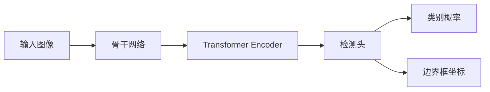

# ViTDet原理与代码实例讲解

## 1.背景介绍

### 1.1 计算机视觉的发展历程

计算机视觉是人工智能的一个重要分支,旨在让计算机能像人一样"看"和理解视觉世界。从最早的边缘检测、特征提取,到后来的分类、检测、分割等任务,再到如今的实例分割、视频理解等,计算机视觉技术不断突破,应用日益广泛。

### 1.2 深度学习时代的目标检测

近年来,深度学习的崛起给计算机视觉带来革命性变革。从2012年AlexNet在ImageNet分类任务上的突破,到R-CNN、Fast R-CNN、Faster R-CNN等经典目标检测算法的出现,再到one-stage检测器如YOLO、SSD的提出,深度学习极大提升了目标检测的性能。

### 1.3 Transformer结构的引入  

Transformer最初应用于自然语言处理领域,展现出强大的建模能力。2020年,Vision Transformer(ViT)将Transformer引入视觉领域,在图像分类任务上取得了优异表现。这启发研究者探索Transformer在其他视觉任务上的应用。

### 1.4 ViTDet的提出

ViTDet(Vision Transformer for Object Detection)就是在这一背景下提出的。它将Transformer结构与目标检测任务相结合,旨在进一步提升检测性能。ViTDet充分利用了Transformer的全局建模能力和自注意力机制,为目标检测这一经典视觉任务带来新的突破。

## 2.核心概念与联系

### 2.1 Transformer

- Transformer是一种基于自注意力机制的神经网络结构
- 由编码器(Encoder)和解码器(Decoder)组成,可以建模序列数据中的长程依赖
- 自注意力机制可以捕捉序列中不同位置元素之间的关系
- 广泛应用于自然语言处理任务,如机器翻译、文本分类等

### 2.2 目标检测 

- 目标检测旨在从图像中定位和识别出感兴趣的目标物体
- 需要预测物体的类别和位置(通常用边界框表示)  
- 经典方法分为两类:two-stage检测器(如Faster R-CNN)和one-stage检测器(如YOLO、SSD)
- 主要挑战包括尺度变化、遮挡、类别不平衡等

### 2.3 ViTDet

- ViTDet将Transformer结构引入目标检测任务
- 利用Transformer的全局建模能力和自注意力机制来增强特征表示
- 采用类似DETR的检测头设计,直接预测物体的类别和位置
- 实现了高效、高性能的目标检测

## 3.核心算法原理具体操作步骤

### 3.1 整体架构

ViTDet的整体架构如下:



### 3.2 骨干网络

- 采用预训练的ViT作为骨干网络,提取图像特征
- 将图像分块,线性映射为序列,加入位置编码
- 骨干网络输出序列化的图像特征表示

### 3.3 Transformer Encoder

- 将骨干网络输出的特征序列输入Transformer Encoder
- 通过多层自注意力和前馈网络,建模特征序列中的全局依赖
- 自注意力机制可以捕捉图像中不同区域之间的关系
- Encoder输出增强后的特征表示

### 3.4 检测头

- 检测头直接对Encoder输出的特征进行预测
- 采用类似DETR的检测头设计
- 预测一组对象查询(object query),每个查询对应一个潜在的物体
- 对象查询通过多层自注意力与图像特征交互,预测物体的类别和位置
- 使用匈牙利匹配(Hungarian matching)将预测结果与真实标注对齐

### 3.5 损失函数

- 分类损失:交叉熵损失,惩罚预测类别与真实类别的差异
- 回归损失:L1损失或GIoU损失,惩罚预测边界框与真实边界框的差异 
- 总损失为分类损失和回归损失的加权和

## 4.数学模型和公式详细讲解举例说明

### 4.1 自注意力机制

自注意力是Transformer的核心,可以建模序列中不同位置之间的依赖关系。对于输入序列$\mathbf{X} \in \mathbb{R}^{n \times d}$,自注意力的计算过程如下:

$$
\begin{aligned}
\mathbf{Q} &= \mathbf{X} \mathbf{W}^Q \\
\mathbf{K} &= \mathbf{X} \mathbf{W}^K \\ 
\mathbf{V} &= \mathbf{X} \mathbf{W}^V \\
\text{Attention}(\mathbf{Q}, \mathbf{K}, \mathbf{V}) &= \text{softmax}(\frac{\mathbf{Q}\mathbf{K}^T}{\sqrt{d_k}})\mathbf{V}
\end{aligned}
$$

其中,$\mathbf{W}^Q, \mathbf{W}^K, \mathbf{W}^V$是可学习的权重矩阵,$d_k$是查询/键的维度。自注意力首先将输入$\mathbf{X}$映射为查询$\mathbf{Q}$、键$\mathbf{K}$和值$\mathbf{V}$,然后通过查询和键的相似度计算注意力权重,最后对值进行加权求和得到输出。

举例说明:假设输入序列$\mathbf{X}$表示一张图像的分块特征,每个特征对应图像的一个区域。通过自注意力,模型可以学习不同区域之间的相关性,捕捉图像中的全局信息。例如,对于包含汽车的图像,自注意力可能会关注车轮、车窗等不同部位之间的关系,从而更好地理解图像内容。

### 4.2 匈牙利匹配

匈牙利匹配用于将模型预测结果与真实标注对齐,以计算损失函数。假设模型预测了$n$个对象查询,每个查询对应一个预测的物体类别$\hat{c}_i$和边界框$\hat{b}_i$。真实标注包含$m$个物体,每个物体有真实类别$c_j$和边界框$b_j$。匈牙利匹配的目标是找到预测结果和真实标注之间的最优匹配$\sigma$,使得匹配成本最小:

$$
\hat{\sigma} = \arg\min_{\sigma} \sum_{i=1}^n \mathcal{L}_{\text{match}}(c_{\sigma(i)}, \hat{c}_i, b_{\sigma(i)}, \hat{b}_i)
$$

其中,$\mathcal{L}_{\text{match}}$是匹配成本函数,通常包括分类损失和回归损失。匈牙利算法可以高效地求解这一最优化问题,得到最优匹配$\hat{\sigma}$。

举例说明:假设模型预测了3个对象查询,真实标注包含2个物体。匈牙利匹配会尝试不同的匹配方式,例如将预测1匹配到物体1、预测2匹配到物体2、预测3视为误检。通过最小化匹配成本,算法找到最优匹配,然后根据匹配结果计算分类损失和回归损失,指导模型学习。

## 5.项目实践：代码实例和详细解释说明

下面是一个简化版的ViTDet的PyTorch实现示例:

```python
import torch
import torch.nn as nn
from transformers import ViTModel

class ViTDet(nn.Module):
    def __init__(self, num_classes, hidden_dim, nheads, num_encoder_layers, num_queries):
        super().__init__()
        self.backbone = ViTModel.from_pretrained('google/vit-base-patch16-224')
        self.transformer = nn.Transformer(hidden_dim, nheads, num_encoder_layers)
        self.class_embed = nn.Linear(hidden_dim, num_classes + 1)
        self.bbox_embed = nn.Linear(hidden_dim, 4)
        self.query_pos = nn.Parameter(torch.rand(num_queries, hidden_dim))
        
    def forward(self, x):
        # 骨干网络提取特征
        features = self.backbone(x)
        features = features.last_hidden_state
        
        # Transformer Encoder增强特征
        features = self.transformer.encoder(features)
        
        # 检测头预测类别和边界框
        output_class = self.class_embed(self.query_pos)
        output_coord = self.bbox_embed(self.query_pos).sigmoid()
        
        return output_class, output_coord
```

代码解释:

1. 首先定义了ViTDet类,初始化时指定类别数、隐藏维度、注意力头数、Encoder层数和对象查询数。
2. 在`__init__`方法中,加载预训练的ViT作为骨干网络,构建Transformer Encoder、分类头和回归头。对象查询的位置编码通过可学习的参数`query_pos`表示。
3. 在`forward`方法中,输入图像首先通过骨干网络提取特征,得到序列化的特征表示。
4. 然后将特征输入Transformer Encoder,通过自注意力建模全局依赖,得到增强后的特征。
5. 最后,将对象查询`query_pos`分别输入分类头和回归头,预测物体的类别和边界框坐标。
6. 模型返回预测的类别概率和边界框坐标。

使用示例:

```python
model = ViTDet(num_classes=20, hidden_dim=768, nheads=12, num_encoder_layers=6, num_queries=100)
image = torch.randn(1, 3, 224, 224)
output_class, output_coord = model(image)
```

这里创建了一个ViTDet模型,指定了20个类别、768维隐藏特征、12个注意力头、6层Encoder和100个对象查询。然后随机生成一个尺寸为(1, 3, 224, 224)的图像输入模型,得到预测的类别概率和边界框坐标。

需要注意的是,这只是一个简化版的示例,实际应用中还需要进行训练、添加损失函数、后处理等步骤。但这个示例展示了ViTDet的核心思想:使用ViT提取特征,Transformer Encoder建模全局信息,检测头直接预测物体。

## 6.实际应用场景

ViTDet作为一种高效、高性能的目标检测算法,可以应用于多种场景:

### 6.1 自动驾驶

在自动驾驶中,准确检测车辆、行人、交通标志等目标至关重要。ViTDet可以实时分析车载摄像头拍摄的图像,识别道路上的各类物体,为自动驾驶系统提供环境感知能力,提高行车安全性。

### 6.2 智慧城市

在智慧城市建设中,ViTDet可用于公共场所的监控分析。通过对监控画面进行实时目标检测,可以及时发现异常情况,如交通拥堵、违法行为等,辅助城市管理和决策。

### 6.3 工业质检

ViTDet可应用于工业生产线的质量检测。通过对产品图像进行检测,可以发现产品的缺陷、异常等问题,提高质检效率和准确率,减少人工成本。

### 6.4 医学影像分析

在医学影像领域,ViTDet可以辅助医生进行疾病诊断。通过对医学图像(如X光片、CT扫描等)进行检测,可以自动定位病灶区域,为医生提供参考,提高诊断效率和准确性。

### 6.5 无人机巡检

ViTDet可用于无人机巡检场景,如电力线路、油气管道等基础设施的巡检。通过对无人机拍摄的图像进行目标检测,可以自动发现设备的损坏、异常等问题,减少人工巡检的风险和成本。

## 7.工具和资源推荐

### 7.1 数据集

- COCO(Common Objects in Context):大规模通用目标检测数据集,包含80个类别的日常物体。
- PASCAL VOC:经典的目标检测数据集,包含20个类别。
- OpenImages:谷歌发布的大规模数据集,包含600个类别。

### 7.2 开源代码

- DETR:Facebook开源的基于Transformer的目标检测算法,ViTDet的重要参考。
- ViT:Google开源的Vision Transformer