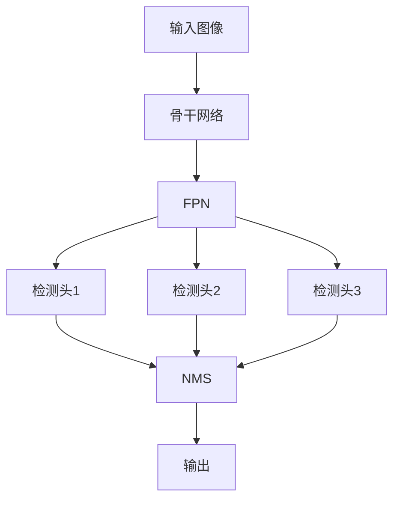

# YOLOv7原理与代码实例讲解

## 1.背景介绍

在计算机视觉领域中,目标检测是一项极具挑战的任务,旨在从给定的图像或视频中定位并识别出感兴趣的目标。近年来,基于深度学习的目标检测算法取得了长足的进步,其中YOLO(You Only Look Once)系列算法因其高效和准确而备受关注。

YOLOv7是YOLO系列的最新版本,由Glenn Jocher等人于2022年6月推出。它在保持YOLO系列高效率和实时性的同时,进一步提升了检测精度,并在训练策略、backbone网络、数据增强等多个方面进行了优化,使其在多个公开数据集上取得了领先的性能表现。

## 2.核心概念与联系

### 2.1 单阶段目标检测

传统的目标检测算法通常采用两阶段方法,首先生成候选区域,然后对每个候选区域进行分类。这种方法存在着计算效率低下、难以实时检测的缺陷。与之相对,单阶段目标检测算法将候选区域生成和分类合并为一个统一的网络,直接从图像像素预测目标边界框和类别,从而大大提高了检测效率。

YOLOv7作为单阶段目标检测器,继承了YOLO系列的高效率特点。它将整个图像划分为S×S个网格,每个网格负责预测B个边界框以及每个边界框所属的类别概率。通过这种密集回归的方式,YOLOv7能够直接从图像像素预测目标,避免了传统方法中复杂的候选区域生成和分类过程。

### 2.2 锚框机制

为了更好地捕获不同形状和大小的目标,YOLOv7采用了锚框(Anchor Box)机制。锚框是一组预先设定的参考框,用于编码预测的边界框。在训练过程中,网络会学习如何调整锚框以适应不同的目标。

YOLOv7使用了6个不同比例和尺度的锚框,通过聚类方法从训练集中自动生成。这种自适应锚框策略有助于提高对不同形状目标的检测能力。

### 2.3 特征金字塔

为了同时检测不同尺度的目标,YOLOv7采用了特征金字塔网络(Feature Pyramid Network,FPN)结构。FPN融合了不同层次的特征图,捕获多尺度的语义信息,从而增强了对大小不等目标的检测能力。

具体来说,YOLOv7使用了三个不同尺度的特征图进行预测,分别对应于大、中、小目标。通过这种多尺度特征融合,YOLOv7能够在单个前向传播中同时检测出不同大小的目标。

## 3.核心算法原理具体操作步骤

YOLOv7的核心算法原理可以概括为以下几个主要步骤:

1. **图像预处理**: 将输入图像缩放到适当的尺寸,并进行归一化处理,以满足网络的输入要求。

2. **骨干网络提取特征**: 输入图像经过一系列卷积层和残差块,提取出不同层次的特征图。YOLOv7使用了EfficientRep作为骨干网络,以获得更强的特征表示能力。

3. **特征金字塔构建**: 利用FPN结构,将不同层次的特征图进行上采样和下采样,构建出多尺度的特征金字塔。

4. **锚框生成和编码**: 在特征金字塔的每个尺度上,生成一组预设的锚框。对于每个锚框,计算其与真实边界框的偏移量,并编码为网络的预测目标。

5. **前向传播和预测**: 将特征金字塔输入到检测头,进行前向传播计算。网络会为每个锚框预测其调整后的边界框坐标、目标置信度和类别概率。

6. **非极大值抑制(NMS)**: 对于同一目标的多个预测框,使用NMS算法去除重叠的冗余框,保留置信度最高的那个。

7. **后处理和输出**: 根据置信度阈值和非极大值抑制的结果,输出最终的目标检测结果,包括边界框坐标和类别标签。

上述步骤通过端到端的训练,使网络能够直接从图像像素预测出目标的位置和类别,实现高效准确的目标检测。

## 4.数学模型和公式详细讲解举例说明

### 4.1 边界框编码

YOLOv7采用了一种高效的边界框编码方式,将预测的边界框表示为相对于锚框的偏移量。具体来说,对于每个锚框,网络需要预测以下4个值:

$$
\begin{aligned}
t_x &= (x - x_a) / w_a \\
t_y &= (y - y_a) / h_a \\
t_w &= \log(w / w_a) \\
t_h &= \log(h / h_a)
\end{aligned}
$$

其中$(x, y, w, h)$表示预测框的中心坐标、宽度和高度,$(x_a, y_a, w_a, h_a)$表示对应锚框的参数。通过这种编码方式,网络只需要预测相对较小的值,有助于提高训练收敛性和预测精度。

在推理阶段,可以通过以下公式将预测的偏移量解码为实际的边界框坐标:

$$
\begin{aligned}
x &= t_x \cdot w_a + x_a \\
y &= t_y \cdot h_a + y_a \\
w &= \exp(t_w) \cdot w_a \\
h &= \exp(t_h) \cdot h_a
\end{aligned}
$$

### 4.2 损失函数

YOLOv7的损失函数是一个多任务损失,包括边界框回归损失、目标置信度损失和分类损失三个部分:

$$
\mathcal{L} = \mathcal{L}_{box} + \mathcal{L}_{obj} + \mathcal{L}_{cls}
$$

其中,边界框回归损失$\mathcal{L}_{box}$使用GIoU(Generalized Intersection over Union)损失函数,能够更好地评估预测框与真实框之间的重叠程度。目标置信度损失$\mathcal{L}_{obj}$是一个二值交叉熵损失,用于判断锚框内是否存在目标。分类损失$\mathcal{L}_{cls}$也是一个交叉熵损失,用于预测目标的类别。

在训练过程中,通过反向传播优化这个多任务损失函数,使网络能够同时学习预测准确的边界框、目标置信度和类别概率。

### 4.3 数据增强

为了增强模型的泛化能力,YOLOv7采用了多种数据增强策略,包括:

- **Mosaic数据增强**: 将4张图像拼接成一张新图像,增加了背景的复杂性和目标的密集程度。
- **混合精度训练(Mixed Precision Training)**: 利用半精度(FP16)和全精度(FP32)混合计算,提高训练速度并节省显存。
- **自动增强(AutoAugment)**: 自动搜索数据增强策略的最佳组合,包括翻转、旋转、缩放等多种变换。

通过这些数据增强技术,YOLOv7能够在有限的训练数据上获得更好的泛化性能。

## 5.项目实践:代码实例和详细解释说明

在这一部分,我们将介绍如何使用PyTorch实现YOLOv7模型,并提供详细的代码解释。完整的代码可以在GitHub上的[YOLOv7项目](https://github.com/WongKinYiu/yolov7)中找到。

### 5.1 模型架构

YOLOv7的模型架构可以用以下Mermaid流程图表示:



上图展示了YOLOv7的主要模块:

1. **骨干网络(Backbone Network)**: 用于从输入图像提取特征,YOLOv7使用了EfficientRep作为骨干网络。
2. **特征金字塔网络(FPN)**: 融合不同尺度的特征图,构建特征金字塔。
3. **检测头(Detection Head)**: 在每个尺度的特征图上预测边界框、目标置信度和类别概率。
4. **非极大值抑制(NMS)**: 对重叠的预测框进行过滤,得到最终的检测结果。

### 5.2 代码实现

下面是YOLOv7模型的PyTorch实现示例:

```python
import torch
import torch.nn as nn

# 定义卷积块
def conv_bn(in_channels, out_channels, kernel_size, stride, padding):
    return nn.Sequential(
        nn.Conv2d(in_channels, out_channels, kernel_size, stride, padding, bias=False),
        nn.BatchNorm2d(out_channels),
        nn.LeakyReLU(0.1)
    )

# 定义残差块
class ResidualBlock(nn.Module):
    def __init__(self, channels, use_residual=True, num_repeats=1):
        super().__init__()
        self.layers = nn.ModuleList()
        for repeat in range(num_repeats):
            self.layers += [
                nn.Sequential(
                    conv_bn(channels, channels // 2, 1, 1, 0),
                    conv_bn(channels // 2, channels, 3, 1, 1)
                )
            ]
        self.use_residual = use_residual
        self.num_repeats = num_repeats

    def forward(self, x):
        for layer in self.layers:
            x = layer(x) + x if self.use_residual else layer(x)
        return x

# 定义YOLO层
class YOLOLayer(nn.Module):
    def __init__(self, anchors, num_classes):
        super().__init__()
        self.anchors = anchors
        self.num_anchors = len(anchors)
        self.num_classes = num_classes
        self.mse_loss = nn.MSELoss()
        self.bce_loss = nn.BCELoss()
        self.obj_scale = 1
        self.noobj_scale = 100
        self.metrics = {}

        self.fcs = nn.ModuleList([
            nn.Linear(512, 256),
            nn.Linear(256, self.num_anchors * (5 + self.num_classes))
        ])

    def forward(self, x):
        # 特征提取
        fcs = [fc(x) for fc in self.fcs]
        pred = fcs[-1].reshape(-1, self.num_anchors, 5 + self.num_classes)

        # 解码预测
        box_pred = pred[..., :4]
        obj_pred = pred[..., 4].sigmoid()
        cls_pred = pred[..., 5:].sigmoid()

        return box_pred, obj_pred, cls_pred

# 定义YOLOv7模型
class YOLOv7(nn.Module):
    def __init__(self, num_classes):
        super().__init__()
        self.backbone = nn.Sequential(
            # 骨干网络层
            ...
        )
        self.fpn = nn.Sequential(
            # FPN层
            ...
        )
        self.head1 = YOLOLayer(anchors1, num_classes)
        self.head2 = YOLOLayer(anchors2, num_classes)
        self.head3 = YOLOLayer(anchors3, num_classes)

    def forward(self, x):
        fpn_features = self.fpn(self.backbone(x))
        outputs = []
        for head, feature in zip([self.head1, self.head2, self.head3], fpn_features):
            box_pred, obj_pred, cls_pred = head(feature)
            outputs.append((box_pred, obj_pred, cls_pred))
        return outputs
```

上述代码实现了YOLOv7模型的核心部分,包括:

1. `conv_bn`函数定义了卷积块,包含卷积、批归一化和LeakyReLU激活函数。
2. `ResidualBlock`类定义了残差块,用于构建骨干网络。
3. `YOLOLayer`类定义了YOLO检测头,用于预测边界框、目标置信度和类别概率。
4. `YOLOv7`类定义了整个YOLOv7模型,包括骨干网络、FPN和三个检测头。

在实际使用中,还需要实现数据加载、模型训练、推理和后处理等功能模块。您可以查阅YOLOv7项目的完整代码,了解更多细节。

## 6.实际应用场景

YOLOv7作为一种高效准确的目标检测算法,在各种计算机视觉应用中都有广泛的应用前景,包括但不限