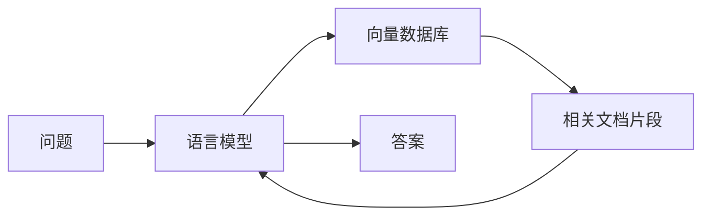

# 【LangChain编程：从入门到实践】基于文档问答场景

## 1.背景介绍
### 1.1 人工智能与自然语言处理的发展
近年来,人工智能(AI)技术飞速发展,尤其是在自然语言处理(NLP)领域取得了突破性进展。从早期的关键词匹配到语义分析,再到如今的大语言模型和知识图谱,NLP技术已经深刻改变了人们获取信息和知识的方式。

### 1.2 知识获取面临的挑战
尽管搜索引擎、知识库等工具为我们提供了海量的信息,但如何从浩如烟海的数据中快速、准确地找到我们需要的知识,仍然是一大挑战。传统的关键词搜索往往难以满足复杂的查询需求,而人工构建知识库又耗时耗力。我们亟需一种更加智能化的知识获取方式。

### 1.3 LangChain的出现
LangChain是一个为语言模型应用而生的开发框架,它为构建基于语言模型的应用提供了丰富的组件和工具。通过LangChain,开发者可以轻松地将语言模型与外部数据源连接,实现更加强大的NLP应用,其中最具代表性的就是基于文档的问答系统。

## 2.核心概念与联系
### 2.1 语言模型(Language Model) 
语言模型是一种基于概率统计的模型,用于预测一段文本中下一个词出现的概率。它通过学习大量语料,掌握了语言的基本规律和知识。当前最先进的语言模型如GPT系列,已经展现出接近人类的语言理解和生成能力。

### 2.2 向量数据库(Vector Database)
向量数据库是一种专门存储和检索高维向量的数据库。在NLP中,我们常常将文本编码为语义向量,通过向量之间的距离来衡量文本的相似度。向量数据库为海量语义向量的高效存储和快速检索提供了支持。

### 2.3 文档问答(Question Answering on Documents)
文档问答指的是给定一个问题和一组相关文档,系统自动从文档中找出问题的答案。这需要系统具备理解问题、检索相关文档、定位答案位置等多项NLP技能。LangChain通过将语言模型、向量数据库等组件巧妙地组合,实现了一套完整的文档问答流程。

### 2.4 核心概念之间的联系
在LangChain的文档问答场景中,语言模型承担了对问题和文档进行语义理解和匹配的任务。向量数据库则为海量文档的语义索引提供了支撑,使得语言模型可以快速找到与问题最相关的文档片段。二者相辅相成,共同构成了一个智能化的知识获取系统。



## 3.核心算法原理与具体操作步骤
### 3.1 文档向量化
将文档转化为语义向量是实现向量检索的基础。LangChain通过调用Embedding模型(如OpenAI的Ada模型),可以将文档编码为768维的语义向量。具体步骤如下:
1. 对文档进行预处理,如去除停用词、标点符号等
2. 将处理后的文档切分为若干个块(chunk),每个块的长度不超过Embedding模型的最大输入长度(如2048个token)
3. 对每个块调用Embedding模型的Encode接口,得到其对应的语义向量
4. 将所有块的语义向量保存到向量数据库中,同时记录块所属的文档ID和位置信息

### 3.2 问题匹配和答案生成
当用户提出一个问题后,LangChain会执行以下步骤来生成答案:
1. 对问题进行向量化,得到问题向量
2. 使用问题向量在向量数据库中进行相似度检索,返回TOP-K个最相似的文档块
3. 将问题和检索到的文档块拼接为一个上下文,送入语言模型
4. 语言模型根据上下文生成答案
5. 对生成的答案进行后处理,如去除不完整的句子、过滤不相关内容等
6. 返回最终的答案给用户

其中,第3步中的"上下文"格式一般为:
```
问题:...
相关内容:...
回答:
```
语言模型会根据这个上下文,在"回答:"后生成问题的答案。

## 4.数学模型和公式详细讲解举例说明
### 4.1 向量相似度计算
在向量检索中,我们常用余弦相似度来衡量两个向量的相似程度。假设有两个n维向量$\mathbf{a}$和$\mathbf{b}$,其余弦相似度定义为:

$$\cos(\mathbf{a},\mathbf{b}) = \frac{\mathbf{a} \cdot \mathbf{b}}{\|\mathbf{a}\| \|\mathbf{b}\|} = \frac{\sum_{i=1}^n a_i b_i}{\sqrt{\sum_{i=1}^n a_i^2} \sqrt{\sum_{i=1}^n b_i^2}}$$

其中$a_i$和$b_i$分别表示$\mathbf{a}$和$\mathbf{b}$的第$i$个分量。余弦相似度的取值范围为$[-1,1]$,值越大表示两个向量越相似。

举例来说,假设我们有两个3维向量$\mathbf{a}=(1,2,3)$和$\mathbf{b}=(4,5,6)$,则它们的余弦相似度为:

$$\cos(\mathbf{a},\mathbf{b}) = \frac{1 \times 4 + 2 \times 5 + 3 \times 6}{\sqrt{1^2+2^2+3^2} \sqrt{4^2+5^2+6^2}} \approx 0.975$$

可见这两个向量的相似度非常高。

### 4.2 BM25排序算法
在实际的向量检索中,我们常常需要在海量向量中找出与查询向量最相似的K个向量,这就需要一个高效的相似度排序算法。BM25就是一种常用的相关性打分算法,它考虑了文档中词项的出现频率和逆文档频率,对查询词的相关性进行打分。

BM25的打分公式为:

$$\text{score}(D,Q) = \sum_{i=1}^n \text{IDF}(q_i) \cdot \frac{f(q_i, D) \cdot (k_1 + 1)}{f(q_i, D) + k_1 \cdot (1 - b + b \cdot \frac{|D|}{\text{avgdl}})}$$

其中:
- $Q$表示查询,$D$表示文档
- $q_i$表示查询中的第$i$个词项
- $f(q_i, D)$表示词项$q_i$在文档$D$中的出现频率
- $\text{IDF}(q_i)$表示词项$q_i$的逆文档频率,计算公式为:
  $$\text{IDF}(q_i) = \log \frac{N - n(q_i) + 0.5}{n(q_i) + 0.5}$$
  其中$N$为文档总数,$n(q_i)$为包含词项$q_i$的文档数。
- $\text{avgdl}$表示所有文档的平均长度
- $k_1$和$b$为调节因子,一般取$k_1=1.2$,$b=0.75$

BM25通过上述公式,综合考虑了词项的相关性和文档的长度因素,对候选文档进行打分排序,从而选出与查询最相关的文档。

## 5.项目实践:代码实例和详细解释说明
下面我们通过一个简单的Python代码实例,演示如何使用LangChain实现基于文档的问答。

```python
from langchain.embeddings.openai import OpenAIEmbeddings
from langchain.vectorstores import Chroma
from langchain.text_splitter import CharacterTextSplitter
from langchain.llms import OpenAI
from langchain.chains import RetrievalQA

# 加载文档
with open("doc.txt") as f:
    doc_text = f.read()
    
# 初始化文本分割器
text_splitter = CharacterTextSplitter(chunk_size=1000, chunk_overlap=0)
texts = text_splitter.split_text(doc_text)

# 初始化Embedding模型
embeddings = OpenAIEmbeddings()

# 将文档块存入向量数据库
docsearch = Chroma.from_texts(texts, embeddings)

# 初始化语言模型
llm = OpenAI()  

# 创建问答链
qa = RetrievalQA.from_chain_type(llm=llm, chain_type="stuff", retriever=docsearch.as_retriever())

# 执行问答
query = "请问文档中讲了哪些内容?"
result = qa({"query": query})
print(result['result'])
```

代码解释:
1. 首先加载需要查询的文档,这里假设文档名为"doc.txt"
2. 初始化一个文本分割器`CharacterTextSplitter`,它会将文档切分为若干个长度为1000的块,块之间没有重叠
3. 调用`split_text`方法对文档进行切分,得到一个文档块列表`texts` 
4. 初始化一个Embedding模型`OpenAIEmbeddings`,用于将文本转换为向量
5. 创建一个向量数据库`Chroma`,将`texts`中的文档块转换为向量并存入数据库
6. 初始化一个语言模型`OpenAI`,用于答案生成
7. 创建一个问答链`RetrievalQA`,指定使用的语言模型、问答类型(这里为"stuff")和检索器(这里为`Chroma`的检索器)
8. 执行问答,指定问题为"请问文档中讲了哪些内容?",得到问答结果并打印出来

以上就是一个简单的LangChain文档问答的代码实例,通过调用LangChain提供的各种组件和工具,我们可以快速搭建一个基于语言模型的智能问答系统。

## 6.实际应用场景
基于文档的问答技术有着广泛的应用前景,下面列举几个典型的应用场景:

### 6.1 企业知识库问答
大型企业常常积累了大量的内部文档,如技术文档、产品手册、客户案例等。员工在日常工作中经常需要查阅这些文档,但是传统的关键词搜索往往无法满足复杂问题的查询需求。通过文档问答技术,员工可以直接用自然语言提问,系统自动给出精准的答案,大大提高了员工的工作效率。

### 6.2 智能客服
客服是企业与客户沟通的重要渠道,但人工客服成本高昂,且无法7x24小时提供服务。通过文档问答技术,企业可以将常见问题的答案整理成知识库,用户通过智能客服系统提问,系统自动给出回答,既降低了人工成本,又提升了客户体验。

### 6.3 医疗领域
医疗领域知识浩如烟海,医生在诊疗过程中经常需要查阅大量的医学文献和病例。通过医学文档问答系统,医生可以快速找到所需的专业知识,辅助诊断和治疗。同时,该系统也可以为患者提供医疗咨询服务,提高医疗资源的可及性。

### 6.4 教育领域
在教育领域,学生在学习过程中难免会遇到各种问题。通过教育问答系统,学生可以直接提出问题,系统从海量的教学资料、习题解析等文档中自动找到答案,为学生提供个性化的学习辅导。该系统还可用于知识测评和学习效果跟踪,助力教学质量的提升。

## 7.工具和资源推荐
### 7.1 LangChain
LangChain是一个基于语言模型的应用开发框架,它提供了丰富的组件和工具,帮助开发者快速构建基于语言模型的应用,包括文档问答、对话系统、文本生成等。LangChain支持多种主流语言模型和向量数据库,具有良好的扩展性和灵活性。
官网:https://docs.langchain.com/

### 7.2 OpenAI API
OpenAI是一家知名的人工智能研究机构,他们开放了强大的语言模型API接口,包括GPT系列模型和Embedding模型。通过OpenAI API,开发者可以方便地调用这些先进的语言模型,而无需自己训练和部署。
官网:https://openai.