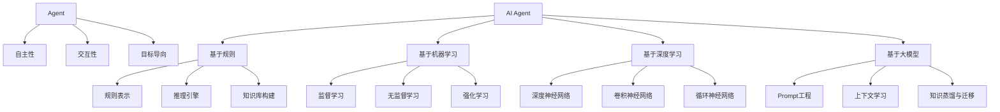

# 【大模型应用开发 动手做AI Agent】那么，究竟何谓Agent

## 1. 背景介绍
### 1.1 人工智能发展历程
#### 1.1.1 早期人工智能
#### 1.1.2 专家系统时代  
#### 1.1.3 机器学习与深度学习
### 1.2 大模型的崛起
#### 1.2.1 Transformer架构的突破
#### 1.2.2 大规模预训练语言模型
#### 1.2.3 多模态大模型
### 1.3 AI Agent的兴起
#### 1.3.1 AI Agent的定义
#### 1.3.2 AI Agent的发展历程
#### 1.3.3 AI Agent的应用前景

## 2. 核心概念与联系
### 2.1 Agent的定义与特征
#### 2.1.1 自主性
#### 2.1.2 交互性
#### 2.1.3 目标导向
### 2.2 AI Agent与传统软件的区别
#### 2.2.1 自主决策能力
#### 2.2.2 持续学习能力
#### 2.2.3 适应环境能力
### 2.3 AI Agent与大模型的关系
#### 2.3.1 大模型为AI Agent赋能
#### 2.3.2 AI Agent为大模型赋予应用场景
#### 2.3.3 二者相辅相成、互为促进

## 3. 核心算法原理具体操作步骤
### 3.1 基于规则的Agent
#### 3.1.1 规则表示
#### 3.1.2 推理引擎
#### 3.1.3 知识库构建
### 3.2 基于机器学习的Agent
#### 3.2.1 监督学习
#### 3.2.2 无监督学习
#### 3.2.3 强化学习
### 3.3 基于深度学习的Agent
#### 3.3.1 深度神经网络
#### 3.3.2 卷积神经网络
#### 3.3.3 循环神经网络
### 3.4 基于大模型的Agent
#### 3.4.1 Prompt工程
#### 3.4.2 上下文学习
#### 3.4.3 知识蒸馏与迁移

## 4. 数学模型和公式详细讲解举例说明
### 4.1 马尔可夫决策过程(MDP)
#### 4.1.1 MDP的定义
$MDP=(S,A,P,R,\gamma)$
其中，$S$表示状态集合，$A$表示动作集合，$P$表示状态转移概率矩阵，$R$表示奖励函数，$\gamma$表示折扣因子。
#### 4.1.2 MDP的贝尔曼方程
$$V(s)=R(s)+\gamma \max_{a \in A} \sum_{s' \in S}P(s'|s,a)V(s')$$
#### 4.1.3 MDP求解算法
- 值迭代
- 策略迭代
- 蒙特卡洛方法
### 4.2 深度强化学习模型
#### 4.2.1 DQN(Deep Q-Network)
$$Q(s,a)=R(s,a)+\gamma \max_{a'} Q(s',a')$$
其中，$Q(s,a)$表示在状态$s$下采取动作$a$的价值函数。
#### 4.2.2 A3C(Asynchronous Advantage Actor-Critic) 
$$\nabla_{\theta} J(\theta) = \mathbb{E}_{\pi_{\theta}}[\nabla_{\theta} \log \pi_{\theta}(a|s)A^{\pi_{\theta}}(s,a)]$$
其中，$\pi_{\theta}$表示参数为$\theta$的策略函数，$A^{\pi_{\theta}}(s,a)$表示优势函数。
#### 4.2.3 PPO(Proximal Policy Optimization)
$$L^{CLIP}(\theta) = \mathbb{E}_t[min(r_t(\theta)\hat{A}_t, clip(r_t(\theta), 1-\epsilon, 1+\epsilon)\hat{A}_t)]$$
其中，$r_t(\theta)$表示重要性采样比率，$\hat{A}_t$表示广义优势估计。

## 5. 项目实践：代码实例和详细解释说明
### 5.1 基于规则的Agent实现
```python
class RuleBasedAgent:
    def __init__(self, rules):
        self.rules = rules
        
    def act(self, state):
        for rule in self.rules:
            if rule.match(state):
                return rule.action
        return None
```
该代码定义了一个基于规则的Agent类，通过匹配预定义的规则来决策动作。
### 5.2 基于深度强化学习的Agent实现
```python
class DQNAgent:
    def __init__(self, state_size, action_size):
        self.state_size = state_size
        self.action_size = action_size
        self.memory = deque(maxlen=2000)
        self.gamma = 0.95    # discount rate
        self.epsilon = 1.0   # exploration rate
        self.epsilon_min = 0.01
        self.epsilon_decay = 0.995
        self.learning_rate = 0.001
        self.model = self._build_model()
        
    def _build_model(self):
        model = Sequential()
        model.add(Dense(24, input_dim=self.state_size, activation='relu'))
        model.add(Dense(24, activation='relu'))
        model.add(Dense(self.action_size, activation='linear'))
        model.compile(loss='mse', optimizer=Adam(lr=self.learning_rate))
        return model
    
    def remember(self, state, action, reward, next_state, done):
        self.memory.append((state, action, reward, next_state, done))
        
    def act(self, state):
        if np.random.rand() <= self.epsilon:
            return random.randrange(self.action_size)
        act_values = self.model.predict(state)
        return np.argmax(act_values[0])
    
    def replay(self, batch_size):
        minibatch = random.sample(self.memory, batch_size)
        for state, action, reward, next_state, done in minibatch:
            target = reward
            if not done:
                target = (reward + self.gamma * np.amax(self.model.predict(next_state)[0]))
            target_f = self.model.predict(state)
            target_f[0][action] = target
            self.model.fit(state, target_f, epochs=1, verbose=0)
        if self.epsilon > self.epsilon_min:
            self.epsilon *= self.epsilon_decay
```
该代码实现了一个基于DQN算法的Agent，通过深度神经网络来逼近Q值函数，并使用经验回放和ε-贪心策略来平衡探索和利用。
### 5.3 基于Prompt的Agent实现
```python
class PromptAgent:
    def __init__(self, model, prompt_template):
        self.model = model
        self.prompt_template = prompt_template
        
    def act(self, state):
        prompt = self.prompt_template.format(state=state)
        action = self.model.generate(prompt)
        return action
```
该代码定义了一个基于Prompt的Agent类，通过填充预定义的Prompt模板并使用语言模型生成来决策动作。

## 6. 实际应用场景
### 6.1 智能客服
#### 6.1.1 基于规则的客服机器人
#### 6.1.2 基于深度学习的智能问答
#### 6.1.3 多轮对话与上下文理解
### 6.2 智能助手
#### 6.2.1 任务型对话系统
#### 6.2.2 个性化推荐
#### 6.2.3 信息检索与知识问答
### 6.3 自动驾驶
#### 6.3.1 感知与预测
#### 6.3.2 决策与规划
#### 6.3.3 控制与执行
### 6.4 智能制造
#### 6.4.1 故障诊断与预测性维护
#### 6.4.2 生产调度优化
#### 6.4.3 质量检测与异常检测

## 7. 工具和资源推荐
### 7.1 开源框架
#### 7.1.1 OpenAI Gym
#### 7.1.2 DeepMind Lab
#### 7.1.3 Microsoft TextWorld
### 7.2 开源模型
#### 7.2.1 GPT系列模型
#### 7.2.2 BERT系列模型
#### 7.2.3 DALL·E系列模型
### 7.3 数据集
#### 7.3.1 bAbI Tasks
#### 7.3.2 SQuAD
#### 7.3.3 Visual Question Answering

## 8. 总结：未来发展趋势与挑战
### 8.1 AI Agent的发展趋势
#### 8.1.1 多模态融合
#### 8.1.2 持续学习
#### 8.1.3 知识增强
### 8.2 AI Agent面临的挑战
#### 8.2.1 可解释性
#### 8.2.2 安全性
#### 8.2.3 公平性
### 8.3 AI Agent的未来展望
#### 8.3.1 人机协作
#### 8.3.2 通用人工智能
#### 8.3.3 认知智能

## 9. 附录：常见问题与解答
### 9.1 AI Agent与机器人的区别是什么？
AI Agent更侧重于软件层面的智能，而机器人则强调硬件实体。AI Agent可以运行在各种计算设备上，机器人通常需要特定的机械结构和传感器。但二者也可以结合，例如自主移动机器人就包含了AI Agent作为其核心控制模块。
### 9.2 AI Agent能否拥有自我意识和情感？
目前的AI Agent还无法拥有真正意义上的自我意识和情感。它们更多是基于算法和数据的计算结果来模拟类似自我意识和情感的行为。但随着认知智能的发展，未来的AI Agent有望在一定程度上具备自主意识和情感能力。
### 9.3 AI Agent会取代人类的工作吗？
AI Agent在很多领域能够辅助和增强人类的工作，提高效率和质量。但在可预见的未来，AI Agent还无法完全取代人类，尤其是那些需要创造力、同理心、社交能力的工作。人机协作将是大势所趋，AI Agent与人类优势互补，共同创造价值。



AI Agent作为人工智能发展的前沿阵地，正在不断突破边界、拓展认知。从早期的规则系统，到机器学习和深度学习，再到如今的大模型赋能，AI Agent的形态和能力不断迭代升级。纵观其发展脉络，我们看到了人类对智能的孜孜以求，对心智的执着探索。

未来，AI Agent必将从单一模态走向多模态融合，从静态学习走向持续进化，从浅层模式匹配走向深层知识融合。它们将与人类形成更加紧密的共生关系，在认知、决策、执行等方面与人类展开更高维度的协作。可以预见，AI Agent将为人类社会的方方面面带来深刻变革，推动生产力的跃升，重塑人类的生活方式。

然而，在憧憬美好前景的同时，我们也要清醒地认识到AI Agent所面临的种种挑战。其突破人类认知极限的能力，也可能带来失控的风险。我们要探索可解释性和可控性，确保AI Agent在服务人类的同时不会背离伦理道德。我们要研究安全性和隐私性，避免AI Agent被恶意利用或侵犯个人权益。我们要关注公平性和包容性，防止AI Agent放大数据中的偏见，加剧社会的不平等。

总之，AI Agent代表了人工智能的一个崭新维度，展现了无限的可能性。它离我们越来越近，影响越来越深远。作为AI时代的开拓者，我们要不断挑战认知的边界，将AI Agent打造成为造福人类的利器。同时我们也要以审慎和智慧之心，去引导和规范AI Agent的发展，确保这场认知革命以人为本，让AI Agent成为推动人类文明进步的助力。

让我们携手并肩，在这场波澜壮阔的AI Agent探索之旅中砥砺前行，共同开创人机协作、和谐共生的美好未来。

作者：禅与计算机程序设计艺术 / Zen and the Art of Computer Programming