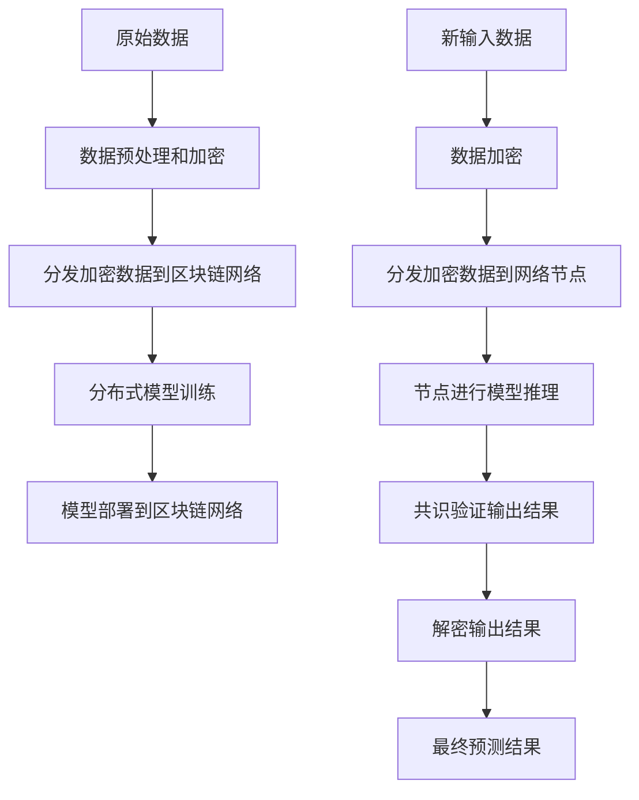

# 一切皆是映射：AI的去中心化：区块链技术的融合

## 1.背景介绍

在当今时代,人工智能(AI)和区块链技术正在引领着一场前所未有的科技革命。这两个领域都在推动着数字化转型,重塑着我们的生活和工作方式。然而,AI系统通常是集中式的,由少数科技巨头控制,这引发了隐私、安全和公平性等方面的担忧。与此同时,区块链技术提供了一种去中心化的解决方案,通过分布式账本和共识机制实现数据的透明性和不可篡改性。

将AI与区块链技术相结合,可以创造出一种全新的范式,即"去中心化人工智能"(Decentralized AI,DAI)。DAI旨在打破AI系统的中心化垄断,构建一个更加开放、透明和公平的人工智能生态系统。通过将AI算法和模型部署在区块链网络上,DAI可以确保数据的隐私性和安全性,同时提高AI系统的可靠性和可信度。

## 2.核心概念与联系

### 2.1 人工智能(AI)

人工智能是一门研究如何使机器具备类似于人类的智能行为的科学,包括感知、学习、推理、规划和控制等能力。AI系统通常由算法模型、训练数据和计算资源组成。

### 2.2 区块链技术

区块链是一种分布式账本技术,它通过密码学、共识机制和点对点网络,实现了数据的不可篡改性、透明性和去中心化。区块链技术最初被应用于加密货币领域,但后来也逐渐扩展到其他领域,如供应链管理、物联网和数字身份等。

### 2.3 去中心化人工智能(DAI)

去中心化人工智能(DAI)是将AI算法和模型部署在区块链网络上的一种新型范式。DAI旨在解决传统AI系统中的隐私、安全和公平性问题,同时提高AI系统的可靠性和可信度。DAI的核心思想是通过分布式计算和共识机制,实现AI系统的去中心化和透明化。

## 3.核心算法原理具体操作步骤

实现DAI需要将AI算法和模型与区块链技术相结合。以下是一种可能的实现方式:

1. **数据预处理和加密**:首先,需要对原始数据进行预处理和加密,以保护数据隐私。可以使用同态加密等加密技术,确保在不解密的情况下对加密数据进行计算。

2. **模型训练和部署**:将预处理后的加密数据分发到区块链网络中的节点,利用分布式计算资源进行模型训练。训练完成后,将训练好的模型部署到区块链网络中。

3. **模型推理和共识**:当有新的输入数据时,将其加密后分发到网络中的节点。节点使用部署的模型对加密数据进行推理,得到加密的输出结果。然后,通过共识机制对所有节点的输出结果进行验证和确认。

4. **结果解密和输出**:最后,将经过共识验证的加密输出结果解密,得到最终的预测结果。

该过程可以通过智能合约在区块链网络上自动化执行,确保整个流程的透明性和不可篡改性。



## 4.数学模型和公式详细讲解举例说明

在DAI系统中,同态加密技术扮演着关键角色。同态加密允许在加密数据上直接进行计算操作,而无需先解密。这使得DAI系统能够在保护数据隐私的同时进行模型训练和推理。

一种常用的同态加密方案是Paillier同态加密系统,它支持同态加法运算。设$m_1$和$m_2$分别是两个明文消息,$E(m_1)$和$E(m_2)$是它们的加密形式,则有:

$$E(m_1) \oplus E(m_2) = E(m_1 + m_2)$$

其中$\oplus$表示同态加法运算。这意味着我们可以在加密数据上直接进行加法运算,而无需先解密。

对于同态乘法运算,我们可以使用一种技术叫做"重线性"(Relinearization)。设$E(m_1)$和$E(m_2)$是两个加密消息,$r$是一个随机数,则有:

$$E(m_1) \otimes E(m_2) \otimes \text{Relin}(r) = E(m_1 \times m_2 \times r)$$

其中$\otimes$表示同态乘法运算,Relin是重线性函数。通过重线性技术,我们可以在加密数据上进行乘法运算。

利用同态加法和乘法运算,我们可以在加密数据上执行各种机器学习算法,如线性回归、逻辑回归和神经网络等。例如,对于线性回归模型$y = w_1x_1 + w_2x_2 + b$,我们可以使用同态运算来计算加密数据$E(x_1)$和$E(x_2)$在该模型下的预测值:

$$\begin{aligned}
E(y) &= E(w_1x_1 + w_2x_2 + b) \\
     &= E(w_1)^{x_1} \otimes E(w_2)^{x_2} \otimes E(b)
\end{aligned}$$

其中$E(w_1)$、$E(w_2)$和$E(b)$是模型参数的加密形式。通过这种方式,我们可以在不解密输入数据的情况下进行模型推理,从而保护了数据隐私。

## 5.项目实践:代码实例和详细解释说明

为了更好地理解DAI系统的实现,我们提供了一个基于Python和以太坊区块链的示例项目。该项目实现了一个简单的线性回归模型,并将其部署到以太坊区块链上进行去中心化推理。

### 5.1 项目结构

```
project/
├── contracts/
│   └── LinearRegression.sol  # 线性回归智能合约
├── data/
│   ├── train.csv             # 训练数据
│   └── test.csv              # 测试数据
├── utils/
│   ├── encryption.py         # 同态加密工具
│   └── blockchain.py         # 区块链交互工具
├── train.py                  # 模型训练脚本
├── inference.py              # 去中心化推理脚本
└── README.md
```

### 5.2 代码示例

以下是`inference.py`脚本的核心代码,用于在区块链上进行去中心化推理:

```python
from utils.encryption import encrypt, decrypt
from utils.blockchain import deploy_contract, call_contract

# 加载测试数据
test_data = load_test_data('data/test.csv')

# 部署线性回归智能合约
contract = deploy_contract('contracts/LinearRegression.sol')

# 加密测试数据
encrypted_data = [encrypt(x) for x in test_data]

# 在区块链上进行推理
encrypted_predictions = call_contract(contract, 'predict', encrypted_data)

# 解密预测结果
predictions = [decrypt(y) for y in encrypted_predictions]
```

在这个示例中,我们首先加载测试数据,然后部署线性回归智能合约到以太坊区块链上。接下来,我们使用同态加密技术对测试数据进行加密,并调用智能合约的`predict`函数在区块链上进行推理。最后,我们对加密的预测结果进行解密,得到最终的预测值。

智能合约`LinearRegression.sol`的核心代码如下:

```solidity
pragma solidity ^0.8.0;

contract LinearRegression {
    uint[] public weights;
    uint public bias;

    constructor(uint[] memory _weights, uint _bias) {
        weights = _weights;
        bias = _bias;
    }

    function predict(uint[] memory inputs) public view returns (uint[] memory) {
        uint[] memory predictions = new uint[](inputs.length);
        for (uint i = 0; i < inputs.length; i++) {
            uint prediction = bias;
            for (uint j = 0; j < weights.length; j++) {
                prediction += weights[j] * inputs[i * weights.length + j];
            }
            predictions[i] = prediction;
        }
        return predictions;
    }
}
```

在这个智能合约中,我们定义了线性回归模型的权重`weights`和偏置`bias`。`predict`函数接受加密的输入数据,并使用同态运算计算预测值。由于智能合约在区块链上执行,因此整个推理过程是透明和不可篡改的。

通过这个示例项目,我们可以看到如何将AI算法与区块链技术相结合,实现去中心化的人工智能系统。虽然这只是一个简单的线性回归示例,但同样的思路也可以应用于更复杂的机器学习模型。

## 6.实际应用场景

DAI系统可以应用于各种领域,以解决隐私、安全和公平性等问题。以下是一些潜在的应用场景:

1. **医疗健康**:在医疗领域,患者的隐私和数据安全至关重要。DAI系统可以确保患者数据的隐私性,同时利用AI算法进行疾病诊断、治疗方案优化等。

2. **金融服务**:在金融领域,DAI系统可以用于风险评估、欺诈检测和投资组合优化等任务,同时保护客户的隐私和交易数据的安全性。

3. **智能城市**:在智能城市中,DAI系统可以用于交通规划、能源优化和环境监测等领域,提高城市运营的效率和可持续性。

4. **供应链管理**:DAI系统可以用于追踪产品来源、验证产品真实性,并优化供应链流程,提高透明度和可追溯性。

5. **隐私保护AI**:DAI系统可以用于构建隐私保护的AI系统,确保个人数据的隐私性,同时利用AI算法提供个性化服务。

总的来说,DAI系统为解决AI系统中的隐私、安全和公平性问题提供了一种有前景的解决方案。随着技术的不断发展,DAI系统的应用场景将会越来越广泛。

## 7.工具和资源推荐

实现DAI系统需要结合多种技术,包括人工智能、区块链、密码学等。以下是一些有用的工具和资源:

1. **AI框架**:TensorFlow、PyTorch、Scikit-learn等流行的AI框架可以用于构建和训练AI模型。

2. **区块链平台**:以太坊、Hyperledger Fabric、Corda等区块链平台提供了智能合约和分布式账本技术的支持。

3. **同态加密库**:Microsoft SEAL、HElib、PALISADE等同态加密库可以用于实现同态加密和计算。

4. **开源项目**:OpenMined、PySyft、TencentBlackBox等开源项目致力于推进DAI技术的发展。

5. **教程和文档**:各种在线教程、文档和示例项目可以帮助开发者快速入门DAI技术。

6. **社区和论坛**:加入相关的社区和论坛,与其他开发者交流经验和想法,共同推进DAI技术的发展。

通过利用这些工具和资源,开发者可以更好地掌握DAI技术,并将其应用于实际项目中。

## 8.总结:未来发展趋势与挑战

去中心化人工智能(DAI)是一个前景广阔的新兴领域,它将人工智能与区块链技术相结合,为解决AI系统中的隐私、安全和公平性问题提供了一种有前景的解决方案。DAI系统通过将AI算法和模型部署在区块链网络上,实现了数据的去中心化和透明化,提高了AI系统的可靠性和可信度。

未来,DAI技术将会在多个领域得到广泛应用,如医疗健康、金融服务、智能城市、供应链管理等。随着技术的不断发展,DAI系统将变得更加高效、可扩展和易于使用。

然而,DAI技术也面临一些挑战和限制:

1. **计算能力**:由于同态加密计算的复杂性,DAI系统的计算效率往往较低,需要更强大的计算资源。

2. **