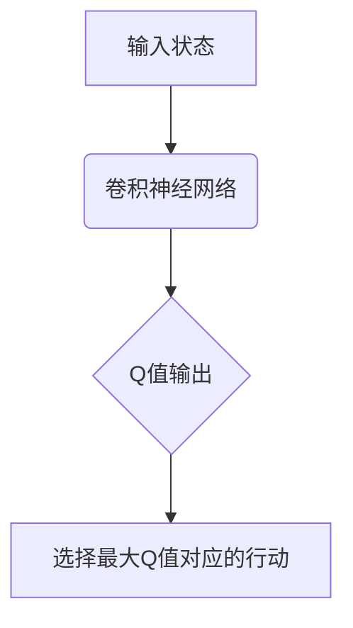
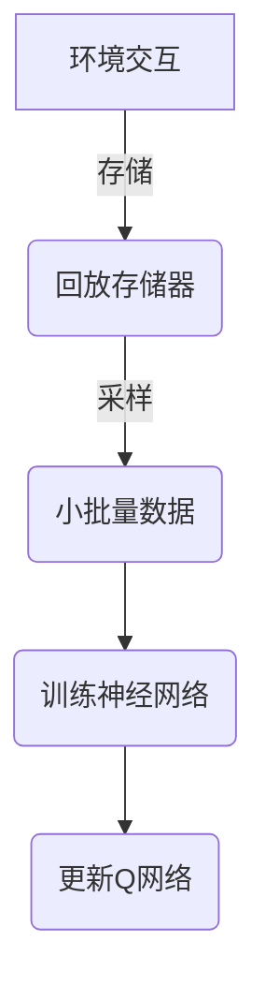

# 一切皆是映射：DQN的经验回放机制：原理与实践细节

## 1.背景介绍

### 1.1 强化学习与经验回放

强化学习是机器学习的一个重要分支,它关注如何基于环境反馈来学习一个代理如何采取行动以最大化累积奖励。与监督学习不同,强化学习没有提供标注的训练数据集,代理必须通过与环境的交互来学习。

在传统的强化学习中,代理与环境交互并存储转换元组(状态、行动、奖励、下一状态)。然后,这些元组用于更新代理的策略或值函数。然而,这种方法存在一些缺陷:

1. **相关性**: 连续的转换元组往往彼此高度相关,这会降低学习效率。
2. **数据利用效率低下**: 每个元组只被使用一次来更新代理,然后就被丢弃。

为了解决这些问题,DeepMind在2015年提出了**经验回放(Experience Replay)**的概念,它是深度强化学习(Deep Reinforcement Learning)中的一项关键技术。

### 1.2 深度Q网络(DQN)

深度Q网络(Deep Q-Network, DQN)是结合经验回放的第一个工作,它在Atari视频游戏中取得了超过人类水平的表现。DQN使用一个深度神经网络来近似Q函数,并利用经验回放来提高样本效率和减少相关性。

## 2.核心概念与联系

### 2.1 Q-Learning

Q-Learning是一种无模型的强化学习算法,它直接试图学习一个行动价值函数Q(s,a),该函数为每个状态s和行动a给出一个价值分数。在每个时间步,代理根据当前状态选择一个行动,并观察到下一个状态和奖励。然后,Q函数根据贝尔曼方程进行更新:

$$Q(s_t, a_t) \leftarrow Q(s_t, a_t) + \alpha \left[ r_t + \gamma \max_{a'} Q(s_{t+1}, a') - Q(s_t, a_t) \right]$$

其中$\alpha$是学习率,$\gamma$是折扣因子。

### 2.2 深度Q网络(DQN)

传统的Q-Learning使用表格或者简单的函数近似器来表示Q函数,但是对于高维状态空间(如Atari游戏画面),这种方法就行不通了。DQN使用一个深度卷积神经网络来近似Q函数,输入是当前状态,输出是每个行动的Q值。



### 2.3 经验回放

经验回放的核心思想是将代理与环境的交互存储在回放存储器(Replay Memory)中,并在训练时从中随机采样小批量数据进行迭代学习。这种方法有以下优点:

1. **减少相关性**: 由于数据是随机采样的,因此连续的转换元组之间的相关性降低了。
2. **提高数据利用效率**: 每个转换元组可以被重复使用多次,从而提高了数据的利用效率。
3. **平滑训练分布**: 回放存储器的数据分布更加平滑,有助于提高训练稳定性。



## 3.核心算法原理具体操作步骤

DQN算法的具体步骤如下:

1. **初始化回放存储器D和Q网络参数θ**。
2. **观察初始状态s_0**。
3. **对于每个时间步t**:
    1. **根据当前状态s_t和Q网络选择行动a_t**。
    2. **执行行动a_t,观察奖励r_t和下一状态s_{t+1}**。
    3. **将转换元组(s_t, a_t, r_t, s_{t+1})存储到回放存储器D中**。
    4. **从回放存储器D中随机采样一个小批量数据**。
    5. **计算目标Q值y_j**:
        - **对于终止状态**: y_j = r_j
        - **对于非终止状态**: y_j = r_j + γ max_{a'} Q(s_{j+1}, a'; θ)
    6. **计算损失函数L = (y_j - Q(s_j, a_j; θ))^2**。
    7. **使用梯度下降法更新Q网络参数θ以最小化损失函数L**。

## 4.数学模型和公式详细讲解举例说明

### 4.1 Q-Learning更新规则

Q-Learning的更新规则由贝尔曼方程给出:

$$Q(s_t, a_t) \leftarrow Q(s_t, a_t) + \alpha \left[ r_t + \gamma \max_{a'} Q(s_{t+1}, a') - Q(s_t, a_t) \right]$$

其中:

- $Q(s_t, a_t)$是当前状态s_t和行动a_t的Q值估计。
- $\alpha$是学习率,控制新信息对Q值估计的影响程度。
- $r_t$是立即奖励。
- $\gamma$是折扣因子,控制未来奖励的重要性。
- $\max_{a'} Q(s_{t+1}, a')$是在下一状态s_{t+1}下,所有可能行动a'的最大Q值估计,代表了最优行动序列的估计值。

更新规则的目标是使Q值估计逼近最优Q值函数Q*(s,a),即在状态s下执行行动a所能获得的最大期望累积奖励。

### 4.2 DQN目标函数

在DQN中,我们使用一个深度神经网络来近似Q函数,网络参数为θ。目标是最小化损失函数:

$$L(\theta) = \mathbb{E}_{(s, a, r, s')\sim D}\left[(r + \gamma \max_{a'} Q(s', a'; \theta^-) - Q(s, a; \theta))^2\right]$$

其中:

- D是回放存储器,包含(s, a, r, s')转换元组的集合。
- $\theta^-$是目标网络参数,用于计算目标Q值y = r + γ max_{a'} Q(s', a'; θ^-)。
- θ是当前Q网络参数,用于计算Q(s, a; θ)。

目标是使Q网络的输出Q(s, a; θ)逼近目标Q值y,从而最小化损失函数L(θ)。

### 4.3 Q-Learning收敛性证明

Q-Learning算法的收敛性可以通过固定点理论得到证明。定义贝尔曼运算符T:

$$T^{\pi}Q(s, a) = \mathbb{E}_{s' \sim P(s'|s, a)}\left[r(s, a) + \gamma \max_{a'} Q(s', a')\right]$$

其中P(s'|s, a)是在状态s执行行动a后转移到状态s'的概率分布。

可以证明,如果折扣因子γ < 1,并且所有状态-行动对都被无限次访问,则Q-Learning更新规则将收敛到T的唯一固定点,即最优Q函数Q*。

## 5.项目实践:代码实例和详细解释说明

以下是使用PyTorch实现DQN算法的简化代码示例:

```python
import torch
import torch.nn as nn
import torch.optim as optim
import random

# 定义Q网络
class QNetwork(nn.Module):
    def __init__(self, state_dim, action_dim):
        super(QNetwork, self).__init__()
        self.fc1 = nn.Linear(state_dim, 64)
        self.fc2 = nn.Linear(64, action_dim)

    def forward(self, x):
        x = torch.relu(self.fc1(x))
        x = self.fc2(x)
        return x

# 定义经验回放存储器
class ReplayMemory:
    def __init__(self, capacity):
        self.memory = []
        self.capacity = capacity

    def push(self, transition):
        self.memory.append(transition)
        if len(self.memory) > self.capacity:
            self.memory.pop(0)

    def sample(self, batch_size):
        return random.sample(self.memory, batch_size)

# 定义DQN代理
class DQNAgent:
    def __init__(self, state_dim, action_dim):
        self.q_net = QNetwork(state_dim, action_dim)
        self.target_q_net = QNetwork(state_dim, action_dim)
        self.optimizer = optim.Adam(self.q_net.parameters())
        self.replay_memory = ReplayMemory(10000)
        self.gamma = 0.99

    def get_action(self, state):
        q_values = self.q_net(state)
        return torch.argmax(q_values).item()

    def update(self, batch_size):
        transitions = self.replay_memory.sample(batch_size)
        states, actions, rewards, next_states = zip(*transitions)

        states = torch.cat(states)
        actions = torch.tensor(actions, dtype=torch.int64)
        rewards = torch.tensor(rewards)
        next_states = torch.cat(next_states)

        q_values = self.q_net(states).gather(1, actions.unsqueeze(1)).squeeze()
        next_q_values = self.target_q_net(next_states).max(1)[0]
        targets = rewards + self.gamma * next_q_values

        loss = nn.MSELoss()(q_values, targets)
        self.optimizer.zero_grad()
        loss.backward()
        self.optimizer.step()

        # 更新目标网络
        self.target_q_net.load_state_dict(self.q_net.state_dict())
```

上述代码实现了以下核心组件:

1. **QNetwork**: 一个简单的全连接神经网络,用于近似Q函数。
2. **ReplayMemory**: 实现经验回放存储器,用于存储和采样转换元组。
3. **DQNAgent**:
   - `get_action`方法根据当前状态和Q网络输出选择行动。
   - `update`方法从回放存储器采样小批量数据,计算目标Q值和损失函数,并使用梯度下降法更新Q网络参数。
   - 定期将Q网络的参数复制到目标网络,以保持目标网络的稳定性。

在实际应用中,还需要处理探索与利用的权衡(如ε-贪婪策略)、优化超参数等问题。此外,对于高维状态输入(如Atari游戏画面),需要使用卷积神经网络作为Q网络的一部分。

## 6.实际应用场景

经验回放机制在多个领域都有广泛的应用,包括但不限于:

1. **视频游戏AI**: DQN最初就是应用于Atari视频游戏,并取得了超过人类水平的表现。
2. **机器人控制**: 在机器人控制任务中,经验回放可以提高样本效率,加快机器人策略的学习。
3. **对话系统**: 在对话系统中,经验回放可以用于存储和重复利用过去的对话数据,提高对话质量。
4. **推荐系统**: 经验回放可以用于存储和重复利用用户的历史交互数据,提高推荐系统的性能。

除了DQN之外,经验回放机制也被广泛应用于其他强化学习算法中,如双重深度Q网络(Dueling DQN)、深度确定性策略梯度(DDPG)等。

## 7.工具和资源推荐

如果您想进一步学习和实践DQN及经验回放机制,以下是一些推荐的工具和资源:

1. **OpenAI Gym**: 一个用于开发和比较强化学习算法的工具包,提供了多种环境(包括Atari游戏)。
2. **Stable Baselines**: 一个基于PyTorch和TensorFlow的强化学习库,实现了多种算法(包括DQN)。
3. **Rainbow**: 一个由谷歌大脑团队开发的强化学习库,实现了多种增强DQN的技术。
4. **DeepMind资源**:
   - [原始DQN论文](https://arxiv.org/abs/1312.5602)
   - [DeepMind控制套件](https://github.com/deepmind/dm_control)
   - [DeepMind Lab](https://github.com/deepmind/lab)
5. **书籍**:
   - 《深度强化学习实战》(Hands-On Deep Reinforcement Learning)
   - 《深度学习与强化学习》(Deep Learning and Reinforcement Learning)

## 8.总结:未来发展趋势与挑战

经验回放机制为强化学习领域带来了重大进展,但仍然存在一些挑战和未来发展方向:

1. **优先经验回放(Prioritized Experience Replay)**: 不同的转换元组对学习的贡献不同,优先回放那些重要的转换元组可以进一步提高样本效率。
2. **分层经