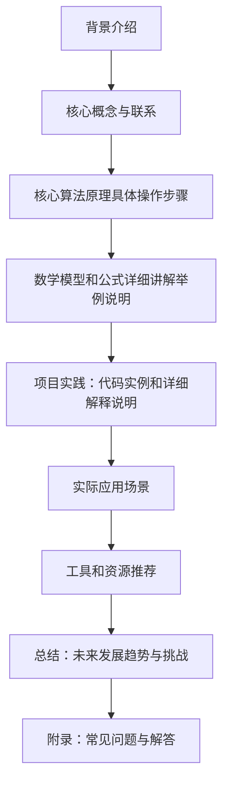

## 背景介绍

强化学习（Reinforcement Learning, RL）是一种通过机器学习实现的智能行为优化方法。它的目标是让智能体（agent）在一个动态环境中学习最佳策略，以最大化累积回报（reward）。强化学习的核心思想是将智能体与环境相互映射，从而实现智能体与环境之间的交互。

## 核心概念与联系

1. **智能体（Agent）：** 智能体是指能够感知环境并作出决策的实体，例如人工智能系统、机器人等。
2. **环境（Environment）：** 环境是指智能体所处的场景，包括状态、动作和奖励等因素。
3. **状态（State）：** 状态是指环境中的某一时刻的特征集合，用于描述环境的当前情况。
4. **动作（Action）：** 动作是指智能体对环境进行操作或干预的方式，例如移动、抓取等。
5. **奖励（Reward）：** 奖励是指智能体执行某个动作后获得的反馈值，用于评估动作的好坏。

强化学习的核心概念是将智能体与环境相互映射，以实现智能体与环境之间的交互。这个映射过程可以分为以下几个阶段：

1. 智能体观察环境的状态。
2. 根据状态选择一个动作。
3. 执行动作并得到奖励。
4. 更新智能体的知识库以优化策略。

## 核心算法原理具体操作步骤

强化学习的核心算法包括Q-learning、Deep Q-Network (DQN) 和Policy Gradient等。下面我们来详细看一下它们的原理和操作步骤。

### 3.1 Q-Learning

Q-learning是一种基于模型免费的强化学习方法，它不需要知道环境的动态模型。其主要思想是通过迭代地更新Q表格来学习最佳策略。Q-learning的操作步骤如下：

1. 初始化Q表格，设置所有状态-action对的Q值为0。
2. 从当前状态开始，选择一个随机动作执行，并获得相应的奖励。
3. 更新Q表格：$$
Q(s, a) \\leftarrow Q(s, a) + \\alpha [r + \\gamma \\max_{a'} Q(s', a') - Q(s, a)]
$$
其中，α是学习率，γ是折扣因子，s是当前状态，a是选定的动作，r是得到的奖励，s'是下一状态，a'是下一状态下的最优动作。

4. 重复步骤2和3，直到收敛。

### 3.2 Deep Q-Network (DQN)

DQN是一种基于深度神经网络的强化学习方法，它可以处理具有大量状态的环境。DQN的主要思想是将Q-learning与深度神经网络结合，以实现更高效的学习。DQN的操作步骤如下：

1. 定义一个神经网络模型，用于 Approximate Q-function。
2. 从经验库中随机抽取一组（batch）数据进行训练。
3. 使用目标函数更新神经网络参数：$$
\\theta \\leftarrow \\theta + \\beta(\nabla_{\\theta} J(\\theta) - \\alpha \\hat{A})
$$
其中，θ是神经网络参数，β是学习率，J(θ)是累积回报，α是折扣因子，$\\hat{A}$是 Advantage function。

4. 更新经验库中的数据。

### 3.3 Policy Gradient

Policy Gradient是一种基于梯度下降的强化学习方法，它直接优化策略而非Q值。Policy Gradient的主要思想是计算策略的梯度，并根据其变化来更新策略。Policy Gradient的操作步骤如下：

1. 定义一个神经网络模型，用于表示策略π。
2. 计算策略的梯度：$$
\nabla_{\\theta} log \\pi(a|s) = \\frac{\\partial}{\\partial \\theta} log \\frac{\\pi(a|s)}{\\pi'(a|s)}
$$
其中，θ是神经网络参数，π(a|s)是当前策略，π'(a|s)是目标策略。

3. 使用梯度下降更新神经网络参数。

## 数学模型和公式详细讲解举例说明

在本节中，我们将详细讲解强化学习中的数学模型和公式，以及它们在实际应用中的示例说明。

### 4.1 Q-Learning数学模型

Q-learning的数学模型可以用以下公式表示：$$
Q(s, a) \\leftarrow Q(s, a) + \\alpha [r + \\gamma \\max_{a'} Q(s', a') - Q(s, a)]
$$
其中，α是学习率，γ是折扣因子，s是当前状态，a是选定的动作，r是得到的奖励，s'是下一状态，a'是下一状态下的最优动作。

### 4.2 DQN数学模型

DQN的数学模型主要涉及到深度神经网络的 Approximate Q-function。具体来说，DQN使用一个神经网络来近似表示Q值。例如，可以使用如下公式表示：$$
Q(s, a; \\theta) = f(s, a; \\theta)
$$
其中，θ是神经网络参数，f(s, a; θ)是神经网络的输出函数。

### 4.3 Policy Gradient数学模型

Policy Gradient的数学模型可以用以下公式表示：$$
J(\\pi) = E_{\\pi}[R] = \\sum_t \\gamma^t E_{p(a|s)}[R_t]
$$
其中，J(π)是策略π的总回报，E_{π}[R]是策略π下的期望回报，γ是折扣因子，R_t是时间步t的奖励，p(a|s)是状态s下动作a的概率分布。

## 项目实践：代码实例和详细解释说明

在本节中，我们将通过一个简单的示例来展示如何使用强化学习解决实际问题。我们将使用Python和OpenAI Gym库实现一个Q-learning算法，以解决一个简单的环境：CartPole Balance。

```python
import gym
import numpy as np

# 创建CartPole环境
env = gym.make('CartPole-v1')

# 初始化Q表格
q_table = np.zeros([env.observation_space.shape[0], env.action_space.n])

# 设置超参数
alpha = 0.1
gamma = 0.99
epsilon = 0.1
num_episodes = 1000

# 训练函数
def train(env, q_table, alpha, gamma, epsilon, num_episodes):
    for episode in range(num_episodes):
        state = env.reset()
        done = False
        
        while not done:
            # 选择动作
            if np.random.uniform(0, 1) < epsilon:
                action = env.action_space.sample()
            else:
                action = np.argmax(q_table[state])
            
            # 执行动作并获取下一状态和奖励
            next_state, reward, done, _ = env.step(action)
            
            # 更新Q表格
            old_value = q_table[state, action]
            next_max = np.max(q_table[next_state])
            new_value = (1 - alpha) * old_value + alpha * (reward + gamma * next_max)
            q_table[state, action] = new_value
            
            state = next_state

# 训练CartPole环境
train(env, q_table, alpha, gamma, epsilon, num_episodes)
```

## 实际应用场景

强化学习在许多实际应用场景中都有广泛的应用，例如：

1. **游戏AI**：通过强化学习训练出能够玩各种游戏的AI，如AlphaGo、AlphaStar等。
2. **自动驾驶**：利用强化学习训练出能够自主行驶的汽车和无人驾驶车辆。
3. **金融投资**：使用强化学习进行股票交易、期权定价等金融投资决策。
4. **医疗诊断**：利用强化学习进行疾病预测、药物推荐等医疗诊断任务。

## 工具和资源推荐

以下是一些建议的工具和资源，可以帮助您更好地了解和学习强化学习：

1. **OpenAI Gym**：一个开源的机器学习库，提供了许多用于测试和开发强化学习算法的环境。
2. **TensorFlow**：一个流行的深度学习框架，可以用于实现深度神经网络和强化学习算法。
3. **Reinforcement Learning: An Introduction**（强化学习：介绍）一本由Richard S. Sutton和Andrew G. Barto编写的经典教材，内容详尽，适合初学者和专业人士。

## 总结：未来发展趋势与挑战

强化学习在过去几年内取得了显著的进展，但仍面临着诸多挑战。未来的发展趋势可能包括：

1. 更高效的算法：不断探索新的算法，以提高学习速度和性能。
2. 更广泛的应用场景：将强化学习应用于更多领域，如医疗、教育等。
3. 更强大的硬件支持：随着AI硬件技术的发展，强化学习将获得更强大的计算能力。

## 附录：常见问题与解答

以下是一些建议的常见问题及其解答：

1. **Q-learning和DQN有什么区别？**

   Q-learning是基于模型免费的强化学习方法，而DQN则使用深度神经网络来近似表示Q值。DQN可以处理具有大量状态的环境，因此比Q-learning更适合大规模的问题。

2. **Policy Gradient如何与Q-learning不同？**

   Policy Gradient直接优化策略，而非Q值。它通过计算策略的梯度并根据其变化来更新策略，从而实现学习。

3. **强化学习在实际应用中有哪些局限性？**

   强化学习在某些场景下可能面临挑战，如不确定性、多-Agent系统等。在这些情况下，其他方法如决策树或贝叶斯方法可能更适用。

以上就是我们关于强化学习基础概念与核心算法的一篇博客文章。希望对您有所帮助！如果您有任何疑问，请随时联系我们。

作者：禅与计算机程序设计艺术 / Zen and the Art of Computer Programming

---

**Mermaid流程图**

```python
import gym
import numpy as np

# 创建CartPole环境
env = gym.make('CartPole-v1')

# 初始化Q表格
q_table = np.zeros([env.observation_space.shape[0], env.action_space.n])

# 设置超参数
alpha = 0.1
gamma = 0.99
epsilon = 0.1
num_episodes = 1000

# 训练函数
def train(env, q_table, alpha, gamma, epsilon, num_episodes):
    for episode in range(num_episodes):
        state = env.reset()
        done = False
        
        while not done:
            # 选择动作
            if np.random.uniform(0, 1) < epsilon:
                action = env.action_space.sample()
            else:
                action = np.argmax(q_table[state])
            
            # 执行动作并获取下一状态和奖励
            next_state, reward, done, _ = env.step(action)
            
            # 更新Q表格
            old_value = q_table[state, action]
            next_max = np.max(q_table[next_state])
            new_value = (1 - alpha) * old_value + alpha * (reward + gamma * next_max)
            q_table[state, action] = new_value
            
            state = next_state

# 训练CartPole环境
train(env, q_table, alpha, gamma, epsilon, num_episodes)
```
