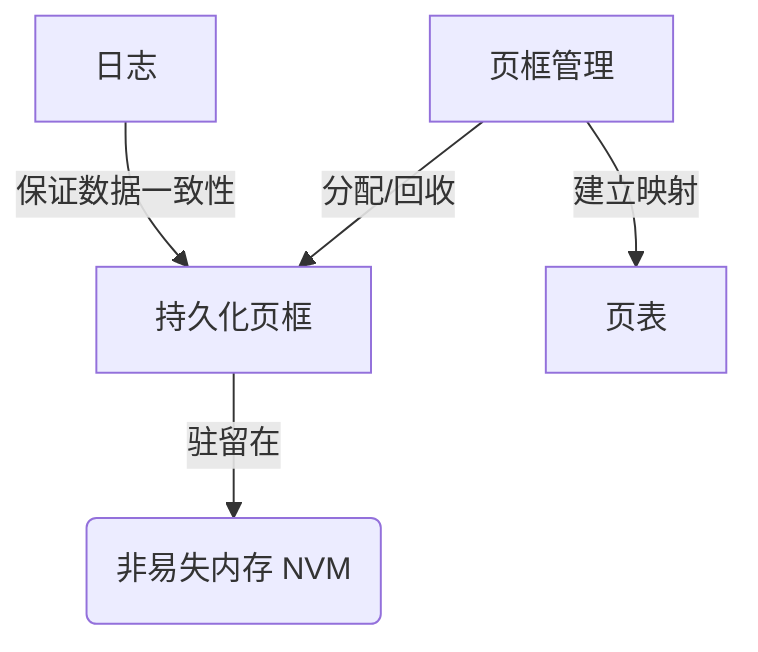

# 一种面向非易失内存的持久化页框管理系统设计与实现

## 1. 背景介绍

### 1.1 非易失内存技术发展现状
非易失内存(Non-Volatile Memory, NVM)是一种新兴的存储技术,具有高速、低功耗、非易失等特点。相比传统的DRAM和NAND闪存,NVM在访问速度和持久化存储方面都有显著优势。目前主流的NVM技术包括相变存储器(PCM)、磁阻随机存储器(MRAM)、阻变存储器(RRAM)等。随着制造工艺的不断进步,NVM的容量和性能都在快速提升,有望成为未来计算机系统的主流存储介质。

### 1.2 NVM给传统页框管理带来的挑战
NVM的出现给传统的基于DRAM的页框管理机制带来了新的挑战:

1. **持久化问题**: 传统页框中的数据掉电后会丢失,而NVM具有数据持久化特性,需要设计新的页框管理方式来保证掉电数据的一致性和完整性。
2. **访问性能问题**: NVM的读写性能虽然优于NAND闪存,但仍然比DRAM慢,直接将NVM作为内存页框使用会影响系统性能。
3. **磨损均衡问题**: NVM的写入次数是有限的,频繁的页框换入换出操作会加剧NVM的磨损,需要设计磨损均衡机制。

### 1.3 研究意义
针对NVM设计高效的持久化页框管理系统,对于发挥NVM的持久化存储优势、提升内存访问性能、延长NVM使用寿命都具有重要意义。本文将探讨一种面向NVM的新型页框管理系统的设计与实现,力求在保证数据持久性的同时,兼顾访问性能与磨损均衡,为NVM在内存系统中的应用提供有益参考。

## 2. 核心概念与联系

### 2.1 持久化页框(Persistent Frame)
传统意义上,页框是内存中的一块固定大小的区域,用于存储从外存换入的页面数据。而持久化页框是驻留在NVM中的一块存储区域,具有掉电数据不丢失的特性。

### 2.2 页框管理(Frame Management) 
页框管理是内存管理的核心职责之一,主要功能包括:

1. **页框分配**: 当发生缺页异常时,从空闲页框列表中分配一个页框用于存储换入的页面。
2. **页框回收**: 当空闲页框不足时,根据一定的页面替换算法选择一个页框进行回收,将其中的页面换出到外存。
3. **页框映射**: 建立逻辑页号与物理页框号之间的映射关系,形成页表项。

### 2.3 日志(Log)
日志是由一系列日志记录组成的持久化数据结构,用于记录页框数据的更新操作,保证NVM中数据的一致性。常见的日志记录包括:

- **Update Log**: 记录写操作的数据页框号、偏移量、写入长度、写入数据等。
- **Commit Log**: 记录一个原子写操作的起始和结束标记。

### 2.4 核心概念之间的关系



## 3. 核心算法原理具体操作步骤

### 3.1 页框分配算法

1. 应用程序发起内存访问请求,如果请求的逻辑页不在内存中,则发生缺页异常。
2. 操作系统捕获缺页异常,根据请求的逻辑页号,在NVM中查找对应的持久化页框。
3. 如果找到对应的持久化页框,则直接将其分配给应用程序使用。
4. 如果没有找到对应的持久化页框,则说明请求的页面尚未被换入NVM。
5. 从NVM中的空闲页框列表中取出一个空闲页框。
6. 如果NVM中没有空闲页框,则触发页框回收流程,直至获得一个空闲页框。
7. 将请求的页面从外存读入该空闲页框,并将页框分配给应用程序使用。
8. 更新页表项,建立逻辑页号到物理页框号的映射关系。

### 3.2 页框回收算法

1. 根据一定的页面替换算法(如LRU、Clock等),选择一个NVM中的页框作为替换页框。
2. 检查替换页框的状态,如果该页框是脏页(有未写回的修改),则需要将其数据写回外存。
3. 为保证NVM数据一致性,写回操作需要记录Update Log和Commit Log。
4. 写回完成后,将该页框从页表中移除,并加入NVM的空闲页框列表。
5. 返回该空闲页框,用于存储新的页面数据。

### 3.3 日志写入与检查点机制

1. 应用程序对NVM中的持久化页框进行写操作。
2. 写操作发生时,生成一条Update Log记录,包含页框号、偏移、长度、数据等信息。
3. Update Log记录即时写入NVM的日志区,保证写操作的持久化。
4. 当一系列写操作完成后,生成一条Commit Log记录,标记这些写操作形成了一个原子更新。
5. 系统定期触发检查点(Checkpoint)操作,将NVM中的脏页框数据刷新到外存。
6. 刷新过程中,根据日志记录对脏页框进行合并写入,保证外存数据与NVM数据的一致性。
7. 完成检查点后,之前的日志记录可以被丢弃,回收日志空间。

## 4. 数学模型和公式详细讲解举例说明

### 4.1 页面替换算法的数学模型

以LRU(Least Recently Used)页面替换算法为例,其数学模型可以表示为:

设页框集合为$F=\{f_1,f_2,...,f_n\}$,每个页框都有一个时间戳$t_i$表示该页框上一次被访问的时间。当发生缺页异常时,选择替换的页框$f_j$满足:

$$
f_j = \arg\min_{1 \leq i \leq n} t_i
$$

即选择时间戳最小(最久未被访问)的页框进行替换。

举例说明:假设有3个页框,其时间戳分别为$t_1=10,t_2=5,t_3=8$,则根据LRU算法,应该选择替换$f_2$页框。

### 4.2 磨损均衡策略的数学模型

设NVM中有$m$个块,每个块有$n$个页框。定义$w_{ij}$为第$i$个块中第$j$个页框的写入次数。目标是最小化各个块的写入次数差异,可以表示为最小化目标函数:

$$
\min \sum_{i=1}^{m} (\sum_{j=1}^{n} w_{ij} - \overline{w})^2
$$

其中$\overline{w}$为所有页框写入次数的平均值:

$$
\overline{w} = \frac{\sum_{i=1}^{m} \sum_{j=1}^{n} w_{ij}}{mn}
$$

举例说明:假设有2个块,每个块有2个页框,其写入次数分别为$w_{11}=100,w_{12}=50,w_{21}=80,w_{22}=70$。则平均写入次数为$\overline{w}=75$,目标函数值为$(100-75)^2+(50-75)^2+(80-75)^2+(70-75)^2=1250$。磨损均衡策略应该尽量将新的写操作分配到写入次数较少的页框上,以减小目标函数值。

## 5. 项目实践：代码实例和详细解释说明

下面是一个简化的持久化页框管理系统的C++代码示例:

```cpp
#include <iostream>
#include <vector>
#include <unordered_map>

using namespace std;

// 持久化页框类
class PersistentFrame {
public:
    int frame_id;    // 页框号
    bool is_dirty;   // 是否为脏页
    int last_access; // 上一次访问时间戳

    PersistentFrame(int id) : frame_id(id), is_dirty(false), last_access(0) {}
};

// 持久化页框管理类
class PersistentFrameManager {
private:
    vector<PersistentFrame> frames;                 // 页框数组
    unordered_map<int, PersistentFrame*> page_table; // 页表映射
    int timestamp;                                   // 全局时间戳

public:
    PersistentFrameManager(int num_frames) : timestamp(0) {
        frames.reserve(num_frames);
        for (int i = 0; i < num_frames; i++) {
            frames.emplace_back(i);
        }
    }

    // 分配页框
    PersistentFrame* allocate_frame(int page_id) {
        if (page_table.find(page_id) != page_table.end()) {
            // 页面已在内存中,直接返回对应页框
            return page_table[page_id];
        }

        if (frames.empty()) {
            // 无空闲页框,触发页框回收
            reclaim_frame();
        }

        // 从空闲页框列表中取出一个页框
        PersistentFrame* frame = &frames.back();
        frames.pop_back();

        // 更新页表映射
        page_table[page_id] = frame;

        return frame;
    }

    // 回收页框
    void reclaim_frame() {
        // 使用LRU算法找到替换页框
        auto it = min_element(frames.begin(), frames.end(),
            [](const PersistentFrame& a, const PersistentFrame& b) {
                return a.last_access < b.last_access;
            });

        PersistentFrame* victim = &(*it);

        if (victim->is_dirty) {
            // 页框为脏页,写回外存
            write_back(victim);
            victim->is_dirty = false;
        }

        // 从页表中移除映射
        page_table.erase(victim->frame_id);

        // 将页框加入空闲列表
        frames.push_back(*victim);
    }

    // 访问页框
    void access_frame(int page_id) {
        PersistentFrame* frame = page_table[page_id];
        frame->last_access = ++timestamp;
    }

    // 写回脏页
    void write_back(PersistentFrame* frame) {
        // 记录Update Log
        log_update(frame);

        // 实际写回外存的操作
        // ...

        // 记录Commit Log
        log_commit();
    }

    // 记录Update Log
    void log_update(PersistentFrame* frame) {
        // 生成Update Log记录并持久化
        // ...
    }

    // 记录Commit Log
    void log_commit() {
        // 生成Commit Log记录并持久化
        // ...
    }
};
```

代码说明:

1. `PersistentFrame`类表示一个持久化页框,包含页框号、是否为脏页、上一次访问时间戳等属性。
2. `PersistentFrameManager`类是持久化页框管理的核心类,包含页框数组、页表映射等数据结构,以及页框分配、回收、访问等操作。
3. `allocate_frame`方法根据请求的逻辑页号分配一个持久化页框,如果该页已在内存中则直接返回对应页框,否则从空闲页框列表中分配一个新的页框。
4. `reclaim_frame`方法使用LRU算法进行页框回收,找到最久未被访问的页框进行替换,如果该页框为脏页则需要先写回外存。
5. `access_frame`方法在访问一个页框时更新其时间戳,用于LRU替换算法。
6. `write_back`方法将一个脏页框的数据写回外存,同时记录Update Log和Commit Log,保证NVM数据一致性。
7. `log_update`和`log_commit`方法分别记录Update Log和Commit Log,并将其持久化到NVM的日志区。

以上代码实现了一个基本的持久化页框管理系统,展示了页框分配、回收、访问以及日志记录等核心操作。实际系统中还需要考虑并发访问、错误恢复、性能优化等因素。

## 6. 实际应用场景

持久化页框管理系统可以应用于以下场景:

1. **数据库系统**: 传统数据库使用DRAM作为缓冲池,将频繁访问的数据页缓存在内存中。使用NVM作为持久化页框,可以大幅提高缓冲池容量,减少I/O操作,同时保证数据的持久性。

2. **文件系