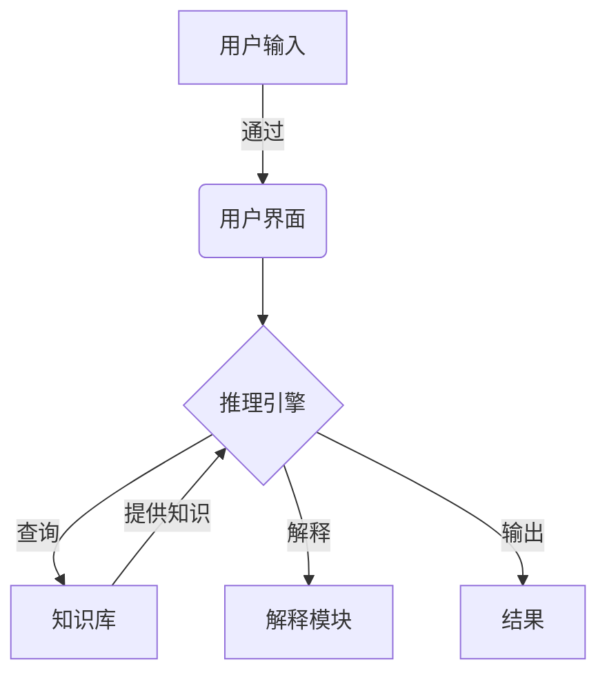

# 专家系统 (Expert System)

## 1.背景介绍

专家系统(Expert System)是一种运用人工智能技术模拟人类专家的知识和推理能力来解决复杂问题的计算机程序。它通过将专家的知识和经验转化为可计算的形式,使计算机能够像人类专家一样进行推理和决策。专家系统的出现旨在弥补人类专家数量有限、分布不均以及知识传承困难等问题,使专家知识得以保存和广泛传播。

专家系统的发展可以追溯到20世纪60年代,当时人工智能研究领域正在兴起。1965年,Edward Feigenbaum等人在斯坦福大学开发了第一个专家系统DENDRAL,用于分析有机化合物的分子结构。此后,专家系统在医疗诊断、金融决策、工程设计等多个领域得到了广泛应用。

## 2.核心概念与联系

专家系统通常由以下几个核心组件构成:

1. **知识库(Knowledge Base)**: 存储专家的知识和经验,通常以规则(Rules)、框架(Frames)或其他形式表示。
2. **推理引擎(Inference Engine)**: 根据知识库中的规则和事实,进行逻辑推理并得出结论。
3. **知识获取模块(Knowledge Acquisition Module)**: 用于从人类专家那里获取知识,并将其转化为可计算的形式存储在知识库中。
4. **用户界面(User Interface)**: 提供与用户交互的界面,接收用户输入并显示系统输出。
5. **解释模块(Explanation Module)**: 解释系统是如何得出结论的,增加系统的透明度和可解释性。

这些组件紧密协作,形成了专家系统的基本工作流程:



## 3.核心算法原理具体操作步骤

专家系统的核心算法原理主要包括以下几个方面:

### 3.1 知识表示

知识表示是将人类专家的知识转化为计算机可理解的形式,是专家系统的基础。常用的知识表示方法包括:

1. **规则表示(Rule-based Representation)**: 以"IF-THEN"形式表示条件和结论,是最常见的知识表示方式。
2. **框架表示(Frame-based Representation)**: 使用框架(Frame)来表示对象及其属性和关系。
3. **语义网络(Semantic Network)**: 使用节点和边来表示概念及其关系。
4. **逻辑表示(Logic Representation)**: 使用一阶逻辑或其他逻辑形式来表示知识。

### 3.2 推理机制

推理机制是专家系统的核心,用于根据知识库中的知识进行推理并得出结论。常见的推理机制包括:

1. **前向链推理(Forward Chaining)**: 从已知事实出发,应用规则推导出新的事实,直到达到目标或无法推导为止。
2. **后向链推理(Backward Chaining)**: 从目标出发,寻找支持目标的规则和事实,反向推理直到找到已知事实或无法推导为止。
3. **非单调推理(Non-monotonic Reasoning)**: 允许在获得新信息时修改先前的结论,适用于不确定性领域。
4. **模糊推理(Fuzzy Reasoning)**: 处理不精确、模糊的信息,常用于控制系统等领域。

### 3.3 不确定性处理

由于专家系统通常需要处理不完全或不精确的信息,因此需要采用特定的方法来处理不确定性。常见的不确定性处理方法包括:

1. **贝叶斯推理(Bayesian Inference)**: 基于贝叶斯定理,根据先验概率和观测证据计算后验概率。
2. **确信度因子(Certainty Factor)**: 使用数值表示规则或事实的确信度,并通过组合运算得出结论的确信度。
3. **模糊逻辑(Fuzzy Logic)**: 使用模糊集合和模糊规则来处理不精确的信息。
4. **德尔菲法(Delphi Method)**: 通过多轮专家评估和反馈,达成一致的判断。

## 4.数学模型和公式详细讲解举例说明

### 4.1 贝叶斯推理

贝叶斯推理是一种基于贝叶斯定理的不确定性处理方法,广泛应用于专家系统中。贝叶斯定理可以表示为:

$$P(H|E) = \frac{P(E|H)P(H)}{P(E)}$$

其中:
- $P(H|E)$ 表示在观测到证据 $E$ 的情况下,假设 $H$ 为真的后验概率。
- $P(E|H)$ 表示在假设 $H$ 为真的情况下,观测到证据 $E$ 的概率,称为似然度(Likelihood)。
- $P(H)$ 表示假设 $H$ 的先验概率。
- $P(E)$ 表示证据 $E$ 的边缘概率,是一个归一化常数。

通过贝叶斯定理,我们可以根据观测到的证据和先验知识,计算出假设为真的后验概率。

例如,在医疗诊断领域,假设 $H$ 表示患有某种疾病,证据 $E$ 表示观测到的症状。我们可以使用贝叶斯定理计算患病的后验概率 $P(H|E)$,从而辅助诊断决策。

### 4.2 确信度因子

确信度因子(Certainty Factor, CF)是一种常用的不确定性处理方法,通过数值表示规则或事实的确信度,并通过组合运算得出结论的确信度。

确信度因子的取值范围通常为 [-1, 1],其中:
- CF = 1 表示完全确信
- CF = 0 表示不确定
- CF = -1 表示完全不确信

对于一条规则 "IF A THEN B",我们可以分别为前提 A 和结论 B 赋予确信度因子 CF(A) 和 CF(B)。推理时,可以使用以下公式组合确信度因子:

$$CF(B) = CF(A) \times CF(rule)$$

其中 $CF(rule)$ 表示规则本身的确信度因子,通常由专家或知识工程师指定。

对于多条规则导出同一结论的情况,可以使用以下公式组合确信度因子:

$$CF(B) = CF(B_1) + CF(B_2) \times (1 - CF(B_1))$$

其中 $CF(B_1)$ 和 $CF(B_2)$ 分别表示两条规则导出结论 B 的确信度因子。

通过确信度因子,专家系统可以量化不确定性,并在推理过程中传播和组合不确定性,从而得出结论的可信度。

## 5.项目实践：代码实例和详细解释说明

以下是一个使用Python实现简单专家系统的示例,用于诊断植物病虫害:

```python
# 知识库
knowledge_base = {
    'rule1': {'IF': {'symptom1': True, 'symptom2': True},
              'THEN': 'disease1',
              'CF': 0.8},
    'rule2': {'IF': {'symptom3': True, 'symptom4': True},
              'THEN': 'disease2',
              'CF': 0.9},
    'rule3': {'IF': {'symptom5': True},
              'THEN': 'disease3',
              'CF': 0.7}
}

# 推理引擎
def inference_engine(facts):
    conclusions = []
    for rule in knowledge_base.values():
        rule_satisfied = True
        for condition, value in rule['IF'].items():
            if facts.get(condition) != value:
                rule_satisfied = False
                break
        if rule_satisfied:
            conclusion = rule['THEN']
            cf = rule['CF']
            conclusions.append((conclusion, cf))
    return conclusions

# 用户界面
def user_interface():
    facts = {}
    print("请输入观测到的症状(True/False):")
    for symptom in ['symptom1', 'symptom2', 'symptom3', 'symptom4', 'symptom5']:
        value = input(f"{symptom}: ")
        facts[symptom] = True if value.lower() == 'true' else False
    return facts

# 主程序
if __name__ == '__main__':
    facts = user_interface()
    conclusions = inference_engine(facts)
    print("可能的诊断结果:")
    for conclusion, cf in conclusions:
        print(f"{conclusion} (确信度: {cf})")
```

在这个示例中:

1. 知识库 `knowledge_base` 使用字典结构存储规则,每条规则包含前提条件、结论和确信度因子。
2. 推理引擎 `inference_engine` 函数实现了前向链推理,根据用户输入的事实和知识库中的规则,推导出可能的结论及其确信度因子。
3. 用户界面 `user_interface` 函数负责与用户交互,获取观测到的症状作为事实输入。
4. 主程序首先调用 `user_interface` 获取事实,然后调用 `inference_engine` 进行推理,最后输出可能的诊断结果及其确信度。

通过这个示例,你可以了解专家系统的基本组件和工作流程,以及如何使用Python实现一个简单的专家系统。

## 6.实际应用场景

专家系统在许多领域得到了广泛应用,以下是一些典型的应用场景:

1. **医疗诊断**: 医疗专家系统可以根据患者的症状和病史,模拟医生的推理过程,提供疾病诊断和治疗建议。例如 MYCIN 系统用于诊断血液感染。

2. **金融决策**: 金融专家系统可以分析市场数据、投资组合和风险因素,为投资决策提供建议。例如 FOLIO 系统用于证券投资组合管理。

3. **工程设计**: 工程专家系统可以根据设计规范和约束条件,提供产品设计和优化方案。例如 XCON 系统用于计算机系统配置。

4. **故障诊断**: 专家系统可以根据设备故障症状,诊断故障原因并提供维修建议。例如 PESS 系统用于电力系统故障诊断。

5. **教育辅助**: 专家系统可以作为智能教学辅助系统,根据学生的知识水平和学习进度,提供个性化的教学内容和指导。

6. **决策支持**: 专家系统可以为复杂的决策过程提供支持,综合考虑多种因素并给出建议。例如 PROSPECTOR 系统用于矿产勘探决策。

7. **法律咨询**: 法律专家系统可以根据案例事实和法律知识,提供法律分析和建议。

8. **环境保护**: 专家系统可以应用于环境监测、污染控制和生态管理等领域。

总的来说,专家系统的应用范围非常广泛,凡是需要模拟人类专家知识和经验的领域,都可以考虑使用专家系统技术。

## 7.工具和资源推荐

在开发和使用专家系统时,以下工具和资源可能会有所帮助:

1. **专家系统开发工具**:
   - CLIPS: 一种基于规则的开源专家系统工具,支持多种编程语言。
   - Drools: 一个基于Java的开源规则引擎,可用于构建专家系统。
   - JESS: 一个基于Java的规则引擎,支持多种推理方式。

2. **知识表示语言**:
   - OWL: Web本体语言(Web Ontology Language),用于表示知识库中的概念和关系。
   - SWRL: 语义Web规则语言(Semantic Web Rule Language),用于在OWL本体中表达规则。

3. **开源框架和库**:
   - PyCLIPS: Python与CLIPS的集成,用于在Python中开发基于规则的系统。
   - Pyknow: 一个Python专家系统框架,支持前向链和后向链推理。
   - Experta: 一个Python规则引擎,用于构建基于规则的应用程序。

4. **在线资源**:
   - AI Topics (https://aitopics.org/): 人工智能主题网站,包含专家系统的教程和资源。
   - Exsys Corvid (https://exsys.com/): 一个商业专家系统开发工具,提供免费试用版本。
   - XpertRule (https://www.attar.com/): 一个基于Web的专家系统开发环境。

5. **书籍和教程**:
   - "Expert Systems: Principles and Programming" by Joseph C. Giarratano and Gary D. Riley
   - "Building Expert