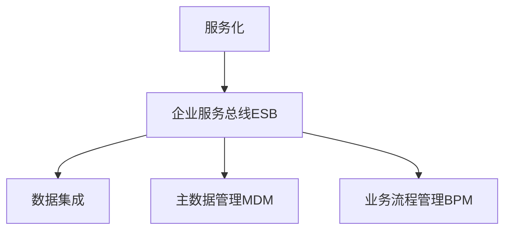

# 产业板块集成信息系统总体构架

## 1. 背景介绍

### 1.1 产业板块集成信息系统的重要性

在当今高度信息化和数字化的时代,企业面临着日益激烈的市场竞争和快速变化的商业环境。为了在这种环境下保持竞争优势,企业需要高效地管理和利用信息资源。产业板块集成信息系统应运而生,它旨在整合企业内部各个业务板块的信息系统,实现信息共享和业务协同,提高企业的运营效率和决策水平。

### 1.2 产业板块集成信息系统面临的挑战

构建产业板块集成信息系统并非易事,它面临着诸多挑战:

1. 业务复杂性:不同业务板块有着各自独特的业务流程和数据模型,如何在保证业务独立性的同时实现信息共享和业务协同是一大难题。

2. 技术异构性:各个业务板块的信息系统可能基于不同的技术架构和平台,如何实现这些异构系统的互联互通是另一个挑战。

3. 数据一致性:在集成过程中,需要确保各个业务板块的数据在语义上是一致的,避免出现数据冲突和不一致的情况。

4. 安全与权限管理:在实现信息共享的同时,还需要考虑数据安全和访问权限的问题,防止敏感数据的泄露和非授权访问。

### 1.3 本文的目的和结构

本文旨在探讨如何构建一个高效、灵活、安全的产业板块集成信息系统。我们将从以下几个方面展开论述:

1. 核心概念与联系:介绍产业板块集成信息系统的核心概念,以及这些概念之间的联系。

2. 核心算法原理与操作步骤:详细阐述实现产业板块集成的核心算法原理,并给出具体的操作步骤。

3. 数学模型和公式:利用数学模型和公式,对核心算法进行形式化描述,并通过举例说明加深理解。

4. 项目实践:给出一个产业板块集成信息系统的代码实例,并对其进行详细解释。

5. 实际应用场景:讨论产业板块集成信息系统在实际业务中的应用场景。

6. 工具和资源推荐:推荐实现产业板块集成信息系统的相关工具和资源。

7. 未来发展趋势与挑战:展望产业板块集成信息系统的未来发展趋势,并分析其面临的挑战。

8. 常见问题与解答:总结实践中常见的问题,并给出相应的解决方案。

## 2. 核心概念与联系

### 2.1 服务化

服务化是实现产业板块集成的基础。它要求将各个业务板块的功能以服务的形式提供出来,使其可以被其他系统调用和集成。每个服务都有明确定义的接口,说明服务的输入、输出和功能。服务之间通过标准的协议进行通信,如HTTP、SOAP等。

### 2.2 企业服务总线(ESB) 

企业服务总线是连接各个服务的中枢。它负责服务的注册、发现和路由,实现服务之间的可靠通信。ESB 屏蔽了服务的技术细节,使得服务的提供方和调用方可以专注于业务逻辑的实现。

### 2.3 数据集成

数据集成旨在将分散在各个业务系统中的数据整合到一起,形成一致的、全面的数据视图。常用的数据集成方法包括 ETL(Extract-Transform-Load)和 EII(Enterprise Information Integration)。前者通过提取、转换、加载的过程将数据从源系统移动到目标系统;后者则通过虚拟化的方式,在不移动数据的情况下实现数据的集成。

### 2.4 主数据管理(MDM)

主数据是企业核心业务实体的数据,如客户、产品、供应商等。主数据管理的目标是在企业范围内维护主数据的一致性、准确性和完整性。通过主数据管理,可以消除不同业务系统之间的数据孤岛,实现数据的共享和重用。

### 2.5 业务流程管理(BPM)

业务流程管理关注的是跨业务板块的端到端流程的优化。它通过对业务流程进行建模、执行、监控和优化,实现业务的自动化和协同。BPM 与 ESB 紧密相关,ESB 提供了流程执行的基础设施,而 BPM 则负责流程的定义和管理。

### 核心概念联系图



## 3. 核心算法原理具体操作步骤

### 3.1 服务化的实现步骤

1. 业务领域建模:对业务领域进行分析,识别出关键的业务实体和业务功能。
2. 服务识别:根据业务领域模型,识别出可以提供的服务。
3. 服务定义:对每个服务进行详细定义,包括服务接口、输入输出参数、服务级别协议等。
4. 服务开发:按照服务定义进行服务的实现。
5. 服务测试:对开发完成的服务进行功能性和非功能性测试。
6. 服务部署:将测试通过的服务部署到 ESB 上。
7. 服务治理:对服务进行持续的监控和管理,确保服务的可用性和性能。

### 3.2 数据集成的 ETL 过程

1. 提取(Extract):从源系统提取所需的数据。
2. 清洗(Cleanse):对提取的数据进行清洗,去除错误、不一致和重复的数据。
3. 转换(Transform):根据目标系统的要求对数据进行转换,如格式转换、值映射等。
4. 加载(Load):将转换后的数据加载到目标系统。
5. 验证(Verify):对加载的数据进行验证,确保数据的准确性和完整性。

### 3.3 主数据管理的操作步骤

1. 主数据识别:识别出企业的主数据实体,如客户、产品等。
2. 主数据收集:从各个源系统收集主数据。
3. 主数据清洗:对收集的主数据进行清洗,解决数据质量问题。
4. 主数据整合:将清洗后的主数据整合到中心的主数据库中。
5. 主数据分发:将主数据分发到各个业务系统,实现数据共享。
6. 主数据维护:对主数据进行持续的维护,确保其准确性和完整性。

### 3.4 业务流程管理的操作步骤

1. 流程建模:使用流程建模工具对业务流程进行可视化建模。
2. 流程实现:根据流程模型进行流程的具体实现,如开发相应的服务。
3. 流程部署:将实现的流程部署到 BPM 引擎上。
4. 流程执行:BPM 引擎负责流程的执行和调度。
5. 流程监控:对流程的执行进行监控,收集相关的性能指标。
6. 流程优化:根据监控数据对流程进行持续的优化和改进。

## 4. 数学模型和公式详细讲解举例说明

在产业板块集成信息系统中,我们可以使用一些数学模型和公式来描述系统的行为和性能。下面我们以排队论为例,说明如何用数学模型分析系统的性能。

假设我们有一个 ESB,它接收来自各个业务系统的服务请求,并将请求分发到相应的服务提供方。我们可以将 ESB 看作一个单服务台的排队系统,请求的到达服从泊松分布,服务时间服从指数分布。根据排队论的 M/M/1 模型,我们有以下公式:

1. 请求的平均到达率(每秒):$\lambda$
2. 请求的平均服务率(每秒):$\mu$
3. 系统的利用率:$\rho = \frac{\lambda}{\mu}$
4. 请求的平均等待时间:$W_q = \frac{\rho}{\mu - \lambda}$
5. 请求在系统中的平均逗留时间:$W = W_q + \frac{1}{\mu}$
6. 系统中请求的平均数量:$L = \lambda W$

举例说明:假设请求的平均到达率为10个/秒,平均服务率为20个/秒,则:

- 系统的利用率:$\rho = \frac{10}{20} = 0.5$
- 请求的平均等待时间:$W_q = \frac{0.5}{20 - 10} = 0.05$ 秒
- 请求在系统中的平均逗留时间:$W = 0.05 + \frac{1}{20} = 0.1$ 秒
- 系统中请求的平均数量:$L = 10 \times 0.1 = 1$ 个

通过这个例子,我们可以看到,当请求的到达率增加时,系统的利用率、请求的等待时间和系统中请求的数量都会增加。这给我们一个启示,需要合理控制请求的到达率,以保证系统的性能。

## 5. 项目实践:代码实例和详细解释说明

下面我们通过一个简单的代码实例,说明如何使用 Spring Boot 和 Apache Camel 实现一个基于 ESB 的服务集成。

### 5.1 添加依赖

在 pom.xml 中添加以下依赖:

```xml
<dependencies>
    <dependency>
        <groupId>org.springframework.boot</groupId>
        <artifactId>spring-boot-starter-web</artifactId>
    </dependency>
    <dependency>
        <groupId>org.apache.camel.springboot</groupId>
        <artifactId>camel-spring-boot-starter</artifactId>
        <version>3.18.1</version>
    </dependency>
</dependencies>
```

### 5.2 定义服务接口

定义一个简单的服务接口 GreetingService:

```java
public interface GreetingService {
    String sayHello(String name);
}
```

### 5.3 实现服务

实现 GreetingService 接口:

```java
@Service
public class GreetingServiceImpl implements GreetingService {
    public String sayHello(String name) {
        return "Hello, " + name;
    }
}
```

### 5.4 定义 Camel 路由

使用 Camel 的 Java DSL 定义一个路由,将 HTTP 请求转发到 GreetingService:

```java
@Component
public class GreetingRouter extends RouteBuilder {
    @Override
    public void configure() throws Exception {
        from("jetty:http://0.0.0.0:8080/greeting")
            .routeId("greeting-route")
            .transform().simple("${body}")
            .bean(GreetingService.class, "sayHello")
            .setHeader(Exchange.CONTENT_TYPE, constant("text/plain"));
    }
}
```

这个路由监听 8080 端口的 /greeting 路径,将请求体作为 name 参数传递给 GreetingService 的 sayHello 方法,并将返回结果作为响应返回。

### 5.5 启动应用

在主类中添加 @EnableAutoConfiguration 注解,启动 Spring Boot 应用:

```java
@SpringBootApplication
@EnableAutoConfiguration
public class Application {
    public static void main(String[] args) {
        SpringApplication.run(Application.class, args);
    }
}
```

### 5.6 测试服务

启动应用,使用 curl 命令测试服务:

```bash
$ curl http://localhost:8080/greeting -d "John"
Hello, John
```

这个简单的例子演示了如何使用 ESB 实现服务的集成。在实际项目中,我们可能需要集成更多的服务,并处理更复杂的业务逻辑。但是基本原理是相同的,都是通过 ESB 将不同的服务连接起来,实现服务之间的通信和协作。

## 6. 实际应用场景

产业板块集成信息系统在实际业务中有广泛的应用,下面是一些典型的应用场景:

### 6.1 供应链管理

在供应链管理中,需要集成采购、生产、仓储、配送等多个环节的信息系统。通过产业板块集成,可以实现供应链的端到端可视化,优化供应链流程,提高供应链的效率和敏捷性。

### 6.2 客户关系管理

客户关系管理涉及市场、销售、服务等多个部门,需要集成这些部门的信息系统,以获得客户的全景视图。通过