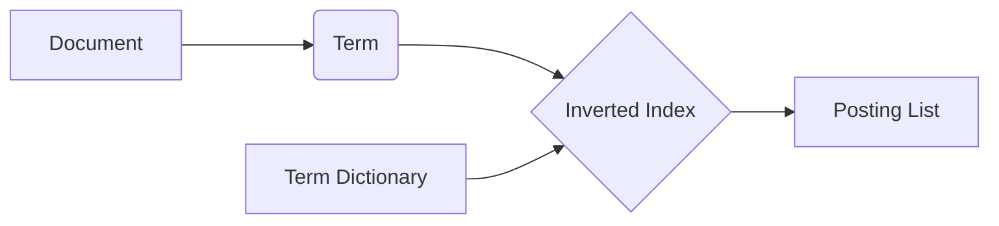

# 倒排索引 原理与代码实例讲解

## 1. 背景介绍
### 1.1 什么是倒排索引
倒排索引(Inverted Index)，也称为反向索引，是一种常用于全文搜索引擎的索引结构。它是一种映射关键词到文档的数据结构，能够根据关键词快速地找到包含该关键词的文档。

### 1.2 倒排索引的重要性
在海量的文本数据中，倒排索引能够极大地提高关键词的查询速度。没有倒排索引，搜索引擎就无法实时响应用户的查询。可以说，倒排索引是搜索引擎的核心，是搜索引擎的基石。

### 1.3 倒排索引的应用场景
倒排索引广泛应用于各种全文搜索引擎中，如 Web 搜索引擎、电子图书馆、文献检索系统等。一些大数据处理系统如 Elasticsearch、Solr、Lucene 等，都是基于倒排索引实现的。

## 2. 核心概念与联系
### 2.1 文档(Document)
文档是指要建立索引的基本单位，可以是网页、文本文件、数据库记录等。每个文档都有一个唯一的编号(DocID)。

### 2.2 词条(Term)
词条是文档的一个基本组成单位，通常是一个单词或词组。在英文等语言中，词条就是单词；在中文等语言中，词条可能是单个汉字或词语。

### 2.3 词典(Term Dictionary)
词典是文档集合中所有词条的集合。每个词条在词典中都有一个唯一的编号(TermID)。词典可以看作是 TermID 到 Term 的映射。

### 2.4 倒排列表(Posting List)  
每个词条都对应一个倒排列表，倒排列表记录了出现过该词条的所有文档的 DocID。有的实现中还会在倒排列表中记录词条在每个文档中出现的次数、位置等信息。

### 2.5 倒排索引的结构
倒排索引可以看作是 Term 到 Posting List 的映射。通常用 B+ 树或哈希表来实现从 Term 到 Posting List 的快速查找。

倒排索引的核心概念联系如下图所示：



## 3. 核心算法原理具体操作步骤
### 3.1 文档预处理
- 将文档内容分割成一个个独立的词条(分词)
- 将所有词条转换为小写(大小写归一化)
- 去除停用词(如 a, the, of 等)
- 对词条进行词干化处理(如 likes, liked, liking 都归为 like)

### 3.2 建立词典
- 将预处理后的所有词条去重后得到词典
- 给每个词条分配一个唯一的 TermID

### 3.3 建立倒排列表
对于词典中的每个词条 Term：
- 遍历所有文档，找出包含该词条的文档
- 将这些文档的 DocID 加入该词条的倒排列表中

### 3.4 查询处理
给定一个查询词条 q：
- 在词典中查找词条 q 的 TermID
- 取出 TermID 对应的倒排列表
- 倒排列表中的 DocID 就是包含词条 q 的文档

## 4. 数学模型和公式详细讲解举例说明
### 4.1 布尔模型
在布尔模型中，一个查询可以用布尔表达式来表示，如：
$$
q = t_1 \wedge (t_2 \vee t_3)
$$
其中，$t_1, t_2, t_3$ 都是词条，$\wedge$ 表示 AND，$\vee$ 表示 OR。

对于上面的查询 $q$，我们可以先取出 $t_1, t_2, t_3$ 的倒排列表，然后根据布尔表达式进行集合操作：
$$
Result(q) = PostingList(t_1) \cap (PostingList(t_2) \cup PostingList(t_3))
$$

### 4.2 向量空间模型
在向量空间模型中，每个文档和查询都被表示为一个向量。文档向量的每个分量表示一个词条在文档中的权重，查询向量的每个分量表示一个词条在查询中的权重。

一个常用的权重计算方法是 TF-IDF：
$$
w_{i,j} = tf_{i,j} \times \log(\frac{N}{df_i})
$$
其中，$w_{i,j}$ 表示词条 $i$ 在文档 $j$ 中的权重，$tf_{i,j}$ 表示词条 $i$ 在文档 $j$ 中的频率，$df_i$ 表示包含词条 $i$ 的文档数，$N$ 表示总文档数。

查询的相关性评分可以通过计算查询向量和文档向量的余弦相似度得到：
$$
sim(q,d) = \frac{\vec{q} \cdot \vec{d}}{|\vec{q}| |\vec{d}|} = \frac{\sum_{i=1}^n w_{i,q} w_{i,d}}{\sqrt{\sum_{i=1}^n w_{i,q}^2} \sqrt{\sum_{i=1}^n w_{i,d}^2}}
$$
其中，$\vec{q}$ 表示查询向量，$\vec{d}$ 表示文档向量。

## 5. 项目实践：代码实例和详细解释说明
下面是一个简单的 Python 实现，展示了倒排索引的基本构建和查询过程：

```python
from collections import defaultdict

class InvertedIndex:
    def __init__(self):
        self.index = defaultdict(list)
        self.documents = {}
        
    def add_document(self, doc_id, content):
        self.documents[doc_id] = content
        terms = content.lower().split()
        for term in terms:
            if doc_id not in self.index[term]:
                self.index[term].append(doc_id)
                
    def search(self, query):
        terms = query.lower().split()
        result = set(self.index[terms[0]])
        for term in terms[1:]:
            result = result.intersection(self.index[term])
        return [self.documents[doc_id] for doc_id in result]
        
# 示例用法        
index = InvertedIndex()
index.add_document(1, "The quick brown fox")
index.add_document(2, "Brown fox jumps over the lazy dog")

print(index.search("fox"))  # 输出：['The quick brown fox', 'Brown fox jumps over the lazy dog']
print(index.search("quick fox"))  # 输出：['The quick brown fox'] 
```

在这个实现中：
- `InvertedIndex` 类表示一个倒排索引，`index` 属性是一个 defaultdict，映射词条到倒排列表，`documents` 属性映射文档 ID 到文档内容。
- `add_document` 方法添加一个文档到索引中。它将文档内容按空格分割成词条，然后将文档 ID 添加到每个词条的倒排列表中。
- `search` 方法处理一个查询。它将查询按空格分割成词条，然后取这些词条的倒排列表的交集，得到包含所有查询词条的文档 ID，最后返回这些文档的内容。

这只是一个简化的实现，实际的搜索引擎中，还会进行更复杂的文本处理、权重计算、查询优化等。

## 6. 实际应用场景
倒排索引在很多实际场景中都有应用，下面是几个典型的例子：

### 6.1 网页搜索引擎
网页搜索引擎是倒排索引最典型的应用。搜索引擎爬取了大量的网页，对网页内容建立倒排索引。当用户输入查询时，搜索引擎就可以快速找到包含查询词的网页，并按相关性排序后返回给用户。

### 6.2 本地文件搜索
操作系统的文件搜索功能通常也是基于倒排索引实现的。系统在后台对本地文件的内容建立索引，当用户在文件搜索框中输入关键词时，系统可以快速返回包含关键词的文件。

### 6.3 电子邮件搜索
大型电子邮件服务提供商通常也会对用户的邮件内容建立倒排索引，以支持邮件的快速搜索。

### 6.4 文献检索系统
学术文献检索系统如 Google Scholar, IEEE Xplore, ACM Digital Library 等，都是基于倒排索引实现对海量学术文献的快速搜索的。

## 7. 工具和资源推荐
如果你想进一步学习和应用倒排索引，下面是一些有用的工具和资源：

- Lucene: 一个成熟的开源全文搜索引擎库，提供了完整的构建倒排索引和搜索的功能。Java 实现。
- Elasticsearch: 基于 Lucene 构建的开源分布式全文搜索引擎。提供 RESTful API，可以很容易地与各种编程语言集成。
- Solr: 另一个基于 Lucene 的开源搜索服务器，提供类似 Elasticsearch 的功能。
- Whoosh: 一个用 Python 实现的全文搜索引擎库，API 友好，适合学习使用。
- Introduction to Information Retrieval: 信息检索领域的经典教材，系统全面地介绍了倒排索引的原理。
- Manning - Lucene in Action: 详细介绍了如何使用 Lucene 构建搜索引擎的书籍。

## 8. 总结：未来发展趋势与挑战
倒排索引技术已经相当成熟，但随着数据量的不断增长和应用需求的不断变化，倒排索引技术仍然面临着新的挑战和发展机遇：

### 8.1 海量数据的存储和更新
如何存储和更新日益增长的海量数据，是搜索引擎持续面临的挑战。需要在存储空间、更新效率、查询性能等方面做出权衡。

### 8.2 实时索引更新
很多应用场景需要搜索引擎能够实时反映新加入的数据。如何在不影响查询性能的情况下实现近实时的索引更新，是一个研究热点。

### 8.3 个性化和语义搜索
用户越来越期待搜索引擎能够理解他们的意图，提供个性化的搜索结果。这需要在倒排索引之外，引入用户画像、知识图谱等技术。

### 8.4 多媒体数据搜索 
图片、视频等非文本数据的搜索需求日益增长。如何对多媒体数据建立有效的索引，是一个富有挑战性的问题。

### 8.5 搜索结果的多样性
用户对搜索结果的多样性和新颖性的要求越来越高。如何在保证相关性的同时提高搜索结果的多样性，是需要探索的问题。

## 9. 附录：常见问题与解答
### 9.1 倒排索引的优缺点是什么？
优点：
- 查询速度快。适合大规模的全文搜索。
- 支持复杂的布尔查询。
- 可以很容易地对查询结果进行排序。

缺点：
- 索引文件通常很大，占用较多的存储空间。
- 更新索引的速度相对较慢。
- 对于短词查询效率较低(因为短词的倒排列表很长)。

### 9.2 倒排索引与正排索引的区别是什么？
正排索引(Forward Index)是文档 ID 到词条的映射，倒排索引是词条到文档 ID 的映射。可以类比书的目录(正排索引)和索引(倒排索引)的区别。

正排索引适合根据文档 ID 查询文档内容，倒排索引适合根据词条查询包含该词条的文档。在全文搜索中，通常使用倒排索引。

### 9.3 倒排索引需要存储哪些信息？
一个典型的倒排索引通常包括：
- 词典(Term Dictionary): 记录所有的词条以及词条的一些统计信息，如文档频率等。
- 倒排列表(Posting List): 记录每个词条出现在哪些文档中。为了支持更复杂的查询和排序，有时还会在倒排列表中记录词条在文档中的位置、词频等信息。

### 9.4 倒排索引如何支持短语搜索？
可以在倒排列表中记录词条在文档中的位置信息。搜索短语时，首先分别找到短语中每个词的倒排列表，然后对这些倒排列表进行合并，找到在文档中距离很近(位