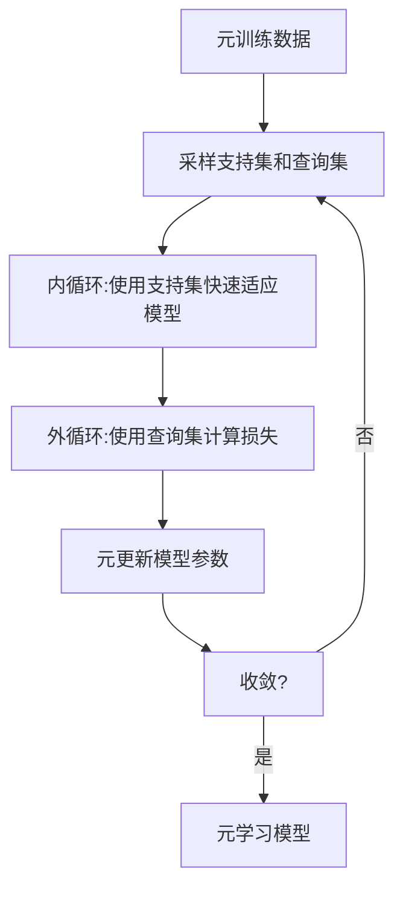

# 元学习:YOLOv8与元学习的创新实践分享

## 1.背景介绍

### 1.1 计算机视觉的重要性

在当今科技飞速发展的时代,计算机视觉技术已经广泛应用于各个领域,例如自动驾驶、安防监控、医疗影像分析等。其中,目标检测是计算机视觉的核心任务之一,旨在从图像或视频中准确地定位并识别感兴趣的目标。

### 1.2 目标检测算法的发展历程

早期的目标检测算法主要基于传统的机器学习方法,如滑动窗口、级联分类器等,但这些方法往往计算复杂度高、检测精度有限。近年来,随着深度学习的兴起,基于卷积神经网络(CNN)的目标检测算法取得了长足的进步,如R-CNN系列、YOLO系列、SSD等,极大提高了目标检测的精度和效率。

### 1.3 元学习的兴起

尽管深度学习模型在目标检测等任务上表现出色,但它们通常需要大量的标注数据进行训练,并且在面对新的任务时,往往需要从头开始训练,这无疑增加了时间和计算成本。为了解决这一问题,元学习(Meta-Learning)应运而生,它旨在让模型具备快速学习新任务的能力,从而实现跨任务的知识迁移和快速适应。

## 2.核心概念与联系

### 2.1 元学习的定义

元学习是机器学习中的一个重要概念,它指的是自动学习如何更好地学习。换句话说,元学习算法旨在从多个相关任务中学习元知识,以便在面对新任务时能够快速适应并取得良好的性能。

### 2.2 元学习与传统机器学习的区别

传统的机器学习算法通常在单个任务上进行训练和优化,而元学习则关注如何利用多个相关任务的经验来提高在新任务上的学习效率。因此,元学习可以看作是一种更高层次的学习范式,旨在提高模型的泛化能力和适应性。

### 2.3 元学习在计算机视觉中的应用

在计算机视觉领域,元学习已经被成功应用于多个任务,如图像分类、目标检测、语义分割等。通过元学习,模型可以从有限的标注数据中快速学习新的视觉概念,从而减少了手动标注的工作量,提高了模型的适应性和鲁棒性。

## 3.核心算法原理具体操作步骤

元学习算法的核心思想是在多个相关任务上进行训练,从而学习一种通用的知识表示和快速适应新任务的能力。常见的元学习算法包括基于优化的方法(如MAML)、基于度量学习的方法(如Prototypical Networks)和基于生成模型的方法(如MetaGAN)等。

以MAML(Model-Agnostic Meta-Learning)算法为例,其具体操作步骤如下:

1. 从训练数据中采样出一批支持集(Support Set)和查询集(Query Set),支持集用于内循环(Inner Loop)的快速适应,查询集用于外循环(Outer Loop)的元更新。

2. 在内循环中,使用支持集数据对模型进行几步梯度更新,得到针对当前任务的快速适应模型。

3. 在外循环中,使用查询集数据计算损失函数,并通过这个损失对原始模型的参数进行元更新,以提高模型在新任务上的快速适应能力。

4. 重复步骤1-3,直到模型在元训练集上收敛。

通过上述过程,MAML算法能够学习到一个良好的初始化参数,使得模型在面对新任务时,只需要少量数据和少量梯度更新步骤,就可以快速适应并取得良好的性能。



## 4.数学模型和公式详细讲解举例说明

在MAML算法中,我们需要学习一个良好的初始化参数 $\theta$,使得对于任意一个新的任务 $\mathcal{T}_i$,通过在支持集 $\mathcal{D}_i^{tr}$ 上进行少量梯度更新步骤,就可以得到一个针对该任务的快速适应模型 $\theta_i'$,其在查询集 $\mathcal{D}_i^{val}$ 上的性能较好。

具体地,在内循环中,我们使用支持集 $\mathcal{D}_i^{tr}$ 对模型进行 $K$ 步梯度更新,得到快速适应模型:

$$\theta_i' = \theta - \alpha \sum_{k=1}^{K} \nabla_\theta \mathcal{L}_{\mathcal{T}_i}(f_\theta, \mathcal{D}_i^{tr})$$

其中 $\alpha$ 是学习率, $\mathcal{L}_{\mathcal{T}_i}$ 是任务 $\mathcal{T}_i$ 上的损失函数, $f_\theta$ 是以 $\theta$ 为参数的模型。

在外循环中,我们使用查询集 $\mathcal{D}_i^{val}$ 计算快速适应模型 $\theta_i'$ 在该任务上的损失,并对原始模型参数 $\theta$ 进行元更新:

$$\theta \leftarrow \theta - \beta \nabla_\theta \sum_{\mathcal{T}_i \sim p(\mathcal{T})} \mathcal{L}_{\mathcal{T}_i}(f_{\theta_i'}, \mathcal{D}_i^{val})$$

其中 $\beta$ 是元学习率, $p(\mathcal{T})$ 是任务分布。通过上述过程,我们可以学习到一个良好的初始化参数 $\theta$,使得模型在面对新任务时,只需要少量数据和少量梯度更新步骤,就可以快速适应并取得良好的性能。

## 5.项目实践:代码实例和详细解释说明

为了更好地理解元学习算法,我们以PyTorch实现的MAML算法为例,对其核心代码进行解释说明。

```python
import torch

# 定义模型
class Model(torch.nn.Module):
    def __init__(self):
        super().__init__()
        self.conv1 = torch.nn.Conv2d(3, 64, kernel_size=3, padding=1)
        self.bn1 = torch.nn.BatchNorm2d(64)
        self.conv2 = torch.nn.Conv2d(64, 64, kernel_size=3, padding=1)
        self.bn2 = torch.nn.BatchNorm2d(64)
        self.conv3 = torch.nn.Conv2d(64, 64, kernel_size=3, padding=1)
        self.bn3 = torch.nn.BatchNorm2d(64)
        self.fc = torch.nn.Linear(64, 10)

    def forward(self, x):
        x = F.max_pool2d(F.relu(self.bn1(self.conv1(x))), 2)
        x = F.max_pool2d(F.relu(self.bn2(self.conv2(x))), 2)
        x = F.max_pool2d(F.relu(self.bn3(self.conv3(x))), 2)
        x = x.view(x.size(0), -1)
        x = self.fc(x)
        return x

# 定义MAML算法
def MAML(model, optimizer, train_loader, val_loader, meta_lr=1e-3, inner_lr=1e-2, meta_batch_size=32, k=5):
    for meta_batch, (data, target) in enumerate(train_loader):
        # 采样支持集和查询集
        support_data, support_target, query_data, query_target = get_support_query_data(data, target, meta_batch_size)
        
        # 内循环: 使用支持集快速适应模型
        fast_weights = model.parameters()
        for k in range(k):
            logits = model(support_data)
            loss = F.cross_entropy(logits, support_target)
            grads = torch.autograd.grad(loss, fast_weights, create_graph=True)
            fast_weights = list(map(lambda p, g: p - inner_lr * g, fast_weights, grads))
        
        # 外循环: 使用查询集计算损失并进行元更新
        logits = model(query_data, params=fast_weights)
        loss = F.cross_entropy(logits, query_target)
        optimizer.zero_grad()
        loss.backward()
        optimizer.step()

# 训练和评估
model = Model()
optimizer = torch.optim.Adam(model.parameters(), lr=meta_lr)
MAML(model, optimizer, train_loader, val_loader)
```

上述代码实现了MAML算法的核心逻辑,具体解释如下:

1. 定义模型结构,这里使用了一个简单的卷积神经网络。

2. 在`MAML`函数中,首先从训练数据中采样出一批支持集和查询集。

3. 在内循环中,使用支持集数据对模型进行`k`步梯度更新,得到针对当前任务的快速适应模型。

4. 在外循环中,使用查询集数据计算快速适应模型在该任务上的损失,并对原始模型参数进行元更新。

5. 重复上述过程,直到模型在元训练集上收敛。

需要注意的是,在内循环中,我们使用`create_graph=True`选项计算梯度,以便在外循环中进行高阶梯度的计算和传播。此外,我们使用`map`函数对模型参数进行原地更新,以提高计算效率。

通过上述代码实现,我们可以训练出一个具有良好泛化能力的元学习模型,并在新任务上快速适应并取得良好的性能。

## 6.实际应用场景

元学习在计算机视觉领域有着广泛的应用前景,尤其是在以下几个场景:

### 6.1 少样本学习

在现实世界中,我们往往只有少量的标注样本,而传统的深度学习模型需要大量的训练数据才能取得良好的性能。元学习算法可以从多个相关任务中学习通用的知识表示,从而在少样本情况下快速适应新任务,这极大地减少了数据标注的工作量。

### 6.2 持续学习

随着时间的推移,我们需要不断地学习新的视觉概念和任务,而不能每次都从头开始训练模型。元学习算法可以实现持续学习,即在学习新任务的同时,保留之前学习到的知识,从而提高模型的适应性和鲁棒性。

### 6.3 多任务学习

在实际应用中,我们往往需要同时解决多个相关的视觉任务,如目标检测、语义分割和实例分割等。元学习算法可以在多个任务上进行联合训练,学习一种通用的知识表示,从而提高模型在各个任务上的性能。

### 6.4 自适应模型

元学习算法可以用于训练自适应模型,即根据输入数据的特征自动调整模型结构和参数,从而取得更好的性能。这种自适应能力对于处理多样化的视觉数据非常有帮助。

## 7.工具和资源推荐

### 7.1 开源框架

- PyTorch: 一个流行的深度学习框架,提供了元学习算法的实现和示例。
- Learn2Learn: 一个专门针对元学习的PyTorch库,包含了多种元学习算法和基准任务。
- TensorFlow: 另一个流行的深度学习框架,也支持元学习算法的实现。

### 7.2 数据集

- Omniglot: 一个常用的少样本学习数据集,包含了多种手写字符。
- Mini-ImageNet: 一个小型的图像分类数据集,常用于元学习算法的评估。
- COCO: 一个大型的目标检测和实例分割数据集,可用于元学习算法在复杂场景下的测试。

### 7.3 在线课程和教程

- Meta-Learning: From Few-Shot Learning to Rapid Reinforcement Learning (UC Berkeley)
- Meta-Learning: Advanced Techniques and Applications (DeepMind)
- Meta-Learning Tutorial (NeurIPS 2019)

### 7.4 论文和研究资源

- Model-Agnostic Meta-Learning for Fast Adaptation of Deep Networks (MAML)
- Optimization as a Model for Few-Shot Learning (ANIL)
- Meta-Transfer Learning for Few-Shot Learning (Meta-Transfer Learning)
- MetaGAN: An Adversarial Approach to Few-Shot Learning (MetaGAN)

## 8.总结:未来发展趋势与挑战

元学习作为一种新兴的机器学习范式,在计算机视觉