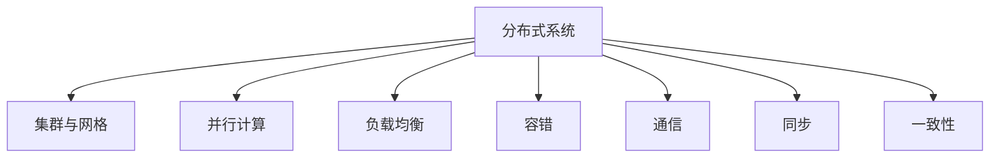

# 分布式计算原理与代码实战案例讲解

## 1. 背景介绍
### 1.1 分布式计算的定义与特点
分布式计算是一种计算模式,它将一个大型的计算问题分解成多个小的子问题,并分配到多台计算机上同时进行处理。这些计算机通过网络连接,协同工作,最终将各自的计算结果合并,得到原问题的解。分布式计算的特点包括:
- 分布性:计算任务分布在多台计算机上执行
- 并行性:多个计算任务可以同时进行
- 协同性:各个计算节点需要通过通信和同步来协调工作
- 异构性:参与计算的节点可以是不同类型的计算机
- 自治性:各个节点在完成自己的计算任务后,无需等待其他节点,可以独立地继续进行下一步工作

### 1.2 分布式计算的发展历程
分布式计算技术已经有几十年的发展历史。最早可以追溯到20世纪60年代,当时的分时系统允许多个用户共享使用大型主机。70年代出现了计算机网络,为分布式计算奠定了通信基础。80年代初,出现了专门用于科学计算的超级计算机。90年代,得益于互联网的普及,分布式计算进入了一个新的发展阶段。以Beowulf集群、SETI@home等为代表的分布式计算项目开始出现。进入21世纪,云计算、大数据处理、区块链等新技术进一步推动了分布式计算的发展。

### 1.3 分布式计算的应用场景
如今,分布式计算已经被广泛应用于科学计算、商业分析、互联网应用等诸多领域。一些典型的应用场景包括:
- 大规模数据处理:如搜索引擎、社交网络等每天需要处理海量数据,单台计算机难以完成,需要采用分布式计算框架如Hadoop、Spark等。
- 高性能计算:如天气预报、生物信息分析等需要超级计算机的计算能力,通过分布式计算可以用多台普通计算机组成廉价的集群来完成。  
- 区块链:加密货币、供应链溯源等区块链应用本质上是一种去中心化的分布式计算。
- 边缘计算:物联网时代大量的数据在边缘设备上产生,通过分布式边缘计算可以就近处理,减少数据传输。
- 人工智能:分布式深度学习可以加速模型的训练和推理。

## 2. 核心概念与联系
### 2.1 分布式系统
分布式系统是分布式计算的基础,它由多个独立的计算机组成,通过网络连接,协同完成计算任务。分布式系统的目标是让用户感受到像是在使用一个单一系统。

### 2.2 集群与网格
集群和网格是组织分布式计算节点的两种主要方式。集群通常由一组位于同一局域网内的计算机组成,它们通常采用相同的硬件和系统配置,专门用于并行计算。网格则将地理位置分散的异构计算机动态组织起来,解决更大规模的问题。

### 2.3 并行计算
并行计算是分布式计算的核心,通过将大问题分解为多个小任务,同时在多个处理器上计算,从而显著提升性能。并行计算可以分为数据并行和任务并行。

### 2.4 负载均衡
由于分布式计算将任务分配到多个节点,因此需要考虑节点之间的负载均衡问题。常见的负载均衡算法有轮询、随机、最小连接数等。

### 2.5 容错
分布式系统中,由于节点数量众多,因此节点故障是常态。为了确保任务能够顺利完成,需要采取容错措施,如数据备份、失效转移等。

### 2.6 通信
分布式计算节点之间需要频繁通信,常见的通信方式包括消息传递、远程过程调用、分布式共享内存等。

### 2.7 同步
为了协调不同节点的工作,需要在关键时刻进行同步。常见的同步机制包括全局状态、逻辑时钟等。

### 2.8 一致性
在分布式环境中,由于存在通信延迟、节点失效等因素,需要采取一定的一致性协议来确保数据的一致性,如两阶段提交、Paxos等。

以下是这些核心概念之间的联系:



## 3. 核心算法原理具体操作步骤
分布式计算涉及多个核心算法,下面以MapReduce为例进行讲解。

### 3.1 MapReduce
MapReduce是Google提出的一个用于大规模数据处理的并行计算模型。它将计算过程分为两个阶段:Map和Reduce。

#### 3.1.1 Map阶段
1. 将输入数据分割成多个独立的块,每个块由一个Map任务处理。
2. 对于每个输入块,Map任务读取数据,执行用户定义的map函数,将数据转化为一组中间的键值对。
3. 对中间结果按照key进行分区,将同一分区的数据发送给同一个Reduce任务。

#### 3.1.2 Reduce阶段  
1. Reduce任务接收来自Map任务的中间结果,按key排序。
2. 对于每个唯一的key,Reduce任务执行用户定义的reduce函数,将同一key的所有值合并产生一个结果。
3. 将Reduce的输出结果写入到输出文件。

MapReduce的整个过程可以用下图表示:


## 4. 数学模型和公式详细讲解举例说明
在分布式计算中,一个重要的数学模型是Bulk Synchronous Parallel(BSP)模型。它是一种通用的并行计算抽象,可以用于设计和分析并行算法。

### 4.1 BSP模型
BSP模型将并行计算分为一系列超步(superstep),每个超步包含以下三个阶段:
1. 本地计算:每个处理器独立执行本地计算任务。
2. 通信:处理器之间交换数据。
3. 障碍同步:所有处理器在进入下一个超步前等待,直到所有处理器完成当前超步。

BSP模型可以用下面的公式来表示:

$T = \sum_{i=1}^{S} (w_i + h \cdot g + l)$

其中:
- $T$表示并行算法的总时间
- $S$表示超步的数量
- $w_i$表示第$i$个超步中,处理器执行本地计算的最大时间
- $h$表示第$i$个超步中,处理器发送和接收的最大消息数量
- $g$表示全局通信时间,与消息大小成正比
- $l$表示障碍同步的时间

例如,考虑一个使用BSP模型实现的并行矩阵乘法算法。假设我们有$p$个处理器,两个$n \times n$的矩阵$A$和$B$,计算$C = A \times B$。

1. 将矩阵$A$和$B$均分为$p$个部分,分配给每个处理器。
2. 每个处理器计算自己分配到的部分的乘积,这是一个本地计算阶段,时间为$w_1 = O(n^3/p)$。
3. 处理器交换中间结果,每个处理器需要接收$p-1$个其他处理器的结果,通信量为$h=p-1$,通信时间为$hg$。
4. 处理器进行障碍同步,等待所有处理器完成通信,同步时间为$l$。
5. 每个处理器将接收到的中间结果累加,得到最终结果,这又是一个本地计算阶段,时间为$w_2 = O(n^2/p)$。

因此,基于BSP模型的并行矩阵乘法的总时间为:

$T = (w_1 + h \cdot g + l) + (w_2 + l) = O(\frac{n^3}{p}) + O(p \cdot g) + O(l)$

可以看出,BSP模型能够清晰地描述并行算法的计算、通信和同步过程,有助于理解和优化并行程序的性能。

## 5. 项目实践：代码实例和详细解释说明
下面以一个使用Python和MPI实现的并行排序算法为例,讲解分布式计算的代码实践。

### 5.1 并行归并排序
归并排序是一种基于分治思想的排序算法,其并行版本可以描述如下:
1. 将待排序的数组分割成多个子数组,分配给不同的处理器。
2. 每个处理器对自己的子数组进行串行的归并排序。
3. 将已排序的子数组逐对归并,直到得到完全排序的数组。

### 5.2 代码实现
```python
from mpi4py import MPI

def merge_sort(arr):
    if len(arr) <= 1:
        return arr
    mid = len(arr) // 2
    left = merge_sort(arr[:mid])
    right = merge_sort(arr[mid:])
    return merge(left, right)

def merge(left, right):
    result = []
    i = j = 0
    while i < len(left) and j < len(right):
        if left[i] <= right[j]:
            result.append(left[i])
            i += 1
        else:
            result.append(right[j])
            j += 1
    result.extend(left[i:])
    result.extend(right[j:])
    return result

def parallel_merge_sort(arr):
    comm = MPI.COMM_WORLD
    size = comm.Get_size()
    rank = comm.Get_rank()

    # 数据分割
    local_n = len(arr) // size
    local_arr = arr[rank * local_n : (rank + 1) * local_n]

    # 本地排序
    local_sorted = merge_sort(local_arr)

    # 归并排序
    step = 1
    while step < size:
        if rank % (2 * step) == 0:
            if rank + step < size:
                recv_arr = comm.recv(source=rank + step)
                local_sorted = merge(local_sorted, recv_arr)
        elif rank % step == 0:
            comm.send(local_sorted, dest=rank - step)
        step *= 2

    # 结果收集
    if rank == 0:
        result = local_sorted
        for i in range(1, size):
            recv_arr = comm.recv(source=i)
            result = merge(result, recv_arr)
        return result
    else:
        comm.send(local_sorted, dest=0)
        return None

if __name__ == '__main__':
    comm = MPI.COMM_WORLD
    rank = comm.Get_rank()

    arr = [5, 2, 4, 6, 1, 3, 2, 6, 8, 4] 
    sorted_arr = parallel_merge_sort(arr)

    if rank == 0:
        print(f"Original array: {arr}")
        print(f"Sorted array: {sorted_arr}")
```

### 5.3 代码解释
1. 首先定义了串行的归并排序函数`merge_sort`和`merge`,用于对本地数据进行排序。
2. 在`parallel_merge_sort`函数中,使用MPI实现并行排序。
3. 通过`comm.Get_size()`和`comm.Get_rank()`获取进程总数和当前进程的编号。
4. 将原始数组分割成多个子数组,每个进程处理一部分数据。
5. 每个进程对本地数据进行归并排序。
6. 使用类似归并排序的方式,逐步将已排序的子数组归并。奇数编号的进程将数据发送给相邻的偶数编号进程,偶数编号进程接收数据并进行归并。
7. 重复步骤6,直到所有数据都归并到进程0。
8. 进程0输出最终的排序结果。

这个例子展示了如何使用Python和MPI实现一个简单的分布式排序算法。通过将数据分割到不同进程,并行执行排序和归并操作,可以显著提升排序性能。

## 6. 实际应用场景
分布式计算在许多实际场景中都有广泛应用,下面列举几个典型的例子。

### 6.1 Web搜索引擎
Web搜索引擎需要处理海量的网页数据,单台服务器难以存储和处理如此大规模的数据。因