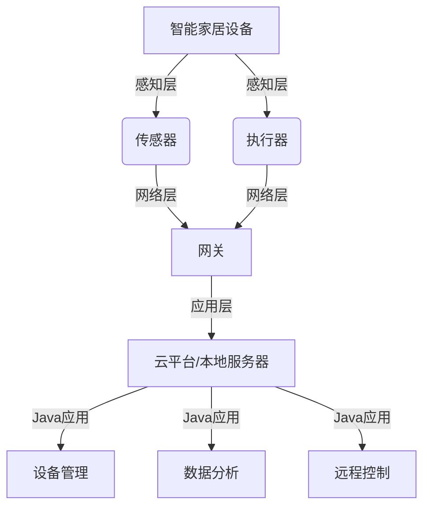

# 基于Java的智能家居设计：Java与物联网(IoT)协议栈全解析

## 1. 背景介绍

### 1.1 智能家居的兴起与发展

随着物联网技术的不断进步,智能家居已经成为了现代生活中不可或缺的一部分。智能家居通过互联网将家中的各种设备连接起来,实现远程控制、自动化等功能,为人们的生活带来了极大的便利。据统计,全球智能家居市场规模预计将从2020年的743亿美元增长到2025年的1,354亿美元,年复合增长率为12.82%。

### 1.2 Java在智能家居领域的应用

Java作为一种成熟稳定、跨平台的编程语言,在智能家居的开发中扮演着重要角色。Java拥有丰富的类库和框架,提供了便捷的开发工具,可以快速构建智能家居系统。同时,Java语言本身的安全性和可靠性,也为智能家居系统的稳定运行提供了保障。

### 1.3 物联网协议栈概述

物联网协议栈是实现设备互联互通的关键。它将各种通信协议和标准进行分层组织,涵盖了物理层、数据链路层、网络层、传输层和应用层等不同层面的内容。常见的物联网协议包括MQTT、CoAP、HTTP、WebSocket等。深入理解物联网协议栈,对于开发高效可靠的智能家居系统至关重要。

## 2. 核心概念与联系

### 2.1 智能家居的架构

智能家居系统通常采用分层架构,主要包括感知层、网络层和应用层三个层次：

- 感知层:由各种传感器和执行器组成,负责采集环境数据和执行控制命令。
- 网络层:负责将感知层的数据传输到应用层,以及将应用层的控制指令下发到感知层。
- 应用层:提供面向用户的服务和接口,实现设备管理、数据分析、远程控制等功能。

### 2.2 物联网协议栈与Java

在智能家居的开发中,Java主要应用于应用层和网络层。Java提供了丰富的库和框架,如Paho、Californium等,可以方便地实现MQTT、CoAP等物联网协议。同时,Java也支持HTTP、WebSocket等传统互联网协议,便于智能家居系统与其他系统的集成。



### 2.3 常见的物联网协议

#### 2.3.1 MQTT

MQTT(Message Queuing Telemetry Transport)是一种轻量级的发布/订阅式消息传输协议。它采用发布/订阅模型,通过"主题"来进行消息路由。MQTT广泛应用于物联网领域,特别适合资源受限的环境。

#### 2.3.2 CoAP

CoAP(Constrained Application Protocol)是一种专为资源受限的物联网设备设计的应用层协议。它基于REST架构,提供了类似HTTP的功能,但更加轻量级和高效。

#### 2.3.3 HTTP/WebSocket

HTTP和WebSocket是传统互联网中广泛使用的协议。在智能家居领域,它们主要用于实现设备与用户终端(如手机App、Web页面)之间的通信。

## 3. 核心算法原理与操作步骤

### 3.1 MQTT通信流程

MQTT通信流程主要包括以下步骤:

1. 客户端与MQTT服务器建立TCP连接。
2. 客户端向MQTT服务器发送CONNECT消息,包括ClientId、用户名、密码等信息。
3. MQTT服务器验证客户端身份,并返回CONNACK消息,表示连接建立成功。
4. 客户端向MQTT服务器发送SUBSCRIBE消息,订阅感兴趣的主题。
5. MQTT服务器返回SUBACK消息,确认订阅成功。
6. 客户端向MQTT服务器发送PUBLISH消息,将消息发布到特定主题。
7. MQTT服务器将收到的消息转发给订阅该主题的所有客户端。
8. 客户端发送DISCONNECT消息,断开与MQTT服务器的连接。

### 3.2 CoAP通信流程

CoAP通信流程主要包括以下步骤:

1. 客户端向CoAP服务器发送GET/POST/PUT/DELETE等请求,请求中包含目标资源的URI。
2. CoAP服务器处理请求,并返回响应消息,响应中包含请求结果或错误信息。
3. 如果请求成功,响应消息中会包含请求的资源数据。

## 4. 数学模型和公式详解

在智能家居系统中,经常需要对传感器数据进行处理和分析。以下是一些常用的数学模型和公式。

### 4.1 数据平滑处理

为了减少传感器数据的噪声,可以采用移动平均法对数据进行平滑处理。假设窗口大小为$n$,则第$i$个数据点的平滑值为:

$$\bar{x}_i=\frac{1}{n}\sum_{j=i-n+1}^{i}x_j$$

其中,$x_j$表示第$j$个原始数据点的值。

### 4.2 异常值检测

在传感器数据中,经常会出现一些异常值。可以采用3σ原则进行异常值检测。假设数据服从正态分布,则异常值的判定公式为:

$$|x_i-\mu|>3\sigma$$

其中,$\mu$和$\sigma$分别表示数据的均值和标准差。

## 5. 项目实践:代码实例与详解

下面通过一个基于Java的智能家居项目,演示如何使用MQTT协议实现设备之间的通信。

### 5.1 项目环境搭建

1. 安装并启动MQTT服务器,如Mosquitto。
2. 创建Java项目,并引入Paho MQTT客户端库。

```xml
<dependency>
    <groupId>org.eclipse.paho</groupId>
    <artifactId>org.eclipse.paho.client.mqttv3</artifactId>
    <version>1.2.5</version>
</dependency>
```

### 5.2 温湿度传感器数据采集与发布

```java
public class TemperatureHumiditySensor {
    private MqttClient client;
    
    public TemperatureHumiditySensor() throws MqttException {
        client = new MqttClient("tcp://localhost:1883", "TemperatureHumiditySensor");
        client.connect();
    }
    
    public void publishData() throws MqttException {
        Random random = new Random();
        double temperature = 20 + random.nextDouble() * 10;
        double humidity = 30 + random.nextDouble() * 20;
        
        String payload = String.format("{\"temperature\":%.2f,\"humidity\":%.2f}", temperature, humidity);
        MqttMessage message = new MqttMessage(payload.getBytes());
        client.publish("home/sensor/th", message);
    }
}
```

### 5.3 空调控制器订阅与执行

```java
public class AirConditionerController {
    private MqttClient client;
    
    public AirConditionerController() throws MqttException {
        client = new MqttClient("tcp://localhost:1883", "AirConditionerController");
        client.setCallback(new MqttCallback() {
            @Override
            public void messageArrived(String topic, MqttMessage message) throws Exception {
                String payload = new String(message.getPayload());
                JSONObject json = new JSONObject(payload);
                double temperature = json.getDouble("temperature");
                
                if (temperature > 30) {
                    turnOnAirConditioner();
                } else {
                    turnOffAirConditioner();
                }
            }
            
            // 其他回调方法省略
        });
        client.connect();
        client.subscribe("home/sensor/th");
    }
    
    private void turnOnAirConditioner() {
        System.out.println("空调已打开");
    }
    
    private void turnOffAirConditioner() {
        System.out.println("空调已关闭");
    }
}
```

## 6. 实际应用场景

智能家居系统在实际生活中有广泛的应用,下面列举几个典型场景:

### 6.1 智能照明

通过在房间内部署光照传感器和智能灯具,可以实现自动调节照明亮度的功能。当室内光照不足时,系统自动打开灯具;当室内光照充足时,系统自动关闭灯具,节约用电。

### 6.2 智能安防

门窗传感器可以检测门窗的开合状态,联动摄像头和报警装置。当门窗异常打开时,系统自动触发报警,并将现场画面传输到用户手机,提高家居安全性。

### 6.3 智能家电控制

通过物联网技术,用户可以使用手机App远程控制家中的电器,如空调、冰箱、洗衣机等。用户可以在外出时提前打开空调,回到家中就能享受舒适的温度;也可以随时查看冰箱的食材存量,方便及时购买。

## 7. 工具和资源推荐

### 7.1 开发工具

- MQTT客户端库:Paho、Fusesource、Hivemq等
- CoAP客户端库:Californium、nCoAP等
- 集成开发环境:Eclipse、IntelliJ IDEA等

### 7.2 在线资源

- MQTT官方网站:https://mqtt.org/
- CoAP官方网站:https://coap.technology/
- Eclipse Paho项目:https://www.eclipse.org/paho/
- Mosquitto MQTT服务器:https://mosquitto.org/

## 8. 总结:未来发展趋势与挑战

智能家居作为物联网技术的重要应用领域,未来发展前景广阔。随着5G、人工智能等新技术的不断发展,智能家居系统将变得更加智能化和个性化。但同时,智能家居的发展也面临着诸多挑战,如设备互联互通、数据安全与隐私保护、能耗优化等。这需要产业链各方通力合作,共同推动智能家居的健康发展。

## 9. 附录:常见问题与解答

### 9.1 MQTT和CoAP有什么区别?

MQTT是一种发布/订阅模型的消息传输协议,而CoAP是一种类似HTTP的请求/响应模型的传输协议。MQTT更适合用于数据采集和发布场景,而CoAP更适合用于设备控制和资源访问场景。

### 9.2 搭建MQTT服务器需要哪些步骤?

1. 下载并安装MQTT服务器,如Mosquitto。
2. 修改配置文件,如端口号、安全设置等。
3. 启动MQTT服务器。
4. 使用MQTT客户端测试连接是否成功。

### 9.3 如何保证智能家居系统的安全性?

1. 使用加密通信协议,如TLS/SSL。
2. 对用户进行身份验证和权限控制。
3. 定期对系统进行安全审计和漏洞修复。
4. 提高用户安全意识,如定期更换密码等。

作者：禅与计算机程序设计艺术 / Zen and the Art of Computer Programming