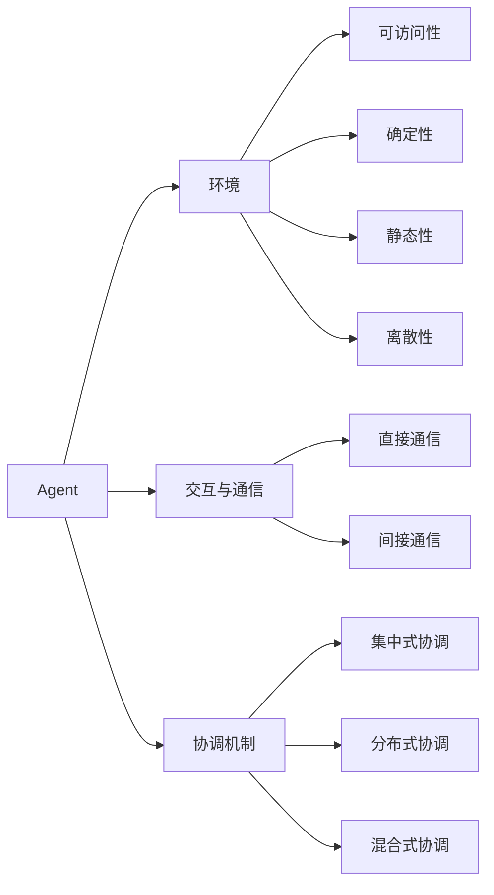

# 多Agent系统(Multi-Agent System)原理与代码实战案例讲解

## 1. 背景介绍
### 1.1 多Agent系统的起源与发展历程
### 1.2 多Agent系统的定义与特点
### 1.3 多Agent系统的研究意义与应用前景

## 2. 核心概念与联系
### 2.1 Agent的定义与特征
#### 2.1.1 自主性
#### 2.1.2 社会性
#### 2.1.3 反应性
#### 2.1.4 主动性
### 2.2 环境的概念与类型
#### 2.2.1 可访问性
#### 2.2.2 确定性
#### 2.2.3 静态性
#### 2.2.4 离散性  
### 2.3 多Agent系统的体系结构
#### 2.3.1 层次化体系结构
#### 2.3.2 黑板式体系结构
#### 2.3.3 联盟式体系结构
### 2.4 Agent之间的交互与通信
#### 2.4.1 直接通信
#### 2.4.2 间接通信
### 2.5 多Agent系统的协调机制
#### 2.5.1 集中式协调
#### 2.5.2 分布式协调
#### 2.5.3 混合式协调



## 3. 核心算法原理具体操作步骤
### 3.1 博弈论在多Agent系统中的应用
#### 3.1.1 纳什均衡
#### 3.1.2 最优反应
#### 3.1.3 重复博弈
#### 3.1.4 进化博弈
### 3.2 拍卖机制与投标策略
#### 3.2.1 英式拍卖
#### 3.2.2 荷兰式拍卖
#### 3.2.3 密封二次价格拍卖
#### 3.2.4 组合拍卖
### 3.3 投票机制与社会选择
#### 3.3.1 多数规则 
#### 3.3.2 Borda计数法
#### 3.3.3 Condorcet方法
### 3.4 多Agent强化学习
#### 3.4.1 Q-learning
#### 3.4.2 Sarsa算法
#### 3.4.3 策略梯度
#### 3.4.4 多Agent深度强化学习
### 3.5 多Agent规划
#### 3.5.1 集中式规划
#### 3.5.2 分布式规划 
#### 3.5.3 部分可观测马尔可夫决策过程

## 4. 数学模型和公式详细讲解举例说明
### 4.1 马尔可夫博弈
假设有 $n$ 个Agent参与博弈，每个Agent的策略空间为 $S_i$，环境状态空间为 $\Omega$。定义从状态到联合行为空间 $S_1 \times \cdots \times S_n$ 的转移概率为:
$$P: \Omega \times S_1 \times \cdots \times S_n \rightarrow \Delta(\Omega)$$
每个Agent $i$ 的效用函数为:
$$u_i: \Omega \times S_1 \times \cdots \times S_n \rightarrow \mathbb{R}$$
博弈的目标是寻找一组纳什均衡策略 $\pi=(\pi_1,\cdots,\pi_n)$，使得对任意Agent $i$ 和其他策略 $\pi_i'$，有:
$$\mathbb{E}_{s \sim d^{\pi}, a \sim \pi}[u_i(s,a)] \geq \mathbb{E}_{s \sim d^{(\pi_{-i},\pi_i')}, a \sim (\pi_{-i},\pi_i')}[u_i(s,a)]$$
其中 $d^{\pi}$ 表示在联合策略 $\pi$ 下的状态分布，$\pi_{-i}$ 表示除Agent $i$ 外其他Agent的联合策略。

### 4.2 VCG机制
VCG机制是一种著名的真实报价激励相容的拍卖机制。假设有 $n$ 个竞标者和 $m$ 个物品，竞标者 $i$ 对获得物品集合 $S$ 的估值为 $v_i(S)$。VCG机制分配结果 $A=(A_1,\cdots,A_n)$ 使得总估值最大化:
$$A \in \arg\max_{A' \in \mathcal{A}} \sum_{i=1}^n v_i(A_i')$$
其中 $\mathcal{A}$ 是所有可行的分配集合。竞标者 $i$ 的支付金额为:
$$p_i(v) = \max_{A' \in \mathcal{A}} \sum_{j \neq i} v_j(A_j') - \sum_{j \neq i} v_j(A_j)$$
直观地，竞标者的支付金额等于他的参与对其他竞标者造成的损失。在VCG机制下，对所有竞标者而言，真实报价是一个占优策略。

### 4.3 部分可观测马尔可夫决策过程
在部分可观测马尔可夫决策过程(POMDP)中，Agent无法直接观测环境状态，而是根据观测值来推断状态。一个POMDP可以定义为六元组 $\langle \mathcal{S}, \mathcal{A}, \mathcal{T}, \mathcal{R}, \Omega, \mathcal{O} \rangle$:
- $\mathcal{S}$ 是状态空间
- $\mathcal{A}$ 是行为空间
- $\mathcal{T}$ 是状态转移概率 $\mathcal{T}(s'|s,a)$
- $\mathcal{R}$ 是奖励函数 $\mathcal{R}(s,a)$
- $\Omega$ 是观测空间
- $\mathcal{O}$ 是观测概率 $\mathcal{O}(o|s',a)$

求解POMDP的一种常见方法是将其转化为连续状态MDP，即信念MDP。Agent维护一个信念状态 $b \in \Delta(\mathcal{S})$，表示对当前状态的概率分布。给定当前信念 $b$，执行行为 $a$ 并观测到 $o$ 后，新的信念状态为:
$$b'(s') = \eta \mathcal{O}(o|s',a) \sum_{s \in \mathcal{S}} \mathcal{T}(s'|s,a)b(s)$$
其中 $\eta$ 是归一化因子。最优策略可以通过求解信念MDP来获得。

## 5. 项目实践：代码实例和详细解释说明
下面我们通过一个简单的多Agent追捕游戏来演示多Agent系统的建模与实现。假设在一个网格化的环境中，有多个追捕者(Pursuer)试图抓住一个逃避者(Evader)。追捕者可以相互通信，协调他们的行动来最大化抓捕的概率。

首先定义Agent类，包含Agent的状态、观测和决策函数:

```python
class Agent:
    def __init__(self, id, role, pos):
        self.id = id
        self.role = role  # 'pursuer' or 'evader'
        self.pos = pos
        
    def observe(self, env):
        return env.get_observation(self)
        
    def act(self, obs):
        # 根据观测值选择行为，这里简单地随机选择
        return random.choice(env.get_actions(self))
        
    def receive_msg(self, msg):
        # 接收其他Agent发送的消息
        pass
        
    def send_msg(self, receipient_id, msg):
        # 向其他Agent发送消息
        pass
```

接下来定义环境类，包含状态转移和奖励函数，以及Agent的观测函数:

```python
class Environment:
    def __init__(self, size, agents):
        self.size = size
        self.agents = agents
        
    def get_actions(self, agent):
        # 返回Agent可选的行为
        actions = []
        x, y = agent.pos
        if x > 0:
            actions.append((-1, 0))
        if x < self.size - 1:
            actions.append((1, 0)) 
        if y > 0:
            actions.append((0, -1))
        if y < self.size - 1:
            actions.append((0, 1))
        return actions
        
    def get_observation(self, agent):
        # 返回Agent的局部观测
        obs = np.zeros((self.size, self.size))
        for other_agent in self.agents:
            if other_agent != agent:
                obs[other_agent.pos] = 1 if other_agent.role == 'pursuer' else -1
        return obs
        
    def step(self):
        # 环境动力学更新
        for agent in self.agents:
            obs = agent.observe(self)
            action = agent.act(obs)
            agent.pos = tuple(map(sum, zip(agent.pos, action)))
            
        # 判断是否抓住逃避者
        evader_pos = [agent.pos for agent in self.agents if agent.role == 'evader'][0] 
        pursuer_pos = [agent.pos for agent in self.agents if agent.role == 'pursuer']
        if evader_pos in pursuer_pos:
            return True
        return False
```

最后，我们构建Agent和环境对象，并运行追捕游戏:

```python
# 创建Agent和环境对象
size = 5
evader = Agent(0, 'evader', (0,0)) 
pursuer1 = Agent(1, 'pursuer', (size-1, 0))
pursuer2 = Agent(2, 'pursuer', (0, size-1))

agents = [evader, pursuer1, pursuer2]
env = Environment(size, agents)

# 运行追捕游戏
while True:
    terminate = env.step()
    if terminate:
        break
```

以上就是一个简单的多Agent追捕游戏的实现。通过定义Agent类和Environment类，我们可以方便地建模多Agent系统，并模拟Agent之间的交互与决策过程。在实际应用中，我们可以进一步引入更复杂的通信协议、博弈算法和学习算法，来实现更高效和智能的多Agent协作。

## 6. 实际应用场景
多Agent系统在许多领域都有广泛的应用，下面列举几个典型的应用场景:

### 6.1 智能交通系统
将车辆和基础设施建模为Agent，通过车车通信、车路协同，实现交通流的优化调度和控制，减少拥堵和事故发生。

### 6.2 智慧供应链管理  
将供应商、制造商、分销商等建模为Agent，通过信息共享和协同决策，优化供应链的运作效率，降低库存和成本。

### 6.3 智能电网调度
将发电、输电、配电、用电等各个环节建模为Agent，通过分布式控制和优化，实现电网的实时平衡和安全稳定运行。

### 6.4 多机器人协作
在复杂的任务如搜索救援、勘探等场景中，多个机器人通过分工协作，可以大大提高任务完成的效率和鲁棒性。

### 6.5 网络安全
将网络中的各个节点如路由器、交换机、防火墙建模为Agent，通过异常检测和协同防御，增强网络系统的安全性。

## 7. 工具和资源推荐
### 7.1 开发工具
- JADE: 一个用Java实现的多Agent系统开发框架
- MASON: 一个用Java实现的多Agent模拟库
- Mesa: 一个用Python实现的多Agent建模框架
- NetLogo: 一个多Agent编程建模环境

### 7.2 学习资源
- 《Multiagent Systems: Algorithmic, Game-Theoretic, and Logical Foundations》by Yoav Shoham and Kevin Leyton-Brown
- 《Multiagent Systems》by Gerhard Weiss
- 《Algorithmic Game Theory》by Noam Nisan, et al.
- 《Markov Decision Processes in Artificial Intelligence》by Olivier Sigaud and Olivier Buffet

## 8. 总结：未来发展趋势与挑战
多Agent系统经过几十年的发展，已经成为人工智能的一个重要分支。随着计算、通信、控制等技术的进步，多Agent系统在理论和应用上都取得了长足的进展。未来，多Agent系统有望在以下几个方向取得突破:

### 8.1 大规模多Agent系统
如何设计可扩展的体系结构和算法，支持成百上千Agent的实时交互与优化，是一个巨大的挑战。

### 8.2 人机混合多Agent系统
将人类行为建模并集成到多Agent系统中，构建人机协同的混合智能系统，有望在许多领域取得变革性的进展。

### 8.3 多Agent强化学习
利用深度强化学习等前沿技术，研究多Agent环境下的自主学习与适应，是一个新