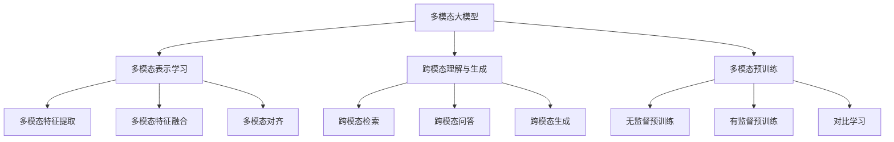

# 多模态大模型：技术原理与实战 其他部署方法介绍

## 1. 背景介绍

近年来,随着人工智能技术的快速发展,多模态大模型成为了学术界和工业界研究的热点。多模态大模型能够同时处理文本、图像、音频等多种模态的数据,在跨模态理解、生成等任务上取得了显著的性能提升。本文将深入探讨多模态大模型的技术原理,并介绍除了常见的本地部署外的其他部署方法,为相关从业者和爱好者提供实战指导。

### 1.1 多模态大模型概述
#### 1.1.1 多模态大模型的定义
#### 1.1.2 多模态大模型的发展历程
#### 1.1.3 多模态大模型的应用场景

### 1.2 多模态大模型面临的挑战
#### 1.2.1 海量多模态数据的处理
#### 1.2.2 模态间信息的融合与对齐
#### 1.2.3 模型的可解释性和鲁棒性

## 2. 核心概念与联系

### 2.1 多模态表示学习
#### 2.1.1 多模态特征提取
#### 2.1.2 多模态特征融合
#### 2.1.3 多模态对齐

### 2.2 跨模态理解与生成
#### 2.2.1 跨模态检索
#### 2.2.2 跨模态问答
#### 2.2.3 跨模态生成

### 2.3 多模态预训练
#### 2.3.1 无监督预训练
#### 2.3.2 有监督预训练
#### 2.3.3 对比学习



## 3. 核心算法原理具体操作步骤

### 3.1 多模态Transformer
#### 3.1.1 自注意力机制
#### 3.1.2 跨注意力机制
#### 3.1.3 位置编码

### 3.2 多模态融合策略
#### 3.2.1 早期融合
#### 3.2.2 晚期融合
#### 3.2.3 混合融合

### 3.3 多模态对齐技术
#### 3.3.1 对抗对齐
#### 3.3.2 度量学习对齐
#### 3.3.3 知识蒸馏对齐

## 4. 数学模型和公式详细讲解举例说明

### 4.1 多模态Transformer的数学表示
#### 4.1.1 自注意力机制公式推导
$$Attention(Q,K,V) = softmax(\frac{QK^T}{\sqrt{d_k}})V$$
其中,$Q$,$K$,$V$分别表示查询、键、值矩阵,$d_k$为键向量的维度。

#### 4.1.2 跨注意力机制公式推导
$$CrossAttention(Q_t,K_v,V_v) = softmax(\frac{Q_tK_v^T}{\sqrt{d_k}})V_v$$
其中,$Q_t$表示文本模态的查询矩阵,$K_v$,$V_v$表示视觉模态的键值矩阵。

#### 4.1.3 位置编码公式
$$PE_{(pos,2i)} = sin(pos/10000^{2i/d_{model}})$$
$$PE_{(pos,2i+1)} = cos(pos/10000^{2i/d_{model}})$$
其中,$pos$表示位置,$i$表示维度,$d_{model}$为模型维度。

### 4.2 多模态融合策略的数学表示
#### 4.2.1 早期融合
$z = f([x_1, x_2, ..., x_n])$
其中,$x_i$表示第$i$种模态的特征向量,$f$表示融合函数。

#### 4.2.2 晚期融合
$z = g(f_1(x_1), f_2(x_2), ..., f_n(x_n))$ 
其中,$f_i$表示第$i$种模态的特征提取函数,$g$表示决策函数。

#### 4.2.3 混合融合
$z = h(f([x_1, x_2, ..., x_n]), g(f_1(x_1), f_2(x_2), ..., f_n(x_n)))$
其中,$h$表示混合函数。

## 5. 项目实践：代码实例和详细解释说明

### 5.1 基于PyTorch的多模态Transformer实现
```python
import torch
import torch.nn as nn

class MultimodalTransformer(nn.Module):
    def __init__(self, d_model, nhead, num_layers):
        super().__init__()
        self.text_encoder = nn.TransformerEncoder(
            nn.TransformerEncoderLayer(d_model, nhead), 
            num_layers
        )
        self.vision_encoder = nn.TransformerEncoder(
            nn.TransformerEncoderLayer(d_model, nhead),
            num_layers  
        )
        self.fusion = nn.Linear(2*d_model, d_model)
    
    def forward(self, text, vision):
        text_feat = self.text_encoder(text)
        vision_feat = self.vision_encoder(vision)
        fused_feat = torch.cat([text_feat, vision_feat], dim=-1)
        output = self.fusion(fused_feat)
        return output
```
以上代码实现了一个简单的多模态Transformer模型,包含文本编码器、视觉编码器和特征融合层。通过nn.TransformerEncoder构建Transformer编码器,使用nn.Linear实现特征融合。forward函数定义了前向传播过程,先分别对文本和视觉特征进行编码,然后拼接两种特征并通过融合层得到最终的多模态表示。

### 5.2 基于对比学习的多模态预训练
```python
import torch
import torch.nn as nn
import torch.nn.functional as F

class ContrastiveLoss(nn.Module):
    def __init__(self, temperature=0.07):
        super().__init__()
        self.temperature = temperature

    def forward(self, features, labels):
        features = F.normalize(features, dim=-1)
        similarity_matrix = features @ features.T
        mask = torch.eye(features.shape[0]).bool()
        similarity_matrix = similarity_matrix[~mask].view(features.shape[0], -1)
        labels = labels[~mask].view(features.shape[0], -1)
        positives = similarity_matrix[labels.bool()].view(features.shape[0], -1)
        negatives = similarity_matrix[~labels.bool()].view(features.shape[0], -1)
        logits = torch.cat([positives, negatives], dim=1)
        labels = torch.zeros(logits.shape[0], dtype=torch.long)
        loss = F.cross_entropy(logits/self.temperature, labels)
        return loss
```
以上代码实现了基于对比学习的损失函数ContrastiveLoss。对比学习旨在拉近相似样本的距离,推开不相似样本的距离。通过计算样本间的相似度矩阵,构建正负样本对,并使用交叉熵损失函数优化模型。temperature为温度参数,用于控制softmax的平滑程度。

## 6. 实际应用场景

### 6.1 多模态情感分析
多模态大模型可以同时利用文本、语音、表情等多种模态的信息,更准确地判断用户的情感倾向,应用于客服系统、舆情监测等场景。

### 6.2 多模态问答
多模态大模型能够根据图像内容回答文本问题,或根据文本描述生成相应的图像,在智能助手、搜索引擎等领域有广泛应用。

### 6.3 多模态内容生成
多模态大模型可以根据文本描述生成逼真的图像、视频等多媒体内容,应用于创意设计、虚拟主播等场景。

## 7. 工具和资源推荐

### 7.1 开源工具包
- MMF: Facebook开源的多模态框架,支持多种多模态任务和模型
- MultiModal-Toolkit: 微软开源的多模态工具包,提供了多种多模态数据集和基准模型
- MMBT: 哥伦比亚大学开源的多模态预训练模型,在多个多模态任务上取得了SOTA结果

### 7.2 多模态数据集
- MS-COCO: 大规模图像描述数据集,包含20万张图像和50万条描述
- Flickr30K: 包含3万张图像和15万条描述的图像描述数据集
- CMU-MOSI: 多模态情感分析数据集,包含视频、音频、文本等多种模态数据

### 7.3 预训练模型
- ViLBERT: 基于Transformer的多模态预训练模型,在多个跨模态任务上取得了优异表现
- LXMERT: 基于Transformer的跨模态预训练模型,在视觉问答、视觉推理等任务上达到SOTA
- UNITER: 基于Transformer的多模态预训练模型,在六个跨模态理解任务上超越SOTA

## 8. 总结：未来发展趋势与挑战

### 8.1 更大规模的多模态预训练
随着计算资源的增长和数据规模的扩大,未来多模态预训练模型的参数量和训练数据量将进一步增加,模型性能有望继续提升。

### 8.2 更紧密的跨模态交互
目前大多数多模态模型采用浅层的特征交互方式,未来需要探索更深层次的跨模态交互机制,实现更精细和高效的多模态理解与生成。

### 8.3 更广泛的应用场景
除了常见的多模态理解与生成任务,多模态大模型在医疗、教育、金融等领域也有广阔的应用前景,需要针对不同场景进行适配和优化。

### 8.4 更可解释和鲁棒的模型
尽管多模态大模型在多项任务上取得了瞩目的性能,但其内部工作机制仍难以解释,且面对对抗样本等异常输入时的鲁棒性有待提高,这是未来需要重点攻克的难题。

## 9. 附录：常见问题与解答

### 9.1 多模态大模型与单模态模型相比有何优势?
与单模态模型相比,多模态大模型能够同时利用多种模态的信息,在跨模态理解、生成等任务上取得更好的性能。此外,多模态大模型还能实现模态间的信息传递和迁移,具有更强的泛化能力。

### 9.2 多模态大模型需要什么样的硬件配置?  
训练多模态大模型通常需要大规模的计算资源,尤其是在预训练阶段。一般需要多个高性能GPU(如V100、A100)和TB级的内存,以支持超大Batch Size的训练。推理阶段对硬件要求相对较低,但也需要GB级以上的显存。

### 9.3 多模态大模型是否存在偏见和安全隐患?
与其他深度学习模型一样,多模态大模型也可能从训练数据中学习到某些偏见,产生不公平或有失偏颇的输出。此外,多模态模型生成的内容可能被恶意用于制作虚假信息。因此,在开发和应用多模态大模型时,需要重点关注其偏见和安全问题。

作者：禅与计算机程序设计艺术 / Zen and the Art of Computer Programming