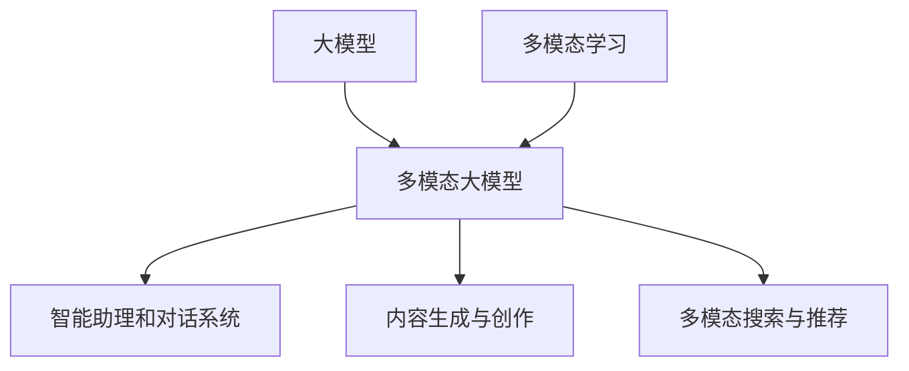

# 多模态大模型：技术原理与实战 大模型+多模态的3种实现方法

## 1. 背景介绍

### 1.1 人工智能发展历程回顾
#### 1.1.1 早期的人工智能探索
#### 1.1.2 深度学习的崛起 
#### 1.1.3 大模型时代的来临

### 1.2 多模态AI的兴起
#### 1.2.1 多模态数据的爆炸式增长
#### 1.2.2 多模态AI的研究进展
#### 1.2.3 多模态大模型的诞生

### 1.3 多模态大模型的应用前景
#### 1.3.1 智能助理和对话系统
#### 1.3.2 内容生成与创作
#### 1.3.3 多模态搜索与推荐

## 2. 核心概念与联系

### 2.1 大模型的定义与特点
#### 2.1.1 大模型的定义
#### 2.1.2 大模型的特点
#### 2.1.3 大模型的训练方法

### 2.2 多模态学习的基本概念
#### 2.2.1 多模态数据的定义
#### 2.2.2 多模态表示学习
#### 2.2.3 多模态融合方法

### 2.3 多模态大模型的核心思想
#### 2.3.1 大模型与多模态学习的结合
#### 2.3.2 多模态预训练范式
#### 2.3.3 多模态任务的统一建模

## 3. 核心算法原理具体操作步骤

### 3.1 多模态预训练算法
#### 3.1.1 掩码语言模型MLM
#### 3.1.2 图像-文本对比学习
#### 3.1.3 视频-文本对比学习

### 3.2 多模态融合方法
#### 3.2.1 早期融合
#### 3.2.2 晚期融合
#### 3.2.3 混合融合

### 3.3 多模态任务微调
#### 3.3.1 多模态分类任务
#### 3.3.2 多模态生成任务
#### 3.3.3 多模态检索任务

## 4. 数学模型和公式详细讲解举例说明

### 4.1 Transformer模型
#### 4.1.1 自注意力机制
$Attention(Q,K,V) = softmax(\frac{QK^T}{\sqrt{d_k}})V$
#### 4.1.2 多头注意力
$$MultiHead(Q,K,V) = Concat(head_1,...,head_h)W^O$$
$$head_i = Attention(QW_i^Q, KW_i^K, VW_i^V)$$
#### 4.1.3 前馈神经网络

### 4.2 对比学习目标函数
#### 4.2.1 InfoNCE损失
$$\mathcal{L}_{NCE} = -\mathbb{E}_{(x,y)\sim D}[log\frac{e^{f(x)^Tf(y)/\tau}}{\sum_{y'\in Y}e^{f(x)^Tf(y')/\tau}}]$$
#### 4.2.2 对比语言-图像预训练CLIP
$$\mathcal{L}_{CLIP} = -\frac{1}{2N}\sum_{i=1}^N[log\frac{e^{s(I_i,T_i)}}{\sum_{j=1}^Ne^{s(I_i,T_j)}} + log\frac{e^{s(I_i,T_i)}}{\sum_{j=1}^Ne^{s(I_j,T_i)}}]$$

### 4.3 知识蒸馏
$$\mathcal{L}_{KD} = \sum_{i=1}^N\mathcal{L}_{CE}(y_i, p_i) + \alpha \mathcal{L}_{KL}(p_i, q_i)$$

## 5. 项目实践：代码实例和详细解释说明

### 5.1 多模态预训练代码实现
#### 5.1.1 数据准备与预处理
#### 5.1.2 模型构建与初始化
#### 5.1.3 预训练过程与损失函数

### 5.2 下游任务微调代码实现  
#### 5.2.1 多模态分类任务微调
#### 5.2.2 多模态生成任务微调
#### 5.2.3 多模态检索任务微调

### 5.3 模型部署与推理优化
#### 5.3.1 模型量化与加速
#### 5.3.2 模型服务化部署
#### 5.3.3 推理引擎优化

## 6. 实际应用场景

### 6.1 智能客服与虚拟助手
#### 6.1.1 多模态对话理解
#### 6.1.2 个性化回复生成
#### 6.1.3 情感识别与同理心回应

### 6.2 内容创作与设计
#### 6.2.1 AI绘画与艺术创作
#### 6.2.2 多模态文案与广告生成
#### 6.2.3 智能影音剪辑与特效

### 6.3 跨模态信息检索 
#### 6.3.1 以图搜图与以文搜图
#### 6.3.2 视频摘要与关键帧提取
#### 6.3.3 跨模态推荐系统

## 7. 工具和资源推荐

### 7.1 开源工具包
#### 7.1.1 Hugging Face Transformers
#### 7.1.2 OpenAI CLIP
#### 7.1.3 微软 Oscar

### 7.2 预训练模型
#### 7.2.1 BERT与RoBERTa
#### 7.2.2 ViT与CLIP
#### 7.2.3 DALL·E与Stable Diffusion

### 7.3 数据集资源
#### 7.3.1 ImageNet与COCO
#### 7.3.2 Conceptual Captions
#### 7.3.3 HowTo100M

## 8. 总结：未来发展趋势与挑战

### 8.1 多模态大模型的发展趋势
#### 8.1.1 模型规模与性能的持续提升
#### 8.1.2 多模态数据的进一步丰富
#### 8.1.3 多模态交互与反馈学习

### 8.2 面临的挑战与问题
#### 8.2.1 计算资源与训练成本
#### 8.2.2 数据偏见与公平性
#### 8.2.3 可解释性与可控性

### 8.3 未来的研究方向
#### 8.3.1 轻量化多模态模型
#### 8.3.2 多模态推理与决策
#### 8.3.3 多模态增强学习

## 9. 附录：常见问题与解答

### 9.1 多模态大模型与单模态大模型的区别？
### 9.2 多模态预训练需要哪些数据？
### 9.3 如何评估多模态大模型的性能？
### 9.4 多模态大模型在实际应用中需要注意哪些问题？
### 9.5 未来多模态大模型还有哪些值得探索的方向？

作者：禅与计算机程序设计艺术 / Zen and the Art of Computer Programming

多模态大模型是人工智能领域的一个重要发展方向，它通过融合不同模态的信息，如文本、图像、视频等，实现更加智能和自然的人机交互。本文从多模态大模型的背景出发，介绍了其核心概念和关键技术，并结合数学模型和代码实例进行了详细讲解。

多模态大模型的核心思想是将大规模预训练模型与多模态学习相结合，通过掩码语言模型、对比学习等预训练任务，学习不同模态数据之间的联系和表示。在此基础上，可以使用早期融合、晚期融合、混合融合等方法，将多模态信息进行有效整合，用于下游的分类、生成、检索等任务。

Transformer模型是多模态大模型的重要基础，其自注意力机制和前馈神经网络可以有效处理不同模态数据的长程依赖关系。对比学习目标函数如InfoNCE和CLIP损失，可以帮助模型学习到不同模态数据之间的对应关系。知识蒸馏技术则可以将大模型的知识迁移到更小的模型中，提高推理效率。

在实际应用中，多模态大模型可以用于智能客服、内容创作、跨模态检索等场景，极大地提升人机交互的自然性和效率。但同时也面临着计算资源、数据偏见、可解释性等挑战，需要在轻量化模型、公平性优化、可控性增强等方面进一步探索。

展望未来，多模态大模型有望在模型规模、数据丰富度、交互反馈等方面取得长足进展，并在推理决策、增强学习等领域实现新的突破。我们相信，多模态大模型必将引领人工智能迈向更加智能和自然的新时代。