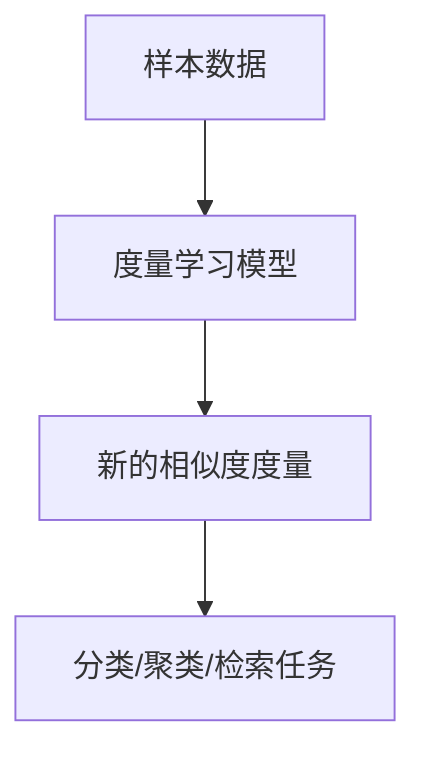

# 度量学习原理与代码实战案例讲解

## 1.背景介绍

在机器学习和模式识别领域中,度量学习(Metric Learning)是一种重要的技术,旨在学习一个合适的距离度量,使得相似的样本在新的度量空间中彼此靠近,而不相似的样本则远离。传统的机器学习算法通常使用预定义的相似度度量(如欧几里得距离),但这种度量未必适合所有的数据分布和任务。度量学习则可以根据数据自动学习出一个判别性更强的相似度度量,从而提高后续分类、聚类等任务的性能。

度量学习广泛应用于计算机视觉、自然语言处理、信息检索等领域,如人脸识别、图像检索、推荐系统等。随着深度学习的兴起,度量学习也逐渐与深度神经网络相结合,成为解决各种实际问题的有力工具。

## 2.核心概念与联系

### 2.1 相似度度量

相似度度量(Similarity Metric)是衡量两个样本相似程度的函数,通常表示为距离或相似度分数。常用的相似度度量有:

- 欧几里得距离(Euclidean Distance)
- 余弦相似度(Cosine Similarity) 
- 杰卡德相似系数(Jaccard Similarity)

### 2.2 度量学习目标

度量学习的目标是学习一个判别性更强的相似度度量函数 $d_M(x_i,x_j)$,使得同类样本 $x_i,x_j$ 的距离很小,异类样本的距离很大。形式化表示为:

$$\begin{cases}
d_M(x_i,x_j) \ll u, & \text{if }y_i=y_j\\
d_M(x_i,x_j) \gg l, & \text{if }y_i\neq y_j
\end{cases}$$

其中 $y_i,y_j$ 为样本标签, $u,l$ 为理想的相似度和不相似度阈值。

### 2.3 Mermaid流程图



## 3.核心算法原理具体操作步骤

度量学习算法主要分为以下几类:

### 3.1 基于对比损失的算法

这类算法的核心思想是最小化同类样本对的距离,最大化异类样本对的距离。典型的对比损失函数有对比损失(Contrastive Loss)和三元组损失(Triplet Loss)。

1. **对比损失**:对于一对样本 $(x_i,x_j)$,损失函数为:

$$\mathcal{L}=\frac{1}{2}(1-y_{ij})d^2(x_i,x_j)+\frac{1}{2}y_{ij}\max(0,m-d(x_i,x_j))^2$$

其中 $y_{ij}=1$ 表示同类样本对, $y_{ij}=0$ 表示异类样本对, $m$ 为正例间距离的上限。

2. **三元组损失**:给定一个三元组 $(x_i,x_j^+,x_j^-)$,其中 $x_i$ 为锚点样本, $x_j^+$ 为同类样本, $x_j^-$ 为异类样本。损失函数为:

$$\mathcal{L}=\max(0,d(x_i,x_j^+)-d(x_i,x_j^-)+m)$$

其中 $m$ 为正例间距离与负例间距离的最小差值。

上述损失函数通过梯度下降等优化方法,学习出一个判别性强的度量 $d_M$。

### 3.2 基于核技巧的算法

这类算法通过核技巧将原始样本映射到高维核空间,再在该空间中学习线性度量。常见的算法有核化的邻域分量分析(KNCA)和核化的判别分析(KDA)等。

### 3.3 基于深度学习的算法

近年来,结合深度神经网络的度量学习方法越来越受关注。这类方法通过构建适当的网络结构和损失函数,端到端地学习样本的深层特征表示和度量函数。

比如,对于图像数据,可以使用卷积神经网络提取图像特征,然后基于这些特征学习度量函数。常用的损失函数包括对比损失、三元组损失、N-pair损失等。

## 4.数学模型和公式详细讲解举例说明  

### 4.1 核化的邻域分量分析(KNCA)

KNCA算法通过核技巧将样本映射到高维核空间,再在该空间中学习邻域保持的线性度量。具体做法如下:

1. 将样本 $x_i$ 映射到核空间: $\phi(x_i)$
2. 在核空间中学习一个半正定的线性变换矩阵 $M$,使得同类样本在变换后的空间中彼此靠近,异类样本远离。
3. 优化目标函数:

$$\min_M \sum_{i,j}d_M(\phi(x_i),\phi(x_j))^2w_{ij}$$

其中 $w_{ij}$ 为样本 $x_i,x_j$ 的权重,用于保持同类样本的邻域结构。

4. 通过半正定规划求解 $M$,得到核化的度量:

$$d_M(x_i,x_j)=\sqrt{(\phi(x_i)-\phi(x_j))^TM(\phi(x_i)-\phi(x_j))}$$

### 4.2 基于深度学习的度量学习

以三元组损失为例,我们可以构建一个由卷积层和全连接层组成的深度网络 $f_\theta$,对输入样本 $x$ 进行特征提取,得到特征向量 $f_\theta(x)$。然后基于这些特征向量计算三元组损失:

$$\mathcal{L}=\sum_{i=1}^N\max(0,\|f_\theta(x_i)-f_\theta(x_i^+)\|_2-\|f_\theta(x_i)-f_\theta(x_i^-)\|_2+m)$$

通过梯度下降优化该损失函数,可以同时学习网络参数 $\theta$ 和判别性强的度量 $d_M(x_i,x_j)=\|f_\theta(x_i)-f_\theta(x_j)\|_2$。

## 5.项目实践:代码实例和详细解释说明

这里我们以基于PyTorch实现的三元组损失度量学习为例,讲解具体的代码实现细节。

### 5.1 数据准备

首先,我们需要准备一个由三元组 $(x_i,x_i^+,x_i^-)$ 组成的数据集,其中 $x_i$ 为锚点样本, $x_i^+$ 为同类样本, $x_i^-$ 为异类样本。这里以MNIST数据集为例:

```python
import torch
from torchvision import datasets, transforms

# 加载MNIST数据集
mnist = datasets.MNIST(root='data', train=True, download=True, transform=transforms.ToTensor())

# 构建三元组数据集
triplets = [(mnist.data[i], mnist.data[j], mnist.data[k]) 
            for i in range(len(mnist))
            for j in range(len(mnist))
            for k in range(len(mnist))
            if mnist.targets[i] == mnist.targets[j]
            and mnist.targets[i] != mnist.targets[k]]
```

### 5.2 模型定义

我们定义一个由卷积层和全连接层组成的网络,用于从输入图像中提取特征向量:

```python
import torch.nn as nn

class EmbeddingNet(nn.Module):
    def __init__(self):
        super().__init__()
        self.conv = nn.Sequential(
            nn.Conv2d(1, 32, 3, padding=1),
            nn.ReLU(),
            nn.MaxPool2d(2),
            nn.Conv2d(32, 64, 3, padding=1),
            nn.ReLU(),
            nn.MaxPool2d(2)
        )
        self.fc = nn.Sequential(
            nn.Linear(64 * 7 * 7, 256),
            nn.ReLU(),
            nn.Linear(256, 64)
        )

    def forward(self, x):
        x = self.conv(x)
        x = x.view(x.size(0), -1)
        x = self.fc(x)
        return x
```

### 5.3 三元组损失函数

我们定义三元组损失函数如下:

```python
import torch.nn.functional as F

def triplet_loss(anchor, positive, negative, margin=1.0):
    d_p = F.pairwise_distance(anchor, positive)
    d_n = F.pairwise_distance(anchor, negative)
    loss = F.relu(d_p - d_n + margin)
    return loss.mean()
```

这里我们使用PyTorch提供的 `pairwise_distance` 函数计算两个向量之间的欧几里得距离。损失函数的目标是最小化锚点样本与同类样本的距离,同时最大化锚点样本与异类样本的距离,从而学习一个判别性强的度量空间。

### 5.4 模型训练

最后,我们定义训练循环,对网络参数进行优化:

```python
import torch.optim as optim

# 初始化模型和优化器
model = EmbeddingNet()
optimizer = optim.Adam(model.parameters(), lr=1e-3)

# 训练循环
for epoch in range(10):
    total_loss = 0
    for anchor, positive, negative in triplets:
        anchor = anchor.unsqueeze(0)
        positive = positive.unsqueeze(0)
        negative = negative.unsqueeze(0)
        
        # 前向传播
        anchor_emb = model(anchor)
        positive_emb = model(positive)
        negative_emb = model(negative)
        
        # 计算损失
        loss = triplet_loss(anchor_emb, positive_emb, negative_emb)
        
        # 反向传播
        optimizer.zero_grad()
        loss.backward()
        optimizer.step()
        
        total_loss += loss.item()
    
    print(f'Epoch {epoch+1}, Loss: {total_loss / len(triplets)}')
```

经过多轮训练后,我们得到了一个能够从输入图像中提取判别性强的特征向量的网络模型。这些特征向量之间的欧几里得距离即为我们所学习的度量函数。

通过上述代码示例,我们可以看到如何利用PyTorch实现基于三元组损失的度量学习。当然,除了三元组损失,我们也可以尝试其他损失函数,如对比损失、N-pair损失等,从而探索更加高效的度量学习方法。

## 6.实际应用场景

度量学习在现实世界中有着广泛的应用,下面列举一些典型场景:

1. **人脸识别**: 通过度量学习,我们可以学习一个判别性强的人脸特征空间,使得同一个人的不同人脸图像彼此靠近,而不同人的人脸图像远离。这对于提高人脸识别的准确性非常有帮助。

2. **图像检索**: 在图像检索任务中,我们需要根据查询图像在大规模图像库中找到相似的图像。度量学习可以学习一个有效的图像相似度度量,从而提高检索的精确度和召回率。

3. **推荐系统**: 推荐系统的核心是计算用户和物品之间的相似度。通过度量学习,我们可以学习一个能够很好捕捉用户偏好的相似度度量,从而提高推荐的准确性。

4. **零样本学习(Zero-Shot Learning)**: 在零样本学习中,我们需要识别从未见过的新类别。度量学习可以帮助我们学习一个能够很好泛化到新类别的语义特征空间,从而实现零样本识别。

5. **聚类分析**: 度量学习可以学习出一个能够很好区分不同簇的相似度度量,从而提高聚类算法的性能。

6. **异常检测**: 通过度量学习,我们可以学习正常样本的紧凑表示,将异常样本与正常样本区分开来,实现有效的异常检测。

总的来说,度量学习为各种机器学习任务提供了一种有力的工具,能够显著提高算法的性能和泛化能力。

## 7.工具和资源推荐

如果你对度量学习感兴趣并希望进一步学习,以下是一些推荐的工具和资源:

1. **开源库**:
   - PyTorch Metric Learning: https://github.com/KevinMusgrave/pytorch-metric-learning
   - Metric-Learn: http://contrib.scikit-learn.org/metric-learn/index.html

2. **在线课程**:
   - 斯坦福大学公开课:"Metric Learning for Computational Vision"(吴恩达)
   - Coursera专项课程:"Metric Learning"

3. **论文**:
   - "Distance Metric Learning: A Comprehensive