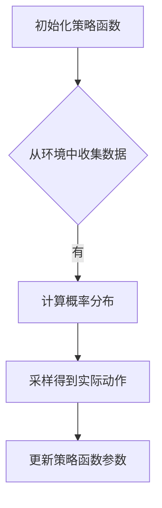

## 背景介绍

强化学习（Reinforcement Learning, RL）是一种通过机器学习实现智能决策的技术，它可以让计算机像人类一样，通过试错学习来解决复杂的问题。策略梯度（Policy Gradient）是强化学习中的一种重要方法，它利用了概率模型来估计状态价值，并根据这些值来选择最佳行动。

在本篇博客中，我们将深入探讨策略梯度方法的原理、数学模型以及实际应用场景。我们将从以下几个方面进行讲解：

1. 核心概念与联系
2. 核心算法原理具体操作步骤
3. 数学模型和公式详细讲解举例说明
4. 项目实践：代码实例和详细解释说明
5. 实际应用场景
6. 工具和资源推荐
7. 总结：未来发展趋势与挑战

## 核心概念与联系

### 策略梯度简介

策略梯度是一种基于概率模型的强化学习方法，其核心思想是通过对策略函数的微调来优化智能体（agent）的行为。策略函数通常表示为一个映射，从状态空间到动作空间的概率分布。策略梯度的目标是找到一种策略，使得智能体能够在每个状态下选择最佳行动，以达到最大化累积奖励。

### 策略梯度与其他方法的联系

相比于其他强化学习方法，如Q-学习（Q-Learning）和actor-critic方法，策略梯度具有以下特点：

1. 策略梯度不需要维护一个价值表（value table），而是直接优化策略函数。
2. 策略梯度可以处理连续动作空间的问题，而Q-学习则需要将连续动作空间离散化。
3. 策略梯度适用于非线性问题，而Q-学习则需要假设状态值函数是线性的。

## 核心算法原理具体操作步骤

策略梯度算法通常包括以下几个主要步骤：

1. 初始化智能体的策略函数和参数。
2. 从环境中收集数据，包括状态、动作和奖励。
3. 计算智能体在当前状态下的概率分布。
4. 根据概率分布采样得到实际执行的动作。
5. 更新策略函数的参数，以便提高未来状态下选择正确动作的概率。

### 策略梯度方法的实现流程图



## 数学模型和公式详细讲解举例说明

在本节中，我们将介绍策略梯度的数学模型以及相关公式。我们将使用一个简单的示例来说明这些概念。

### 策略梯度的目标函数

策略梯度的目标是最大化累积奖励。给定一个策略函数π，智能体的累积奖励为：

$$
G_t = R_{t+1} + \\gamma R_{t+2} + \\gamma^2 R_{t+3} +...
$$

其中，$R_t$表示时间$t$时的奖励，$\\gamma$表示折扣因子。

### 策略梯度的损失函数

为了最大化累积奖励，我们需要优化策略函数。我们可以定义一个基于累积奖励的损失函数：

$$
L(\\theta) = -\\frac{1}{N} \\sum_{i=1}^{N} G_i
$$

其中，$N$是采样数据的数量，$\\theta$是策略函数的参数。

### 策略梯度的更新规则

为了最小化损失函数，我们使用梯度下降法来更新策略函数的参数。我们需要计算损失函数关于参数的梯度，并根据梯度进行更新：

$$
\\theta_{t+1} = \\theta_t - \\alpha \nabla_\\theta L(\\theta)
$$

其中，$\\alpha$是学习率。

## 项目实践：代码实例和详细解释说明

在本节中，我们将通过一个简单的示例来展示如何实现策略梯度算法。我们将使用Python和TensorFlow来编写代码。

```python
import tensorflow as tf
import numpy as np

# 定义状态空间、动作空间和奖励空间
state_space =...
action_space =...
reward_space =...

# 定义策略网络
def policy_network(state):
    # 使用神经网络来估计每个动作的概率分布
    pass

# 定义目标函数
def loss_function(rewards, states, actions, probabilities):
    # 计算累积奖励
    pass

# 定义优化器
optimizer = tf.keras.optimizers.Adam(learning_rate=0.01)

# 训练策略网络
for episode in range(num_episodes):
    state = env.reset()
    done = False
    
    while not done:
        # 根据策略网络生成动作
        action =...
        
        # 执行动作并获取下一个状态和奖励
        next_state, reward, done, info = env.step(action)
        
        # 更新策略网络
        with tf.GradientTape() as tape:
            probabilities = policy_network(next_state)
            loss = loss_function(reward, state, action, probabilities)
        gradients = tape.gradient(loss, policy_network.trainable_variables)
        optimizer.apply_gradients(zip(gradients, policy_network.trainable_variables))
        
        state = next_state
```

## 实际应用场景

策略梯度方法在许多实际应用场景中都有广泛的应用，例如：

1. 机器人控制：策略梯度可以用于训练机器人来执行复杂的任务，如走路、抓取对象等。
2. 游戏AI：策略梯度可以用于开发强大的游戏AI，如Go、Chess等。
3. 自动驾驶: 策略梯度可以用于训练自动驾驶系统，实现安全、高效的交通流。

## 工具和资源推荐

如果您想深入了解策略梯度及其应用，请参考以下工具和资源：

1. TensorFlow（[https://www.tensorflow.org/）](https://www.tensorflow.org/%EF%BC%89)：一个开源的机器学习框架，可以方便地构建和训练策略梯度模型。
2. OpenAI Gym（[https://gym.openai.com/）](https://gym.openai.com/%EF%BC%89)：一个广泛使用的机器学习实验平台，提供了许多预先训练好的环境，可以用于测试和评估策略梯度算法。
3. Sutton and Barto（[http://www.amazon.com/Reinforcement-Learning-Introduction-Algorithms/dp/0262195675](http://www.amazon.com/Reinforcement-Learning-Introduction-Algorithms/dp/0262195675)）：这本书是强化学习领域的经典之作，涵盖了许多重要的理论和方法，包括策略梯度。

## 总结：未来发展趋势与挑战

策略梯度是一种具有巨大潜力的强化学习方法，它在许多实际应用场景中都有广泛的应用。然而，在未来，策略梯度仍然面临一些挑战：

1. 计算效率：策略梯度通常需要大量的计算资源，这限制了其在大规模问题中的应用。
2. 不稳定性：策略梯度方法可能会遇到不稳定的训练过程，导致模型性能波动。
3. 模型复杂性：策略梯度方法需要构建复杂的神经网络模型，以便捕捉复杂的状态-action映射关系。

为了克服这些挑战，我们需要继续探索新的算法、优化技术和模型架构，以实现更高效、稳定、高质量的策略梯度方法。

## 附录：常见问题与解答

1. 策略梯度与Q-学习有什么区别？

策略梯度与Q-学习都是强化学习方法，但它们的核心思想有所不同。Q-学习通过维护一个价值表来估计每个状态-action对的值，而策略梯度则直接优化策略函数，从而间接地估计了价值表。

1. 策略梯度可以处理连续动作空间的问题吗？

是的，策略梯度可以处理连续动作空间的问题，因为它不需要将连续动作空间离散化，而是直接优化策略函数。

1. 策略梯度的优势在哪里？

策略梯度的优势在于它可以处理非线性问题，不需要维护一个价值表，并且适用于连续动作空间。这使得策略梯度成为一种更灵活、更高效的强化学习方法。

# 结束语

本篇博客我们深入探讨了策略梯度方法的原理、数学模型以及实际应用场景。通过理解策略梯度，我们可以更好地利用强化学习来解决复杂的问题。在未来，我们期待看到策略梯度在更多领域中的广泛应用，为人类创造更智能的AI系统贡献力量。

作者：禅与计算机程序设计艺术 / Zen and the Art of Computer Programming
