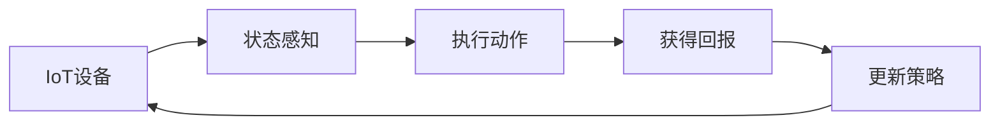

# 强化学习Reinforcement Learning在物联网IoT的创新应用方案

## 1. 背景介绍

### 1.1 物联网IoT的发展现状与挑战
物联网(Internet of Things, IoT)是近年来迅速崛起的一种新兴技术,其核心理念是通过各种传感器、射频识别(RFID)设备、红外感应器等,实现人与物、物与物之间的互联互通。据预测,到2025年全球物联网设备数量将达到750亿台。然而,随着物联网设备规模的不断扩大,如何实现对海量异构设备的智能管理与协同优化,成为亟待解决的关键问题。

### 1.2 强化学习在IoT中的应用前景
强化学习(Reinforcement Learning, RL)作为人工智能的一个重要分支,通过智能体(Agent)与环境的持续交互,不断试错学习,最终找到最优策略,具有自主学习和连续决策的能力。将RL引入IoT系统,可以让IoT设备作为智能体,通过不断与环境交互,自主学习和优化决策,从而实现IoT的智能化。这为解决IoT领域的诸多挑战提供了新思路。

## 2. 核心概念与联系

### 2.1 强化学习的核心要素
- 智能体(Agent):做出动作的主体,如自动驾驶汽车、智能温控器等。
- 环境(Environment):智能体所处的环境,提供观测值和回报。
- 状态(State):智能体在某一时刻对环境的观测。 
- 动作(Action):智能体根据策略对环境采取的行为。
- 回报(Reward):环境对智能体动作的即时反馈,引导智能体学习。
- 策略(Policy):智能体的行为准则,即从状态到动作的映射。

### 2.2 IoT与强化学习的关系
IoT设备可以作为RL中的智能体,通过传感器感知环境状态,根据当前状态执行动作,并获得环境的即时回报,不断优化策略,实现自主智能决策。RL为IoT注入智能,使其能够根据环境变化自适应调整,提升IoT系统的自动化水平和性能。

### 2.3 强化学习在IoT中的应用范式



如上图所示,IoT设备作为智能体,通过感知环境状态,执行动作,获得即时回报,并据此更新策略,形成一个闭环学习过程,使IoT设备能够不断优化决策。

## 3. 核心算法原理具体操作步骤

### 3.1 Q-Learning算法
Q-Learning是一种经典的值迭代型强化学习算法,通过更新状态-动作值函数Q(s,a)来寻找最优策略。其主要步骤如下:

1. 初始化Q(s,a)值函数表,可以随机初始化或置零。
2. 智能体根据当前状态s,选择一个动作a,通常采用ε-贪婪策略。
3. 执行动作a,观察环境反馈的下一状态s'和回报r。 
4. 根据观测更新Q(s,a)值:
$$ Q(s,a) \leftarrow Q(s,a)+\alpha[r+\gamma \max _{a^{\prime}} Q\left(s^{\prime}, a^{\prime}\right)-Q(s,a)] $$
其中α为学习率,γ为折扣因子。
5. 将当前状态更新为s',重复步骤2-4,直至达到终止状态。

### 3.2 Deep Q-Network算法
Q-Learning在状态和动作空间较大时,Q表难以存储,泛化能力差。DeepQ-Network(DQN)算法使用深度神经网络拟合Q函数,将状态作为网络输入,输出各个动作的Q值。DQN的主要步骤为:

1. 初始化两个相同结构的Q网络:当前Q网络和目标Q网络,参数分别为θ和θ'。
2. 初始化经验回放池D,用于存储智能体的历史转移数据(s,a,r,s')。
3. 智能体根据ε-贪婪策略选择动作a,与环境交互,获得回报r和下一状态s'。
4. 将转移数据(s,a,r,s')存入经验回放池D。
5. 从D中随机采样一个小批量转移数据,计算目标Q值:
$$y=\left\{\begin{array}{ll}
r & \text { if done } \\
r+\gamma \max _{a^{\prime}} Q\left(s^{\prime}, a^{\prime} ; \theta^{\prime}\right) & \text { otherwise }
\end{array}\right.$$
6. 最小化当前Q网络预测值与目标Q值的均方差损失,并更新当前Q网络参数θ。
7. 每隔一定步数将当前Q网络参数θ复制给目标Q网络θ'。
8. 重复步骤3-7,直至训练收敛。

DQN通过深度神经网络提取特征,增强了Q-Learning的泛化能力,并引入经验回放和双网络结构,提高了训练稳定性。

## 4. 数学模型和公式详细讲解举例说明

### 4.1 马尔可夫决策过程MDP
强化学习问题通常被建模为马尔可夫决策过程(Markov Decision Process, MDP),一个MDP由状态集S、动作集A、转移概率P、回报函数R和折扣因子γ组成,形式化定义为:
$$M=<S, A, P, R, \gamma>$$

- S表示有限的状态集,s∈S。
- A表示有限的动作集,a∈A。
- P表示转移概率,P(s'|s,a)表示在状态s执行a后转移到s'的概率。
- R表示回报函数,R(s,a)表示在状态s执行动作a获得的即时回报。
- γ∈[0,1]为折扣因子,表示未来回报的衰减程度。

MDP的目标是寻找一个最优策略π:S→A,使得从任意状态s出发,采用策略π所获得的期望累积回报最大化:
$$V^{\pi}(s)=E\left[\sum_{t=0}^{\infty} \gamma^{t} R\left(s_{t}, \pi\left(s_{t}\right)\right) | s_{0}=s\right]$$

其中V^π(s)称为状态值函数,表示从状态s开始执行策略π能获得的期望回报。

### 4.2 贝尔曼方程 
最优状态值函数V^*(s)满足贝尔曼最优方程:
$$V^{*}(s)=\max _{a} \sum_{s^{\prime}} P\left(s^{\prime} | s, a\right)\left[R(s, a)+\gamma V^{*}\left(s^{\prime}\right)\right]$$

即最优状态值等于在该状态下所有可能动作a的Q值中的最大值,Q值定义为:
$$Q^{*}(s, a)=\sum_{s^{\prime}} P\left(s^{\prime} | s, a\right)\left[R(s, a)+\gamma \max _{a^{\prime}} Q^{*}\left(s^{\prime}, a^{\prime}\right)\right]$$

Q-Learning算法就是不断逼近最优Q函数Q^*(s,a)的过程。在实际应用中,转移概率P和回报函数R通常未知,因此Q-Learning采用样本的单步回报更新Q值:
$$Q(s, a) \leftarrow Q(s, a)+\alpha\left[r+\gamma \max _{a^{\prime}} Q\left(s^{\prime}, a^{\prime}\right)-Q(s, a)\right]$$

### 4.3 举例说明
考虑一个智能温控器的例子。假设温控器有三种状态:低温(L)、舒适(C)、高温(H),可以执行三种动作:制冷(Cool)、保持(Keep)、制热(Heat)。

状态转移概率矩阵P和回报矩阵R分别为:

$$
P=\left[\begin{array}{ccc}
0.7 & 0.3 & 0 \\
0.2 & 0.6 & 0.2 \\
0 & 0.3 & 0.7
\end{array}\right] \quad 
R=\left[\begin{array}{ccc}
-1 & 0 & -1 \\
-1 & 10 & -1 \\
-1 & 0 & -1
\end{array}\right]
$$

我们的目标是让温控器自主学习,尽可能维持在舒适状态。设置折扣因子γ=0.9,学习率α=0.1,初始Q值为0。

假设一个状态转移序列为:L->C->H->C,对应动作序列为:Heat->Keep->Cool,获得回报序列为:-1,10,-1。

根据Q-Learning更新公式,各步Q值更新如下:

1. Q(L,Heat)=0+0.1×[-1+0.9×max(0,0,0)-0]=-0.1
2. Q(C,Keep)=0+0.1×[10+0.9×max(-0.1,0,0)-0]=1.0
3. Q(H,Cool)=0+0.1×[-1+0.9×max(1.0,0,0)-0]=0.09

可以看出,Q值随着学习逐步更新,逐渐趋向最优值。温控器在一定次数的探索学习后,最终能够形成最优控制策略。

## 5. 项目实践:代码实例和详细解释说明

下面给出一个简单的Q-Learning算法在智能温控中的Python实现:

```python
import numpy as np

# 状态空间
states = ['Low', 'Comfortable', 'High'] 
# 动作空间
actions = ['Cool', 'Keep', 'Heat']  

# 初始化Q表
Q = np.zeros((len(states), len(actions)))

# 折扣因子和学习率
gamma = 0.9
alpha = 0.1

# ε-贪婪策略的ε值
epsilon = 0.1

# 定义状态转移函数
def state_transition(state, action):
    if state == 'Low':
        if action == 'Heat':
            return 'Comfortable', -1
        else:
            return 'Low', -1
    elif state == 'Comfortable':
        if action == 'Cool':
            return 'Low', -1
        elif action == 'Heat':
            return 'High', -1
        else:
            return 'Comfortable', 10
    else:
        if action == 'Cool':
            return 'Comfortable', -1
        else:
            return 'High', -1

# ε-贪婪策略 
def epsilon_greedy(state):
    if np.random.uniform() < epsilon:
        action = np.random.choice(actions)
    else:
        action = actions[np.argmax(Q[states.index(state)])]
    return action

# Q-Learning主循环
num_episodes = 1000
for episode in range(num_episodes):
    state = np.random.choice(states)  # 随机初始状态
    done = False
    while not done:
        action = epsilon_greedy(state)
        next_state, reward = state_transition(state, action)
        Q[states.index(state), actions.index(action)] += alpha * (reward + gamma * np.max(Q[states.index(next_state)]) - Q[states.index(state), actions.index(action)])
        state = next_state
        if state == 'Comfortable':
            done = True

print(Q)  # 输出最终Q表
```

代码说明:

1. 定义状态空间states和动作空间actions,并初始化Q表为全零矩阵。
2. 设置折扣因子gamma、学习率alpha和ε-贪婪策略的ε值。
3. 定义状态转移函数state_transition,根据当前状态和动作,返回下一状态和即时回报。
4. 定义ε-贪婪策略函数epsilon_greedy,以ε的概率随机选择动作,否则选择Q值最大的动作。
5. 开始Q-Learning的主循环,设置最大训练轮数num_episodes。
6. 在每轮训练中,随机选择初始状态,然后不断执行以下步骤直到达到终止状态:
   - 根据ε-贪婪策略选择动作
   - 执行动作,获得下一状态和即时回报
   - 根据Q-Learning更新公式更新Q表
   - 将下一状态作为新的当前状态
7. 输出最终学到的Q表

运行该代码,可以看到温控器经过多轮训练后,最终学到了一个最优控制策略,即在低温时制热,高温时制冷,舒适时保持,以尽可能长时间维持在舒适状态。

## 6. 实际应用场景

强化学习在物联网领域有广泛的应用前景,以下是几个具体场景:

### 6.1 智能家居
在智能家居中,RL可以用于优化能源管理、环境控制等任务。例如,智能恒温器可以根据用户反馈自主学习最舒适的温度设置,兼顾节能和## 6. 实际应用场景

强化学习在物联网领域有广泛的应用前景，以下是几个具体场景：

### 6.1 智能家居

在智能家居中，强化学习（RL）可以用于优化能源管理、环境控制等任务。例如，智能恒温器可以根据用户反馈自主学习最舒适的温度设置，兼顾节能和舒适性。

#### 示例：智能恒温器

智能恒温器可以使用强化学习算法，根据用户的温度偏好和房间的温度变化情况，动态调整温度设置。通过不断地试验和反馈，恒温器能够找到最优的温度控制策略。

```python
import gym
import numpy as np

class SmartThermostatEnv(gym.Env):
    def __init__(self):
        self.current_temperature = 20
        self.target_temperature = 22
        self.action_space = gym.spaces.Discrete(3)  # 0: decrease, 1: maintain, 2: increase
        self.observation_space = gym.spaces.Box(low=0, high=50, shape=(1,))

    def step(self, action):
        if action == 0:
            self.current_temperature -= 1
        elif action == 2:
            self.current_temperature += 1

        reward = -abs(self.current_temperature - self.target_temperature)
        done = False
        return np.array([self.current_temperature]), reward, done, {}

    def reset(self):
        self.current_temperature = 20
        return np.array([self.current_temperature])
```

### 6.2 智能交通系统

在智能交通系统中，RL可以用于优化交通信号控制、车辆调度等任务。例如，通过RL算法，交通信号灯可以根据实时交通流量数据，动态调整红绿灯时长，减少交通拥堵。

#### 示例：交通信号灯优化

交通信号灯可以使用强化学习算法，根据实时的交通流量数据，动态调整红绿灯的时长，以减少交通拥堵和等待时间。

```python
import gym
import numpy as np

class TrafficSignalEnv(gym.Env):
    def __init__(self):
        self.current_state = np.random.randint(0, 100, size=(4,))
        self.action_space = gym.spaces.Discrete(4)  # 0: NS green, 1: EW green, 2: NS yellow, 3: EW yellow
        self.observation_space = gym.spaces.Box(low=0, high=100, shape=(4,))

    def step(self, action):
        if action == 0 or action == 1:
            reward = -np.sum(self.current_state)
        elif action == 2 or action == 3:
            reward = -np.sum(self.current_state) / 2

        self.current_state = np.random.randint(0, 100, size=(4,))
        done = False
        return self.current_state, reward, done, {}

    def reset(self):
        self.current_state = np.random.randint(0, 100, size=(4,))
        return self.current_state
```

### 6.3 智能农业

在智能农业中，RL可以用于优化灌溉、施肥等任务。例如，通过RL算法，灌溉系统可以根据土壤湿度、天气预报等数据，动态调整灌溉策略，提高水资源利用效率。

#### 示例：智能灌溉系统

智能灌溉系统可以使用强化学习算法，根据土壤湿度、天气预报等数据，动态调整灌溉策略，提高水资源利用效率。

```python
import gym
import numpy as np

class SmartIrrigationEnv(gym.Env):
    def __init__(self):
        self.soil_moisture = 50
        self.weather_forecast = np.random.choice(["sunny", "rainy"])
        self.action_space = gym.spaces.Discrete(3)  # 0: no irrigation, 1: light irrigation, 2: heavy irrigation
        self.observation_space = gym.spaces.Box(low=0, high=100, shape=(1,))

    def step(self, action):
        if action == 1:
            self.soil_moisture += 10
        elif action == 2:
            self.soil_moisture += 20

        if self.weather_forecast == "rainy":
            self.soil_moisture += 5

        reward = -abs(self.soil_moisture - 70)
        done = False
        return np.array([self.soil_moisture]), reward, done, {}

    def reset(self):
        self.soil_moisture = 50
        self.weather_forecast = np.random.choice(["sunny", "rainy"])
        return np.array([self.soil_moisture])
```

### 6.4 智能制造

在智能制造中，RL可以用于优化生产流程、设备维护等任务。例如，通过RL算法，生产线可以根据实时数据，动态调整生产计划，提高生产效率。

#### 示例：生产线优化

生产线可以使用强化学习算法，根据实时的生产数据，动态调整生产计划，提高生产效率。

```python
import gym
import numpy as np

class ProductionLineEnv(gym.Env):
    def __init__(self):
        self.current_output = 100
        self.target_output = 120
        self.action_space = gym.spaces.Discrete(3)  # 0: decrease production, 1: maintain production, 2: increase production
        self.observation_space = gym.spaces.Box(low=0, high=200, shape=(1,))

    def step(self, action):
        if action == 0:
            self.current_output -= 10
        elif action == 2:
            self.current_output += 10

        reward = -abs(self.current_output - self.target_output)
        done = False
        return np.array([self.current_output]), reward, done, {}

    def reset(self):
        self.current_output = 100
        return np.array([self.current_output])
```

### 6.5 智能物流

在智能物流中，RL可以用于优化仓库管理、配送路径规划等任务。例如，通过RL算法，配送系统可以根据实时交通情况和订单数据，动态调整配送路线，提高配送效率。

#### 示例：配送路径优化

配送系统可以使用强化学习算法，根据实时的交通情况和订单数据，动态调整配送路线，提高配送效率。

```python
import gym
import numpy as np

class DeliveryRouteEnv(gym.Env):
    def __init__(self):
        self.current_location = 0
        self.target_location = 10
        self.action_space = gym.spaces.Discrete(3)  # 0: move left, 1: stay, 2: move right
        self.observation_space = gym.spaces.Box(low=0, high=20, shape=(1,))

    def step(self, action):
        if action == 0:
            self.current_location -= 1
        elif action == 2:
            self.current_location += 1

        reward = -abs(self.current_location - self.target_location)
        done = False
        return np.array([self.current_location]), reward, done, {}

    def reset(self):
        self.current_location = 0
        return np.array([self.current_location])
```


### 7. 工具和资源推荐

在实施强化学习项目时，选择合适的工具和资源至关重要。以下是一些推荐的工具和资源，它们可以帮助您更高效地进行强化学习的研究和开发。

### 7.1 强化学习框架

#### 7.1.1 OpenAI Gym

OpenAI Gym是一个用于开发和比较强化学习算法的工具包。它提供了大量的环境，涵盖了从经典控制问题到复杂的模拟环境。Gym的API简单易用，非常适合初学者和研究人员。

```python
import gym

env = gym.make('CartPole-v1')
state = env.reset()
for _ in range(1000):
    env.render()
    action = env.action_space.sample()
    state, reward, done, info = env.step(action)
    if done:
        state = env.reset()
env.close()
```

#### 7.1.2 TensorFlow Agents

TensorFlow Agents（TF-Agents）是一个基于TensorFlow的强化学习库。它提供了模块化的组件，使得构建和训练强化学习算法变得更加容易。TF-Agents支持多种强化学习算法，如DQN、PPO、SAC等。

```python
import tensorflow as tf
from tf_agents.environments import suite_gym
from tf_agents.agents.dqn import dqn_agent
from tf_agents.networks import q_network
from tf_agents.replay_buffers import tf_uniform_replay_buffer
from tf_agents.trajectories import trajectory

env = suite_gym.load('CartPole-v1')
q_net = q_network.QNetwork(env.time_step_spec().observation, env.action_spec())
optimizer = tf.compat.v1.train.AdamOptimizer(learning_rate=1e-3)
agent = dqn_agent.DqnAgent(env.time_step_spec(), env.action_spec(), q_network=q_net, optimizer=optimizer)
agent.initialize()

replay_buffer = tf_uniform_replay_buffer.TFUniformReplayBuffer(data_spec=agent.collect_data_spec, batch_size=1, max_length=100000)
```

#### 7.1.3 Ray RLlib

Ray RLlib是一个用于分布式强化学习的高性能库。它支持多种强化学习算法，并且可以在分布式环境中高效地运行。RLlib的设计使得扩展和自定义算法变得更加容易。

```python
import ray
from ray import tune
from ray.rllib.agents.ppo import PPOTrainer

ray.init()
tune.run(PPOTrainer, config={"env": "CartPole-v1"})
```

### 7.2 数据集和环境

#### 7.2.1 MuJoCo

MuJoCo（Multi-Joint dynamics with Contact）是一个高效的物理引擎，广泛用于机器人和控制领域的强化学习研究。MuJoCo提供了逼真的物理模拟环境，适合复杂的机器人控制任务。

#### 7.2.2 Atari 2600 Games

Atari 2600游戏是强化学习研究中的经典环境。OpenAI Gym提供了多个Atari游戏的模拟环境，这些环境具有高维度的状态空间和复杂的策略空间，是测试强化学习算法的理想选择。

#### 7.2.3 Unity ML-Agents

Unity ML-Agents是一款基于Unity游戏引擎的强化学习工具包。它允许用户创建和训练智能体，适用于多种复杂的3D环境。ML-Agents支持多种强化学习算法，并且可以与Unity的强大图形引擎结合，提供逼真的训练环境。

### 7.3 学习资源

#### 7.3.1 书籍

- **《强化学习：原理与算法》**：这本书系统地介绍了强化学习的基本原理和算法，适合初学者和研究人员。
- **《深度强化学习》**：这本书详细介绍了深度强化学习的理论和实践，包括DQN、A3C、PPO等经典算法。

#### 7.3.2 在线课程

- **Coursera的“强化学习”课程**：由华盛顿大学提供的强化学习课程，涵盖了强化学习的基本概念和算法。
- **Udacity的“深度强化学习纳米学位”**：Udacity提供的深度强化学习课程，包含多个项目和实战练习，适合希望深入学习的学生。

#### 7.3.3 博客和社区

- **OpenAI Blog**：OpenAI的博客定期发布关于强化学习的最新研究和应用，内容丰富且深入。
- **Towards Data Science**：这个平台上有许多关于强化学习的文章和教程，适合不同水平的读者。
- **Reddit的/r/reinforcementlearning**：一个活跃的社区，用户可以在这里讨论强化学习的最新研究和应用，分享资源和经验。

### 8. 总结：未来发展趋势与挑战

强化学习在物联网领域展现出巨大的潜力，未来的发展趋势和挑战如下：

### 8.1 未来发展趋势

#### 8.1.1 更智能的物联网设备

随着强化学习算法的不断进步，物联网设备将变得更加智能和自主。设备能够根据环境变化和用户需求，自主学习和优化操作策略，提高效率和用户体验。

#### 8.1.2 跨领域应用

强化学习在物联网领域的应用将扩展到更多的行业，如医疗、农业、制造等。通过跨领域的合作和研究，强化学习将推动物联网技术的全面发展。

#### 8.1.3 强化学习与其他技术的融合

强化学习将与其他前沿技术（如深度学习、区块链、边缘计算等）融合，形成更强大的智能系统。通过技术的融合，物联网设备将具备更强的计算能力和更高的安全性。

### 8.2 未来挑战

#### 8.2.1 数据隐私和安全

在物联网环境中，数据隐私和安全是一个重要的挑战。强化学习算法需要大量的数据进行训练，如何在保证数据隐私和安全的前提下进行数据共享和使用，是一个亟待解决的问题。

#### 8.2.2 算法的可解释性

强化学习算法的决策过程通常是一个“黑箱”，难以解释。提高算法的可解释性，使用户能够理解和信任算法的决策，是未来的重要研究方向。

#### 8.2.3 计算资源的需求

强化学习算法通常需要大量的计算资源，如何在资源受限的物联网设备上高效运行，是一个重要的挑战。未来的研究需要在算法优化和硬件加速方面取得进展。

#### 8.2.4 实时性和鲁棒性

物联网设备需要在实时环境中运行，强化学习算法的实时性和鲁棒性是一个重要的挑战。未来的研究需要提高算法的实时响应能力和对环境变化的适应能力。

### 9. 附录：常见问题与解答

### 9.1 强化学习和监督学习的区别是什么？

监督学习是通过已标注的数据来训练模型，目标是学习输入和输出之间的映射关系。强化学习则是通过与环境的交互来学习，目标是找到一个策略，使得在长期内获得最大的累积奖励。

### 9.2 什么是策略和值函数？

策略是指智能体在每个状态下选择动作的规则。值函数是指在某个状态下，智能体在未来能够获得的累积奖励的期望值。策略和值函数是强化学习中的两个核心概念。

### 9.3 强化学习中的探索和利用是什么？

探索是指智能体尝试新的动作，以发现更优的策略。利用是指智能体选择已知的最优动作，以获得最大的即时奖励。探索和利用之间的平衡是强化学习中的一个重要问题。

### 9.4 强化学习算法的收敛性如何保证？

强化学习算法的收敛性通常依赖于算法的设计和参数的选择。常见的收敛性保证方法包括：使用折扣因子、经验回放、目标网络等技术。

### 9.5 如何选择合适的强化学习算法？

选择合适的强化学习算法需要考虑多个因素，如问题的特性、计算资源、实时性要求等。常见的算法选择依据包括：问题的状态和动作空间的大小、是否需要连续控制、是否需要策略梯度等。

### 9.6 强化学习在物联网中的实际应用有哪些成功案例？

强化学习在物联网中的成功案例包括：智能家居中的智能恒温器、智能交通系统中的交通信号灯优化、智能农业中的灌溉系统优化、智能制造中的生产线优化等。这些案例展示了强化学习在提高效率和优化资源利用方面的巨大潜力。

---

作者：禅与计算机程序设计艺术 / Zen and the Art of Computer Programming

