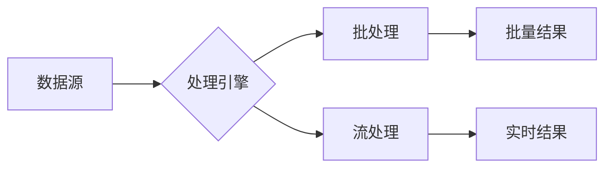

# 批处理 原理与代码实例讲解

## 1.背景介绍

### 1.1 什么是批处理
批处理(Batch Processing)是一种高效处理大量数据的计算方式。它将一组任务集中起来，在一个预定的时间内一次性执行完成，而不是对每个任务单独执行。批处理通常用于处理周期性、大批量、非交互式的任务，如定期生成报表、大规模数据分析、索引构建等。

### 1.2 批处理的历史
批处理的概念起源于早期的计算机系统。在那个年代，计算资源非常昂贵和有限，需要精心安排任务以最大化利用系统。操作员将一批作业提交给计算机，然后将结果返回给用户。这种离线的、基于磁带的批处理系统一直延续到20世纪60年代。

### 1.3 现代批处理系统
如今，尽管计算机性能大幅提升，批处理仍在大数据处理领域扮演重要角色。Hadoop MapReduce就是一个著名的分布式批处理框架，能够在大规模集群上并行处理PB级数据。其他现代批处理工具还包括Spark、Flink等，它们提供更高层的API和更丰富的功能，让批处理变得更加灵活和高效。

## 2.核心概念与联系

### 2.1 批处理的特点
- 离线处理：批处理任务通常是预先定义好的，以批的形式执行，而不是实时响应每个请求。
- 大数据量：批处理系统擅长处理大规模的历史数据，数据量动辄GB、TB甚至PB级。  
- 吞吐量导向：批处理强调高吞吐量，通过并行计算尽可能快地处理海量数据，而非低延迟。
- 成本效益：通过批量执行任务，批处理能充分利用计算资源，避免频繁启停开销，从而降低整体处理成本。

### 2.2 批处理 vs 流处理
与批处理相对的是流处理(Stream Processing)范式。流处理以事件为中心，每次处理一条或一小批数据，强调低延迟。典型的流处理场景有实时推荐、欺诈检测等。

下图展示了批处理与流处理的区别：



### 2.3 批处理相关概念
- 作业(Job)：一个完整的批处理过程，包含输入数据、计算逻辑和输出数据。
- 任务(Task)：作业中的一个原子处理单元，通常在一个数据分片上执行特定函数。 
- DAG：有向无环图，描述作业中任务的依赖关系和执行顺序。
- 数据并行：批处理通过将数据分片并分发到不同节点实现并行计算。
- 容错：批处理框架能检测和重试失败的任务以确保作业的正确完成。

## 3.核心算法原理具体操作步骤

批处理的核心是将大规模数据分而治之，通过数据分片和并行计算加速处理过程。以下是MapReduce批处理算法的基本步骤：

### 3.1 数据输入
批处理作业首先需要读入待处理的原始数据。数据通常以文件形式存储在分布式文件系统如HDFS中，可以是结构化、半结构化或非结构化的。

### 3.2 数据分片
输入数据被逻辑切分为多个分片(Split)，每个分片将由一个独立的任务处理。分片的大小和数量取决于数据总量、节点数等因素。这一步由批处理框架自动完成。

### 3.3 Map阶段
对每个输入分片，系统启动一个Map任务进行处理。Map函数将分片数据转化为一组中间的键值对。这一阶段是完全并行的，Map任务之间没有依赖。典型的Map函数有解析、过滤、转换等。

### 3.4 Shuffle阶段  
Map阶段生成的键值对需要按照key进行分组，这样具有相同key的数据会被送到同一个Reduce任务。Shuffle阶段负责对Map输出进行收集、排序和分发。系统会对key进行哈希或范围分区以决定数据的去向。

### 3.5 Reduce阶段
Reduce任务对收到的键值对进行最终的聚合计算。常见的Reduce函数包括求和、求平均、Top N等。每个Reduce任务负责处理一个或多个key的全部数据，因此Reduce阶段只有key的数量个并发任务。

### 3.6 结果输出  
Reduce阶段的输出即为整个批处理作业的最终结果。结果通常以文件形式写回到分布式文件系统中，每个Reduce任务生成一个输出文件。用户可以在此基础上进行后续分析或处理。

## 4.数学模型和公式详细讲解举例说明

MapReduce批处理可以抽象为以下数学模型：

设输入数据为 $D={d_1,d_2,...,d_n}$，Map函数为$f_m$，Reduce函数为$f_r$。

Map阶段对每个数据元素$d_i$执行映射：

$$(k_{i1},v_{i1}),(k_{i2},v_{i2}),...,(k_{im},v_{im}) = f_m(d_i)$$

其中$k_{ij}$为中间结果的key，$v_{ij}$为对应的value。

Shuffle阶段将相同key的数据分到一组：

$$V_j = {v_{1j},v_{2j},...,v_{nj}}$$

其中$V_j$为所有具有相同key $k_j$的value集合。

Reduce阶段对每组key的数据进行规约：

$$(k_j,v_j^{'}) = f_r(k_j,V_j)$$

其中$v_j^{'}$为规约后的结果。

以词频统计为例，假设输入数据为：

```
("hello world",""),("hello hadoop",""),("hi world","")  
```

Map阶段将每个单词映射为(word,1)对：
```
("hello",1),("world",1),("hello",1),("hadoop",1),("hi",1),("world",1)
```

Shuffle阶段将结果按单词分组：
```
"hello" -> {1,1}
"world" -> {1,1} 
"hadoop" -> {1}
"hi" -> {1}
```

Reduce阶段对每个单词的计数进行求和：
```
("hello",2),("world",2),("hadoop",1),("hi",1)
```

最终得到每个单词的出现频率。整个过程可以并行化，从而实现高效的数据处理。

## 5.项目实践：代码实例和详细解释说明

下面以Python为例，演示如何使用MapReduce模型实现单词计数：

```python
from mrjob.job import MRJob

class MRWordCount(MRJob):
    
    def mapper(self, _, line):
        for word in line.split():
            yield word, 1
            
    def reducer(self, word, counts):
        yield word, sum(counts)
        
if __name__ == '__main__':
    MRWordCount.run()
```

代码解释：

- 首先定义一个`MRWordCount`类，继承自`MRJob`。这个类封装了MapReduce作业的处理逻辑。  
- `mapper`方法实现Map函数。它接受一行输入文本，将其切分为单词，并输出(word,1)键值对。  
- `reducer`方法实现Reduce函数。它接收一个单词和一组计数值，对计数求和并输出(word,sum)结果对。
- `if __name__ == '__main__'`部分是程序的入口，它调用`MRWordCount.run()`启动MapReduce作业。

假设我们有一个名为`input.txt`的文本文件：

```
hello world
hello hadoop 
hi world
```

运行以下命令即可执行单词计数：

```bash
python word_count.py input.txt
```

输出结果为：

```
"hadoop"    1
"hello"     2
"hi"        1
"world"     2
```

这个简单例子展示了如何用MapReduce处理文本数据。实际的批处理作业要复杂得多，但基本思想是一致的。

## 6.实际应用场景

批处理在许多实际场景中大显身手，下面列举一些典型应用：

### 6.1 日志分析
互联网公司每天会收集大量的用户行为日志，如点击、浏览、搜索等。通过批处理对原始日志进行清洗、转换和聚合分析，可以挖掘出有价值的商业洞见，如用户画像、热门商品等。

### 6.2 数据仓库ETL
数据仓库是企业级数据集成和分析的核心。批处理在ETL(抽取、转换、加载)过程中扮演关键角色，它从多个异构数据源提取数据，经过筛选、清洗、转换等一系列处理，最终以一致的格式加载到数据仓库中，为OLAP分析提供支撑。

### 6.3 机器学习预处理
机器学习模型的训练往往需要大量且干净的数据。批处理可以对原始数据进行采样、特征提取、标准化等预处理操作，将其转化为适合模型学习的特征向量。一些机器学习算法如逻辑回归、决策树等也可以通过批处理实现分布式训练。

### 6.4 搜索引擎索引构建
搜索引擎需要定期对海量网页进行抓取和索引，以支持快速、准确的关键词查询。这个过程通常以批处理方式进行，将抓取到的网页解析为文本和链接，提取关键信息，建立倒排索引，最后生成一个全新的索引库供搜索引擎使用。

### 6.5 金融风险计算
金融机构如银行、保险公司需要定期计算各类风险指标如VaR、信用评分等。这需要处理大量的历史交易和市场数据，通过复杂的金融模型进行估值和评估。批处理可以并行化这些计算密集型任务，缩短处理时间，及时控制风险。

## 7.工具和资源推荐

### 7.1 Apache Hadoop
Hadoop是最著名的开源批处理框架，包含分布式文件系统HDFS和MapReduce计算框架。它是构建大数据处理系统的基石，支持PB级数据的可靠存储和处理。Hadoop生态圈中还有许多高层工具如Hive、Pig等，使得批处理变得更加简单和高效。

### 7.2 Apache Spark
Spark是一个基于内存的快速通用计算引擎，除了支持批处理外，还提供了流处理、SQL查询、机器学习等一站式数据分析功能。Spark的批处理API更加丰富和灵活，支持DAG型任务调度，处理性能大大优于Hadoop MapReduce。

### 7.3 Apache Flink
Flink是新一代大数据处理框架，在批处理和流处理上都有出色表现。它采用内存计算和本地算子链优化，具有低延迟、高吞吐的特点。Flink的DataSet API提供了丰富的转换算子，支持高效的批处理作业开发。

### 7.4 云批处理服务
各大公有云如AWS、Azure、阿里云等都提供托管的批处理服务，如AWS Batch、Azure Batch、阿里云BatchCompute等。用户无需关心底层资源的管理和维护，只需上传处理程序和数据，即可按需使用强大的分布式计算能力，按量付费。

## 8.总结：未来发展趋势与挑战

批处理技术经过几十年的发展，已经相当成熟和完善。未来的发展趋势主要体现在以下几个方面：

### 8.1 与流处理的融合
随着实时数据处理的需求日益增长，批处理与流处理的界限正变得模糊。Lambda架构尝试将两者结合，用批处理提供准确性，用流处理提供实时性。而Apache Flink、Spark等新兴框架则提出批流一体的思路，用统一的API处理有界和无界数据，简化了系统的开发和维护。

### 8.2 AI赋能
人工智能的浪潮正在深刻影响各行各业。批处理系统开始引入AI技术，如机器学习优化任务调度和资源管理，异常检测和根因分析加速问题定位，智能数据倾斜解决方案等。同时，批处理平台为AI应用提供了高效的数据处理和特征工程能力，二者正在加速融合。

### 8.3 ServerLess化
ServerLess计算模式让用户聚焦于业务逻辑本身，而无需关注底层资源