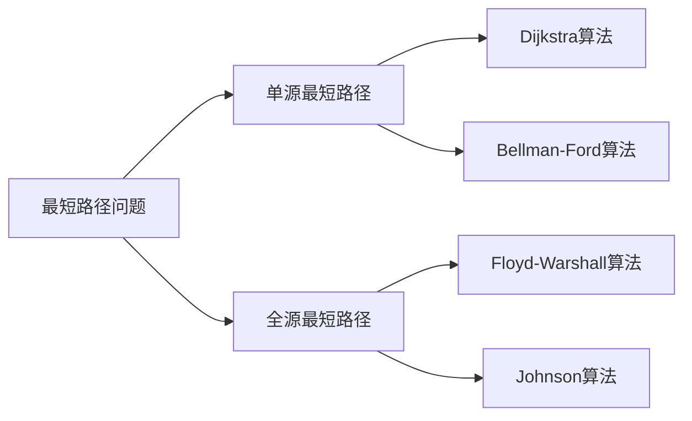

# 最短路径 原理与代码实例讲解

## 1.背景介绍
### 1.1 最短路径问题的定义
最短路径问题是图论中的一个基本问题，旨在寻找图中两个顶点之间的最短路径。在现实生活中，最短路径问题有着广泛的应用，如导航系统、网络路由、运输规划等。

### 1.2 最短路径问题的重要性
解决最短路径问题可以帮助我们优化资源分配、提高效率、节省成本。在计算机科学领域，最短路径算法是图论算法的基础，也是许多高级算法的基石。

### 1.3 最短路径问题的研究历史
最短路径问题的研究可以追溯到1956年，Edsger Dijkstra提出了著名的Dijkstra算法。此后，又出现了许多其他的最短路径算法，如Bellman-Ford算法、Floyd-Warshall算法等。

## 2.核心概念与联系
### 2.1 图的基本概念
- 顶点：图中的节点，表示实体或位置。
- 边：连接两个顶点的线段，表示实体或位置之间的关系。
- 权重：与边相关的数值，表示从一个顶点到另一个顶点的代价或距离。

### 2.2 最短路径的定义
在带权图中，从源顶点到目标顶点的所有路径中，边权重之和最小的路径称为最短路径。

### 2.3 单源最短路径与全源最短路径
- 单源最短路径：从一个固定的源顶点到图中其他所有顶点的最短路径。
- 全源最短路径：图中每对顶点之间的最短路径。

### 2.4 最短路径问题与其他问题的联系
最短路径问题与其他经典问题有着密切的联系，如最小生成树问题、网络流问题等。解决这些问题的算法思想often互相借鉴。



## 3.核心算法原理具体操作步骤
### 3.1 Dijkstra算法
#### 3.1.1 算法思想
Dijkstra算法是一种贪心算法，用于解决单源最短路径问题。它的基本思想是维护一个距离数组，记录源顶点到每个顶点的最短距离，并不断更新这个数组，直到找到目标顶点的最短路径。

#### 3.1.2 算法步骤
1. 初始化距离数组，源顶点到自身的距离为0，到其他顶点的距离为无穷大。
2. 创建一个未访问顶点集合，初始时包含所有顶点。
3. 从未访问集合中选择距离最小的顶点，标记为已访问。
4. 更新该顶点的邻居的距离，如果新距离更小，则更新距离数组。
5. 重复步骤3和4，直到目标顶点被访问或未访问集合为空。

### 3.2 Bellman-Ford算法
#### 3.2.1 算法思想
Bellman-Ford算法是一种动态规划算法，用于解决单源最短路径问题，特别适用于存在负权边的图。它的基本思想是对图进行V-1次松弛操作，其中V是图中顶点的数量。

#### 3.2.2 算法步骤
1. 初始化距离数组，源顶点到自身的距离为0，到其他顶点的距离为无穷大。
2. 进行V-1轮松弛操作，对每条边进行松弛。
3. 检查是否存在负权回路，如果第V轮松弛仍然可以更新距离，则说明存在负权回路。

### 3.3 Floyd-Warshall算法
#### 3.3.1 算法思想
Floyd-Warshall算法是一种动态规划算法，用于解决全源最短路径问题。它的基本思想是通过逐步增加中间顶点集来更新最短路径。

#### 3.3.2 算法步骤
1. 初始化距离矩阵，顶点到自身的距离为0，没有直连边的距离为无穷大。
2. 遍历中间顶点k，对每对顶点i和j，更新它们的最短距离。
3. 重复步骤2，直到所有顶点都被作为中间顶点。

## 4.数学模型和公式详细讲解举例说明
### 4.1 图的数学表示
图可以用邻接矩阵或邻接表来表示。邻接矩阵是一个二维数组，其中 $A[i][j]$ 表示顶点i到顶点j的边的权重。邻接表是一个列表数组，其中 $Adj[i]$ 包含所有与顶点i相邻的顶点。

### 4.2 Dijkstra算法的数学描述
设 $dist[i]$ 表示源顶点到顶点i的最短距离，$w(i,j)$ 表示顶点i到顶点j的边的权重。Dijkstra算法可以用以下公式描述：

$$
dist[i] = \min\{dist[i], dist[u] + w(u,i)\}
$$

其中，u是未访问集合中距离最小的顶点。

### 4.3 Bellman-Ford算法的数学描述
设 $dist[i]$ 表示源顶点到顶点i的最短距离，$w(u,v)$ 表示顶点u到顶点v的边的权重。Bellman-Ford算法可以用以下公式描述：

$$
dist[v] = \min\{dist[v], dist[u] + w(u,v)\}
$$

其中，u和v是图中的任意两个顶点。

### 4.4 Floyd-Warshall算法的数学描述
设 $dist[i][j]$ 表示顶点i到顶点j的最短距离，$dist[i][k]$ 和 $dist[k][j]$ 分别表示顶点i到顶点k和顶点k到顶点j的最短距离。Floyd-Warshall算法可以用以下公式描述：

$$
dist[i][j] = \min\{dist[i][j], dist[i][k] + dist[k][j]\}
$$

其中，i、j和k是图中的任意三个顶点。

## 5.项目实践：代码实例和详细解释说明
### 5.1 Dijkstra算法的C++实现
```cpp
vector<int> dijkstra(vector<vector<pair<int, int>>>& graph, int src) {
    int n = graph.size();
    vector<int> dist(n, INT_MAX);
    dist[src] = 0;
    priority_queue<pair<int, int>, vector<pair<int, int>>, greater<pair<int, int>>> pq;
    pq.push({0, src});
    
    while (!pq.empty()) {
        int u = pq.top().second;
        pq.pop();
        
        for (auto& neighbor : graph[u]) {
            int v = neighbor.first;
            int weight = neighbor.second;
            
            if (dist[u] + weight < dist[v]) {
                dist[v] = dist[u] + weight;
                pq.push({dist[v], v});
            }
        }
    }
    
    return dist;
}
```

这段代码使用优先队列优化了Dijkstra算法，时间复杂度为 $O((V+E)\log V)$，其中V是顶点数，E是边数。

### 5.2 Bellman-Ford算法的C++实现
```cpp
vector<int> bellmanFord(vector<vector<pair<int, int>>>& graph, int src) {
    int n = graph.size();
    vector<int> dist(n, INT_MAX);
    dist[src] = 0;
    
    for (int i = 0; i < n - 1; i++) {
        for (int u = 0; u < n; u++) {
            for (auto& neighbor : graph[u]) {
                int v = neighbor.first;
                int weight = neighbor.second;
                
                if (dist[u] != INT_MAX && dist[u] + weight < dist[v]) {
                    dist[v] = dist[u] + weight;
                }
            }
        }
    }
    
    for (int u = 0; u < n; u++) {
        for (auto& neighbor : graph[u]) {
            int v = neighbor.first;
            int weight = neighbor.second;
            
            if (dist[u] != INT_MAX && dist[u] + weight < dist[v]) {
                return {};  // 存在负权回路
            }
        }
    }
    
    return dist;
}
```

这段代码实现了Bellman-Ford算法，时间复杂度为 $O(VE)$，其中V是顶点数，E是边数。

### 5.3 Floyd-Warshall算法的C++实现
```cpp
vector<vector<int>> floydWarshall(vector<vector<int>>& graph) {
    int n = graph.size();
    vector<vector<int>> dist = graph;
    
    for (int k = 0; k < n; k++) {
        for (int i = 0; i < n; i++) {
            for (int j = 0; j < n; j++) {
                if (dist[i][k] != INT_MAX && dist[k][j] != INT_MAX &&
                    dist[i][k] + dist[k][j] < dist[i][j]) {
                    dist[i][j] = dist[i][k] + dist[k][j];
                }
            }
        }
    }
    
    return dist;
}
```

这段代码实现了Floyd-Warshall算法，时间复杂度为 $O(V^3)$，其中V是顶点数。

## 6.实际应用场景
### 6.1 导航系统
在导航系统中，最短路径算法可以帮助用户找到从起点到终点的最短路线。Dijkstra算法和A*算法常用于解决这类问题。

### 6.2 网络路由
在计算机网络中，最短路径算法可以帮助路由器找到从源主机到目标主机的最优路由。Bellman-Ford算法和OSPF协议都使用了最短路径算法。

### 6.3 运输规划
在运输规划中，最短路径算法可以帮助物流公司优化运输路线，减少运输成本和时间。Floyd-Warshall算法可以用于解决多目标运输问题。

### 6.4 社交网络分析
在社交网络分析中，最短路径算法可以用于计算用户之间的最短距离，从而发现社区结构和影响力。

## 7.工具和资源推荐
### 7.1 图论算法可视化工具
- VisuAlgo：一个交互式的算法可视化网站，包含了最短路径算法的可视化演示。
- Graph Online：一个在线图论算法可视化工具，支持多种最短路径算法。

### 7.2 图论算法库
- Boost Graph Library：一个C++图论算法库，包含了多种最短路径算法的实现。
- NetworkX：一个Python图论算法库，提供了多种最短路径算法的实现。
- JGraphT：一个Java图论算法库，支持多种最短路径算法。

### 7.3 在线学习资源
- Coursera上的"Algorithms, Part II"课程，包含了最短路径算法的详细讲解。
- LeetCode和HackerRank上的图论算法题目，可以帮助练习最短路径算法的编程实现。

## 8.总结：未来发展趋势与挑战
### 8.1 算法优化
随着图的规模不断增大，如何设计更高效的最短路径算法仍然是一个挑战。未来可能会出现更多的启发式算法和近似算法，以在可接受的时间内获得近似最优解。

### 8.2 并行计算
随着多核处理器和分布式系统的发展，如何设计并行的最短路径算法成为一个新的研究方向。并行算法可以充分利用计算资源，加速最短路径的计算。

### 8.3 动态图上的最短路径
在许多实际应用中，图的结构可能随时间变化。如何在动态图上高效地维护最短路径是一个具有挑战性的问题。增量算法和近似算法可能会在这一领域发挥重要作用。

### 8.4 机器学习与最短路径
机器学习技术可以用于优化最短路径算法的性能，如通过学习图的结构特征来指导算法的搜索方向。将机器学习与最短路径算法相结合是一个有前景的研究方向。

## 9.附录：常见问题与解答
### 9.1 为什么Dijkstra算法不能处理负权边？
Dijkstra算法使用了贪心策略，总是选择距离最小的顶点进行松弛。如果存在负权边，可能会出现松弛后距离变大的情况，导致算法无法正确终止。

### 9.2 Bellman-Ford算法如何检测负权回路？
Bellman-Ford算法在进行了V-1轮松弛后，会再进行一轮松弛。如