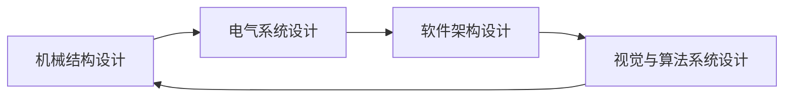

# 机器人的整体设计：机械结构、电气系统和软件架构、视觉与算法系统设计

## 1. 背景介绍
### 1.1 机器人发展历史与现状
#### 1.1.1 机器人的起源与发展历程
#### 1.1.2 当前机器人技术的发展现状
#### 1.1.3 机器人在各行业中的应用概况

### 1.2 机器人设计的重要性
#### 1.2.1 机器人设计对功能实现的影响
#### 1.2.2 机器人设计对性能优化的作用
#### 1.2.3 机器人设计在实际应用中的价值

### 1.3 机器人整体设计的关键要素
#### 1.3.1 机械结构设计的重要性
#### 1.3.2 电气系统设计的关键点
#### 1.3.3 软件架构设计的核心原则
#### 1.3.4 视觉与算法系统设计的作用

## 2. 核心概念与联系
### 2.1 机械结构设计
#### 2.1.1 机器人运动学与动力学基础
#### 2.1.2 机器人本体结构设计原则
#### 2.1.3 机器人关节与传动机构设计

### 2.2 电气系统设计  
#### 2.2.1 机器人电源管理系统
#### 2.2.2 机器人传感器系统设计
#### 2.2.3 机器人执行器控制系统设计

### 2.3 软件架构设计
#### 2.3.1 机器人操作系统(ROS)概述
#### 2.3.2 机器人软件模块化设计
#### 2.3.3 机器人软件通信机制设计

### 2.4 视觉与算法系统设计
#### 2.4.1 机器人视觉系统组成
#### 2.4.2 机器人视觉图像处理算法
#### 2.4.3 机器人导航与路径规划算法

### 2.5 机器人整体设计中各系统的关联


## 3. 核心算法原理具体操作步骤
### 3.1 机器人运动学正逆解算法
#### 3.1.1 机器人正向运动学求解步骤
#### 3.1.2 机器人逆向运动学求解步骤
#### 3.1.3 雅可比矩阵在机器人运动学中的应用

### 3.2 机器人路径规划算法
#### 3.2.1 基于采样的路径规划算法
#### 3.2.2 基于图搜索的路径规划算法 
#### 3.2.3 基于人工势场的路径规划算法

### 3.3 机器人视觉处理算法
#### 3.3.1 机器人视觉图像预处理算法
#### 3.3.2 机器人视觉特征提取与描述算法
#### 3.3.3 机器人视觉目标检测与识别算法

## 4. 数学模型和公式详细讲解举例说明
### 4.1 机器人运动学数学模型
#### 4.1.1 D-H参数与连杆变换矩阵
设机器人相邻两个关节的连杆参数为 $a_{i-1}, \alpha_{i-1}, d_i, \theta_i$，则连杆 $i-1$ 到 $i$ 的变换矩阵为：

$$
^{i-1}T_i = \begin{bmatrix} 
cos\theta_i & -sin\theta_i & 0 & a_{i-1}\\
sin\theta_icos\alpha_{i-1} & cos\theta_icos\alpha_{i-1}  & -sin\alpha_{i-1} & -d_isin\alpha_{i-1}\\  
sin\theta_isin\alpha_{i-1} & cos\theta_isin\alpha_{i-1} & cos\alpha_{i-1} & d_icos\alpha_{i-1}\\
0 & 0 & 0 & 1
\end{bmatrix}
$$

#### 4.1.2 机器人正向运动学求解
通过连乘各连杆变换矩阵，可得机器人正向运动学方程：

$$^{0}T_n(q) = ^{0}T_1(q_1) \cdot ^{1}T_2(q_2) \cdot ... \cdot ^{n-1}T_n(q_n)$$

其中，$q = [q_1,q_2,...,q_n]^T$ 为关节变量。

#### 4.1.3 机器人逆向运动学求解
已知机器人末端位姿 $^{0}T_n$，求解关节变量 $q$ 的过程。常用解法有解析法、几何法和数值迭代法等。

### 4.2 路径规划算法数学模型
#### 4.2.1 A*搜索算法数学模型
启发式函数：$f(n) = g(n) + h(n)$
- $g(n)$ 为起点到节点 $n$ 的实际代价 
- $h(n)$ 为节点 $n$ 到目标节点的估计代价

#### 4.2.2 快速扩展随机树(RRT)算法数学模型
从起始点 $q_{init}$ 开始，每次随机采样一个点 $q_{rand}$，找到树上距离 $q_{rand}$ 最近的点 $q_{near}$，然后从 $q_{near}$ 向 $q_{rand}$ 方向延伸一段距离 $\epsilon$ 得到新节点 $q_{new}$，加入到树中，直到树到达目标点 $q_{goal}$ 为止。

### 4.3 视觉处理算法数学模型 
#### 4.3.1 Canny边缘检测算法数学模型
1. 对图像进行高斯平滑：$I_s = I * G$，其中 $G$ 为高斯核
2. 计算梯度幅值与方向：$M(i,j) = \sqrt{I_x^2 + I_y^2}, \theta(i,j) = arctan(\frac{I_y}{I_x})$ 
3. 对梯度幅值进行非极大值抑制
4. 双阈值处理和连接边缘

#### 4.3.2 SIFT特征提取算法数学模型
1. 尺度空间极值检测：对图像进行高斯差分(DoG)，在尺度空间找到局部极值点
2. 关键点定位：去除低对比度和不稳定的边缘响应点
3. 关键点方向确定：利用关键点邻域内像素的梯度方向直方图统计主方向
4. 关键点描述子生成：对关键点邻域图像区域采样并计算梯度直方图，生成128维SIFT描述向量

## 5. 项目实践：代码实例和详细解释说明
### 5.1 ROS机器人仿真项目
#### 5.1.1 搭建ROS开发环境
#### 5.1.2 创建机器人模型URDF文件
```xml
<!-- 底盘 -->
<link name="base_link">
  <visual>
    <geometry>
      <box size="0.5 0.5 0.1"/>
    </geometry>
  </visual>
</link>

<!-- 驱动轮 -->
<link name="left_wheel">
  <visual>
    <geometry>
      <cylinder radius="0.1" length="0.05"/>
    </geometry>
  </visual>
</link>
<link name="right_wheel">
  <visual>
    <geometry>
      <cylinder radius="0.1" length="0.05"/>
    </geometry>
  </visual>
</link>

<!-- 驱动轮关节 -->
<joint name="left_wheel_joint" type="continuous">
  <parent link="base_link"/>
  <child link="left_wheel"/>
  <origin xyz="0 0.2 0" rpy="0 0 0" />
  <axis xyz="0 1 0" />
</joint>
<joint name="right_wheel_joint" type="continuous">
  <parent link="base_link"/>
  <child link="right_wheel"/>
  <origin xyz="0 -0.2 0" rpy="0 0 0" />
  <axis xyz="0 1 0" />
</joint>
```

#### 5.1.3 编写ROS节点实现机器人运动控制
```cpp
#include <ros/ros.h>
#include <geometry_msgs/Twist.h>

int main(int argc, char** argv)
{
  ros::init(argc, argv, "robot_controller");
  ros::NodeHandle n;
  ros::Publisher cmd_vel_pub = n.advertise<geometry_msgs::Twist>("cmd_vel", 10);
  
  ros::Rate loop_rate(10);
  
  while (ros::ok())
  {
    geometry_msgs::Twist vel_msg;
    vel_msg.linear.x = 0.2; // 线速度
    vel_msg.angular.z = 0.5; // 角速度
    
    cmd_vel_pub.publish(vel_msg);
    ros::spinOnce();
    loop_rate.sleep();
  }
  
  return 0;
}
```

### 5.2 机器人视觉处理项目
#### 5.2.1 利用OpenCV实现物体颜色识别
```python
import cv2
import numpy as np

# 读取图像
frame = cv2.imread('object.jpg')

# 转换为HSV颜色空间
hsv = cv2.cvtColor(frame, cv2.COLOR_BGR2HSV)

# 定义蓝色物体的HSV阈值
lower_blue = np.array([100, 50, 50])
upper_blue = np.array([130, 255, 255])

# 对图像进行二值化处理
mask = cv2.inRange(hsv, lower_blue, upper_blue)

# 找出面积最大的蓝色区域
contours, hierarchy = cv2.findContours(mask, cv2.RETR_EXTERNAL, cv2.CHAIN_APPROX_SIMPLE)
max_contour = max(contours, key=cv2.contourArea)

# 计算蓝色物体的中心位置
M = cv2.moments(max_contour)
center_x = int(M["m10"] / M["m00"])
center_y = int(M["m01"] / M["m00"])

# 在图像上绘制蓝色物体的位置
cv2.circle(frame, (center_x, center_y), 5, (0, 255, 0), -1)

# 显示结果
cv2.imshow('Object Detection', frame)
cv2.waitKey(0)
cv2.destroyAllWindows()
```

#### 5.2.2 利用深度学习实现目标检测
```python
import cv2
import numpy as np

# 加载YOLO模型
net = cv2.dnn.readNet("yolov3.weights", "yolov3.cfg")
classes = []
with open("coco.names", "r") as f:
    classes = [line.strip() for line in f.readlines()]

# 读取图像
frame = cv2.imread('image.jpg')

# 获取图像尺寸
height, width = frame.shape[:2]

# 将图像转换为模型输入的格式
blob = cv2.dnn.blobFromImage(frame, 1/255.0, (416, 416), swapRB=True, crop=False)

# 设置模型输入
net.setInput(blob)

# 前向传播获取检测结果
outputs = net.forward(net.getUnconnectedOutLayersNames())

# 解析检测结果
for output in outputs:
    for detection in output:
        scores = detection[5:]
        class_id = np.argmax(scores)
        confidence = scores[class_id]
        if confidence > 0.5:  # 置信度阈值
            # 计算目标框的坐标
            center_x = int(detection[0] * width)
            center_y = int(detection[1] * height)
            w = int(detection[2] * width)
            h = int(detection[3] * height)
            x = int(center_x - w / 2)
            y = int(center_y - h / 2)
            
            # 绘制目标框和类别标签
            cv2.rectangle(frame, (x, y), (x + w, y + h), (0, 255, 0), 2)
            cv2.putText(frame, classes[class_id], (x, y - 5), cv2.FONT_HERSHEY_SIMPLEX, 0.5, (0, 255, 0), 2)

# 显示结果
cv2.imshow('Object Detection', frame)
cv2.waitKey(0)
cv2.destroyAllWindows()
```

## 6. 实际应用场景
### 6.1 工业领域
#### 6.1.1 工业机器人在生产线上的应用
#### 6.1.2 机器人在智能制造中的作用
#### 6.1.3 机器人在工业检测与质量控制中的应用

### 6.2 服务领域
#### 6.2.1 家庭服务机器人的应用场景
#### 6.2.2 医疗康复机器人的应用
#### 6.2.3 教育机器人在教学中的应用

### 6.3 特种领域
#### 6.3.1 军事机器人在侦察、排爆等任务中的应用
#### 6.3.2 灾害救援机器人的应用场景
#### 6.3.3 深海、深空探测机器人的应用

## 7. 工具和资源推荐
### 7.1 机器人仿真平台
#### 7.1.1 Gazebo机器人仿真平台
#### 7.1.2 V-