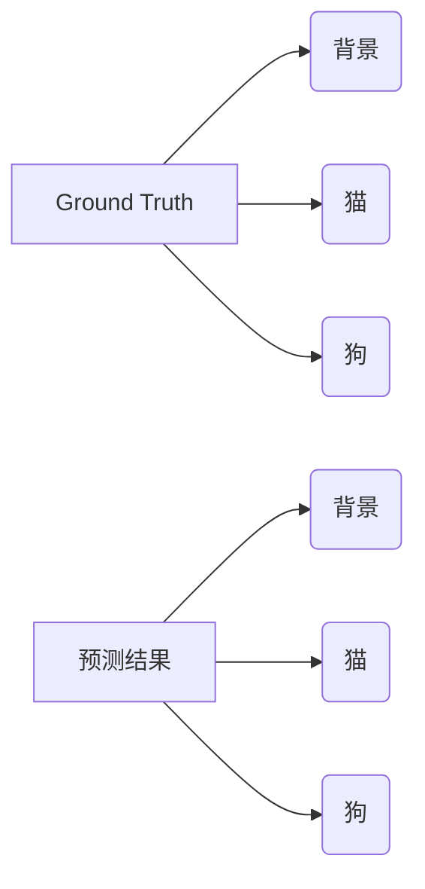

# 模型评估：检验分割效果

## 1. 背景介绍
### 1.1 图像分割的重要性
图像分割是计算机视觉领域的一项基础而关键的任务,它旨在将图像划分为多个具有特定意义的区域或对象。图像分割在医学影像分析、自动驾驶、遥感图像处理等诸多领域有着广泛的应用。一个高质量的图像分割算法能够为后续的图像分析任务提供良好的基础。

### 1.2 评估分割效果的必要性
为了验证一个图像分割算法的有效性,我们需要对其分割结果进行客观、量化的评估。通过合理的评估指标,我们可以比较不同分割算法的优劣,进而不断改进和优化分割算法。因此,模型评估在图像分割任务中具有十分重要的意义。

## 2. 核心概念与联系
### 2.1 分割结果的表示
图像分割的结果通常可以用两种方式表示:

1. 像素级标注(Pixel-wise Annotation):对图像的每个像素指定一个类别标签。
2. 实例分割(Instance Segmentation):不仅对每个像素进行分类,还能区分不同的对象实例。

### 2.2 Ground Truth
Ground Truth是人工标注的分割结果,它代表了图像分割的"正确答案"。在评估分割模型时,我们通常将模型预测的分割结果与Ground Truth进行比较,以此来判断模型的性能。

### 2.3 评估指标
常用的图像分割评估指标包括:

1. 像素准确率(Pixel Accuracy) 
2. 平均交并比(Mean Intersection over Union, MIoU)
3. F1分数(F1 Score)
4. 边界F1分数(Boundary F1 Score)

这些指标从不同的角度评估分割结果的准确性和完整性。

## 3. 核心算法原理与具体操作步骤
### 3.1 像素准确率(Pixel Accuracy)
像素准确率衡量分割结果中正确分类的像素数占总像素数的比例。其计算公式为:
$$
\text{PA} = \frac{\text{TP}}{\text{TP} + \text{FP}}
$$

其中,TP表示真正例(True Positive),即正确分类的像素数;FP表示假正例(False Positive),即错误分类的像素数。

计算步骤如下:
1. 统计分割结果中每个像素的预测类别
2. 将预测结果与Ground Truth进行比较,统计TP和FP
3. 根据公式计算像素准确率

### 3.2 平均交并比(MIoU) 
MIoU衡量预测结果与Ground Truth的重合程度。对于每一个类别,计算其交集(Intersection)与并集(Union)的比值,再对所有类别求平均。MIoU的计算公式为:
$$
\text{MIoU} = \frac{1}{k}\sum_{i=1}^{k}\frac{\text{TP}_i}{\text{TP}_i + \text{FP}_i + \text{FN}_i}
$$

其中,$k$表示类别数,$\text{TP}_i$、$\text{FP}_i$和$\text{FN}_i$分别表示第$i$类的真正例、假正例和假负例(False Negative)。

计算步骤如下:
1. 对每一个类别,统计其TP、FP和FN
2. 计算每个类别的IoU
3. 对所有类别的IoU求平均得到MIoU

### 3.3 F1分数
F1分数是精确率(Precision)和召回率(Recall)的调和平均,常用于评估二分类问题。对于多分类问题,可以先计算每个类别的F1分数,再求平均。F1分数的计算公式为:
$$
\text{F1} = 2 \cdot \frac{\text{Precision} \cdot \text{Recall}}{\text{Precision} + \text{Recall}}
$$

其中,精确率和召回率的计算公式为:
$$
\text{Precision} = \frac{\text{TP}}{\text{TP} + \text{FP}}
$$
$$
\text{Recall} = \frac{\text{TP}}{\text{TP} + \text{FN}}
$$

计算步骤如下:
1. 对每一个类别,统计其TP、FP和FN
2. 计算每个类别的精确率和召回率
3. 根据公式计算每个类别的F1分数
4. 对所有类别的F1分数求平均

### 3.4 边界F1分数(Boundary F1 Score)
边界F1分数专门用于评估分割结果的边界质量。与普通的F1分数类似,但它只关注对象边界附近的像素。计算边界F1分数需要先生成边界Ground Truth和预测结果,再计算它们的精确率和召回率。

计算步骤如下:
1. 对Ground Truth和预测结果提取边界
2. 统计边界像素的TP、FP和FN
3. 计算边界像素的精确率和召回率
4. 根据公式计算边界F1分数

## 4. 数学模型和公式详细讲解举例说明
前面我们介绍了几个常见的分割评估指标,下面以MIoU为例,详细说明其数学模型和计算过程。

假设我们有一个包含3个类别(背景、猫、狗)的图像分割任务。对于一张图像,其Ground Truth和预测结果如下图所示:



我们需要统计每个类别的TP、FP和FN:
- 背景:
  - TP = 背景像素被正确预测为背景的数量
  - FP = 猫或狗像素被错误预测为背景的数量
  - FN = 背景像素被错误预测为猫或狗的数量
- 猫:
  - TP = 猫像素被正确预测为猫的数量  
  - FP = 背景或狗像素被错误预测为猫的数量
  - FN = 猫像素被错误预测为背景或狗的数量
- 狗:
  - TP = 狗像素被正确预测为狗的数量
  - FP = 背景或猫像素被错误预测为狗的数量 
  - FN = 狗像素被错误预测为背景或猫的数量

有了这些统计数据,我们就可以计算每个类别的IoU:
$$
\text{IoU}_{\text{背景}} = \frac{\text{TP}_{\text{背景}}}{\text{TP}_{\text{背景}} + \text{FP}_{\text{背景}} + \text{FN}_{\text{背景}}}
$$
$$
\text{IoU}_{\text{猫}} = \frac{\text{TP}_{\text{猫}}}{\text{TP}_{\text{猫}} + \text{FP}_{\text{猫}} + \text{FN}_{\text{猫}}}
$$
$$
\text{IoU}_{\text{狗}} = \frac{\text{TP}_{\text{狗}}}{\text{TP}_{\text{狗}} + \text{FP}_{\text{狗}} + \text{FN}_{\text{狗}}}
$$

最后,对所有类别的IoU求平均,得到MIoU:
$$
\text{MIoU} = \frac{\text{IoU}_{\text{背景}} + \text{IoU}_{\text{猫}} + \text{IoU}_{\text{狗}}}{3}
$$

这个例子展示了MIoU的计算过程。对于其他评估指标,虽然公式有所不同,但基本思路是类似的,都需要先统计每个类别的TP、FP、FN等数据,再代入相应的公式进行计算。

## 5. 项目实践:代码实例和详细解释说明
下面我们用Python代码实现MIoU的计算。假设`gt`是Ground Truth分割结果,`pred`是预测的分割结果,它们都是大小相同的二维数组,数组元素表示像素的类别标签。

```python
import numpy as np

def compute_miou(gt, pred, num_classes):
    miou = 0
    for i in range(num_classes):
        gt_mask = (gt == i)
        pred_mask = (pred == i) 
        intersection = np.logical_and(gt_mask, pred_mask)
        union = np.logical_or(gt_mask, pred_mask)
        iou = np.sum(intersection) / np.sum(union)
        miou += iou
    miou /= num_classes
    return miou
```

代码解释:
1. 遍历每个类别标签`i`
2. 生成Ground Truth的掩码`gt_mask`,将标签为`i`的像素设为True,其他像素设为False
3. 生成预测结果的掩码`pred_mask`,方法同上
4. 计算`gt_mask`和`pred_mask`的逻辑与,得到交集`intersection`
5. 计算`gt_mask`和`pred_mask`的逻辑或,得到并集`union`
6. 计算交集和并集的像素数比值,得到该类别的IoU
7. 将各类别IoU相加
8. 将总IoU除以类别数,得到MIoU
9. 返回MIoU

这段简洁的Python代码展示了如何使用NumPy库高效计算MIoU。对于大型数据集,我们还可以利用GPU加速库如PyTorch或TensorFlow,进一步提升计算效率。

## 6. 实际应用场景
图像分割评估指标在以下场景中有重要应用:

### 6.1 算法比较与选择
研究人员常常需要比较不同分割算法在特定数据集上的表现。使用客观的评估指标,如MIoU、F1分数等,可以定量评估算法优劣,为算法选择提供参考。

### 6.2 超参数调优
图像分割模型通常有许多超参数需要调节,如学习率、批量大小等。评估指标可用于指导超参数搜索,选择能够最大化模型性能的超参数组合。

### 6.3 模型迭代与更新
在模型迭代开发过程中,评估指标能够量化每一版模型的进展。通过追踪评估指标的变化,开发者可以判断模型是否有所改进,并及时做出调整。

### 6.4 实际部署评估
将图像分割模型部署到实际应用中时,需要评估其在真实场景下的表现。使用合适的评估指标,可以客观衡量模型的实际分割效果,为后续的模型优化或应用决策提供依据。

## 7. 工具和资源推荐
以下是一些用于图像分割评估的工具和资源:

1. [NumPy](https://numpy.org/): Python科学计算基础库,提供了多维数组支持和大量数学函数。
2. [OpenCV](https://opencv.org/): 开源计算机视觉库,提供了图像处理和分析的各种算法。
3. [scikit-learn](https://scikit-learn.org/): Python机器学习库,提供了多种模型评估指标的实现。
4. [PyTorch](https://pytorch.org/), [TensorFlow](https://www.tensorflow.org/): 常用的深度学习框架,支持GPU加速和自动求导。
5. [COCO API](https://github.com/cocodataset/cocoapi): 用于加载、解析和可视化COCO数据集的Python API。
6. [cityscapesScripts](https://github.com/mcordts/cityscapesScripts): 用于处理Cityscapes数据集的脚本合集,包括评估模型性能。

这些工具和资源可以帮助我们高效地实现和使用图像分割评估指标,提升研究和开发效率。

## 8. 总结:未来发展趋势与挑战
### 8.1 未来发展趋势
图像分割评估技术在未来可能有以下发展趋势:

1. 更加全面的评估体系:综合考虑分割精度、速度、资源消耗等多方面因素,构建更加全面的评估指标体系。
2. 特定领域的评估指标:针对医学影像、遥感图像等特定领域,设计专门的评估指标,更好地反映领域特点和需求。
3. 评估指标的可解释性:研究如何提高评估指标的可解释性,使其能够为算法改进提供更明确的指导。
4. 无监督评估方法:探索无需人工标注的Ground Truth的评估方法,降低评估成本,提高评估效率。

### 8.2 面临的挑战
图像分割评估也面临一些挑战:

1. Ground Truth的标注质量:人工标注的质量直接影响评估结果的可靠性,需要投入大量时间和精力保证标注质量。
2. 评估指标的局限性:现有评估指标难以完全反映人眼对分割质量的主观感受,有待进一步改进。
3. 评估效率问题: