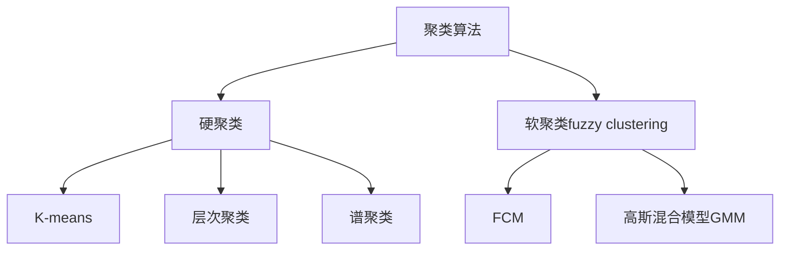

# 模糊聚类算法的研究与实现

## 1. 背景介绍

在大数据时代,海量数据的分析和处理已成为各行各业面临的重大挑战。数据挖掘技术应运而生,其中聚类分析作为一种重要的数据挖掘方法,在模式识别、图像分割、信息检索等领域有着广泛的应用。

传统的硬聚类算法(如K-means)要求每个样本点只能严格地属于某一类,但在现实问题中,样本点往往具有一定的模糊性和不确定性。为了更好地描述这种不确定性,模糊聚类算法被提出。模糊C均值聚类(FCM)是最经典、应用最广泛的模糊聚类算法之一。

本文将重点探讨FCM算法的基本原理、优化改进、实现细节以及实际应用,并提供相关的数学推导、代码实例和实验结果,帮助读者全面深入地理解模糊聚类的核心思想和关键技术。

## 2. 核心概念与联系

### 2.1 模糊集合理论

- 传统集合论中,元素要么属于要么不属于某个集合,membership是非黑即白的。
- 模糊集合理论 (Fuzzy Set Theory) 允许元素以一定的隶属度 (membership) 属于某个集合。隶属度可以是[0,1]区间内的任意实数。
- 隶属度矩阵U: 第i行第j列元素uij表示第i个样本属于第j类的隶属度。

### 2.2 模糊C均值聚类(FCM)

- FCM是一种基于模糊集合理论的无监督学习算法,通过优化目标函数迭代更新隶属度矩阵和聚类中心,实现对样本数据的软划分。
- 模糊化参数m: 控制聚类结果的模糊程度,m越大,聚类结果越模糊。
- 聚类有效性指标: 用于评估聚类性能的定量度量,如Partition Coefficient (PC)、Partition Entropy (PE)、Xie-Beni指标等。

### 2.3 算法关系

下图展示了FCM与其他聚类算法的关系:



## 3. 核心算法原理与步骤

FCM算法的目标是最小化如下损失函数:

$$J_m(U,V)=\sum_{i=1}^N\sum_{j=1}^C (u_{ij})^m \lVert x_i-v_j \rVert^2$$

其中$u_{ij}$是样本$x_i$对第$j$类的隶属度,$v_j$是第$j$类的聚类中心。$m$是模糊化参数,控制聚类结果的模糊程度。

FCM的优化求解过程如下:

1. 随机初始化隶属度矩阵$U$,使其满足约束条件。
2. 固定$U$,更新各聚类中心$v_j$:
$$v_j=\frac{\sum_{i=1}^N (u_{ij})^m x_i}{\sum_{i=1}^N (u_{ij})^m}, j=1,2,...,C$$
3. 固定$v_j$,更新隶属度矩阵$U$:  
$$u_{ij}=\frac{1}{\sum_{k=1}^C (\frac{\lVert x_i-v_j \rVert}{\lVert x_i-v_k \rVert})^{\frac{2}{m-1}}}, i=1,2,...,N; j=1,2,...,C$$
4. 计算目标函数值,若小于阈值或达到最大迭代次数则停止,否则回到步骤2。

## 4. 数学模型和公式详解

### 4.1 隶属度矩阵

隶属度矩阵$U$是一个$N \times C$的矩阵,其中$N$为样本数,$C$为聚类数。$U$需要满足以下约束:

$$u_{ij} \in [0,1], \forall i,j$$
$$\sum_{j=1}^C u_{ij}=1, \forall i$$
$$0<\sum_{i=1}^N u_{ij}<N, \forall j$$

直观理解就是每个样本对所有类别的隶属度之和为1,且每个类至少要包含一个样本。

### 4.2 聚类中心

聚类中心$v_j$表示第$j$类的中心点坐标,由隶属度加权平均计算得到:

$$v_j=\frac{\sum_{i=1}^N (u_{ij})^m x_i}{\sum_{i=1}^N (u_{ij})^m}, j=1,2,...,C$$

$m$越大,隶属度的加权作用越明显,聚类中心更偏向隶属度高的样本。

### 4.3 模糊化参数

模糊化参数$m$控制聚类结果的模糊程度,通常取值在[1.5,2.5]之间。

- 当$m \to 1$时,FCM退化为硬聚类,每个样本只能完全属于某一类。
- 当$m \to \infty$时,隶属度趋于平均值$1/C$,聚类结果最模糊。

$m$的选择需要根据具体问题和领域知识来权衡,没有统一的最优值。

### 4.4 目标函数

FCM的损失函数$J_m(U,V)$由两部分组成:隶属度$u_{ij}$和距离$\lVert x_i-v_j \rVert$。

- $(u_{ij})^m$反映了样本$x_i$对第$j$类的归属强度。$m$越大,隶属度的差异性越被放大。
- $\lVert x_i-v_j \rVert^2$表示样本$x_i$到聚类中心$v_j$的欧氏距离平方。距离越小,样本越应该属于该类。

最小化$J_m$就是在隶属度矩阵$U$和聚类中心$V$上寻找最优的软划分方案。

## 5. 项目实践:代码实例与详解

下面用Python实现了FCM算法的核心部分:

```python
import numpy as np

def fcm(X, C, m=2, eps=1e-5, max_iter=100):
    N = X.shape[0]  # 样本数
    D = X.shape[1]  # 特征维度
    
    # 初始化隶属度矩阵U
    U = np.random.rand(N, C)
    U = U / np.sum(U, axis=1, keepdims=True)
    
    for _ in range(max_iter):
        # 更新聚类中心
        V = np.zeros((C, D))
        for j in range(C):
            V[j] = np.sum(U[:,j].reshape(-1,1)**m * X, axis=0) / np.sum(U[:,j]**m)
        
        # 更新隶属度矩阵 
        dist = np.linalg.norm(X[:, None, :] - V[None, :, :], axis=-1)  # 计算距离矩阵
        exp = -2 / (m-1)
        U_new = 1 / np.sum((dist / dist[:, :, None]) ** exp, axis=-1)
        
        # 检查收敛性
        if np.linalg.norm(U_new - U) < eps:
            break
        U = U_new
        
    return U, V
```

代码说明:

- X为$N \times D$的数据矩阵,每行是一个D维样本。C为聚类数。
- 隶属度矩阵U初始化为$N \times C$的随机矩阵,然后按行归一化。
- 循环更新聚类中心V和隶属度矩阵U,直到U的变化量小于阈值eps或达到最大迭代次数。
- 聚类中心V是$C \times D$的矩阵,每行是一个D维聚类中心。
- 隶属度矩阵U利用了广播机制高效计算,dist是$N \times C \times C$的距离张量。

这里用了NumPy的向量化操作来提高计算效率,避免了显式的循环。

## 6. 实际应用场景

FCM在多个领域都有广泛应用,举几个例子:

- 医学图像分割:将CT、MRI等医学图像划分为不同组织和器官,如肿瘤、脑白质等。相比传统阈值分割,FCM能更好地处理组织间模糊的边界。

- 客户细分:根据客户属性(如年龄、消费水平)将其划分为不同的群体,制定差异化的营销策略。FCM能揭示客户的多重属性。

- 文本聚类:对文本数据进行主题聚类,一篇文档可能兼有多个主题。FCM能表示文本的主题分布。

- 模式识别:提取图像、语音等数据的模糊特征,用于分类和识别任务。

总的来说,FCM特别适合处理具有模糊性、连续性的聚类问题。通过隶属度来刻画样本的多样性,能发现更真实、更丰富的数据结构。

## 7. 工具和资源推荐

- scikit-fuzzy: Python的模糊逻辑和模糊聚类工具包。
- e1071: R语言的模糊聚类包。
- Fuzzy Clustering and Data Analysis Toolbox: MATLAB的模糊聚类工具箱。
- 《Fuzzy Cluster Analysis: Methods for Classification, Data Analysis and Image Recognition》: 模糊聚类的经典教材,全面系统地介绍了FCM等算法。

建议感兴趣的读者进一步探索FCM的变种和扩展,如Kernel FCM、Possibilistic FCM、Fuzzy Co-Clustering等,它们从不同角度增强了FCM的性能和适用性。

## 8. 总结:未来发展与挑战

FCM作为经典的模糊聚类算法,在理论和实践上都取得了丰硕的成果。未来,FCM还有以下几个发展方向:

1. 大数据场景:研究FCM在分布式、流数据环境下的增量学习和并行计算。
2. 高维数据:针对"维度灾难"设计稀疏化、降维的FCM变种。
3. 非欧空间:拓展FCM到非欧几何结构数据上,如流形聚类。
4. 深度学习结合:用FCM思想来指导深度神经网络的设计与训练,实现端到端的模糊聚类学习。

同时,FCM还面临一些挑战:

1. 聚类数C的选择:需要先验知识或数据驱动的方法来自适应确定最优C值。
2. 模糊化参数m的调优:m对聚类结果影响很大,需要更多的理论指导和自动调参策略。
3. 初值敏感性:FCM对隶属度矩阵U的初始化较为敏感,有时会收敛到次优解。

总之,FCM是一个简洁而强大的模糊聚类框架,为不确定性数据挖掘开辟了广阔的前景。在大数据时代,FCM必将迎来新的机遇和挑战。让我们携手探索模糊聚类的新边界,用模糊的视角去认识确定的世界。

## 9. 附录:常见问题解答

### 9.1 FCM与K-means的区别?

- K-means是硬聚类,每个样本只能属于一个类;FCM是软聚类,样本以不同的隶属度属于多个类。
- K-means只优化各类内距离;FCM同时优化类内距离和隶属度。
- K-means对噪声和异常点敏感;FCM通过隶属度调节,对噪声更鲁棒。

### 9.2 FCM的收敛性?

已证明,当模糊化参数$m>1$时,FCM的目标函数是非凸的,梯度下降法能收敛到局部极小值。但聚类结果可能依赖于隶属度矩阵U的初始化。

### 9.3 FCM的时间复杂度?

设样本数为$N$,聚类数为$C$,特征维度为$D$,迭代次数为$t$。则FCM的时间复杂度为$O(t \cdot N \cdot C \cdot D)$。当$N \gg C,D$时,复杂度近似为$O(t \cdot N)$,与K-means相当。

### 9.4 如何加速FCM?

可以考虑以下几种加速策略:

1. 数据预处理:对高维数据进行PCA等降维,减少特征维度D。
2. 采样与分治:对大规模数据进行采样,先聚类采样子集,再对全集做调整。
3. 并行化:利用多核CPU或GPU