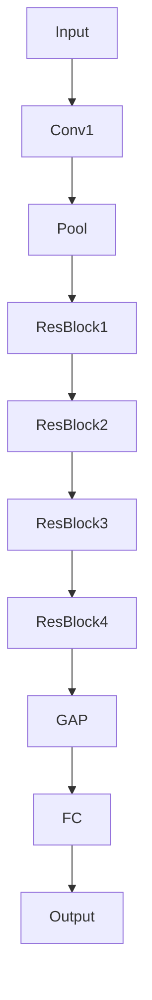

# 残差网络ResNet详解:让神经网络更深的秘诀

## 1. 背景介绍
### 1.1 深度学习的发展历程
深度学习作为人工智能领域的一个重要分支,在计算机视觉、自然语言处理等领域取得了突破性的进展。从最早的感知机,到BP神经网络,再到AlexNet、VGGNet等深度卷积神经网络的诞生,深度学习的发展可谓是日新月异。

### 1.2 深度神经网络面临的挑战
然而,随着神经网络层数的不断加深,网络训练变得越来越困难。梯度消失和梯度爆炸问题成为制约神经网络进一步加深的瓶颈。如何解决深层神经网络训练的难题,成为学术界和工业界共同关注的焦点。

### 1.3 残差网络ResNet的诞生
2015年,何恺明等人提出了残差网络(Residual Network,简称ResNet),通过引入恒等映射(identity mapping)成功训练出了上百层的神经网络,一举夺得当年ImageNet图像分类竞赛冠军,Top5错误率降到了3.57%,刷新了当时的最好成绩。ResNet的诞生,为神经网络的进一步加深提供了新的思路。

## 2. 核心概念与联系
### 2.1 残差学习 
ResNet的核心思想在于引入了残差学习(Residual Learning)。与传统的逐层学习相比,残差学习让网络去学习残差函数,而不是去直接学习目标函数。

假设某一层网络要学习的目标函数为 $H(x)$,残差学习等价于将 $H(x)$ 分解为两个部分:
$$H(x) = F(x) + x$$
其中 $x$ 是恒等映射, $F(x)$ 是残差函数。网络只需要学习残差函数 $F(x)=H(x)-x$ 即可。

### 2.2 残差单元
ResNet中引入了残差单元(Residual Unit)的概念。一个残差单元可以表示为:
$$y = F(x, \{W_i\}) + x$$
其中 $x$ 和 $y$ 是残差单元的输入和输出, $F$ 是残差函数, $W_i$ 是残差单元中的参数。通过跳跃连接(skip connection),输入 $x$ 可以直接传递到输出,与 $F(x)$ 相加,从而实现恒等映射。

### 2.3 残差网络结构
ResNet的整体结构由多个残差单元堆叠而成。网络的输入首先经过一个 $7\times 7$ 的卷积层和最大池化层,然后进入多个残差单元,最后通过全局平均池化层和全连接层得到输出。

下面是一个典型的ResNet-34的网络结构示意图:



其中,Conv1表示初始的卷积层,Pool表示最大池化层,ResBlock1~4表示4个残差单元组,每组内有多个残差单元堆叠,GAP表示全局平均池化层,FC表示最后的全连接层。

## 3. 核心算法原理具体操作步骤
下面我们详细介绍ResNet的核心算法原理和具体操作步骤。

### 3.1 前向传播
对于一个残差单元,前向传播过程可以表示为:
$$y = F(x, \{W_i\}) + x$$

具体步骤如下:
1. 输入 $x$ 经过两个或三个卷积层得到 $F(x)$
2. 将 $F(x)$ 与输入 $x$ 相加
3. 对相加的结果进行ReLU激活,得到输出 $y$

值得注意的是,为了保证 $F(x)$ 与 $x$ 可以相加,它们的维度必须相同。如果维度不同(通常是因为中间的卷积层改变了特征图的通道数),需要对 $x$ 做一个线性投影 $W_s$,将其变换到与 $F(x)$ 相同的维度:
$$y = F(x, \{W_i\}) + W_sx$$

### 3.2 反向传播
反向传播时,梯度可以直接传递到浅层网络。以一个两层的残差单元为例:
$$y = W_2\sigma(W_1x) + x$$
其中 $\sigma$ 表示ReLU激活函数。

假设 $L$ 为损失函数,则:
$$\frac{\partial L}{\partial x} = \frac{\partial L}{\partial y}\frac{\partial y}{\partial x} = \frac{\partial L}{\partial y}(1 + \frac{\partial}{\partial x}W_2\sigma(W_1x))$$

可以看到,梯度 $\frac{\partial L}{\partial x}$ 可以分为两部分:一部分是从 $y$ 直接传递过来的,另一部分则需要经过中间的权重层。这种特殊的梯度传递方式,使得即使网络很深,梯度也能够从后面的层直接传递到前面的层,从而缓解了梯度消失的问题。

## 4. 数学模型和公式详细讲解举例说明
接下来,我们用一个简单的例子来说明残差学习的数学模型和公式。

假设我们要用神经网络拟合一个函数 $H(x)=0.5x$,网络的输入为 $x$,输出为 $y$。如果直接学习 $H(x)$,我们可以用一个两层的全连接网络:
$$y = W_2\sigma(W_1x)$$

其中 $W_1,W_2$ 是网络的权重, $\sigma$ 是ReLU激活函数。我们希望网络学习到 $W_2W_1=0.5$ 的映射关系。

现在,我们用残差学习的方式来学习这个函数。新的网络可以表示为:
$$y = W_2\sigma(W_1x) + x$$

此时,网络需要学习的残差函数为:
$$F(x) = H(x) - x = -0.5x$$

也就是说,只要网络学习到 $W_2W_1=-0.5$ 的映射关系即可。

可以看到,对于同样的问题,残差学习需要学习的函数比直接学习简单得多。这就是残差学习的优势所在。通过把复杂的函数分解为两部分,一部分用恒等映射直接传递,另一部分学习残差,可以大大简化学习难度。

## 5. 项目实践：代码实例和详细解释说明
下面我们用PyTorch实现一个简单的残差单元,并对代码进行详细解释。

```python
import torch
import torch.nn as nn

class ResidualUnit(nn.Module):
    def __init__(self, in_channels, out_channels, stride=1):
        super(ResidualUnit, self).__init__()
        
        self.conv1 = nn.Conv2d(in_channels, out_channels, kernel_size=3, stride=stride, padding=1, bias=False)
        self.bn1 = nn.BatchNorm2d(out_channels)
        self.relu = nn.ReLU(inplace=True)
        self.conv2 = nn.Conv2d(out_channels, out_channels, kernel_size=3, stride=1, padding=1, bias=False)
        self.bn2 = nn.BatchNorm2d(out_channels)
        
        if stride != 1 or in_channels != out_channels:
            self.shortcut = nn.Sequential(
                nn.Conv2d(in_channels, out_channels, kernel_size=1, stride=stride, bias=False),
                nn.BatchNorm2d(out_channels)
            )
        else:
            self.shortcut = nn.Identity()
            
    def forward(self, x):
        out = self.relu(self.bn1(self.conv1(x)))
        out = self.bn2(self.conv2(out))
        out += self.shortcut(x)
        out = self.relu(out)
        return out
```

这段代码实现了一个两层的残差单元。让我们逐行解释:

- `__init__`方法定义了残差单元的架构。它包含两个卷积层`conv1`和`conv2`,以及对应的批归一化层`bn1`和`bn2`。
- 如果输入和输出的维度不同(通道数不同或步长不为1),就需要对输入做一个线性投影,使其与输出的维度相同。这里用一个1x1的卷积`shortcut`来实现。
- 如果输入和输出维度相同,`shortcut`就是一个恒等映射,直接把输入传递给输出。
- `forward`方法定义了前向传播的过程。输入 $x$ 首先经过第一个卷积层、批归一化层和ReLU激活,得到中间结果。
- 中间结果再经过第二个卷积层和批归一化层,得到残差函数 $F(x)$。
- 将残差函数 $F(x)$ 和输入 $x$ 相加,再通过ReLU激活,得到最终的输出。

有了残差单元,我们就可以搭建任意深度的残差网络了。下面是一个简单的例子:

```python
class ResNet(nn.Module):
    def __init__(self, num_classes=10):
        super(ResNet, self).__init__()
        
        self.conv1 = nn.Conv2d(3, 64, kernel_size=7, stride=2, padding=3, bias=False)
        self.bn1 = nn.BatchNorm2d(64)
        self.relu = nn.ReLU(inplace=True)
        self.maxpool = nn.MaxPool2d(kernel_size=3, stride=2, padding=1)
        
        self.layer1 = self._make_layer(64, 64, 2)
        self.layer2 = self._make_layer(64, 128, 2, stride=2)
        self.layer3 = self._make_layer(128, 256, 2, stride=2)
        self.layer4 = self._make_layer(256, 512, 2, stride=2)
        
        self.avgpool = nn.AdaptiveAvgPool2d((1, 1))
        self.fc = nn.Linear(512, num_classes)
        
    def _make_layer(self, in_channels, out_channels, num_blocks, stride=1):
        layers = []
        layers.append(ResidualUnit(in_channels, out_channels, stride))
        for _ in range(1, num_blocks):
            layers.append(ResidualUnit(out_channels, out_channels))
        return nn.Sequential(*layers)
    
    def forward(self, x):
        x = self.conv1(x)
        x = self.bn1(x)
        x = self.relu(x)
        x = self.maxpool(x)
        
        x = self.layer1(x)
        x = self.layer2(x)
        x = self.layer3(x)
        x = self.layer4(x)
        
        x = self.avgpool(x)
        x = torch.flatten(x, 1)
        x = self.fc(x)
        
        return x
```

这个ResNet包含4个残差单元组(`layer1`~`layer4`),每组内有2个残差单元。此外,网络还包括初始的卷积层、最大池化层、全局平均池化层和最终的全连接层。

通过这个例子,相信你已经对残差网络的实现有了一个直观的认识。ResNet的强大之处在于,你可以随意增加它的深度,而不用担心网络难以训练。事实上,ResNet的变体可以达到上千层,这在以前是不可想象的。

## 6. 实际应用场景
残差网络自提出以来,在计算机视觉的诸多任务中取得了广泛的成功,成为了很多复杂模型的首选骨干网络。下面列举了一些ResNet的典型应用场景:

### 6.1 图像分类
ResNet最初就是为ImageNet图像分类任务而设计的。此后,各种ResNet变体如ResNeXt、SE-ResNet等进一步提升了图像分类的精度。ResNet也常作为基础网络,去解决细粒度图像分类、多标签图像分类等问题。

### 6.2 目标检测
目标检测是计算机视觉的另一个重要任务。以Faster R-CNN、Mask R-CNN为代表的两阶段检测器,都采用ResNet作为骨干网络提取特征。单阶段检测器如SSD、YOLO等,也进一步借鉴了残差学习的思想。

### 6.3 语义分割
语义分割旨在对图像的每个像素进行分类。FCN、U-Net等分割网络在编码阶段通常采用ResNet提取特征,再通过反卷积或上采样得到像素级的预测。

### 6.4 行人重识别
行人重识别需要对不同摄像头下的行人图像进行匹配。通常采用ResNet在行人数据集上进行预训练,提取判别性的特征表示,再结合度量学习等策略完成匹配。

### 6.5 人脸识别
ResNet也是很多人脸识别系统的首选骨干网络。在海量人