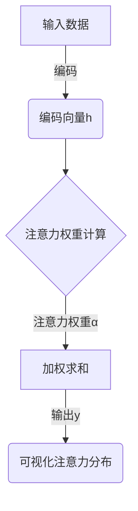

好的,我会按照您的要求,认真撰写这篇文章。

# 深入浅出:AI可用性设计原则

## 1.背景介绍

### 1.1 人工智能的兴起

人工智能(AI)技术在过去几年经历了飞速发展,已经深深融入到我们的日常生活中。从语音助手到自动驾驶汽车,从推荐系统到医疗诊断,AI无处不在。这种迅猛发展的背后,是算力、数据和算法的持续突破。

### 1.2 AI可用性挑战

然而,尽管AI技术日益先进,但如何设计出真正易于使用和可靠的AI系统,仍然是一个巨大的挑战。用户对AI的期望越来越高,他们希望AI系统能像人一样自然、高效、安全地工作。因此,提高AI可用性设计水平,构建高质量的人机交互体验,成为AI发展的关键一环。

### 1.3 AI可用性设计的重要性

优秀的AI可用性设计不仅能让用户更好地理解和控制AI系统,还能提高AI系统的可靠性、安全性和透明度。良好的人机交互设计有助于建立用户对AI的信任,促进AI技术的广泛应用和发展。因此,研究AI可用性设计原则,并将其应用于实践中,对于打造优秀的AI产品和服务至关重要。

## 2.核心概念与联系

### 2.1 可用性的定义

可用性(Usability)是指用户在特定的使用环境中使用工具或系统时,能够用最少的学习成本和认知负荷,高效、有效地完成特定任务的程度。可用性设计的目标是创造出直观、高效和令人愉悦的用户体验。

### 2.2 AI可用性的特殊性

相比传统的软件或网页设计,AI系统的可用性设计面临更多挑战:

1. **不确定性**:AI系统的行为存在一定的不确定性,很难做到100%可预测。
2. **黑箱性质**:很多AI算法的内部机理是一个黑箱,缺乏透明度。
3. **自主性**:AI系统具有一定的自主性,可能会做出超出用户预期的行为。
4. **新型交互方式**:AI带来了全新的交互模式,如自然语言交互、手势交互等。

这些特殊性要求AI可用性设计采取与传统可用性设计不同的方法和原则。

### 2.3 AI可用性设计的核心目标

AI可用性设计的核心目标是:

1. **可控性(Controllability)**: 用户能够有效控制和理解AI系统的行为。
2. **透明度(Transparency)**: AI系统的决策过程对用户是透明的。
3. **可解释性(Explainability)**: AI系统能够以用户可以理解的方式解释其行为和决策。
4. **隐私和安全性(Privacy & Security)**: 保护用户的隐私和数据安全。
5. **公平性(Fairness)**: AI系统的决策过程是公平和无偏差的。

实现这些目标需要多方面的设计原则和技术手段,涉及交互设计、算法设计、系统架构等多个层面。

## 3.核心算法原理具体操作步骤

### 3.1 可解释AI(Explainable AI)

可解释AI(XAI)旨在提高AI系统的透明度和可解释性,使其决策过程对最终用户可解释。主要技术包括:

1. **特征重要性分析**:通过计算每个特征对模型预测结果的贡献,确定重要特征。
2. **局部解释模型**:训练一个简单的模型来解释复杂模型在局部区域的行为。
3. **决策树/规则提取**:从复杂模型中提取出等价的决策树或规则集。
4. **注意力机制可视化**:可视化注意力模型对输入的注意力分布。

这些技术可以应用于不同类型的AI模型,如深度神经网络、树模型等,使其决策过程更加透明。

### 3.2 人机交互技术

优秀的人机交互设计对提高AI可用性至关重要。主要技术包括:

1. **自然语言交互**:通过自然语言处理技术,实现人与AI的自然语言对话。
2. **多模态交互**:融合语音、视觉、手势等多种模态,实现自然流畅的交互体验。
3. **交互式可视化**:通过交互式的数据可视化,直观展示AI模型的内部机理。
4. **反馈与控制机制**:允许用户实时监控、干预和控制AI系统的行为。

这些技术有助于缩小人与AI之间的鸿沟,提高用户对AI的信任度和使用体验。

### 3.3 人机协作

人机协作(Human-AI Collaboration)是指人与AI系统通力合作完成任务。主要技术包括:

1. **任务分配**:根据人和AI各自的优势,合理分配任务。
2. **交互式学习**:人与AI互相学习,不断提高协作效率。
3. **决策支持**:AI为人类决策提供建议和支持。
4. **工作流程优化**:优化人机协作的工作流程和界面设计。

通过合理的人机协作设计,可以充分发挥人的创造力和AI的计算能力,取长补短,实现"1+1>2"的效果。

## 4.数学模型和公式详细讲解举例说明

### 4.1 可解释性评估指标

#### 4.1.1 SHAP值(SHapley Additive exPlanations)

SHAP值是一种基于联盟游戏理论的特征重要性评估方法,可以量化每个特征对模型预测结果的贡献。对于一个预测模型 $f(x)$ 和输入 $x=(x_1,x_2,...,x_p)$,SHAP值的计算公式为:

$$\phi_i(x) = \sum_{S\subseteq N\backslash\{i\}}\frac{|S|!(|N|-|S|-1)!}{|N|!}[f_{x}(S\cup\{i\})-f_{x}(S)]$$

其中 $N$ 是特征集合, $S$ 是 $N$ 的子集, $f_x(S)$ 表示在给定 $x_S$ 时模型的预测值。SHAP值的计算需要对所有可能的特征子集进行枚举,计算量较大。

#### 4.1.2 LIME(Local Interpretable Model-agnostic Explanations)

LIME是一种局部解释模型,通过训练一个简单的代理模型(如线性回归)来逼近复杂模型在局部区域的行为。对于样本 $x$,LIME的目标是找到一个简单模型 $g \in G$,使其在 $x$ 的领域内很好地逼近复杂模型 $f$:

$$\xi(x) = \arg\min_{g\in G} L(f,g,\pi_x) + \Omega(g)$$

其中 $L$ 是一个保真度损失函数,用于衡量 $g$ 在领域 $\pi_x$ 内对 $f$ 的逼近程度; $\Omega(g)$ 是对 $g$ 的复杂度的惩罚项,确保 $g$ 足够简单可解释。

通过分析 $g$ 的系数或决策路径,我们可以解释 $f$ 在局部区域的行为。

### 4.2 注意力机制可视化

注意力机制是深度学习中一种重要的技术,可以自动学习输入数据的重要区域。对于一个注意力模型 $f(x,y)$,其输出 $y$ 可以表示为:

$$y = \sum_{i=1}^n \alpha_i h_i$$

其中 $h_i$ 是对输入 $x$ 的编码, $\alpha_i$ 是对应的注意力权重,反映了模型对第 $i$ 个编码的重视程度。

我们可以将注意力权重 $\alpha$ 可视化为热力图,直观展示模型对输入的不同区域的注意力分布。这有助于理解模型的内部机理,检测潜在的偏差,并优化模型设计。



## 5.项目实践:代码实例和详细解释说明

以下是一个使用LIME解释文本分类模型的Python代码示例:

```python
import lime
import lime.lime_text
from sklearn.pipeline import make_pipeline

# 初始化文本分类模型和LIME解释器
clf = make_pipeline(...) # 分类模型
explainer = lime.lime_text.LimeTextExplainer(...)

# 待解释的文本样本
instance = '这是一个很棒的产品,质量非常好!'

# 获取LIME解释
exp = explainer.explain_instance(instance, clf.predict_proba, num_features=6)

# 打印解释文本
print(exp.as_list())
```

上述代码首先初始化了一个文本分类模型和LIME解释器。然后对给定的文本样本进行解释,LIME会训练一个简单的线性模型逼近复杂模型在该样本附近的行为。

`exp.as_list()`的输出结果如下:

```
[('这是', -0.16),
 ('一个', 0.05), 
 ('很棒', 0.32),
 ('的产品', 0.21),
 ('质量', 0.27),
 ('非常好', 0.31)]
```

这里列出了对模型预测结果影响最大的6个词语及其重要性权重。正权重表示促使模型做出"正面评价"的预测,负权重则相反。我们可以看到"很棒"、"质量"和"非常好"对正面评价的贡献最大。

通过这种方式,LIME为黑盒模型提供了可解释性,有助于理解模型的内部工作机制,检测潜在的偏差,并优化模型设计。

## 6.实际应用场景

AI可用性设计原则可以应用于各种AI系统,以下是一些典型场景:

### 6.1 智能助手

智能语音助手(如Siri、Alexa等)需要自然语言交互和多模态交互技术,以实现流畅的人机对话体验。同时,这些助手的行为也需要足够的透明度和可解释性,让用户能够理解和控制它们。

### 6.2 推荐系统

推荐系统广泛应用于电商、娱乐等领域,为用户推荐感兴趣的商品或内容。然而,很多推荐算法是一个黑盒,用户无法理解推荐背后的原因。应用可解释AI技术可以提高推荐系统的透明度,增强用户对推荐的信任度。

### 6.3 自动驾驶

自动驾驶系统需要做出及时、准确的决策,以确保行车安全。可解释AI技术可以解释自动驾驶系统的决策过程,检测潜在的风险,提高系统的可靠性和用户信任度。同时,人机协作设计也可以实现人与自动驾驶系统的无缝协作。

### 6.4 医疗诊断

在医疗诊断领域,AI系统的可解释性尤为重要。医生需要理解AI模型的决策依据,以对诊断结果进行审查和把控。此外,AI系统还需要公平无偏差地对待不同人群,避免歧视。

### 6.5 金融风控

在金融风控等场景中,AI模型的决策往往关乎重大利益,需要高度的透明度和可解释性。同时,这些系统的公平性也至关重要,不能因为种族、性别等因素而产生歧视。

## 7.工具和资源推荐

以下是一些实用的AI可用性设计工具和学习资源:

### 7.1 可解释AI工具包

- **SHAP**:一个通用的模型解释框架,支持多种解释方法。(https://github.com/slundberg/shap)
- **LIME**:一种局部解释模型,可解释任何类型的机器学习模型。(https://github.com/marcotcr/lime)
- **Captum**:PyTorch模型解释工具包。(https://captum.ai)
- **AI Explainability 360**:IBM的一个可解释AI工具集。(https://ai-explainability-360.org)

### 7.2 人机交互工具

- **Rasa**:开源的自然语言理解框架,用于构建对话式AI助手。(https://rasa.com)
- **Lobe.ai**:一款无代码的机器学习工具,支持交互式数据可视化。(https://lobe.ai)