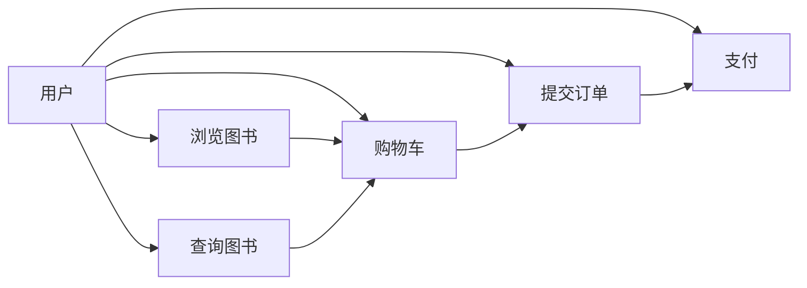

# 网上图书查询与销售系统详细设计与具体代码实现

## 1. 背景介绍

在互联网时代,电子商务已经成为人们日常生活中不可或缺的一部分。网上购物以其便捷、高效、价格实惠等优势,深受广大消费者的青睐。作为电子商务的重要组成部分,网上图书销售系统为广大读者提供了一个便捷的购书渠道。

本文将详细介绍一个完整的网上图书查询与销售系统的设计与实现过程,包括需求分析、概要设计、详细设计、数据库设计和核心代码实现等内容,旨在为从事相关系统开发的技术人员提供有价值的参考。

### 1.1 系统概述
#### 1.1.1 系统目标
#### 1.1.2 系统功能
#### 1.1.3 系统架构

### 1.2 需求分析 
#### 1.2.1 功能需求
#### 1.2.2 性能需求
#### 1.2.3 安全需求

### 1.3 可行性分析
#### 1.3.1 技术可行性
#### 1.3.2 经济可行性
#### 1.3.3 操作可行性

## 2. 核心概念与联系

在网上图书查询与销售系统中,涉及到一些核心概念,包括:

- 图书:系统销售的核心商品,包含书名、作者、出版社、ISBN、价格、库存等属性。
- 用户:使用该系统的对象,分为普通用户和管理员两类。普通用户可以浏览图书、查询图书、购买图书等,管理员拥有管理图书、订单等权限。  
- 购物车:用户在浏览图书时可以将图书添加到购物车,最后统一结算。
- 订单:用户提交购物车中的图书清单后形成订单,包含订单编号、用户信息、图书清单、总价格、收货地址、支付状态等。
- 支付:用户在提交订单后需要支付订单金额,系统需要对接第三方支付平台。

下图展示了这些核心概念之间的关系:



## 3. 核心算法原理具体操作步骤

在网上图书销售系统中,有几个核心算法值得关注:

### 3.1 协同过滤推荐算法

协同过滤是一种常用的推荐算法,其基本原理是:如果用户A和用户B对一些物品有着类似的评价,那么可以推断他们对其他物品也可能有相似的评价。将这种思想应用到图书推荐中,可以根据用户的历史购买记录、浏览记录,找到与之相似的其他用户,从而给用户推荐那些相似用户喜欢的其他图书。

协同过滤算法一般分为以下几个步骤:
1. 收集用户偏好数据,即用户对一些图书的评分或购买记录。
2. 计算用户之间的相似度,常用的相似度计算方法有欧几里得距离、皮尔逊相关系数等。 
3. 根据用户相似度,找到与当前用户最相似的K个用户。
4. 计算这K个用户对各个图书的评分,将其作为当前用户对这些图书的预测评分。
5. 选择预测评分最高的N个图书推荐给用户。

### 3.2 关联规则挖掘算法

关联规则挖掘可以发现不同商品之间的关联关系,常见的应用如"购买了商品X的用户通常也会购买商品Y"。将其应用于图书销售中,可以发现不同图书之间的关联关系,从而可以在用户浏览某本图书时推荐与之相关的其他图书。

关联规则挖掘的核心是找出频繁项集,然后由频繁项集产生关联规则。其基本步骤如下:

1. 根据用户的购买记录,生成事务数据库。一个事务即一个用户的一次购买行为,包含多个商品。
2. 设定最小支持度阈值,找出频繁项集。频繁项集是指在事务数据库中出现频率不低于最小支持度的商品组合。常用的频繁项集挖掘算法有Apriori、FP-Growth等。
3. 由频繁项集产生关联规则。关联规则的形式为"X->Y",表示购买X的用户有很大概率也会购买Y。关联规则的重要指标有支持度和置信度。
4. 根据关联规则,在用户浏览某本图书时,推荐置信度高的关联图书。

### 3.3 图书搜索算法

图书搜索是网上图书销售系统的一个重要功能,需要根据用户输入的关键词快速找出相关图书。常用的搜索算法有:

1. 顺序搜索:将用户输入的关键词与图书信息逐一比对,找出包含关键词的图书。这种方法简单直观,但搜索效率较低。 

2. 倒排索引:预先建立关键词到图书的映射关系,搜索时直接根据关键词找出对应的图书。这种方法搜索效率高,但需要额外的存储空间来存储索引。

3. 全文搜索:将图书的标题、作者、简介等信息切分成词,建立倒排索引。搜索时先对输入的关键词分词,然后根据倒排索引找出包含这些词的图书。

## 4. 数学模型和公式详细讲解举例说明

在协同过滤算法中,我们提到了用户相似度的计算,这里以皮尔逊相关系数为例进行详细说明。

皮尔逊相关系数用于度量两个变量之间的线性相关性,取值范围为[-1,1]。值越接近1或-1,表示两个变量的正相关或负相关性越强;值越接近0,表示两个变量的相关性越弱。

假设有n个用户和m本图书,令$r_{ui}$表示用户u对图书i的评分,$\bar{r_u}$表示用户u的平均评分。那么用户u和用户v的皮尔逊相关系数定义为:

$$
sim(u,v) = \frac{\sum_{i\in I_{uv}}(r_{ui}-\bar{r_u})(r_{vi}-\bar{r_v})}{\sqrt{\sum_{i\in I_{uv}}(r_{ui}-\bar{r_u})^2}\sqrt{\sum_{i\in I_{uv}}(r_{vi}-\bar{r_v})^2}}
$$

其中$I_{uv}$表示用户u和用户v共同评分的图书集合。

举例说明,假设用户A和用户B对5本图书的评分如下:

| 图书 | 用户A评分 | 用户B评分 |
|------|----------|----------|
| 图书1 | 5        | 4        |
| 图书2 | 4        | 5        |  
| 图书3 | 3        | 3        |
| 图书4 | 4        | 4        |
| 图书5 | 2        | 1        |

用户A的平均评分为$(5+4+3+4+2)/5=3.6$,用户B的平均评分为$(4+5+3+4+1)/5=3.4$。

代入公式计算,可得:

$$
sim(A,B) = \frac{(5-3.6)(4-3.4)+(4-3.6)(5-3.4)+...+(2-3.6)(1-3.4)}{\sqrt{(5-3.6)^2+(4-3.6)^2+...+(2-3.6)^2}\sqrt{(4-3.4)^2+(5-3.4)^2+...+(1-3.4)^2}} \approx 0.975
$$

可见用户A和用户B的相似度很高,这与他们的评分趋势是一致的。

## 5. 项目实践：代码实例和详细解释说明

下面给出一些核心功能的代码实现示例(以Java为例)。

### 5.1 图书查询

```java
@RestController
@RequestMapping("/books")
public class BookController {
    
    @Autowired
    private BookService bookService;

    @GetMapping("/search")
    public List<Book> searchBooks(@RequestParam("keyword") String keyword) {
        return bookService.searchBooks(keyword);
    }
}
```

这段代码实现了一个图书搜索接口,接受一个名为"keyword"的请求参数,表示用户输入的搜索关键词。控制器调用BookService的searchBooks方法进行图书搜索,并将结果以JSON格式返回。

### 5.2 购物车管理

```java
@RestController
@RequestMapping("/cart")
public class CartController {

    @Autowired
    private CartService cartService;

    @PostMapping("/add")
    public void addToCart(@RequestBody CartItem cartItem, HttpSession session) {
        User user = (User) session.getAttribute("user");
        cartService.addToCart(user.getId(), cartItem);
    }

    @GetMapping("/list")
    public List<CartItem> getCartItems(HttpSession session) {
        User user = (User) session.getAttribute("user");
        return cartService.getCartItems(user.getId());
    }
}
```

这段代码实现了购物车的两个接口:添加商品到购物车和获取购物车商品列表。添加商品到购物车时,从Session中获取当前登录用户的信息,然后调用CartService的addToCart方法将商品添加到该用户的购物车。获取购物车商品列表时,同样从Session中获取当前登录用户的信息,然后调用CartService的getCartItems方法获取该用户购物车中的所有商品。

### 5.3 订单提交

```java
@RestController
@RequestMapping("/orders")
public class OrderController {

    @Autowired
    private OrderService orderService;

    @PostMapping("/submit")
    public Order submitOrder(@RequestBody OrderRequest orderRequest, HttpSession session) {
        User user = (User) session.getAttribute("user");
        return orderService.submitOrder(user.getId(), orderRequest);
    }
}
```

这段代码实现了订单提交接口。接口接受一个OrderRequest对象,其中包含了订单的相关信息,如收货地址、支付方式等。从Session中获取当前登录用户的信息,然后调用OrderService的submitOrder方法提交订单,返回生成的订单对象。

## 6. 实际应用场景

网上图书销售系统可应用于多种场景,例如:

1. 出版社的官方销售网站。出版社可以通过自建网上书店,直接面向读者销售图书,减少中间环节,提高利润空间。

2. 综合性电商平台的图书频道。像亚马逊、当当、京东这样的大型电商平台,都有专门的图书销售频道,销售品类涵盖了各种出版物。

3. 专业的网上书店。一些专注于图书销售的网站,如博库书城,它们通过专业化的经营和个性化的服务来吸引读者。

4. 社交化的读书平台。像豆瓣读书那样,将图书销售与社交功能相结合,用户可以评价图书、分享读书心得,平台则根据用户的兴趣爱好来推荐图书。

5. 数字阅读平台。随着数字阅读的兴起,一些平台开始销售电子书,用户购买后可以在线阅读或下载到本地设备。

## 7. 工具和资源推荐

在开发网上图书销售系统时,可以使用以下一些工具和资源:

1. 开发语言:Java、Python、JavaScript等。
2. Web框架:Spring Boot、Django、Express等。
3. 数据库:MySQL、MongoDB、Redis等。
4. 搜索引擎:Elasticsearch、Solr等。
5. 前端框架:Vue.js、React、Angular等。
6. 推荐系统库:Mahout、Spark MLlib等。
7. 第三方服务:支付宝/微信支付、快递鸟等。
8. 图书数据源:豆瓣API、当当API等。

## 8. 总结：未来发展趋势与挑战

未来,网上图书销售系统将呈现出以下一些发展趋势:

1. 个性化推荐将成为常态。随着用户数据的积累和算法的进步,网上书店可以给用户提供越来越精准的个性化推荐,提升用户体验。

2. 社交化互动将更加深入。用户不仅仅是图书的购买者,还是内容的生产者和传播者。网上书店将加强社交互动功能,让读者分享读书心得,形成读书社区。  

3. 数字阅读占比将继续提升。电子书、有声书等数字阅读方式将更加普及,数字版权管理和销售将成为网上书店的重要内容。

4. 服务将更加多元化。除了销售图书本身,网上书