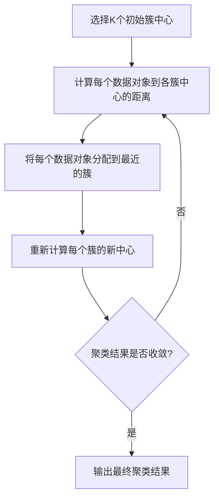
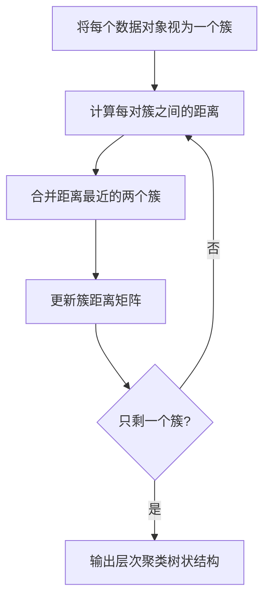
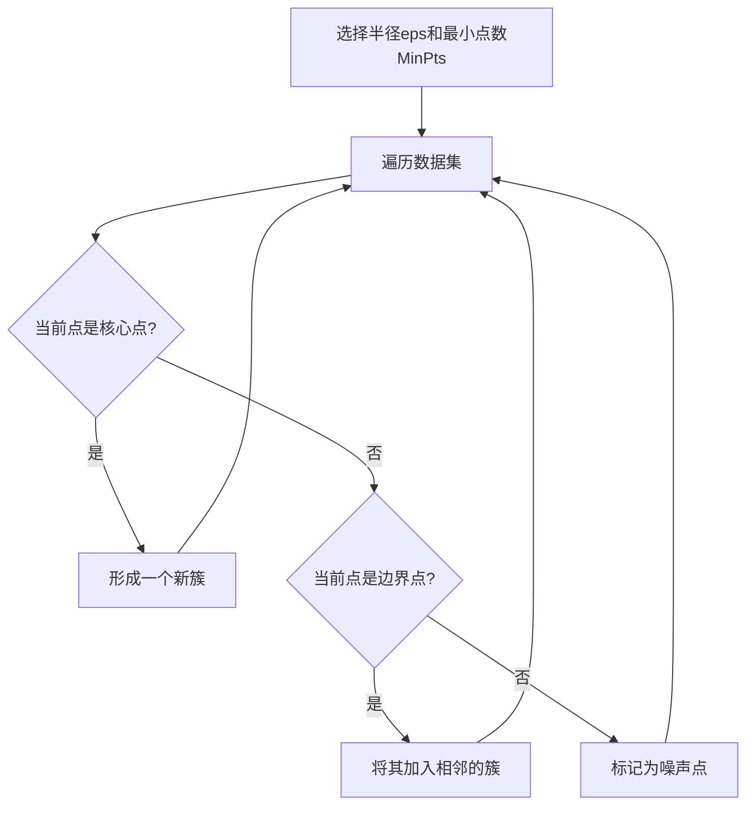

# 聚类算法(Clustering Algorithms) - 原理与代码实例讲解

## 1. 背景介绍

### 1.1 什么是聚类?

聚类(Clustering)是一种无监督学习技术,旨在将数据集中的对象划分为多个"簇"(Clusters)。每个簇由相似的对象组成,而不同簇之间的对象应该存在明显差异。聚类广泛应用于多个领域,如计算机科学、人工智能、生物信息学、图像分析、网页挖掘等。

### 1.2 聚类的应用场景

- 客户细分(Customer Segmentation)
- 异常检测(Anomaly Detection) 
- 文档分类(Document Clustering)
- 图像分割(Image Segmentation)
- 基因序列分析(Gene Sequence Analysis)

### 1.3 聚类算法分类

聚类算法可分为以下几种主要类型:

- 原型聚类(Prototype-based Clustering)
- 层次聚类(Hierarchical Clustering)
- 密度聚类(Density-based Clustering) 
- 基于网格的聚类(Grid-based Clustering)
- 基于模型的聚类(Model-based Clustering)

## 2. 核心概念与联系

### 2.1 相似度度量

相似度度量是聚类算法的核心概念之一,用于量化数据对象之间的相似程度。常用的相似度度量包括:

- 欧几里得距离(Euclidean Distance)
- 曼哈顿距离(Manhattan Distance)
- 余弦相似度(Cosine Similarity)
- 杰卡德相似系数(Jaccard Similarity Coefficient)

### 2.2 聚类质量评估

聚类质量评估是评判聚类结果的重要标准,常用指标包括:

- 簇内平方和(Intra-Cluster Sum of Squares)
- 轮廓系数(Silhouette Coefficient)
- 戴维斯-布丁指数(Davies-Bouldin Index)
- 卡林斯基-哈拉巴斯指数(Calinski-Harabasz Index)

### 2.3 聚类算法关键步骤

大多数聚类算法遵循以下关键步骤:

1. 选择合适的相似度度量
2. 创建初始聚类
3. 迭代优化聚类
4. 评估聚类质量

## 3. 核心算法原理具体操作步骤

### 3.1 K-Means聚类

K-Means是最流行的原型聚类算法之一,其核心思想是将数据划分为K个簇,每个数据对象属于离其最近的簇中心。算法步骤如下:



### 3.2 层次聚类

层次聚类根据聚类的方式可分为自底向上(Agglomerative)和自顶向下(Divisive)两种方法。以Agglomerative为例,算法步骤如下:



### 3.3 DBSCAN聚类 

DBSCAN是一种基于密度的聚类算法,能够发现任意形状的簇,并有效处理噪声数据。算法步骤如下:



## 4. 数学模型和公式详细讲解举例说明

### 4.1 K-Means目标函数

K-Means算法的目标是最小化所有簇的总离差平方和(Total Intra-Cluster Sum of Squares):

$$J = \sum_{i=1}^{K}\sum_{x \in C_i} \left \| x - \mu_i \right \|^2$$

其中:
- $K$是簇的数量
- $C_i$是第$i$个簇
- $\mu_i$是第$i$个簇的均值向量(质心)
- $\left \| x - \mu_i \right \|$是数据点$x$到簇$i$质心的欧几里得距离

通过迭代优化,算法逐步减小目标函数值,直至收敛。

### 4.2 层次聚类距离度量

层次聚类中,需要定义簇间距离的度量方式。常用的有:

- 单链接(Single Linkage): $d(C_i, C_j) = \min_{x \in C_i, y \in C_j} d(x, y)$
- 完全链接(Complete Linkage): $d(C_i, C_j) = \max_{x \in C_i, y \in C_j} d(x, y)$ 
- 组均值链接(Group Average Linkage): $d(C_i, C_j) = \frac{1}{n_i n_j} \sum_{x \in C_i}\sum_{y \in C_j} d(x, y)$

其中$d(x, y)$是数据点$x$和$y$之间的距离。

### 4.3 DBSCAN核心概念

DBSCAN算法中有三个核心概念:

- 核心点(Core Point): 在半径$\epsilon$范围内至少有$MinPts$个点的点
- 边界点(Border Point): 不是核心点,但在某个核心点的$\epsilon$邻域内的点
- 噪声点(Noise Point): 既不是核心点也不是边界点的点

簇由核心点及其可达边界点组成,噪声点被视为异常值剔除。

## 5. 项目实践: 代码实例和详细解释说明

以下是使用Python的scikit-learn库实现K-Means聚类的示例代码:

```python
from sklearn.cluster import KMeans
import numpy as np

# 生成示例数据
X = np.array([[1, 2], [1, 4], [1, 0],
              [10, 2], [9, 3], [10, 5]])

# 初始化KMeans
kmeans = KMeans(n_clusters=2, random_state=0)

# 训练模型
kmeans.fit(X)

# 获取聚类标签
labels = kmeans.labels_

# 获取簇中心
centroids = kmeans.cluster_centers_

print("Cluster Labels:", labels)
print("Centroids:", centroids)
```

代码解释:

1. 导入KMeans类和NumPy库
2. 创建示例数据集X,包含6个二维数据点
3. 初始化KMeans对象,设置簇数为2
4. 在数据集X上训练KMeans模型
5. 获取每个数据点的簇标签
6. 获取每个簇的质心坐标
7. 打印聚类结果和簇质心

输出:

```
Cluster Labels: [1 1 1 0 0 0]
Centroids: [[ 9.66666667  3.33333333]
            [ 1.          2.        ]]
```

可以看到,数据点被划分为两个簇,每个簇的质心坐标也被成功计算出来。

## 6. 实际应用场景

聚类算法在现实世界中有广泛的应用,包括但不限于:

### 6.1 客户细分

电子商务公司可以使用聚类算法根据客户的购买模式、兴趣爱好等特征,将客户划分为不同的细分市场,从而制定有针对性的营销策略。

### 6.2 基因序列分析

在生物信息学领域,聚类算法可用于分析基因序列数据,识别具有相似功能或结构的基因簇。这对于基因组学研究和药物开发具有重要意义。

### 6.3 网络入侵检测

通过聚类网络流量数据,可以发现异常的网络活动模式,从而检测潜在的网络入侵行为。

### 6.4 图像分割

在计算机视觉领域,聚类算法常用于将图像像素划分为不同的簇,实现图像分割和对象识别。

### 6.5 推荐系统

电影、音乐等推荐系统可以利用聚类算法根据用户的历史偏好,将用户划分为不同的兴趣群体,从而提供个性化的推荐内容。

## 7. 工具和资源推荐

以下是一些流行的聚类算法工具和学习资源:

### 7.1 Python库

- scikit-learn: 机器学习库,提供多种聚类算法实现
- pyclustering: 专门的聚类算法库,包含多种先进的聚类算法

### 7.2 R包

- cluster: 提供常用的聚类算法,如K-Means、层次聚类等
- fpc: 实现了众多模糊聚类算法

### 7.3 在线课程

- 吴恩达机器学习课程(Coursera)
- 斯坦福大学聚类算法课程(Coursera)

### 7.4 书籍

- 《模式分类》(Pattern Classification)
- 《数据挖掘:概念与技术》(Data Mining: Concepts and Techniques)

## 8. 总结: 未来发展趋势与挑战

聚类算法在过去几十年中取得了长足的进展,但仍面临一些挑战和发展方向:

### 8.1 大规模数据集

随着数据量的快速增长,如何在可接受的时间和计算资源内对大规模数据集进行高效聚类,是一个亟待解决的问题。

### 8.2 高维数据

许多现实世界的数据集都具有高维特征,传统的聚类算法在高维空间中可能表现不佳。发展能够有效处理高维数据的聚类算法是一个重要方向。

### 8.3 异构数据聚类

现有的大多数聚类算法都假设数据是同质的,但现实中的数据通常是异构的,包含不同类型的属性(如数值型、类别型等)。发展能够处理异构数据的聚类算法是一个挑战。

### 8.4 集成聚类

单一的聚类算法可能无法很好地适应所有数据集,集成多种聚类算法的思路值得探索,以提高聚类性能和稳健性。

### 8.5 可解释性

随着机器学习模型变得越来越复杂,提高聚类算法的可解释性,使得结果更容易被人类理解和解释,是一个重要的发展方向。

## 9. 附录: 常见问题与解答

### 9.1 如何选择合适的聚类算法?

选择聚类算法时,需要考虑以下几个因素:

- 数据集的大小和维度
- 数据分布的特点(是否有噪声、异常值等)
- 所需的聚类形状(球形、任意形状等)
- 计算资源和时间限制
- 可解释性需求

通常可以先尝试几种常用算法,评估其性能,再选择最合适的一种。

### 9.2 如何确定最佳簇数K?

没有放之四射的方法可以确定最佳簇数K,通常需要尝试不同的K值,并根据某些评估指标(如轮廓系数、离差平方和等)选择最优值。也可以使用启发式方法,如肘部法则(Elbow Method)。

### 9.3 聚类算法如何处理异常值?

大多数聚类算法对异常值比较敏感。一种常见的做法是先进行异常值检测和去除,再进行聚类。另一种方法是使用能够自动识别异常值的算法,如DBSCAN。

### 9.4 如何评估聚类结果的质量?

可以使用多种内部和外部评估指标来评估聚类质量,如:

- 内部指标:簇内平方和、轮廓系数等
- 外部指标(需要已知真实标签):纯度(Purity)、兰德指数(Rand Index)等

没有放之四射的评估方法,需要根据具体场景选择合适的指标。

### 9.5 聚类算法如何处理高维数据?

高维数据容易导致"维数灾难"问题,传统算法可能表现不佳。可以尝试以下策略:

- 特征选择或降维技术(如PCA)