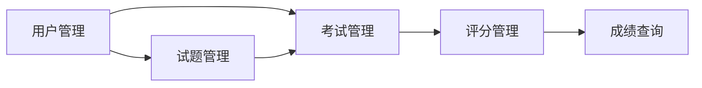

# 计算机等级考试系统设计与实现

## 1. 背景介绍

### 1.1 计算机等级考试的重要性

计算机等级考试是评估个人计算机应用能力的重要标准之一。通过参加计算机等级考试，考生可以检验自己的计算机知识和实际操作技能，获得相应的等级证书，为今后的学习、就业和发展奠定良好的基础。

### 1.2 传统考试方式的局限性

传统的计算机等级考试通常采用纸笔考试的形式，存在以下几个方面的局限性：

1. 考试效率低：纸质试卷的发放、收集和评阅过程耗时较长，考试组织和管理工作量大。
2. 评分主观性强：人工阅卷容易受主观因素影响，评分标准难以统一。
3. 反馈不及时：考生无法在考试结束后立即获得成绩和反馈信息。
4. 资源浪费：纸质试卷的印刷和存储会消耗大量的纸张和空间资源。

### 1.3 计算机考试系统的优势

为了克服传统考试方式的局限性，开发一个基于计算机的考试系统具有以下优势：

1. 提高考试效率：实现试题的自动生成、分发和评阅，减少人工操作环节。
2. 保证评分客观性：通过预设的评分规则和算法，确保评分的公平性和一致性。
3. 即时反馈：考生可以在考试结束后立即查看成绩和答案解析，便于及时调整学习策略。
4. 节约资源：无需印刷和存储纸质试卷，减少资源消耗和环境影响。

## 2. 核心概念与联系

### 2.1 考试系统的核心组成

一个完整的计算机等级考试系统通常包括以下几个核心组成部分：

1. 用户管理模块：负责管理考生、管理员等用户的信息和权限。
2. 试题管理模块：负责试题的录入、编辑、审核和存储。
3. 考试管理模块：负责考试的创建、发布、监控和结束。
4. 评分管理模块：负责考生答卷的自动评阅和成绩计算。
5. 成绩查询模块：负责考生成绩的查询和统计分析。

### 2.2 各模块之间的关系

考试系统的各个模块之间存在着紧密的联系和协作关系，如下图所示：



用户管理模块为试题管理和考试管理提供用户身份验证和权限控制支持。试题管理模块为考试管理提供题库资源。考试管理模块依赖于用户管理和试题管理，负责组织和调度考试流程。评分管理模块对考生提交的答卷进行自动评阅，并将成绩结果传递给成绩查询模块进行展示和分析。

## 3. 核心算法原理具体操作步骤

### 3.1 试题随机抽取算法

为了保证考试的公平性和防止作弊，考试系统需要从题库中随机抽取试题组成试卷。常见的试题随机抽取算法包括：

1. 简单随机抽取：从题库中等概率地随机选择指定数量的试题。
2. 分层随机抽取：按照试题难度、类型等属性将题库分层，再从各层中等概率随机抽取试题。
3. 加权随机抽取：根据试题的重要性、使用频率等因素设置权重，按权重概率抽取试题。

以分层随机抽取为例，具体操作步骤如下：

1. 将题库按照难度分为简单、中等、困难三个层次。
2. 确定每个难度层次的抽取比例，例如简单:中等:困难=4:4:2。
3. 计算每个层次需要抽取的试题数量。
4. 对每个层次分别进行等概率随机抽取，得到各层次的试题子集。
5. 将各层次的试题子集合并，形成最终的试卷。

### 3.2 自动评分算法

考试系统需要根据预设的答案和评分规则对考生提交的答卷进行自动评阅和打分。常见的自动评分算法包括：

1. 关键词匹配：根据答案中的关键词出现的频率和位置计算得分。
2. 语义相似度匹配：利用自然语言处理技术，计算答案与标准答案的语义相似度。
3. 规则匹配：根据预设的正则表达式、语法规则等判断答案的正确性。

以关键词匹配为例，具体操作步骤如下：

1. 对标准答案进行分词，提取关键词及其权重。
2. 对考生答案进行分词，统计关键词出现的频率。
3. 计算关键词匹配得分，公式为：
   $$score=\sum_{i=1}^{n} frequency_i \times weight_i$$
   其中，$n$为关键词数量，$frequency_i$为第$i$个关键词出现的频率，$weight_i$为第$i$个关键词的权重。
4. 根据关键词匹配得分和其他评分规则综合计算最终得分。

## 4. 数学模型和公式详细讲解举例说明

在考试系统中，可以使用数学模型和公式来描述和优化某些功能模块。以下是两个常见的数学模型：

### 4.1 试题难度模型

试题难度是影响考试质量和区分度的重要因素。可以使用Item Response Theory (IRT)中的Rasch模型来估计试题难度。Rasch模型的数学表达式为：

$$P(\theta)=\frac{e^{\theta-b}}{1+e^{\theta-b}}$$

其中，$P(\theta)$表示能力水平为$\theta$的考生答对该试题的概率，$b$为试题难度参数。通过收集考生的作答数据，可以使用最大似然估计等方法估计出每个试题的难度参数$b$。

例如，假设一个试题的难度参数$b=1.5$，考生的能力水平$\theta=1$，则该考生答对该试题的概率为：

$$P(1)=\frac{e^{1-1.5}}{1+e^{1-1.5}}=0.38$$

可见，试题难度越高，考生答对的概率越低。

### 4.2 考试时长预估模型

为了合理安排考试时间，可以使用线性回归模型来预估考生完成试卷所需的时间。假设有$n$个考生的历史考试数据，包括试卷题目数量$x_i$和完成时间$y_i$，则可以建立如下的线性回归模型：

$$y=ax+b$$

其中，$a$为回归系数，$b$为截距。使用最小二乘法估计参数$a$和$b$：

$$a=\frac{\sum_{i=1}^{n}(x_i-\bar{x})(y_i-\bar{y})}{\sum_{i=1}^{n}(x_i-\bar{x})^2}$$

$$b=\bar{y}-a\bar{x}$$

其中，$\bar{x}$和$\bar{y}$分别为$x_i$和$y_i$的平均值。

例如，通过历史数据估计出回归参数$a=2$，$b=30$，则对于一张包含50道题的试卷，预估的考试时长为：

$$y=2 \times 50+30=130 \text{(min)}$$

即该试卷的预估考试时长为130分钟。

## 5. 项目实践：代码实例和详细解释说明

下面以Python语言为例，展示考试系统中的部分核心功能代码实现。

### 5.1 试题随机抽取

```python
import random

def random_select_questions(question_bank, num_questions):
    """
    从题库中随机抽取指定数量的试题
    :param question_bank: 题库列表
    :param num_questions: 抽取试题数量
    :return: 选中的试题列表
    """
    selected_questions = random.sample(question_bank, num_questions)
    return selected_questions
```

该函数使用`random.sample()`方法从题库列表`question_bank`中随机抽取`num_questions`个试题，并返回选中的试题列表。

### 5.2 自动评分

```python
import jieba

def keyword_score(standard_answer, user_answer):
    """
    基于关键词匹配的自动评分
    :param standard_answer: 标准答案
    :param user_answer: 考生答案
    :return: 评分结果
    """
    # 对标准答案进行分词
    standard_keywords = jieba.lcut(standard_answer)
    # 对考生答案进行分词
    user_keywords = jieba.lcut(user_answer)
    
    # 计算关键词匹配得分
    score = 0
    for keyword in standard_keywords:
        if keyword in user_keywords:
            score += 1
    
    return score / len(standard_keywords)
```

该函数使用jieba分词库对标准答案和考生答案进行分词，然后统计考生答案中匹配标准答案关键词的数量，计算关键词匹配得分。得分公式为：

$$score=\frac{matched\_keywords}{total\_keywords}$$

其中，$matched\_keywords$为匹配的关键词数量，$total\_keywords$为标准答案的关键词总数。

### 5.3 成绩查询

```python
def query_score(user_id, exam_id, cursor):
    """
    查询考生成绩
    :param user_id: 考生ID
    :param exam_id: 考试ID
    :param cursor: 数据库游标
    :return: 考生成绩
    """
    # 查询考生成绩
    query = "SELECT score FROM user_exam WHERE user_id=%s AND exam_id=%s"
    cursor.execute(query, (user_id, exam_id))
    result = cursor.fetchone()
    
    if result:
        return result[0]
    else:
        return None
```

该函数使用SQL查询语句从数据库中查询指定考生在指定考试中的成绩。如果查询结果存在，则返回成绩值；否则返回None。

## 6. 实际应用场景

计算机等级考试系统可以应用于以下几个实际场景：

1. 学校和培训机构：用于组织学生进行计算机等级考试，评估学生的计算机应用能力。
2. 企业和事业单位：用于对员工进行计算机技能测评，作为招聘、晋升和绩效考核的依据。
3. 政府和行业协会：用于举办全国或行业范围内的计算机等级认证考试，促进计算机应用能力的提升。
4. 在线教育平台：用于为学员提供在线模拟考试和能力评估服务，提高学习效果和用户体验。

## 7. 工具和资源推荐

以下是一些开发计算机等级考试系统时常用的工具和资源：

1. 编程语言：Python、Java、C#等。
2. Web框架：Django、Spring Boot、ASP.NET等。
3. 数据库：MySQL、PostgreSQL、Oracle等。
4. 前端技术：HTML、CSS、JavaScript、Vue.js、React等。
5. 自然语言处理库：jieba、NLTK、Stanford CoreNLP等。
6. 数学和科学计算库：NumPy、SciPy、MATLAB等。
7. 机器学习和深度学习框架：TensorFlow、PyTorch、scikit-learn等。
8. 开源考试系统项目：Quiz-Master、Exam-Plus、Online-Exam-System等。

## 8. 总结：未来发展趋势与挑战

随着计算机技术的不断发展和应用领域的不断拓展，计算机等级考试系统也面临着新的发展趋势和挑战：

1. 智能化：利用人工智能技术，实现试题自动生成、智能评分和个性化推荐等功能，提高考试的智能化水平。
2. 移动化：支持移动设备（如手机、平板）上的考试，提供更加灵活和便捷的考试体验。
3. 云化：将考试系统部署在云平台上，实现资源的弹性扩展和按需分配，降低运维成本。
4. 安全性：加强考试系统的安全防护，防止考试作弊、数据泄露等安全风险。
5. 标准化：制定计算机等级考试的标准和规范，促进考试内容和评价体系的统一和规范化。

未来，计算机等级考试系统将朝着更加智能、移动、云化、安全和标准化的方向发展，为考生提供更加高效、公平和优质的考试服务。同时，也需要不断应对技术变革、安全挑战和标准制定