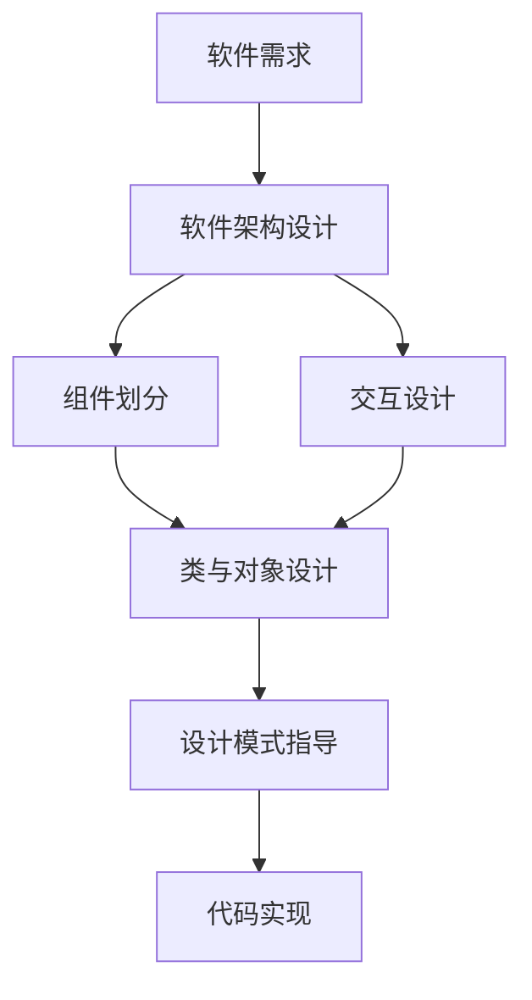

# 设计模式与软件架构原理与代码实战案例讲解

## 1.背景介绍

### 1.1 软件设计的复杂性不断增加

在当今软件开发领域,软件系统的规模和复杂性都在不断增长。开发人员面临着巨大的挑战,需要设计出高质量、可维护、可扩展的软件系统。然而,许多软件项目在开发过程中遇到了种种困难,代码质量低下、难以维护、扩展性差等问题层出不穷。

### 1.2 设计模式和软件架构的重要性

为了应对软件开发的复杂性,设计模式和软件架构应运而生。设计模式是前人总结出的一套解决特定问题的最佳实践。它们提供了经过验证的解决方案,使得开发人员能够避免重复造轮子,提高开发效率和代码质量。软件架构则关注系统的整体结构和组件之间的交互,它决定了系统的性能、可伸缩性、可维护性等关键特性。

### 1.3 本文的目标和内容安排

本文将深入探讨设计模式与软件架构的原理,并结合实际的代码案例进行讲解。通过学习本文,读者将掌握常见的设计模式,了解如何应用它们解决实际问题；同时也将学习软件架构设计的基本原则和方法,提升架构设计能力。

本文的内容安排如下:

- 第2部分:介绍设计模式和软件架构的核心概念,阐述它们之间的联系。
- 第3部分:详细讲解几种常见设计模式的原理和具体操作步骤。
- 第4部分:介绍软件架构设计涉及的数学模型和公式,并举例说明。  
- 第5部分:通过代码实例,演示如何应用设计模式和架构原则指导项目实践。
- 第6部分:列举设计模式和软件架构在实际应用场景中的案例。
- 第7部分:推荐一些有助于深入学习设计模式和软件架构的工具和资源。
- 第8部分:展望设计模式和软件架构未来的发展趋势,分析面临的挑战。
- 第9部分:附录,解答一些常见问题。

## 2.核心概念与联系

### 2.1 设计模式的定义和分类

设计模式(Design Pattern)是一套被反复使用、多数人知晓的、经过分类编目的、代码设计经验的总结。使用设计模式是为了可重用代码、让代码更容易被他人理解并且保证代码可靠性。

设计模式一般分为三大类:

- 创建型模式:提供创建对象的机制,增加已有代码的灵活性和可复用性。
- 结构型模式:介绍如何将对象和类组装成较大的结构,并同时保持结构的灵活和高效。
- 行为型模式:负责对象间的高效沟通和职责委派。

### 2.2 软件架构的定义和目标

软件架构是有关软件整体结构与组件的抽象描述,用于指导大型软件系统各个方面的设计。软件架构涉及顶层结构、不同组件间的交互关系、组件的职责划分、用户与系统的交互等诸多方面。

软件架构设计的主要目标包括:
- 功能性:满足系统的功能需求。
- 性能:满足响应时间、吞吐量等指标。
- 可伸缩性:能够通过添加资源提升系统性能。
- 可维护性:系统要易于理解、修改和扩展。
- 安全性:控制对系统和数据的访问。
- 可靠性:最小化系统故障,保证数据一致性。

### 2.3 二者之间的关系

设计模式和软件架构是软件设计领域两个密切相关的概念。设计模式主要解决代码层面的问题,例如对象创建、对象组合、算法封装等；而软件架构关注的是系统顶层的结构划分和组件职责。

在软件开发过程中,我们往往先进行顶层的架构设计,确定系统的整体结构和关键组件。在具体的代码实现阶段,再使用设计模式指导类和对象的设计,提高代码的复用性和灵活性。可以说,软件架构为设计模式的使用提供了上下文环境。

下图展示了软件架构和设计模式在软件设计中的作用:

从图中可以看出,软件架构设计是顶层设计,主要包括组件划分和交互设计两大块。组件划分完成后,再进行类与对象的设计。这时,我们就可以借助设计模式的经验和最佳实践来指导代码实现,提高代码质量。

## 3.核心算法原理具体操作步骤

在本节中,我们将详细讲解几种常见的设计模式,包括它们的原理、结构、优缺点以及具体的实现步骤。

### 3.1 单例模式

#### 3.1.1 模式介绍
单例模式(Singleton Pattern)是一种创建型设计模式,它确保一个类只有一个实例,并提供一个全局访问点。当一个类负责创建自己的对象时,就可以考虑使用单例模式。

#### 3.1.2 模式结构
单例模式的主要角色如下:
- Singleton:负责创建单例,并提供一个访问该单例的全局节点。

#### 3.1.3 实现步骤
以下是实现单例模式的一般步骤:
1. 构造函数设为私有,禁止外部直接实例化。
2. 提供一个静态方法或属性,用于返回单例对象。
3. 确保单例类只被实例化一次,可以在静态方法中添加判断逻辑。

#### 3.1.4 优缺点分析
单例模式的主要优点如下:
- 对唯一实例的受控访问。
- 缩小命名空间,减少全局变量。
- 允许可变数目的实例。
- 更灵活的控制实例创建过程。

但是它也有一些缺点:
- 扩展很困难,通常需要修改代码。
- 单例类职责过重,在一定程度上违背了"单一职责原则"。
- 滥用单例将带来一些负面问题,如对代码的理解和维护。

### 3.2 观察者模式

#### 3.2.1 模式介绍
观察者模式(Observer Pattern)是一种行为型设计模式,它定义了一种一对多的依赖关系,让多个观察者对象同时监听某一个主题对象。这个主题对象在状态变化时,会通知所有的观察者对象,使它们能够自动更新自己。

#### 3.2.2 模式结构
观察者模式涉及如下角色:
- Subject:抽象主题,提供注册和删除观察者对象的接口。
- ConcreteSubject:具体主题,状态发生变化时通知所有注册的观察者。
- Observer:抽象观察者,定义一个更新接口,当主题状态改变时更新自己。
- ConcreteObserver:具体观察者,实现抽象观察者的更新接口。

#### 3.2.3 实现步骤
实现观察者模式的一般步骤如下:
1. 定义 Subject 和 Observer 接口。
2. 实现具体的主题类和观察者类。  
3. 在具体主题类中添加 attach、detach、notify 等方法。
4. 在具体观察者类中实现 update 方法。
5. 客户端创建主题和观察者,并注册观察者到主题。

#### 3.2.4 优缺点分析
观察者模式的主要优点包括:
- 实现表示层和数据逻辑层的分离。 
- 支持简单的广播通信。
- 符合开闭原则,新增具体观察者无需修改原有代码。

它的主要缺点如下:  
- 如果一个主题对象有很多直接和间接观察者,将所有的观察者通知到会花费很多时间。
- 如果在观察者和观察目标之间有循环依赖,可能导致系统崩溃。
- 没有相应的机制让观察者知道所观察的目标对象是怎么发生变化的。

### 3.3 策略模式

#### 3.3.1 模式介绍
策略模式(Strategy Pattern)是一种行为型设计模式,它定义了一系列算法,并将每个算法封装起来,使它们可以相互替换。策略模式让算法可以独立于使用它的客户端而变化。

#### 3.3.2 模式结构 
策略模式涉及如下角色:
- Strategy:抽象策略,定义所有支持的算法的公共接口。
- ConcreteStrategy:具体策略,实现 Strategy 定义的接口。
- Context:上下文,维护一个对 Strategy 对象的引用,定义一个接口来让 Strategy 访问它的数据。

#### 3.3.3 实现步骤
实现策略模式的一般步骤如下:
1. 定义一个 Strategy 接口,声明一个算法的方法。
2. 定义一组实现 Strategy 接口的 ConcreteStrategy 类。
3. 定义 Context 类,内部维护一个 Strategy 引用。 
4. Context 类对外提供设置和调用 Strategy 的方法。
5. 客户端创建 Context 对象,并设置具体的 Strategy。

#### 3.3.4 优缺点分析
策略模式的主要优点如下:
- 提供了管理相关算法簇的办法。
- 提供了可以替换继承关系的办法。
- 可以避免使用多重条件转移语句。
- 使用策略模式可以提高算法的保密性和安全性。

策略模式的缺点主要有:
- 客户端必须知道所有的策略类,并自行决定使用哪一个策略类。
- 策略模式造成很多的策略类,增加维护难度。

## 4.数学模型和公式详细讲解举例说明

在软件架构设计中,我们经常借助一些数学模型和公式来评估系统的性能、可靠性、可扩展性等指标。下面我们介绍几个常用的数学模型。

### 4.1 排队论模型

排队论是研究排队现象的数学理论,广泛应用于服务系统的建模和性能分析。一个典型的排队模型可以表示为:A/B/c/K/N/D。其中:
- A:到达时间分布,如 M(马尔科夫)、D(确定)、G(一般)等。
- B:服务时间分布。
- c:服务台个数。
- K:系统容量,即系统中最多允许存在的顾客数。
- N:顾客源个数,即潜在的顾客数。
- D:服务规则,如 FCFS(先来先服务)、LCFS(后来先服务)等。

举例来说,M/M/1/∞/∞ 表示一个具有指数到达时间分布、指数服务时间分布、单个服务台、无限排队长度、顾客源个数无限的排队模型。

在该模型中,我们可以计算一些重要的性能指标,如:
- 系统中平均顾客数:$L=\frac{\rho}{1-\rho}$
- 平均排队长度:$L_q=\frac{\rho^2}{1-\rho}$  
- 平均逗留时间:$W=\frac{1}{\mu(1-\rho)}$
- 平均等待时间:$W_q=\frac{\rho}{\mu(1-\rho)}$

其中,$\rho=\frac{\lambda}{\mu}$,表示服务强度。$\lambda$ 是平均到达率,$\mu$ 是平均服务率。

### 4.2 可靠性模型

可靠性是指系统在规定时间内和规定条件下完成规定功能的概率。我们常用连续时间马尔可夫链(CTMC)来建模系统的可靠性。

假设系统有 n 个状态,状态 i 到状态 j 的转移速率为 $q_{ij}$。我们可以得到状态转移速率矩阵 Q:

$$
Q=\begin{bmatrix}
q_{11} & q_{12} & \cdots & q_{1n}\\
q_{21} & q_{22} & \cdots & q_{2n}\\
\vdots & \vdots & \ddots & \vdots\\
q_{n1} & q_{n2} & \cdots & q_{nn}