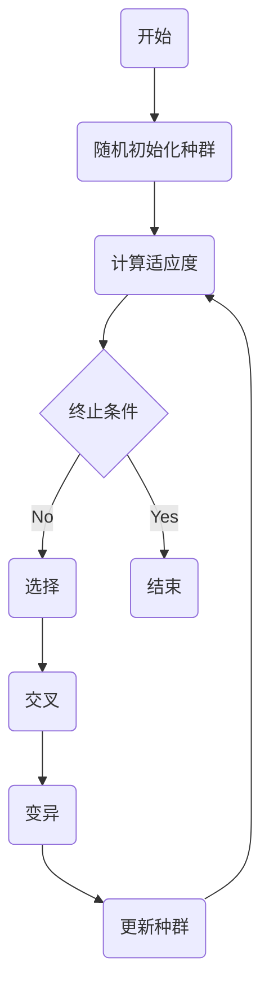

## 1.背景介绍

遗传算法是一种通过模拟自然界中生物的进化过程来解决优化问题的搜索算法。它的灵感来源于达尔文的进化论，通过模拟生物进化过程中的选择、交叉和变异等操作来进行全局搜索。自1975年由荷兰科学家John Holland首次提出以来，遗传算法已在许多领域得到了成功的应用，包括函数优化、机器学习、调度问题、路径规划等。

## 2.核心概念与联系

遗传算法的主要组成部分包括：编码、适应度函数、选择、交叉、变异和解码。

- **编码**：将问题的解表示为染色体，通常使用二进制编码。
- **适应度函数**：评估染色体的适应度，即解的质量。
- **选择**：根据适应度选择染色体进行繁殖。
- **交叉**：模拟生物的交配过程，两个染色体交换部分基因，产生新的染色体。
- **变异**：模拟生物的突变过程，随机改变染色体的部分基因。
- **解码**：将染色体解码为问题的解。

这些操作形成了遗传算法的主要流程，如下图所示：



## 3.核心算法原理具体操作步骤

遗传算法的具体操作步骤如下：

1. **随机初始化种群**：随机生成一定数量的染色体，形成初始种群。
2. **计算适应度**：使用适应度函数评估每个染色体的适应度。
3. **选择**：根据染色体的适应度进行选择，适应度高的染色体被选择的概率更高。
4. **交叉**：随机选择两个染色体进行交叉，生成两个新的染色体。
5. **变异**：以一定的概率随机改变染色体的部分基因。
6. **更新种群**：将新生成的染色体替换掉原来种群中适应度低的染色体。
7. **终止条件**：如果达到了预设的终止条件（如迭代次数、适应度阈值等），则结束算法，否则返回第2步。

## 4.数学模型和公式详细讲解举例说明

遗传算法的数学模型可以用以下的公式来描述：

设 $x = (x_1, x_2, ..., x_n)$ 是一个染色体，$f(x)$ 是适应度函数，$p(x)$ 是染色体 $x$ 被选择的概率，则有

$$
p(x) = \frac{f(x)}{\sum_{i=1}^{n} f(x_i)}
$$

这是一个简单的轮盘赌选择策略，适应度高的染色体被选择的概率更高。

交叉和变异操作可以用以下的公式来描述：

设 $x = (x_1, x_2, ..., x_n)$ 和 $y = (y_1, y_2, ..., y_n)$ 是两个染色体，$c$ 是一个随机选择的交叉点，那么交叉操作可以表示为

$$
x' = (x_1, x_2, ..., x_c, y_{c+1}, ..., y_n)
$$

$$
y' = (y_1, y_2, ..., y_c, x_{c+1}, ..., x_n)
$$

设 $x = (x_1, x_2, ..., x_n)$ 是一个染色体，$m$ 是一个随机选择的变异点，那么变异操作可以表示为

$$
x' = (x_1, ..., x_{m-1}, 1-x_m, x_{m+1}, ..., x_n)
$$

## 5.项目实践：代码实例和详细解释说明

下面是一个使用Python实现的简单遗传算法的例子，用于解决一元函数优化问题。

```python
import numpy as np

# 适应度函数
def fitness(x):
    return -x**2

# 初始化种群
np.random.seed(1)
population = np.random.randint(0, 2, (10, 10))

for generation in range(100):
    # 计算适应度
    fitness_values = np.array([fitness(int("".join(map(str, individual)), 2)) for individual in population])
    
    # 选择
    parents_index = np.random.choice(range(10), size=10, p=fitness_values/np.sum(fitness_values))
    parents = population[parents_index]
    
    # 交叉
    crossover_point = np.random.randint(0, 10, size=5)
    for i in range(0, 10, 2):
        parents[i, crossover_point[i//2]:], parents[i+1, crossover_point[i//2]:] = parents[i+1, crossover_point[i//2]:].copy(), parents[i, crossover_point[i//2]:].copy()
    
    # 变异
    mutation_points = np.random.randint(0, 10, size=2)
    for i in range(2):
        parents[i, mutation_points[i]] = 1 - parents[i, mutation_points[i]]
    
    # 更新种群
    population = parents

# 输出最优解
best_individual = population[np.argmax(fitness_values)]
print("Best solution: ", int("".join(map(str, best_individual)), 2))
```

这段代码首先初始化一个种群，然后进行100次迭代。在每次迭代中，它先计算每个个体的适应度，然后进行选择、交叉和变异操作，最后更新种群。最后，它输出适应度最高的个体作为最优解。

## 6.实际应用场景

遗传算法在许多领域都有应用，以下是一些成功的案例：

- **函数优化**：遗传算法可以用于找到函数的全局最优解，例如上面的一元函数优化问题。
- **机器学习**：遗传算法可以用于特征选择、超参数优化等任务，提升机器学习模型的性能。
- **调度问题**：遗传算法可以用于解决车辆路径问题、作业排程问题等调度问题。
- **路径规划**：遗传算法可以用于解决旅行商问题、最短路径问题等路径规划问题。

## 7.工具和资源推荐

以下是一些有用的遗传算法相关的工具和资源：

- **DEAP**：一个用于进化计算的Python库，包括遗传算法、遗传编程、演化策略等多种进化算法。
- **PyGAD**：一个用于遗传算法的Python库，易于使用，功能强大。
- **遗传算法入门**：一本介绍遗传算法基础知识的书籍，适合初学者。

## 8.总结：未来发展趋势与挑战

遗传算法作为一种全局优化算法，已经在许多领域得到了成功的应用。然而，它也面临一些挑战，例如收敛速度慢、易陷入局部最优、参数调整困难等问题。未来的发展趋势可能会朝着改进算法性能、结合其他优化算法、应用于更复杂问题等方向进行。

## 9.附录：常见问题与解答

**问：遗传算法总是能找到全局最优解吗？**

答：不一定。遗传算法是一种启发式的全局优化算法，它的目标是找到全局最优解，但并不能保证总是能找到全局最优解。实际上，遗传算法有可能陷入局部最优。

**问：如何选择遗传算法的参数？**

答：遗传算法的参数通常需要通过实验来调整，包括种群大小、交叉概率、变异概率等。一般来说，种群大小越大，算法的全局搜索能力越强，但计算量也越大；交叉概率和变异概率的选择需要在保持多样性和保持优良性之间找到平衡。

**问：遗传算法和其他优化算法相比有什么优势？**

答：遗传算法的主要优势在于其全局搜索能力，它能在整个解空间中进行搜索，而不是仅在某个局部区域进行搜索。因此，遗传算法更适合于解决那些存在多个局部最优解的复杂优化问题。

作者：禅与计算机程序设计艺术 / Zen and the Art of Computer Programming