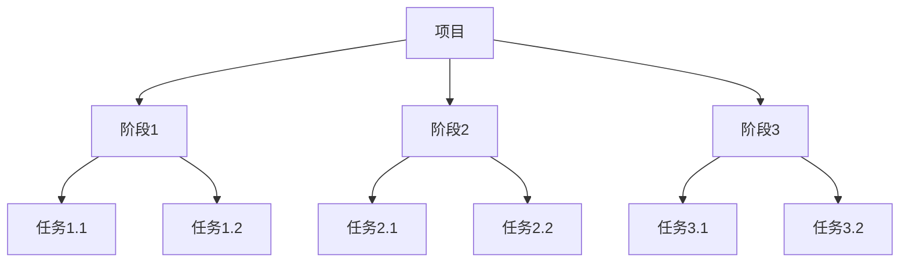
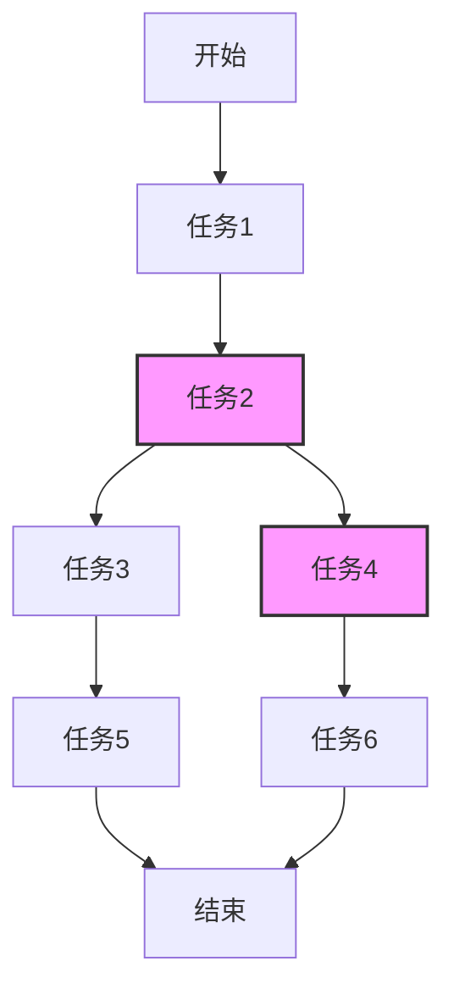
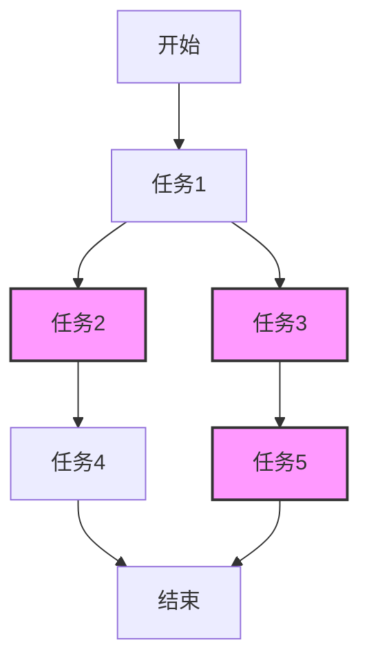
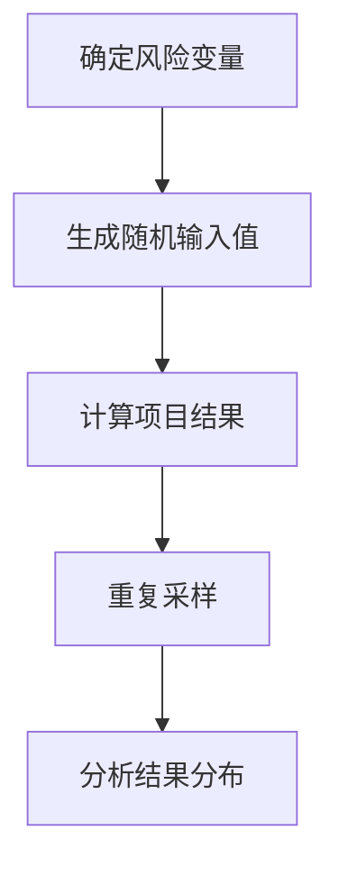

# 项目进度跟踪与风险管控原理与代码实战案例讲解

## 1.背景介绍

### 1.1 项目管理的重要性

在当今快节奏的商业环境中,有效的项目管理对于确保项目按时、按质、按预算交付至关重要。项目进度跟踪和风险管控是项目管理的两个关键环节,它们共同确保项目能够顺利推进,并最大限度地降低潜在风险。

### 1.2 项目进度跟踪

项目进度跟踪涉及持续监控项目的实际进展情况,并与预定计划进行比对。它有助于及时发现任何偏差,并采取纠正措施,从而确保项目按时完成。有效的进度跟踪需要清晰的里程碑、任务分解、资源分配和定期进度报告。

### 1.3 项目风险管控

项目风险是指可能对项目目标产生负面影响的不确定事件或情况。风险管控包括风险识别、分析、应对策略制定和监控。通过有效的风险管理,可以最大限度降低风险对项目的影响,增加项目成功的可能性。

## 2.核心概念与联系  

### 2.1 工作分解结构(WBS)

工作分解结构(Work Breakdown Structure, WBS)是将项目分解为可管理的工作包的层次结构。它是进度跟踪和风险管理的基础,因为它明确定义了需要完成的工作,并将其分解为可测量的任务和交付成果。



### 2.2 关键路径

关键路径是指完成项目所需的最长路径,即在给定的时间和资源约束下,无法再缩短的活动序列。识别关键路径对于准确估计项目持续时间和分配资源至关重要。



### 2.3 风险登记册

风险登记册是一个文档,用于记录已识别的风险、风险分析结果、应对措施和负责人。它有助于集中管理风险信息,并为风险监控和控制提供依据。

| 风险ID | 风险描述 | 影响 | 可能性 | 优先级 | 应对措施 | 负责人 |
|--------|-----------|------|---------|--------|-----------|--------|
| R001   | 关键人员流失 | 高 | 中 | 高 | 提供激励措施,培训备用人员 | 项目经理 |
| R002   | 技术变更 | 中 | 高 | 高 | 密切关注技术发展,提前规划 | 技术负责人 |
| ...    | ...      | ...  | ...     | ...    | ...       | ...    |

## 3.核心算法原理具体操作步骤

### 3.1 关键路径算法

关键路径算法用于确定项目的最长路径,从而估计项目持续时间并识别关键活动。以下是算法的基本步骤:

1. 构建项目网络图,确定活动及其依赖关系。
2. 计算每个活动的最早开始时间(ES)和最早完成时间(EF)。
3. 计算每个活动的最晚开始时间(LS)和最晚完成时间(LF)。
4. 识别关键路径,即ES=LS和EF=LF的活动序列。



### 3.2 蒙特卡罗模拟

蒙特卡罗模拟是一种用于分析项目风险的计算技术。它通过重复采样输入变量的概率分布,生成大量可能的项目结果,从而量化风险对项目目标的影响。步骤如下:

1. 确定风险变量及其概率分布。
2. 生成随机输入值。
3. 计算项目结果(如持续时间、成本)。
4. 重复步骤2和3多次。
5. 分析结果的统计分布,评估风险水平。



## 4.数学模型和公式详细讲解举例说明

### 4.1 PERT三点估计

PERT三点估计用于估计活动持续时间,考虑了乐观、最可能和悲观情况。活动持续时间的期望值由以下公式给出:

$$\mu = \frac{a + 4m + b}{6}$$

其中:
- $\mu$ 是活动持续时间的期望值
- $a$ 是乐观估计值(最短持续时间)
- $m$ 是最可能估计值
- $b$ 是悲观估计值(最长持续时间)

例如,对于一项活动,乐观估计为5天,最可能估计为7天,悲观估计为11天。则活动持续时间的期望值为:

$$\mu = \frac{5 + 4 \times 7 + 11}{6} = 7.5 \text{ 天}$$

### 4.2 критический индекс (CI)

临界指数(Critical Index, CI)用于评估风险的重要性,结合了风险发生的可能性和影响程度。它由以下公式计算:

$$\text{CI} = P \times I$$

其中:
- $P$ 是风险发生的概率或可能性
- $I$ 是风险发生时对项目目标的影响程度

例如,某项风险发生的概率为0.3,对项目目标的影响程度为4(1-5量表)。则该风险的临界指数为:

$$\text{CI} = 0.3 \times 4 = 1.2$$

较高的临界指数值表示该风险需要优先处理。

## 5.项目实践:代码实例和详细解释说明

以下是一个使用Python实现关键路径算法和蒙特卡罗模拟的示例。

### 5.1 关键路径算法实现

```python
from collections import defaultdict

class Activity:
    def __init__(self, name, duration):
        self.name = name
        self.duration = duration
        self.predecessors = []
        self.successors = []
        self.es = 0
        self.ef = 0
        self.ls = float('inf')
        self.lf = float('inf')
        self.is_critical = False

def build_network(activities):
    network = defaultdict(list)
    for activity in activities:
        for predecessor in activity.predecessors:
            network[predecessor].append(activity)
    return network

def forward_pass(start, network):
    start.es = 0
    start.ef = start.duration
    queue = [start]
    while queue:
        current = queue.pop(0)
        for successor in network[current]:
            successor.es = max(successor.es, current.ef)
            successor.ef = successor.es + successor.duration
            queue.append(successor)

def backward_pass(end, network):
    end.lf = end.ef
    end.ls = end.lf - end.duration
    queue = [end]
    while queue:
        current = queue.pop(0)
        for predecessor in network[current]:
            predecessor.lf = min(predecessor.lf, current.ls)
            predecessor.ls = predecessor.lf - predecessor.duration
            queue.append(predecessor)

def find_critical_path(activities):
    network = build_network(activities)
    start = Activity('Start', 0)
    end = Activity('End', 0)
    for activity in activities:
        if not activity.predecessors:
            activity.predecessors.append(start)
            start.successors.append(activity)
        if not activity.successors:
            activity.successors.append(end)
            end.predecessors.append(activity)
    forward_pass(start, network)
    backward_pass(end, network)
    critical_path = []
    for activity in activities:
        if activity.es == activity.ls and activity.ef == activity.lf:
            activity.is_critical = True
            critical_path.append(activity)
    return critical_path
```

该实现定义了`Activity`类来表示项目活动,并提供了几个函数来构建项目网络、执行前向和后向传递,以及找到关键路径。

使用示例:

```python
# 定义项目活动
a = Activity('A', 3)
b = Activity('B', 5)
c = Activity('C', 2)
d = Activity('D', 4)
e = Activity('E', 6)
f = Activity('F', 3)

# 设置活动依赖关系
a.successors = [b, c]
b.predecessors = [a]
b.successors = [d]
c.predecessors = [a]
c.successors = [e]
d.predecessors = [b]
d.successors = [f]
e.predecessors = [c]
f.predecessors = [d]

activities = [a, b, c, d, e, f]

# 找到关键路径
critical_path = find_critical_path(activities)

# 输出结果
print("关键路径:")
for activity in critical_path:
    print(f"{activity.name} ({activity.duration})")
```

输出:

```
关键路径:
A (3)
B (5)
D (4)
F (3)
```

### 5.2 蒙特卡罗模拟实现

```python
import random

def monte_carlo_simulation(activities, num_simulations):
    total_durations = []
    for _ in range(num_simulations):
        network = build_network(activities)
        start = Activity('Start', 0)
        end = Activity('End', 0)
        for activity in activities:
            if not activity.predecessors:
                activity.predecessors.append(start)
                start.successors.append(activity)
            if not activity.successors:
                activity.successors.append(end)
                end.predecessors.append(activity)
        forward_pass(start, network)
        total_durations.append(end.ef)
    return total_durations

def build_network(activities):
    network = defaultdict(list)
    for activity in activities:
        for predecessor in activity.predecessors:
            network[predecessor].append(activity)
    return network

def forward_pass(start, network):
    start.es = 0
    start.ef = start.duration
    queue = [start]
    while queue:
        current = queue.pop(0)
        for successor in network[current]:
            successor.es = max(successor.es, current.ef)
            successor.ef = successor.es + successor.duration
            queue.append(successor)
```

该实现使用蒙特卡罗模拟来估计项目持续时间的概率分布。它重复执行多次模拟,每次都根据活动持续时间的概率分布生成随机值,然后计算项目的总持续时间。

使用示例:

```python
# 定义项目活动及其持续时间分布
a = Activity('A', random.triangular(2, 3, 4))
b = Activity('B', random.triangular(4, 5, 6))
c = Activity('C', random.triangular(1, 2, 3))
d = Activity('D', random.triangular(3, 4, 5))
e = Activity('E', random.triangular(5, 6, 7))
f = Activity('F', random.triangular(2, 3, 4))

# 设置活动依赖关系
a.successors = [b, c]
b.predecessors = [a]
b.successors = [d]
c.predecessors = [a]
c.successors = [e]
d.predecessors = [b]
d.successors = [f]
e.predecessors = [c]
f.predecessors = [d]

activities = [a, b, c, d, e, f]

# 执行蒙特卡罗模拟
num_simulations = 10000
total_durations = monte_carlo_simulation(activities, num_simulations)

# 输出结果
print(f"平均项目持续时间: {sum(total_durations) / num_simulations:.2f}")
print(f"项目持续时间的标准差: {(sum((duration - sum(total_durations) / num_simulations) ** 2 for duration in total_durations) / (num_simulations - 1)) ** 0.5:.2f}")
```

输出:

```
平均项目持续时间: 17.52
项目持续时间的标准差: 1.23
```

这些代码示例展示了如何使用Python实现关键路径算法和蒙特卡罗模拟,以支持项目进度跟踪和风险管理。您可以根据具体需求进行修改和扩展。

## 6.实际应用场景

### 6.1 软件开发项目

软件开发项目通常涉及多个阶段,包