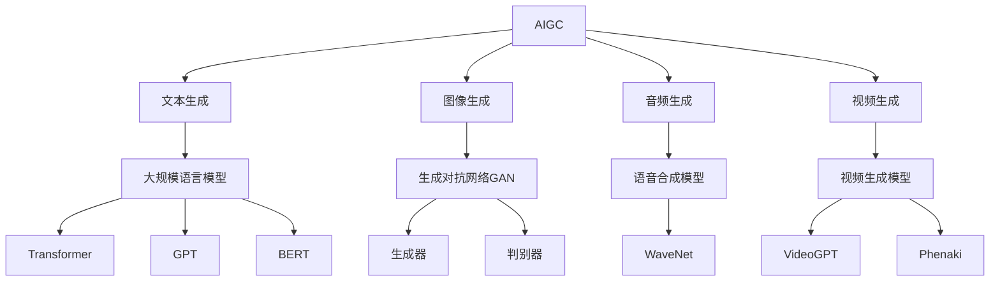

# AIGC(AI Generated Content) - 原理与代码实例讲解

## 1. 背景介绍
### 1.1 AIGC的兴起
近年来,人工智能技术的飞速发展催生了一个新兴领域——AIGC(AI Generated Content),即利用人工智能算法自动生成各种内容,如文本、图像、音频、视频等。AIGC正在深刻影响着内容创作、娱乐传媒、商业营销等诸多行业,引发了人们对未来内容生产方式的无限遐想。

### 1.2 AIGC的应用现状
目前,AIGC技术已经在多个领域崭露头角:

- 文本生成:GPT-3、ERNIE等大语言模型可以根据输入的文本提示自动生成连贯流畅的长篇文章。
- 图像生成:DALL-E、Stable Diffusion等图像生成模型能够根据文本描述合成逼真的图像。
- 音频生成:WaveNet等语音合成模型可以克隆特定人的声音,生成与原声难以区分的语音。
- 视频生成:VideoGPT、Phenaki等视频生成模型初步实现了根据文本提示自动生成短视频的能力。

AIGC正逐步走向成熟和商业化,为内容创作带来了革命性的变化。但它的发展仍面临诸多技术和伦理挑战,需要学界和业界的共同努力。

## 2. 核心概念与联系
### 2.1 AIGC的定义与内涵
AIGC是一个交叉学科,融合了人工智能、自然语言处理、计算机视觉、语音识别等多个领域的最新进展。其核心是利用深度学习算法,通过海量数据的训练,使计算机模型掌握内容生成的能力。

### 2.2 AIGC与传统内容创作的区别
与传统的人工内容创作相比,AIGC具有以下特点:

- 高效:AIGC可以在短时间内批量生产大量内容,效率远超人力。
- 低成本:一旦训练完成,AIGC模型的使用成本很低,不需要支付额外的人力成本。
- 个性化:AIGC可以根据用户的特定需求生成定制化的内容。
- 创新性:AIGC能够探索出人类难以想象的创意空间,激发新的灵感。

### 2.3 AIGC的关键技术
AIGC的实现离不开以下关键技术:

- 大规模语言模型:如Transformer、GPT、BERT等,它们是AIGC的核心,掌握了对自然语言的理解和生成能力。
- 生成对抗网络(GAN):GAN 由生成器和判别器组成,通过两者的博弈训练,可以生成逼真的图像、视频等。
- 强化学习:通过设计奖励函数,使AIGC模型在生成过程中不断自我优化,生成更高质量的内容。
- 知识图谱:将结构化的知识融入AIGC模型,可以提升内容的逻辑性和专业性。

下图展示了AIGC的核心概念与技术之间的关系:



## 3. 核心算法原理具体操作步骤
本节将以图像生成中的DALL-E模型为例,讲解其核心算法原理和操作步骤。

### 3.1 DALL-E的整体架构
DALL-E是一个基于Transformer的文本到图像生成模型,它接收一段文本描述,输出与之匹配的图像。其主要由以下几个部分组成:

1. 文本编码器:将输入的文本描述转换为语义特征向量。
2. 图像解码器:根据语义特征向量,通过自回归的方式逐像素生成图像。
3. 预训练:在大规模的图文对数据集上进行预训练,学习文本与图像的对应关系。
4. 微调:在特定领域的小样本数据集上进行微调,提升生成图像的质量和多样性。

### 3.2 文本编码器
DALL-E使用基于Transformer的文本编码器,具体步骤如下:

1. 将输入的文本描述进行分词,转换为token序列。
2. 将token序列传入Transformer的多层自注意力机制和前馈神经网络,提取上下文语义信息。
3. 取Transformer最后一层的输出,通过池化操作得到定长的语义特征向量。

### 3.3 图像解码器
DALL-E的图像解码器采用自回归生成的方式,逐像素预测生成图像。其步骤如下:

1. 将语义特征向量通过全连接层映射到图像解码器的初始状态。
2. 图像解码器采用类似GPT的结构,通过因果自注意力机制建模已生成像素之间的依赖关系。
3. 在每个时间步,解码器根据当前状态预测下一个像素的概率分布,并采样生成具体的像素值。
4. 重复步骤3,直到生成完整的图像。

### 3.4 训练过程
DALL-E的训练过程分为无监督的预训练和有监督的微调两个阶段。

预训练阶段的目标是学习通用的文本-图像对应关系。具体步骤如下:

1. 收集大规模的图文对数据集,如互联网上的图片及其描述文本。
2. 使用文本编码器和图像解码器分别提取图像和文本的特征。
3. 通过最大化图文特征之间的互信息,训练编码器和解码器,使其能够建立文本与图像的语义关联。

微调阶段的目标是提升模型在特定领域的生成效果。具体步骤如下:

1. 在目标领域收集少量高质量的图文对数据集。
2. 固定预训练阶段学到的通用语义表示,只微调图像解码器的部分参数。
3. 通过最小化生成图像与真实图像之间的重建误差,训练解码器生成更准确、细节更丰富的图像。

## 4. 数学模型和公式详细讲解举例说明
本节以Transformer中的自注意力机制为例,详细讲解其数学模型和公式。

### 4.1 自注意力机制的直觉理解
自注意力机制允许模型在处理某个token时,自适应地关注输入序列中的其他相关token。直观地说,它可以学习到token之间的依赖关系,捕捉到全局的上下文信息。

### 4.2 自注意力的数学定义
设输入序列为 $\mathbf{X} \in \mathbb{R}^{n \times d}$,其中 $n$ 为序列长度, $d$ 为特征维度。自注意力将 $\mathbf{X}$ 映射为三个矩阵:查询矩阵 $\mathbf{Q}$、键矩阵 $\mathbf{K}$ 和值矩阵 $\mathbf{V}$。

$$
\mathbf{Q} = \mathbf{X} \mathbf{W}^Q \\
\mathbf{K} = \mathbf{X} \mathbf{W}^K \\ 
\mathbf{V} = \mathbf{X} \mathbf{W}^V
$$

其中, $\mathbf{W}^Q, \mathbf{W}^K, \mathbf{W}^V \in \mathbb{R}^{d \times d_k}$ 为可学习的权重矩阵。

然后,计算查询矩阵和键矩阵的相似度得到注意力分数:

$$
\mathbf{A} = \text{softmax}(\frac{\mathbf{Q}\mathbf{K}^T}{\sqrt{d_k}})
$$

其中, $\mathbf{A} \in \mathbb{R}^{n \times n}$ 为注意力矩阵。$\sqrt{d_k}$ 为缩放因子,用于控制梯度的稳定性。

最后,将注意力分数与值矩阵相乘,得到自注意力的输出表示:

$$
\text{Attention}(\mathbf{Q}, \mathbf{K}, \mathbf{V}) = \mathbf{A} \mathbf{V}
$$

### 4.3 多头自注意力
为了捕捉更丰富的语义信息,Transformer采用多头自注意力机制。它将 $\mathbf{Q}, \mathbf{K}, \mathbf{V}$ 分别映射为 $h$ 个子空间,并行计算 $h$ 个自注意力函数,再将结果拼接起来:

$$
\begin{aligned}
\text{MultiHead}(\mathbf{Q}, \mathbf{K}, \mathbf{V}) &= \text{Concat}(\text{head}_1, \ldots, \text{head}_h) \mathbf{W}^O \\
\text{head}_i &= \text{Attention}(\mathbf{Q}\mathbf{W}_i^Q, \mathbf{K}\mathbf{W}_i^K, \mathbf{V}\mathbf{W}_i^V)
\end{aligned}
$$

其中, $\mathbf{W}_i^Q, \mathbf{W}_i^K, \mathbf{W}_i^V \in \mathbb{R}^{d \times d_k}, \mathbf{W}^O \in \mathbb{R}^{hd_k \times d}$ 为可学习的权重矩阵。

多头自注意力允许模型在不同的子空间中学习到不同的语义表示,提升了模型的表达能力。

## 5. 项目实践:代码实例和详细解释说明
本节将以PyTorch为例,给出DALL-E模型中文本编码器的简化实现代码。

```python
import torch
import torch.nn as nn

class TextEncoder(nn.Module):
    def __init__(self, vocab_size, embed_dim, num_layers, num_heads, hidden_dim, dropout=0.1):
        super().__init__()
        self.embedding = nn.Embedding(vocab_size, embed_dim)
        self.positional_encoding = PositionalEncoding(embed_dim)
        encoder_layer = nn.TransformerEncoderLayer(
            d_model=embed_dim, 
            nhead=num_heads,
            dim_feedforward=hidden_dim, 
            dropout=dropout
        )
        self.transformer = nn.TransformerEncoder(encoder_layer, num_layers)
        
    def forward(self, x):
        x = self.embedding(x)
        x = self.positional_encoding(x)
        x = self.transformer(x)
        return x.mean(dim=1)
```

代码解释:

1. `__init__` 方法定义了文本编码器的架构。它由三部分组成:
   - `nn.Embedding` 层将输入的token ID映射为稠密向量。
   - `PositionalEncoding` 层添加位置编码,引入序列的位置信息。
   - `nn.TransformerEncoder` 层堆叠多层Transformer的编码器块,提取上下文语义信息。

2. `forward` 方法定义了前向传播的过程:
   - 将输入的token ID通过嵌入层映射为词向量。
   - 加上位置编码。
   - 将词向量序列传入Transformer编码器,提取上下文表示。
   - 对编码器输出的序列进行平均池化,得到定长的语义特征向量。

这段代码体现了Transformer在文本编码中的典型用法。通过自注意力机制,模型能够自适应地聚合上下文信息,得到语义丰富的文本表示。

## 6. 实际应用场景
AIGC 技术在各行各业都有广泛的应用前景,下面列举几个具体的场景:

### 6.1 智能内容创作
AIGC 可以辅助或自动完成各种内容的创作,如新闻报道、社交媒体帖文、产品描述、广告文案等。这大大提高了内容生产的效率,降低了人力成本。例如:

- 彭博社使用自动化新闻写作系统 Cyborg,根据结构化的财经数据快速生成新闻报道。
- 阿里巴巴开发了智能写作助手 AI Copywriter,可以根据产品信息自动生成详细的商品描述和推广文案。

### 6.2 个性化推荐
AIGC 可以根据用户的画像和行为数据,自动生成个性化的内容推荐。比如:

- 抖音的推荐算法可以根据用户的兴趣爱好,实时生成专属的短视频信息流。
- Netflix 利用用户观影历史和评分