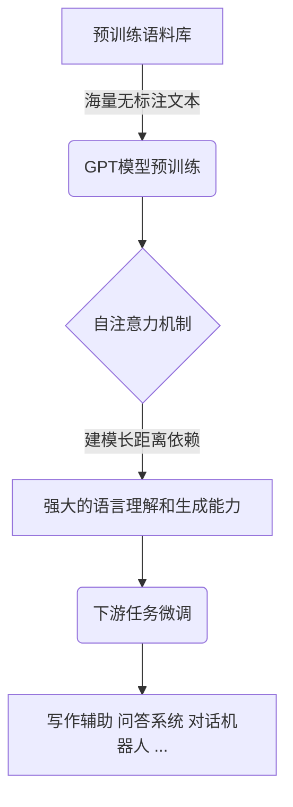
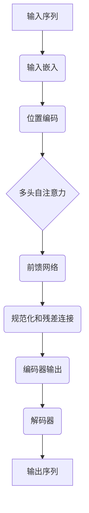

# AIGC从入门到实战：只缘身在此山中：GPT模型靠什么取胜和"出圈"？

## 1.背景介绍

### 1.1 人工智能的崛起

人工智能(Artificial Intelligence,AI)作为一门新兴的交叉学科,已经在各个领域掀起了前所未有的热潮。从计算机视觉、自然语言处理到机器学习等,AI技术正在重塑着我们的生活和工作方式。在这场科技革命中,大型语言模型(Large Language Model,LLM)无疑是最耀眼的明星。

### 1.2 GPT:开启大模型时代的先驱

GPT(Generative Pre-trained Transformer)是一种基于Transformer架构的大型语言模型,由OpenAI公司于2018年提出。它通过在海量文本数据上进行预训练,学习到了丰富的语言知识和上下文关联能力。GPT的出现,开启了大型语言模型的新时代,也为后续的GPT-2、GPT-3等更强大的模型奠定了基础。

### 1.3 GPT模型的"出圈"现象

最近,以GPT为代表的大型语言模型在各个领域掀起了热潮,可以说是"出圈"了。从写作创作到编程辅助,从问答系统到对话机器人,GPT模型正在展现出前所未有的能力。这种"出圈"现象,不仅源于GPT模型本身的强大性能,更重要的是它所代表的全新的人工智能范式。

## 2.核心概念与联系

### 2.1 自然语言处理(NLP)

自然语言处理(Natural Language Processing,NLP)是人工智能的一个重要分支,旨在使计算机能够理解和生成人类语言。传统的NLP任务包括文本分类、机器翻译、问答系统等。GPT模型作为一种大型语言模型,在NLP领域取得了突破性的进展。

### 2.2 预训练与微调(Pre-training & Fine-tuning)

预训练(Pre-training)是GPT模型的核心思想之一。通过在海量无标注文本数据上进行自监督学习,模型可以获得丰富的语言知识和上下文关联能力。而微调(Fine-tuning)则是将预训练好的模型在特定任务上进行进一步训练,以适应该任务的特殊需求。

### 2.3 自注意力机制(Self-Attention)

Transformer架构中的自注意力机制是GPT模型的另一个核心技术。与传统的RNN和LSTM不同,自注意力机制可以直接捕捉输入序列中任意两个位置之间的关系,从而更好地建模长距离依赖。这使得GPT模型能够处理更长的文本序列,并获得更好的语言理解和生成能力。



## 3.核心算法原理具体操作步骤

### 3.1 Transformer架构

GPT模型的核心架构是Transformer,它由编码器(Encoder)和解码器(Decoder)两个主要部分组成。编码器负责处理输入序列,解码器则根据输入生成目标序列。两者之间通过自注意力机制建立联系。

1. **输入嵌入(Input Embeddings)**: 将输入序列(如词或子词)映射为向量表示。
2. **位置编码(Positional Encoding)**: 为每个位置添加位置信息,使模型能够捕捉序列的顺序。
3. **多头自注意力(Multi-Head Self-Attention)**: 计算输入序列中每个位置与其他位置的关联度,建模长距离依赖。
4. **前馈网络(Feed-Forward Network)**: 对自注意力的输出进行非线性变换,提取更高层次的特征。
5. **规范化(Normalization)** 和 **残差连接(Residual Connection)**: 用于稳定训练过程和提高梯度传播效率。



### 3.2 自回归语言模型(Autoregressive Language Model)

GPT模型采用了自回归语言模型的思想,即根据前面的词来预测下一个词。在训练过程中,模型会最大化下一个词的条件概率,从而学习到语言的规律和上下文关联。

$$P(x_1, x_2, \dots, x_n) = \prod_{t=1}^{n} P(x_t | x_1, \dots, x_{t-1})$$

其中,$ P(x_t | x_1, \dots, x_{t-1}) $表示在给定前 $t-1$ 个词的情况下,预测第 $t$ 个词的条件概率。

在推理阶段,GPT模型可以根据给定的起始文本,自回归地生成连贯的后续文本。这种生成式建模方式,使得GPT模型在写作创作、对话生成等任务中表现出色。

### 3.3 预训练与微调

GPT模型的训练分为两个阶段:预训练(Pre-training)和微调(Fine-tuning)。

1. **预训练**: 在海量无标注文本数据上进行自监督学习,获取通用的语言知识和上下文关联能力。预训练的目标是最大化语言模型的似然函数:

$$\mathcal{L}_{\text{LM}} = \sum_{i=1}^{N} \log P(x_i | x_1, \dots, x_{i-1}; \theta)$$

其中,$ \theta $表示模型参数,$ N $是语料库中的总词数。

2. **微调**: 将预训练好的模型在特定的下游任务上进行进一步训练,使其适应该任务的特殊需求。微调过程中,模型参数会根据任务目标函数进行调整和优化。

通过预训练和微调的两阶段训练策略,GPT模型可以在保留通用语言知识的同时,专门针对特定任务进行优化,从而取得更好的性能表现。

## 4.数学模型和公式详细讲解举例说明

### 4.1 自注意力机制(Self-Attention)

自注意力机制是Transformer架构的核心,它能够直接捕捉输入序列中任意两个位置之间的关系,从而更好地建模长距离依赖。

对于一个长度为 $n$ 的输入序列 $\boldsymbol{x} = (x_1, x_2, \dots, x_n)$,自注意力机制首先计算每个位置 $i$ 与其他所有位置 $j$ 之间的注意力分数 $e_{ij}$:

$$e_{ij} = \frac{(x_i \boldsymbol{W}^Q)(x_j \boldsymbol{W}^K)^{\top}}{\sqrt{d_k}}$$

其中,$ \boldsymbol{W}^Q $和$ \boldsymbol{W}^K $分别是查询(Query)和键(Key)的线性变换矩阵,$ d_k $是缩放因子,用于防止点积结果过大导致梯度消失或爆炸。

然后,通过 Softmax 函数将注意力分数转换为注意力权重:

$$\alpha_{ij} = \text{Softmax}(e_{ij}) = \frac{e^{e_{ij}}}{\sum_{k=1}^{n} e^{e_{ik}}}$$

最后,将注意力权重与值(Value)向量 $x_j \boldsymbol{W}^V$ 相乘并求和,得到自注意力的输出:

$$y_i = \sum_{j=1}^{n} \alpha_{ij}(x_j \boldsymbol{W}^V)$$

通过自注意力机制,模型可以动态地捕捉输入序列中任意两个位置之间的关联,从而更好地建模长距离依赖。这种灵活的注意力机制是GPT模型取得卓越性能的关键因素之一。

### 4.2 多头自注意力(Multi-Head Attention)

为了进一步提高模型的表现力,Transformer采用了多头自注意力(Multi-Head Attention)机制。具体来说,它将输入序列通过不同的线性变换映射到多个子空间,分别计算自注意力,然后将结果拼接起来。

设有 $h$ 个注意力头,每个注意力头的输出为 $\text{head}_i$,则多头自注意力的输出为:

$$\text{MultiHead}(Q, K, V) = \text{Concat}(\text{head}_1, \dots, \text{head}_h) \boldsymbol{W}^O$$

其中,$ \boldsymbol{W}^O $是一个可训练的线性变换矩阵,用于将拼接后的向量映射回原始空间。

多头自注意力机制允许模型从不同的子空间捕捉不同的关系,从而提高了模型的表现力和泛化能力。

### 4.3 掩码自注意力(Masked Self-Attention)

在自回归语言模型中,我们希望模型只关注当前位置之前的上下文信息,而忽略之后的信息。为此,GPT模型采用了掩码自注意力(Masked Self-Attention)机制。

具体来说,在计算注意力分数时,我们将当前位置之后的注意力分数设置为一个非常小的值(如 $-\infty$),从而使得这些位置的注意力权重接近于 0。这种掩码操作可以确保模型只关注当前位置之前的上下文信息,符合自回归语言模型的要求。

$$e_{ij} = \begin{cases}
\frac{(x_i \boldsymbol{W}^Q)(x_j \boldsymbol{W}^K)^{\top}}{\sqrt{d_k}}, & \text{if } j \leq i \\
-\infty, & \text{if } j > i
\end{cases}$$

掩码自注意力机制是GPT模型实现自回归语言模型的关键技术,它确保了模型在生成下一个词时只依赖于已知的上下文信息,而不会"窥视"未来的信息。

## 5.项目实践:代码实例和详细解释说明

为了更好地理解GPT模型的工作原理,我们将通过一个简单的代码示例来演示如何实现一个基于Transformer架构的自回归语言模型。

我们将使用PyTorch框架,并借助于 Hugging Face 的 Transformers 库,它提供了许多预训练的语言模型,以及相关的数据处理和训练工具。

### 5.1 导入所需的库

```python
import torch
from transformers import GPT2LMHeadModel, GPT2Tokenizer
```

我们导入了 PyTorch 和 Transformers 库,以及预训练的 GPT-2 语言模型和相应的分词器(Tokenizer)。

### 5.2 加载预训练模型和分词器

```python
model = GPT2LMHeadModel.from_pretrained('gpt2')
tokenizer = GPT2Tokenizer.from_pretrained('gpt2')
```

我们加载了预训练的 GPT-2 模型和分词器。这些预训练模型已经在大量文本数据上进行了训练,可以直接用于下游任务。

### 5.3 文本生成

```python
input_text = "Once upon a time, there was a"
input_ids = tokenizer.encode(input_text, return_tensors='pt')

output = model.generate(input_ids, max_length=100, do_sample=True, top_k=50, top_p=0.95, num_return_sequences=3)

for i in range(3):
    generated_text = tokenizer.decode(output[i], skip_special_tokens=True)
    print(f"Generated Text {i+1}: {generated_text}")
```

在这个示例中,我们首先定义了一个起始文本 `"Once upon a time, there was a"`。然后,我们使用分词器将文本转换为模型可以理解的输入 ID 张量。

接下来,我们调用 `model.generate` 方法,传入输入 ID 张量,并设置一些生成参数,如最大长度、采样策略等。这个方法会自回归地生成连续的文本序列。

最后,我们使用分词器将生成的输出 ID 张量解码为可读的文本,并打印出来。

通过这个简单的示例,我们可以看到如何使用预训练的 GPT 模型进行文本生成。当然,在实际应用中,我们还需要根据具体任务对模型进行微调,以获得更好的性能。

## 6.实际应用场景

GPT模型凭借