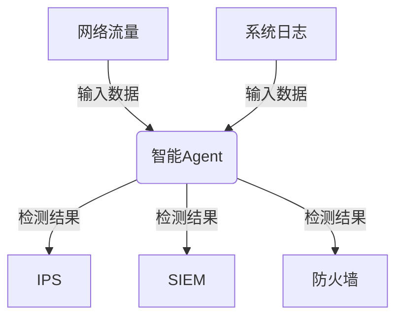
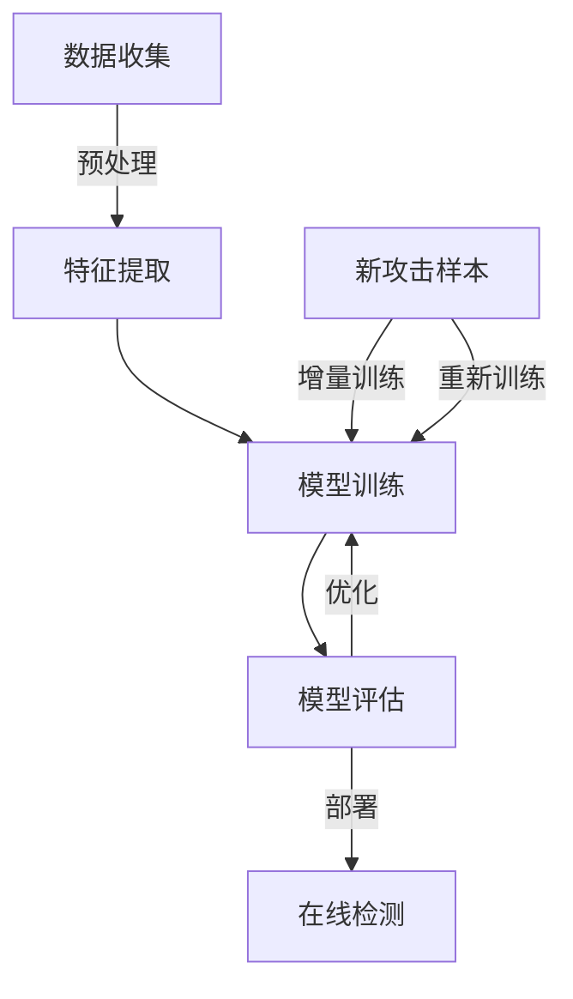

# AI人工智能 Agent：安全防御中智能体的应用

## 1.背景介绍

### 1.1 网络安全形势严峻

在当今互联网时代,网络安全问题日益突出。网络攻击手段不断升级,攻击目标也在不断扩大,从个人电脑到大型企业服务器,从单一系统到整个基础设施,都可能遭受攻击。传统的防御措施已经难以完全防范各种复杂的网络攻击。

### 1.2 人工智能在网络安全中的应用

人工智能技术在网络安全领域展现出巨大的潜力。智能Agent可以通过机器学习算法自主学习,识别并响应各种已知和未知的网络攻击,提高防御能力。与此同时,攻击者也可能利用AI技术进行攻击,加剧了攻防对抗。

### 1.3 智能Agent在网络安全中的作用

智能Agent可以作为网络安全防御体系的重要组成部分,在入侵检测、威胁狩猎、漏洞分析等多个环节发挥作用。它们能够自主学习,持续优化防御策略,提高检测精度,减轻安全分析人员的工作负担。

## 2.核心概念与联系

### 2.1 智能Agent

智能Agent是指具有一定自主性、可以感知环境、作出决策并采取行动的软件实体。在网络安全领域,智能Agent需要具备以下几个核心能力:

1. **感知能力**:收集网络流量、系统日志等安全相关数据
2. **学习能力**:基于机器学习算法从历史数据中学习,识别攻击模式
3. **决策能力**:根据学习到的知识,对检测到的行为作出判断
4. **行动能力**:对判断为攻击的行为采取相应的防御措施

### 2.2 Agent类型

根据应用场景的不同,网络安全领域的智能Agent可分为以下几种:

1. **入侵检测Agent(IDS Agent)**: 专注于检测入侵行为
2. **漏洞分析Agent**: 分析系统中存在的安全漏洞
3. **蜜罐Agent**: 模拟真实系统,诱捕攻击者并分析攻击手段
4. **威胁情报Agent**: 收集分析来自各方面的网络威胁情报

### 2.3 智能Agent与其他安全组件的关系

智能Agent并非独立存在,它需要与防火墙、入侵防护系统(IPS)、安全信息和事件管理(SIEM)等其他安全组件协同工作,构成完整的网络安全防御体系。

智能Agent可以为其他组件提供精确的攻击检测结果,而其他组件也可以为Agent提供必要的数据输入,相互配合、发挥联合防御作用。



## 3.核心算法原理具体操作步骤  

智能Agent通常基于机器学习算法实现攻击检测,具体操作步骤如下:

### 3.1 数据收集与预处理

1. 收集网络流量数据包、系统日志等原始安全数据
2. 对原始数据进行清洗,剔除无用信息
3. 从数据中提取特征,构建算法可以识别的特征向量

### 3.2 模型训练

1. 选择合适的机器学习算法,如决策树、支持向量机等
2. 使用标记好的历史攻击数据训练模型
3. 模型参数优化,提高检测精度

### 3.3 模型评估

1. 使用保留的测试数据对模型进行评估
2. 计算模型的精确率、召回率、F1分数等指标
3. 根据评估结果进一步优化模型

### 3.4 模型部署与在线检测  

1. 将训练好的模型部署到生产环境中
2. 实时获取新的网络数据,提取特征向量
3. 将特征向量输入模型,获取检测结果
4. 根据检测结果采取相应的防御策略

### 3.5 模型更新

1. 持续收集新的攻击样本
2. 使用新样本对模型进行增量训练
3. 定期评估模型性能,必要时重新训练模型



## 4.数学模型和公式详细讲解举例说明

机器学习算法在智能Agent中扮演着核心角色,这些算法大多基于数学模型,通过一些公式实现。以下将介绍几种常用算法的数学原理:

### 4.1 决策树

决策树是一种基于树形结构的监督学习算法,常用于分类和回归任务。它通过不断划分特征空间,将样本数据划分到不同的叶子节点,每个叶子节点对应一个分类结果。

决策树的构建过程可以用信息增益或信息增益比作为特征选择的标准,公式如下:

$$Gain(D,a)=Ent(D)-\sum_{v=1}^{V}\frac{|D^v|}{|D|}Ent(D^v)$$

$$Gain\_ratio(D,a)=\frac{Gain(D,a)}{IV(a)}$$

其中$Ent(D)$表示数据集$D$的熵,$D^v$表示根据特征$a$的取值$v$将$D$划分的子集,$IV(a)$表示特征$a$的固有值。

### 4.2 支持向量机(SVM)

支持向量机是一种有监督的机器学习模型,常用于分类和回归分析。SVM的基本思想是在特征空间中构建一个超平面,将不同类别的样本点分隔开,并使得间隔最大化。

对于线性可分的情况,超平面方程为:

$$\vec{w}^T\vec{x}+b=0$$

其中$\vec{w}$为法向量,$\vec{x}$为样本特征向量,$b$为偏置项。

SVM的目标是最大化几何间隔:

$$\max\limits_{\vec{w},b}\frac{1}{\|\vec{w}\|}$$

同时满足约束条件:

$$y_i(\vec{w}^T\vec{x}_i+b)\geq1,i=1,2,...n$$

### 4.3 人工神经网络

人工神经网络是一种模拟生物神经网络的机器学习模型,广泛应用于分类、回归、聚类等任务。神经网络由多层神经元组成,每个神经元对输入信号进行加权求和,再通过激活函数得到输出。

对于单个神经元,输出可表示为:

$$y=f(\sum_{i=1}^{n}w_ix_i+b)$$

其中$x_i$为输入,$w_i$为对应权重,$b$为偏置项,$f$为激活函数。

常用的激活函数有Sigmoid函数:

$$f(x)=\frac{1}{1+e^{-x}}$$

以及ReLU函数:

$$f(x)=\max(0,x)$$

通过反向传播算法对网络的权重参数进行迭代优化,可以使网络逐步拟合训练数据,从而实现分类或回归任务。

### 4.4 聚类算法

聚类是一种无监督学习算法,通过对样本数据进行分组,发现数据内在的结构。常用的聚类算法包括K-Means、DBSCAN等。

以K-Means为例,算法的目标是最小化所有样本到最近聚类中心的距离平方和:

$$\min\limits_{C}\sum_{i=1}^{k}\sum_{x\in C_i}\|x-\mu_i\|^2$$

其中$k$为聚类数量,$C_i$为第$i$个聚类,$\mu_i$为第$i$个聚类中心。

算法通过迭代的方式优化聚类结果,直到收敛。每次迭代包括两个步骤:

1. 分配步骤:将每个样本分配到最近的聚类中心
2. 更新步骤:重新计算每个聚类的中心点

## 5.项目实践：代码实例和详细解释说明

为了更好地理解智能Agent的工作原理,我们以一个基于Python的入侵检测系统(IDS)为例,介绍具体的代码实现。

### 5.1 数据预处理

```python
import pandas as pd

# 读取网络流量数据
data = pd.read_csv('network_traffic.csv')

# 删除无用特征列
data = data.drop(['src_ip', 'dst_ip'], axis=1)

# 对类别特征进行One-Hot编码
categorical_cols = ['protocol', 'service']
data = pd.get_dummies(data, columns=categorical_cols)

# 将标签编码为0/1
data['label'] = data['label'].map({'normal': 0, 'attack': 1})

# 划分训练集和测试集
from sklearn.model_selection import train_test_split
X = data.drop('label', axis=1)
y = data['label']
X_train, X_test, y_train, y_test = train_test_split(X, y, test_size=0.2, random_state=42)
```

上述代码读取网络流量数据,删除无用特征,对类别特征进行One-Hot编码,将标签编码为0/1,最后划分训练集和测试集。

### 5.2 模型训练

```python
from sklearn.ensemble import RandomForestClassifier

# 初始化随机森林模型
rf = RandomForestClassifier(n_estimators=100, random_state=42)

# 训练模型
rf.fit(X_train, y_train)
```

这里使用了随机森林分类器作为入侵检测模型,`n_estimators`参数控制树的数量。`fit`函数用于在训练数据上训练模型。

### 5.3 模型评估

```python
from sklearn.metrics import accuracy_score, precision_score, recall_score, f1_score

# 在测试集上评估模型
y_pred = rf.predict(X_test)
accuracy = accuracy_score(y_test, y_pred)
precision = precision_score(y_test, y_pred)
recall = recall_score(y_test, y_pred)
f1 = f1_score(y_test, y_pred)

print(f'Accuracy: {accuracy:.4f}')
print(f'Precision: {precision:.4f}')
print(f'Recall: {recall:.4f}')
print(f'F1-score: {f1:.4f}')
```

上述代码在测试集上评估模型的准确率、精确率、召回率和F1分数等指标,用于衡量模型的性能。

### 5.4 在线检测

```python
import numpy as np

# 新的网络流量数据
new_data = np.array([[...]])  # 特征向量

# 进行预测
prediction = rf.predict(new_data)

# 根据预测结果采取防御措施
if prediction == 1:
    # 采取防御措施
    ...
```

在实际应用中,可以实时获取新的网络流量数据,提取特征向量,输入到训练好的模型中进行预测。如果检测到攻击,则采取相应的防御措施,如阻断连接、发出警报等。

## 6.实际应用场景

智能Agent在网络安全领域有着广泛的应用前景,可以部署在不同的环节发挥作用:

### 6.1 入侵检测系统(IDS)

智能Agent可以作为IDS的核心组件,通过机器学习算法检测各种已知和未知的网络攻击行为,如分布式拒绝服务攻击、SQL注入攻击等。与传统的基于签名的IDS相比,智能Agent具有更强的检测能力和适应性。

### 6.2 漏洞分析

智能Agent可以自动分析系统中存在的安全漏洞,包括软件漏洞、配置漏洞等。通过机器学习算法从历史漏洞数据中学习,Agent能够发现新的未知漏洞,为漏洞修复提供决策支持。

### 6.3 蜜罐系统

蜜罐是一种模拟真实系统的陷阱,用于诱捕攻击者并分析攻击手段。智能Agent可以作为蜜罐的"大脑",根据攻击者的行为进行学习,优化防御策略。

### 6.4 威胁情报分析

智能Agent可以从多个来源收集网络威胁情报,如黑客论坛、暗网、安全公告等,并对这些信息进行关联分析,发现潜在的攻