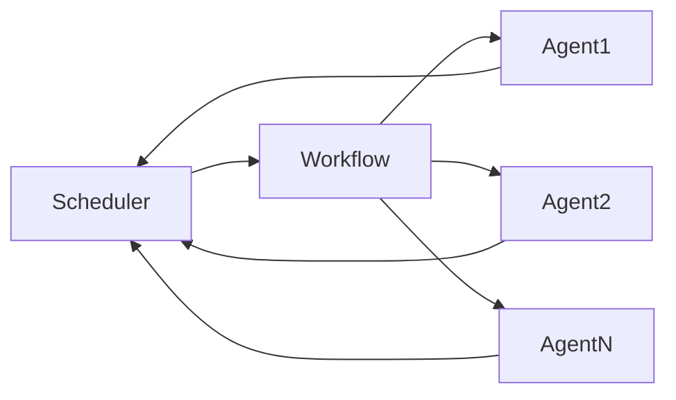
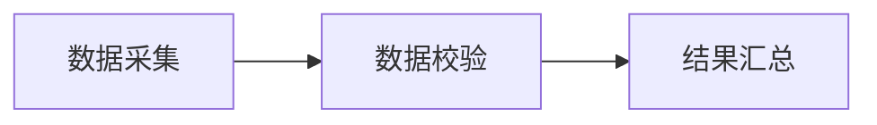

# AI人工智能代理工作流 AI Agent WorkFlow：在自动化检查中的应用

## 1. 背景介绍
### 1.1 人工智能发展现状
随着人工智能技术的快速发展,AI已经在各行各业得到广泛应用。从智能语音助手、自动驾驶汽车,到医疗诊断、金融风控等领域,AI正在改变着我们的生活和工作方式。特别是在自动化检查领域,AI技术正在扮演着越来越重要的角色。

### 1.2 自动化检查面临的挑战
传统的自动化检查主要依赖预先定义好的规则和脚本,存在着诸多局限性:
- 规则和脚本的制定需要大量人力,且难以覆盖所有场景
- 系统变更后需要频繁修改规则和脚本,维护成本高
- 无法应对复杂多变的检查需求,智能化水平不足

因此,亟需引入先进的AI技术,提升自动化检查的智能化水平和效率。这就催生了AI人工智能代理工作流(AI Agent Workflow)的诞生。

### 1.3 AI Agent Workflow的优势
相比传统的自动化检查方案,基于AI Agent的工作流有如下优势:
- 通过机器学习自动生成检查规则,减少人工干预
- 支持动态调整检查策略,快速适应需求变化 
- 具备自学习能力,可根据反馈结果不断优化
- 可构建多Agent协同工作的复杂工作流,应对各类场景需求

## 2. 核心概念与联系
要理解AI Agent Workflow,首先需要了解其中的几个核心概念:
### 2.1 Agent
Agent即智能代理,是一个可感知环境并作出行动的自治实体。它内置了感知、推理、决策、执行等组件,可独立完成特定任务。在自动化检查场景中,一个Agent可以是负责采集数据的Collector,也可以是负责校验规则的Validator等。

### 2.2 Workflow 
Workflow即工作流,定义了一系列有序的任务和活动。通过组织多个Agent并协调它们的工作,可构建复杂的自动化检查工作流。常见的工作流模式有:
- 顺序流:按照固定顺序依次执行各个Agent
- 条件流:根据条件决定下一步执行哪个Agent
- 并行流:多个Agent同时并行执行

### 2.3 Scheduler
Scheduler是调度器,负责统筹协调各个Agent,驱动整个工作流的执行。它会持续监控每个Agent的状态,并根据工作流定义分配后续任务。当检查过程出现异常时,Scheduler还可以采取重试、跳过等容错处理。

### 2.4 组件关系
下面是Agent、Workflow、Scheduler三者之间的关系示意图:



可以看到,Scheduler与Workflow是一对一的关系,Workflow与Agent是一对多的关系。Scheduler驱动Workflow,Workflow协调Agent,Agent反馈结果给Scheduler,三者相互配合,共同完成自动化检查任务。

## 3. 核心算法原理具体操作步骤
接下来我们详细讲解AI Agent Workflow的核心算法原理和具体操作步骤。
### 3.1 工作流建模
首先需要对自动化检查工作流进行建模,将其抽象为一个有向无环图(DAG):
- 图中每个节点表示一个原子任务,由特定的Agent完成
- 有向边表示任务间的依赖关系和数据流向
- 整个图描述了任务的拓扑结构和执行次序

例如下图描述了一个简单的三节点工作流:



### 3.2 任务调度
建立工作流模型后,Scheduler需要负责任务调度和流程控制:
1. 创建Workflow实例,读取任务拓扑结构
2. 将初始就绪的任务(无前置依赖)加入待运行队列
3. 为待运行任务分配Agent,下发任务并启动执行
4. 监听Agent状态变化事件,记录任务执行结果
5. 任务完成后,检查后续任务的就绪状态,重复3-4步骤
6. 直到所有任务完成,流程结束

其中第3步Agent的选择可以采用多种调度算法,如先来先服务(FCFS)、最小负载优先(Least-Loaded)等,以实现负载均衡和效率最大化。

### 3.3 容错处理
为保障工作流的鲁棒性,Scheduler还需要提供必要的容错处理机制:
- 任务失败重试:对执行失败的任务,重新下发给Agent多次尝试
- 任务超时处理:设置任务最大执行时间,超时的任务可重试或跳过
- 任务跳过:对不影响后续任务的非关键节点,可在失败后直接跳过
- 流程挂起恢复:在必要时刻(如系统升级)可暂停流程,并支持断点恢复

引入这些机制可以最大限度地保证工作流的连续性和一致性,降低外部因素的干扰。

### 3.4 性能优化
在海量任务和复杂工作流的场景下,Scheduler还需要考虑性能优化,提升系统吞吐量:
- 并行执行:充分利用多Agent资源,并行执行无依赖关系的任务
- 任务拆分:将耗时长的任务拆分为多个子任务,分别执行以减少排队时间
- 缓存优化:对常用的数据和中间结果进行缓存,减少重复计算
- 动态伸缩:根据任务负载情况动态调整Agent的数量,提高资源利用率

这些优化手段可以显著提升工作流的执行效率,缩短检查的总时间。

## 4. 数学模型和公式详细讲解举例说明
为了量化分析AI Agent Workflow的性能,我们还需要建立相应的数学模型。以下是几个常用的模型和公式。

### 4.1 任务调度模型
假设有m个Agent和n个任务,第i个任务的执行时间为$t_i$,可获得如下优化目标:

$$
\min T = \max_{1 \leq j \leq m} \sum_{i \in S_j} t_i
$$

其中$S_j$表示分配给第j个Agent的任务集合,优化目标是最小化执行时间最长的Agent的总时间,即最小化makespan。

这是一个经典的作业调度问题,可用贪心、动态规划等算法求解。一个简单的贪心策略是每次选择执行时间最短的任务,分配给当前负载最小的Agent。

### 4.2 流程执行时间估计
为了预估工作流的执行时间,可以采用关键路径法(CPM)。将工作流建模为DAG后,定义:
- $d_i$:节点i的最早开始时间
- $f_i$:节点i的最早结束时间
- $t_i$:节点i的执行时间

则有递推公式:

$$
d_i = \max_{j \in \mathrm{pred}(i)} f_j \\
f_i = d_i + t_i
$$

其中$\mathrm{pred}(i)$表示节点i的直接前驱节点集合。

初始化源节点$d_{source} = 0$,然后递推计算每个节点的最早开始和结束时间,直到汇节点,其结束时间$f_{sink}$即为整个工作流的估计执行时间。

关键路径是工作流中耗时最长的路径,其长度等于汇节点的最早结束时间。优化关键路径可以缩短整个工作流的执行时间。

### 4.3 吞吐量估计
假设工作流中有n个任务,第i个任务的执行时间为$t_i$,m个Agent的处理能力分别为$s_1,s_2,\cdots,s_m$,单位时间内可处理的任务数量。

假设采用均匀调度策略,令$\lambda$为任务到达率,则根据排队论的结果,系统的平均吞吐量$\mu$应满足:

$$
\mu = \min\left(\lambda, \frac{\sum_{j=1}^m s_j}{\sum_{i=1}^n t_i}\right)
$$

即吞吐量取决于任务到达率和Agent的最大处理能力。当$\lambda$较小时,吞吐量等于到达率;当$\lambda$较大时,吞吐量由Agent的处理能力决定。

为了提高吞吐量,一方面要提高Agent的处理能力,另一方面要优化任务粒度,避免出现少数任务执行时间过长的情况。

## 5. 项目实践：代码实例和详细解释说明
下面我们通过一个简单的代码实例,演示如何使用Python实现一个基本的AI Agent Workflow框架。

### 5.1 定义任务和Agent
首先定义任务(Task)和Agent的数据结构:

```python
class Task:
    def __init__(self, tid, runtime):
        self.tid = tid          # 任务ID
        self.runtime = runtime  # 估计运行时间
        self.state = 'WAITING'  # 任务状态
        self.agent = None       # 执行Agent

class Agent:
    def __init__(self, aid, capacity):
        self.aid = aid          # Agent ID  
        self.capacity = capacity# 处理能力
        self.tasks = []         # 已分配任务列表

    def run(self):  
        for task in self.tasks:
            task.state = 'RUNNING'
            time.sleep(task.runtime)
            task.state = 'FINISHED'
        self.tasks = []  
```

Task包含任务ID、运行时间、状态等属性;Agent包含ID、处理能力、任务列表等属性,并提供run方法模拟任务执行过程。

### 5.2 定义调度器
然后定义Scheduler,用于任务调度和流程控制:

```python
class Scheduler:
    def __init__(self, agents, tasks):
        self.agents = agents
        self.tasks = tasks

    def schedule(self):
        for task in self.tasks:
            agent = self.select_agent()
            agent.tasks.append(task)
            task.agent = agent
            task.state = 'SCHEDULED'

        threads = []
        for agent in self.agents:
            t = threading.Thread(target=agent.run)
            threads.append(t)
            t.start()

        for t in threads:
            t.join()

    def select_agent(self):
        return min(self.agents, key=lambda x: len(x.tasks)) 
```

Scheduler接收Agent和Task列表,提供schedule方法执行调度。它先为每个任务选择一个空闲的Agent,然后为每个Agent创建一个线程并行执行任务。

其中select_agent方法采用最小负载优先策略,总是选择当前任务最少的Agent。

### 5.3 创建工作流实例
最后创建一个工作流实例并执行:

```python
def main():
    agents = [Agent(1, 10), Agent(2, 20)]
    tasks = [Task(1, 5), Task(2, 10), Task(3, 15)]

    scheduler = Scheduler(agents, tasks)
    scheduler.schedule()

    for task in tasks:
        print(f'Task {task.tid} state: {task.state}')

if __name__ == '__main__':
    main()
```

这里创建了2个Agent和3个Task,构建Scheduler并执行调度,最后输出每个任务的最终状态。

一个可能的输出结果为:

```
Task 1 state: FINISHED
Task 2 state: FINISHED 
Task 3 state: FINISHED
```

表明所有任务都被成功执行完成。

当然,这只是一个最简单的示例,实际的AI Agent Workflow框架要复杂得多,需要考虑更多的任务类型、调度策略、容错机制等。但核心思路是一致的,即将大任务拆分为多个原子任务,通过灵活调度和协作执行来完成。

## 6. 实际应用场景
AI Agent Workflow可以应用于多个自动化检查场景,下面列举几个典型案例。

### 6.1 软件系统集成测试
在大型软件系统的集成测试中,通常需要模拟各种外部依赖(如数据库、缓存、消息队列等),并按照特定流程执行一系列检查,例如:
1. 准备测试数据,清理环境
2. 启动被测系统,加载配置
3. 调用系统接口,发起请求
4. 校验返回结果,断言业务逻辑
5. 生成覆盖率报告,评估测试质量

将这些步骤划分为多个原子任务,然后通过AI Agent Workflow有序调度执行,可以大大提升测试的自动化水平,降低人工介入的成本。

### 6