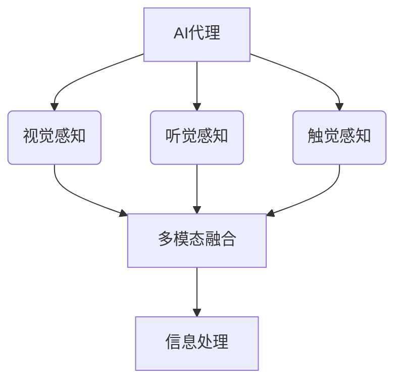
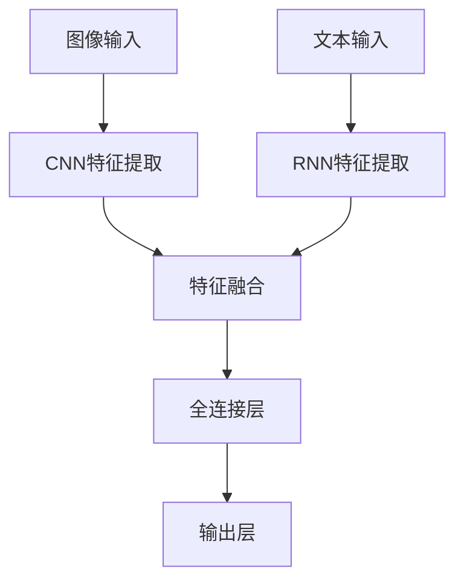

# AI人工智能代理工作流AI Agent WorkFlow：AI代理的多模态感知与处理能力

## 1.背景介绍

### 1.1 人工智能发展简史

人工智能(Artificial Intelligence, AI)是当代科技发展的前沿领域,旨在创造出能够模仿人类智能行为的智能系统。自20世纪50年代问世以来,人工智能经历了起伏跌宕的发展历程。

### 1.2 AI代理的重要性

在人工智能领域,AI代理(AI Agent)扮演着至关重要的角色。AI代理是指能够感知环境,并根据感知结果做出决策和行动的智能系统。它们是人工智能系统与现实世界交互的桥梁,在诸多应用场景中发挥着关键作用。

### 1.3 多模态感知处理的必要性

然而,现实世界是高度复杂和多样化的,单一模态的感知和处理能力往往无法满足实际需求。因此,AI代理必须具备多模态感知和处理的能力,才能更好地理解和应对复杂的环境。

## 2.核心概念与联系

### 2.1 AI代理

AI代理是一种能够感知环境、处理信息、做出决策并采取行动的智能系统。它们通常由以下几个核心组件构成:

- 感知器(Sensor):用于获取环境信息
- 执行器(Actuator):用于对环境进行操作
- 知识库(Knowledge Base):存储代理的知识和规则
- 推理引擎(Inference Engine):根据知识库进行推理和决策

### 2.2 多模态感知

多模态感知是指AI代理能够通过多种感官通道获取环境信息,如视觉、听觉、触觉等。这种多模态感知能力可以提高AI代理对环境的理解程度,并为后续处理提供更丰富的信息。



### 2.3 多模态信息处理

多模态信息处理是指AI代理能够综合处理来自多个模态的信息,并从中获取有价值的洞见。这需要将不同模态的信息进行有效融合,并应用适当的算法和模型进行分析和决策。

## 3.核心算法原理具体操作步骤

### 3.1 多模态数据预处理

在进行多模态信息处理之前,需要对来自不同模态的原始数据进行预处理,包括数据清洗、标准化、特征提取等步骤。这有助于消除数据噪声,并将不同模态的数据转换为统一的表示形式,为后续的融合和处理奠定基础。

### 3.2 多模态特征融合

特征融合是多模态信息处理的关键步骤,旨在将来自不同模态的特征信息进行有效整合。常见的融合策略包括:

1. **早期融合**:在特征级别直接拼接不同模态的特征向量。
2. **晚期融合**:对每个模态单独进行处理,然后将各模态的预测结果进行融合。
3. **核融合**:利用核方法将不同模态的核矩阵进行融合。

不同的融合策略适用于不同的场景,需要根据具体任务和数据特点进行选择。

### 3.3 多模态模型训练

基于融合后的多模态特征,可以训练适当的机器学习或深度学习模型,以捕获不同模态之间的相关性和互补性。常见的模型包括:

- 多层感知机(MLP)
- 支持向量机(SVM)
- 随机森林(Random Forest)
- 深度神经网络(DNN)

模型的选择和设计需要考虑任务复杂度、数据量、计算资源等多方面因素。

### 3.4 决策与执行

经过训练的多模态模型可以对新的多模态输入数据进行预测和决策。AI代理根据模型的输出,结合其知识库和规则,选择合适的行动方案,并通过执行器对环境进行操作。

## 4.数学模型和公式详细讲解举例说明

### 4.1 多模态特征融合

假设我们有两个模态的特征向量$\mathbf{x}_1$和$\mathbf{x}_2$,需要将它们融合为一个综合特征向量$\mathbf{z}$。

#### 4.1.1 早期融合

早期融合的思路是直接将两个模态的特征向量拼接起来:

$$\mathbf{z} = [\mathbf{x}_1, \mathbf{x}_2]$$

其中,$\mathbf{z}$是一个长度为$m+n$的向量,其中$m$和$n$分别是$\mathbf{x}_1$和$\mathbf{x}_2$的长度。

#### 4.1.2 晚期融合

晚期融合的思路是先对每个模态单独进行处理,得到预测结果$\mathbf{y}_1$和$\mathbf{y}_2$,然后将它们融合为最终预测$\mathbf{y}$:

$$\mathbf{y} = f(\mathbf{y}_1, \mathbf{y}_2)$$

其中,$f$是一个融合函数,可以是简单的加权求和,也可以是更复杂的非线性函数。

#### 4.1.3 核融合

核融合的思路是利用核技巧将不同模态的数据映射到更高维的核空间,然后在核空间中进行融合。假设$\phi_1$和$\phi_2$分别是两个模态的核函数,则融合后的核矩阵$\mathbf{K}$可以表示为:

$$\mathbf{K} = \alpha \mathbf{K}_1 + \beta \mathbf{K}_2$$

其中,$\mathbf{K}_1$和$\mathbf{K}_2$分别是两个模态的核矩阵,$\alpha$和$\beta$是权重系数。

### 4.2 多模态模型示例

假设我们需要构建一个多模态深度神经网络模型,用于融合视觉和文本信息进行图像描述任务。该模型的结构如下:



其中,图像输入通过卷积神经网络(CNN)提取视觉特征,文本输入通过循环神经网络(RNN)提取语义特征。然后,将两种模态的特征进行融合,并输入到全连接层和输出层,生成最终的图像描述结果。

该模型的损失函数可以定义为:

$$\mathcal{L} = -\frac{1}{N}\sum_{i=1}^{N}\sum_{j=1}^{T}y_{ij}\log p_{ij}$$

其中,$N$是批次大小,$T$是序列长度,$y_{ij}$是真实标签,$p_{ij}$是模型预测的概率。通过最小化损失函数,可以优化模型参数,提高多模态融合的性能。

## 5.项目实践:代码实例和详细解释说明

为了更好地理解多模态信息处理的实现细节,我们提供了一个基于PyTorch的代码示例,用于融合视觉和文本信息进行图像描述任务。

### 5.1 数据预处理

```python
import torch
from torchvision import transforms

# 图像预处理
image_transform = transforms.Compose([
    transforms.Resize((224, 224)),
    transforms.ToTensor(),
    transforms.Normalize(mean=[0.485, 0.456, 0.406], std=[0.229, 0.224, 0.225])
])

# 文本预处理
text_transform = ...  # 实现文本tokenization和embedding

# 加载数据集
dataset = MultiModalDataset(image_paths, captions, image_transform, text_transform)
dataloader = DataLoader(dataset, batch_size=32, shuffle=True)
```

在这个示例中,我们首先定义了图像和文本的预处理转换,包括调整图像大小、标准化和文本tokenization等步骤。然后,我们构建了一个自定义的`MultiModalDataset`类,用于加载图像和对应的描述文本,并应用相应的预处理转换。最后,我们创建了一个`DataLoader`对象,用于在训练过程中迭代数据。

### 5.2 模型定义

```python
import torch.nn as nn

class MultiModalModel(nn.Module):
    def __init__(self, image_encoder, text_encoder, fusion_module, output_dim):
        super(MultiModalModel, self).__init__()
        self.image_encoder = image_encoder
        self.text_encoder = text_encoder
        self.fusion_module = fusion_module
        self.output_layer = nn.Linear(fusion_module.output_dim, output_dim)

    def forward(self, images, texts):
        image_features = self.image_encoder(images)
        text_features = self.text_encoder(texts)
        fused_features = self.fusion_module(image_features, text_features)
        outputs = self.output_layer(fused_features)
        return outputs

# 实例化模型
image_encoder = ...  # 实例化图像编码器
text_encoder = ...  # 实例化文本编码器
fusion_module = ...  # 实例化融合模块
model = MultiModalModel(image_encoder, text_encoder, fusion_module, output_dim)
```

在这个示例中,我们定义了一个`MultiModalModel`类,它包含了图像编码器、文本编码器和融合模块三个主要组件。在前向传播过程中,图像和文本输入分别通过对应的编码器提取特征,然后将提取的特征输入到融合模块中进行融合。最后,融合后的特征被输入到输出层,生成最终的预测结果。

您需要根据具体任务和模型架构,实现相应的图像编码器、文本编码器和融合模块。例如,可以使用预训练的ResNet作为图像编码器,使用LSTM作为文本编码器,并采用早期融合或晚期融合策略作为融合模块。

### 5.3 模型训练

```python
import torch.optim as optim
import torch.nn.functional as F

# 定义损失函数和优化器
criterion = nn.CrossEntropyLoss()
optimizer = optim.Adam(model.parameters(), lr=0.001)

# 训练循环
for epoch in range(num_epochs):
    for images, texts, labels in dataloader:
        optimizer.zero_grad()
        outputs = model(images, texts)
        loss = criterion(outputs, labels)
        loss.backward()
        optimizer.step()

    # 评估模型性能
    model.eval()
    with torch.no_grad():
        val_loss = 0
        for images, texts, labels in val_dataloader:
            outputs = model(images, texts)
            loss = criterion(outputs, labels)
            val_loss += loss.item()
        val_loss /= len(val_dataloader)
    print(f'Epoch [{epoch+1}/{num_epochs}], Val Loss: {val_loss:.4f}')
```

在这个示例中,我们定义了交叉熵损失函数和Adam优化器,用于模型的训练。在每个epoch中,我们遍历训练数据集,计算模型输出与真实标签之间的损失,并通过反向传播更新模型参数。

在每个epoch结束时,我们切换到评估模式,在验证数据集上计算模型的损失,以监控模型的性能表现。您可以根据需要添加其他评估指标,如准确率、F1分数等。

### 5.4 模型推理

```python
# 加载训练好的模型
model.load_state_dict(torch.load('model.pth'))
model.eval()

# 预处理输入数据
image = image_transform(Image.open('image.jpg'))
text = text_transform('This is a sample caption.')

# 模型推理
with torch.no_grad():
    output = model(image.unsqueeze(0), text.unsqueeze(0))
    predicted_caption = decode_caption(output)

print(f'Predicted Caption: {predicted_caption}')
```

在训练完成后,我们可以加载保存的模型权重,并切换到评估模式。然后,我们预处理输入的图像和文本数据,并将它们输入到模型中进行推理。最后,我们解码模型的输出,得到预测的图像描述结果。

您需要根据具体任务和模型架构,实现相应的解码函数`decode_caption`。例如,对于图像描述任务,您可以将模型输出解码为一个单词序列,作为最终的描述结果。

通过这个示例,您可以了解到如何在PyTorch中实现一个多模态融合模型,包括数据预处理、模型定义、训练和推理等关键步骤。您可以根据实际需求进行适当的修改和扩展。

## 6.实际应用场景

多模态信息处理技术在诸多领域都有广泛的应用前景,包括但不限于:

### 6.1 图像描述与视觉问答