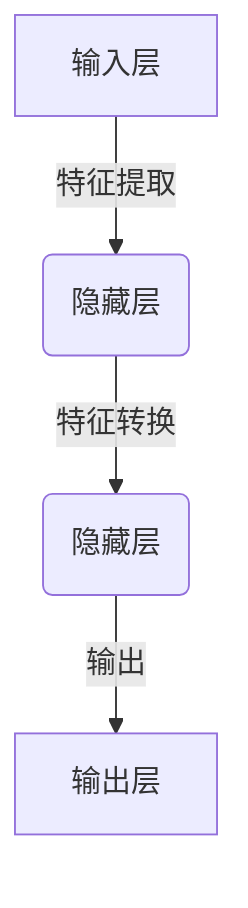

# AI人工智能深度学习算法：神经网络的复杂性与能力

## 1.背景介绍

### 1.1 人工智能的兴起

人工智能(Artificial Intelligence,AI)是当代科技发展的一个重要领域,近年来受到了前所未有的关注和投资。AI的发展可以追溯到上世纪50年代,当时一些科学家提出了"赋予机器智能"的想法,并开始进行相关的研究工作。

### 1.2 深度学习的崛起

传统的人工智能系统主要依赖于人工设计的规则和算法,但在处理复杂问题时往往会遇到瓶颈。深度学习(Deep Learning)的出现为人工智能注入了新的活力,它是一种模仿人脑神经网络结构和工作原理的算法,能够从大量数据中自动学习特征表示,并用于解决诸如计算机视觉、自然语言处理等各种复杂任务。

### 1.3 神经网络的重要性

神经网络是深度学习的核心,它是一种由众多相互连接的节点(神经元)组成的网络结构,能够对输入数据进行处理并输出结果。神经网络具有强大的非线性建模能力,可以学习复杂的映射关系,因此在深度学习中扮演着至关重要的角色。

## 2.核心概念与联系

### 2.1 神经元

神经元是神经网络的基本单元,它接收来自其他神经元或外部输入的信号,并根据一定的规则产生输出信号。每个神经元都有一个激活函数,用于决定神经元的输出。常见的激活函数包括Sigmoid函数、ReLU函数等。

### 2.2 网络结构

神经网络通常由多层神经元组成,包括输入层、隐藏层和输出层。输入层接收外部数据,隐藏层对数据进行特征提取和转换,输出层产生最终的输出结果。不同的网络结构适用于不同的任务,如前馈神经网络、卷积神经网络、递归神经网络等。



### 2.3 权重和偏置

每个神经元之间的连接都有一个权重值,表示该连接的重要程度。同时,每个神经元还有一个偏置值,用于调整神经元的激活程度。在训练过程中,神经网络会不断调整权重和偏置,以最小化损失函数,从而获得更好的性能。

### 2.4 前向传播和反向传播

前向传播(Forward Propagation)是指将输入数据通过神经网络层层传递,得到最终的输出结果。反向传播(Backpropagation)则是根据输出结果和期望值之间的误差,计算每个权重的梯度,并沿着反方向更新权重和偏置,从而优化神经网络的性能。

## 3.核心算法原理具体操作步骤  

### 3.1 前向传播算法

前向传播算法是神经网络的核心计算过程,它将输入数据通过网络层层传递,得到最终的输出结果。具体步骤如下:

1. 初始化网络权重和偏置。
2. 对于每一个输入样本:
    a. 将输入数据传递到输入层。
    b. 对于每一个隐藏层:
        i. 计算每个神经元的加权输入,即将上一层的输出与相应的权重相乘并求和。
        ii. 将加权输入传递到激活函数,得到该层的输出。
    c. 将最后一个隐藏层的输出传递到输出层,得到网络的最终输出。

### 3.2 反向传播算法

反向传播算法用于根据输出结果和期望值之间的误差,计算每个权重的梯度,并更新权重和偏置,从而优化神经网络的性能。具体步骤如下:

1. 计算输出层的误差,即输出层的输出与期望输出之间的差异。
2. 对于每一个隐藏层(从输出层开始,逆向传播):
    a. 计算每个神经元的误差梯度,即该神经元对于总误差的贡献程度。
    b. 计算每个权重的梯度,即该权重对于总误差的贡献程度。
    c. 更新该层的权重和偏置,通常使用梯度下降法或其变体。
3. 重复步骤2,直到完成所有隐藏层的权重和偏置更新。

通过不断地前向传播和反向传播,神经网络可以逐步减小输出误差,从而学习到更好的权重和偏置参数,提高模型的性能。

## 4.数学模型和公式详细讲解举例说明

### 4.1 神经元数学模型

神经元是神经网络的基本单元,它接收来自其他神经元或外部输入的信号,并根据一定的规则产生输出信号。数学上,神经元的工作过程可以表示为:

$$
y = f\left(\sum_{i=1}^{n}w_ix_i + b\right)
$$

其中:
- $x_i$是第$i$个输入
- $w_i$是第$i$个输入对应的权重
- $b$是神经元的偏置项
- $f$是激活函数,用于引入非线性

常见的激活函数包括Sigmoid函数、ReLU函数等。

#### 4.1.1 Sigmoid函数

Sigmoid函数的数学表达式为:

$$
f(x) = \frac{1}{1 + e^{-x}}
$$

Sigmoid函数的输出范围在(0,1)之间,常用于二分类问题的输出层。

#### 4.1.2 ReLU函数

ReLU(Rectified Linear Unit)函数的数学表达式为:

$$
f(x) = \max(0, x)
$$

ReLU函数在输入大于0时保持线性,否则输出0,具有计算简单、收敛速度快的优点,广泛应用于深度神经网络的隐藏层。

### 4.2 损失函数

损失函数(Loss Function)用于衡量神经网络的输出与期望输出之间的差异,是优化神经网络参数的依据。常见的损失函数包括均方误差(Mean Squared Error,MSE)、交叉熵损失(Cross-Entropy Loss)等。

#### 4.2.1 均方误差

均方误差常用于回归问题,它的数学表达式为:

$$
\mathrm{MSE} = \frac{1}{n}\sum_{i=1}^{n}(y_i - \hat{y}_i)^2
$$

其中:
- $n$是样本数量
- $y_i$是第$i$个样本的真实值
- $\hat{y}_i$是第$i$个样本的预测值

#### 4.2.2 交叉熵损失

交叉熵损失常用于分类问题,它的数学表达式为:

$$
\mathrm{CE} = -\frac{1}{n}\sum_{i=1}^{n}\sum_{j=1}^{m}y_{ij}\log(\hat{y}_{ij})
$$

其中:
- $n$是样本数量
- $m$是类别数量
- $y_{ij}$是第$i$个样本属于第$j$类的真实标记(0或1)
- $\hat{y}_{ij}$是第$i$个样本属于第$j$类的预测概率

### 4.3 优化算法

优化算法用于根据损失函数的梯度,更新神经网络的权重和偏置,从而最小化损失函数。常见的优化算法包括梯度下降法(Gradient Descent)、动量法(Momentum)、RMSProp、Adam等。

#### 4.3.1 梯度下降法

梯度下降法是最基本的优化算法,它根据损失函数对权重的梯度,沿着梯度的反方向更新权重,数学表达式为:

$$
w_{t+1} = w_t - \eta\frac{\partial L}{\partial w_t}
$$

其中:
- $w_t$是当前的权重
- $\eta$是学习率,控制更新步长的大小
- $\frac{\partial L}{\partial w_t}$是损失函数对权重的梯度

#### 4.3.2 动量法

动量法在梯度下降的基础上引入了动量项,使得权重更新时不仅考虑当前梯度,还考虑了之前的更新方向,从而加快收敛速度并避免陷入局部最优。数学表达式为:

$$
v_{t+1} = \gamma v_t + \eta\frac{\partial L}{\partial w_t} \\
w_{t+1} = w_t - v_{t+1}
$$

其中:
- $v_t$是当前的动量
- $\gamma$是动量系数,控制动量的大小

## 5.项目实践:代码实例和详细解释说明

以下是使用Python和TensorFlow构建一个简单的前馈神经网络的示例代码,用于对MNIST手写数字数据集进行分类。

```python
import tensorflow as tf
from tensorflow.keras.datasets import mnist
from tensorflow.keras.utils import to_categorical

# 加载MNIST数据集
(x_train, y_train), (x_test, y_test) = mnist.load_data()

# 数据预处理
x_train = x_train.reshape(-1, 28*28) / 255.0
x_test = x_test.reshape(-1, 28*28) / 255.0
y_train = to_categorical(y_train, num_classes=10)
y_test = to_categorical(y_test, num_classes=10)

# 构建模型
model = tf.keras.models.Sequential([
    tf.keras.layers.Dense(512, activation='relu', input_shape=(28*28,)),
    tf.keras.layers.Dense(256, activation='relu'),
    tf.keras.layers.Dense(10, activation='softmax')
])

# 编译模型
model.compile(optimizer='adam',
              loss='categorical_crossentropy',
              metrics=['accuracy'])

# 训练模型
model.fit(x_train, y_train, epochs=5, batch_size=128, verbose=1)

# 评估模型
test_loss, test_acc = model.evaluate(x_test, y_test, verbose=0)
print('Test accuracy:', test_acc)
```

代码解释:

1. 首先导入所需的库和加载MNIST数据集。
2. 对数据进行预处理,将图像数据展平并归一化,将标签转换为一热编码形式。
3. 构建一个包含两个隐藏层的前馈神经网络模型,输入层为28x28=784个节点,第一隐藏层有512个节点,第二隐藏层有256个节点,输出层为10个节点(对应0-9共10个数字类别)。
4. 编译模型,设置优化器为Adam,损失函数为categorical_crossentropy(分类问题的交叉熵损失),评估指标为准确率。
5. 使用model.fit()函数训练模型,设置训练epoch数为5,批量大小为128。
6. 在测试集上评估模型的性能,打印测试准确率。

通过这个示例,你可以了解如何使用TensorFlow构建、训练和评估一个简单的神经网络模型。在实际应用中,你可以根据具体问题调整网络结构、优化算法等超参数,以获得更好的性能。

## 6.实际应用场景

神经网络在许多领域都有广泛的应用,下面列举了一些典型的应用场景:

### 6.1 计算机视觉

- 图像分类:通过卷积神经网络(CNN)对图像进行分类,如识别手写数字、物体分类等。
- 目标检测:在图像中定位并识别特定目标的位置和类别。
- 图像分割:将图像分割为不同的语义区域,如前景和背景分离。
- 风格迁移:将一种图像风格迁移到另一种图像上,产生具有特定风格的新图像。

### 6.2 自然语言处理

- 机器翻译:将一种语言的文本翻译成另一种语言。
- 文本分类:根据文本内容对文本进行分类,如新闻分类、垃圾邮件过滤等。
- 情感分析:分析文本中所表达的情感倾向,如正面、负面或中性。
- 问答系统:根据问题的语义,从知识库中检索相关答案。

### 6.3 语音识别

通过神经网络模型对语音信号进行处理,实现将语音转换为文本的功能,广泛应用于智能语音助手、语音输入等场景。

### 6.4 推荐系统

利用神经网络对用户的历史行为数据进行建模,预测用户的兴趣偏好,从而为用户推荐感兴趣的商品、新闻、视频等内容。

### 6.5 金融领域

神经网络可以用于股票趋势预测