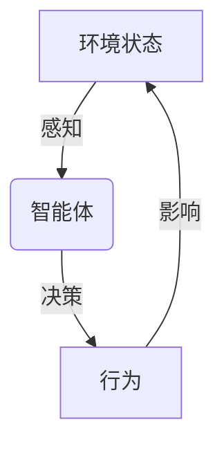
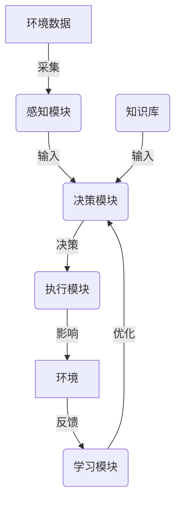

# AI代理在智慧农业中的工作流与决策支持

## 1.背景介绍

### 1.1 智慧农业的兴起

随着世界人口的不断增长和气候变化的影响,确保粮食安全和可持续农业生产已成为当前人类社会面临的重大挑战。传统农业生产模式已难以满足未来需求,因此智慧农业(Smart Agriculture)应运而生。

智慧农业是指利用物联网(IoT)、大数据、人工智能(AI)等现代信息技术,对农业生产全过程进行精准监测和智能决策,实现农业生产的自动化、精准化和智能化。它有望显著提高农业生产效率、降低生产成本、减少资源浪费、保护环境,从而推动农业可持续发展。

### 1.2 AI代理在智慧农业中的作用

在智慧农业系统中,AI代理扮演着关键角色。AI代理是指具备一定智能和自主性的软件系统,能够根据预设目标和环境信息做出决策并执行相应行为。AI代理可广泛应用于农场监测、作物管理、病虫害诊断、决策支持等智慧农业场景。

AI代理通过感知农场环境数据(如气象、土壤、作物生长状况等),结合知识库和决策模型,可自主分析当前状况并给出管理建议,支持农户实施精准高效的农业生产。同时,AI代理还可通过机器学习不断优化决策模型,使决策支持日益精准。

## 2.核心概念与联系  

### 2.1 智能体与环境

AI代理实际上是一种智能体(Agent),是具有感知和行为能力的自主实体。智能体与环境(Environment)之间存在持续的交互过程:

1. 感知(Perception):智能体通过传感器获取环境状态
2. 决策(Decision Making):基于感知到的环境状态,智能体根据内部决策模型选择行为
3. 行为(Action):智能体执行选定的行为,对环境产生影响
4. 环境反馈:环境状态发生变化,智能体获取新的环境状态,循环往复

智能体的目标是通过与环境的交互,最终达成预期任务。在智慧农业场景中,环境即农场及其所处的外部条件,智能体则是AI代理系统。



### 2.2 AI代理的体系结构

典型的AI代理由以下几个核心模块组成:

1. **感知模块**(Perception Module):获取环境数据,如农场物联网传感器采集的数据
2. **知识库**(Knowledge Base):存储领域知识、规则、历史数据等
3. **决策模块**(Decision Module):运行决策算法,输出行为决策
4. **执行模块**(Action Module):执行决策,对环境产生影响
5. **学习模块**(Learning Module):根据反馈,优化决策模型



## 3.核心算法原理具体操作步骤

AI代理的决策算法是其核心部分,决定了决策的质量和效率。常用的决策算法包括:

### 3.1 基于规则的决策

基于规则的决策是最直观的方法。知识库中存储了一系列if-then规则,决策引擎根据当前环境状态匹配相应规则,执行对应行为。

例如:
- 规则1:if 土壤湿度<20% then 启动灌溉系统
- 规则2:if 当天最高温度>35°C then 打开遮阳网

该方法简单直观,但需要人工总结规则,无法处理复杂场景。

### 3.2 基于模型的决策

基于模型的决策利用机器学习或数理模型对复杂系统进行建模,并基于模型输出结果作出决策。

#### 3.2.1 机器学习方法

常用的机器学习算法包括:

- **决策树**(Decision Tree):根据特征对样本进行分类,得到一系列决策规则
- **随机森林**(Random Forest):构建多个决策树,对结果进行综合
- **支持向量机**(SVM):对数据进行分类的监督学习模型
- **神经网络**(Neural Network):对复杂非线性系统进行建模

这些算法通过训练数据学习模型参数,可对新的输入数据作出预测或分类。在智慧农业中,可用于作物生长预测、病虫害诊断等。

以决策树为例,其构建步骤如下:

1. 收集训练数据,包括特征(气象、土壤等)和标签(是否发生病害)
2. 根据信息增益或其他指标,选择最优特征作为根节点
3. 对每个特征值,递归构建子树
4. 生成决策树模型

使用时,输入新的特征数据,根据决策树路径得到最终分类结果。

#### 3.2.2 数理模型方法

对于一些物理化学过程,可利用机理模型对其进行描述,例如:

- 光合作用模型:描述作物对光、温度等环境因素的响应
- 土壤水分模型:描述土壤水分随时间、灌溉等条件的变化
- 病虫害传播模型:描述病虫害在农田中的扩散规律

这些模型通常由一系列微分方程或其他数学表达式构成,需要估计参数并对模型进行求解。模型输出可为决策提供依据,如确定最佳灌溉时间和量。

以光合作用模型为例,常用的是Farquhar模型,它描述了光合作用速率$A$与叶绿素含量$C_c$、环境因素(光照$I$、温度$T$、CO2浓度$C_a$)的关系:

$$A = \min\left\{A_c(C_c,I,T), A_j(C_c,I,T,C_a)\right\} - R_d$$

其中$A_c$是羧化限制的光合速率,$A_j$是RuBP再生限制的光合速率,$R_d$是暗呼吸速率。通过估计模型参数并给定环境条件,可计算出光合作用速率,为调控环境因素提供依据。

### 3.3 多智能体系统

对于大规模复杂系统,可采用多智能体(Multi-Agent)系统,由多个智能体协同完成决策任务。每个智能体负责子任务,通过协调和信息交互得到整体最优解。

多智能体系统具有以下特点:

- 分布式:不同智能体分布在不同位置,分散决策
- 自主性:每个智能体根据本地信息自主决策
- 协作性:智能体通过协作实现整体目标
- 开放性:系统可动态加入或移除智能体

在大型农场中,可将农场划分为多个区域,每个区域部署一个智能体,分别根据本地环境数据做出决策,同时与其他智能体协调,实现整个农场的最优管理。

协调机制有多种,如:

- 直接通信:智能体直接交换信息
- 间接协调:通过环境状态变化实现隐式协调
- 组织结构:设置组织层次,上级智能体协调下级智能体

## 4.数学模型和公式详细讲解举例说明

智慧农业系统中涉及许多数学模型,用于描述自然过程、优化决策等。以下是一些典型模型:

### 4.1 作物生长模型

作物生长模型描述作物生物学过程,预测生长状况,例如:

$$\frac{dW}{dt} = \mu(T,N,W) \cdot W$$

其中$W$为作物生物量,$\mu$为特征生长率,是温度$T$、养分$N$等因素的函数。

通过估计参数、给定环境条件,可对生物量变化进行模拟,为决策提供支持。

### 4.2 土壤水分平衡模型

$$\frac{dS}{dt} = P - E - T - R - D$$

$S$为土壤含水量,$P$为降水,$E$为蒸发,$T$为作物蒸腾,$R$为地表径流,$D$为深层渗漏。

该模型可用于预测土壤湿度变化,指导灌溉决策。

### 4.3 病虫害传播模型

$$\frac{\partial I(x,y,t)}{\partial t} = D_I\nabla^2I(x,y,t) + \beta S(x,y,t)I(x,y,t)$$

$I$为病害密度,$S$为易感种群密度,$D_I$为扩散系数,$\beta$为传播率。

该模型描述了病害在时空上的动态扩散,可用于预测病情发展,制定防治措施。

### 4.4 决策优化模型

智慧农业决策往往需要在多目标约束下寻求最优解,可构建优化模型:

$$\begin{array}{ll} 
\operatorname{maximize} & f(x_1,x_2,\ldots,x_n)\\
\text{subject to} & g_i(x_1,x_2,\ldots,x_n) \leq b_i, & i=1,2,\ldots,m\\
 & x_j \in \mathbb{R}, & j=1,2,\ldots,n
\end{array}$$

目标函数$f$为所需最大化的指标,如产量、利润等;$g_i$为约束条件,如资源、环境等限制;$x_j$为决策变量,如灌溉量、施肥量等。

通过数学规划算法(线性规划、动态规划等)可求解该优化问题,得到最优决策方案。

## 5.项目实践:代码实例和详细解释说明

以下是一个基于Python的简单AI代理实现示例,用于农田病虫害监测:

```python
import numpy as np
from sklearn.tree import DecisionTreeClassifier

# 训练数据
X_train = np.array([[25, 80, 70], 
                    [22, 90, 60],
                    [20, 85, 65], 
                    [18, 75, 80]])

y_train = np.array([0, 0, 1, 1])  # 0表示无病害, 1表示有病害

# 训练决策树模型
clf = DecisionTreeClassifier()
clf.fit(X_train, y_train)

# 测试数据
X_test = np.array([[23, 82, 72]])

# 预测结果
y_pred = clf.predict(X_test)
print(f"预测结果: {'有病害' if y_pred[0] else '无病害'}")
```

### 5.1 数据准备

首先准备训练数据集,包括特征(气温、湿度、光照)和标签(是否发生病害)。这里使用一些虚构数据进行示例。

在实际场景中,特征数据可从物联网传感器获取,标签则需要专家人工标注。

### 5.2 模型训练

使用scikit-learn库中的DecisionTreeClassifier,基于训练数据构建决策树分类模型:

```python
clf = DecisionTreeClassifier()
clf.fit(X_train, y_train)
```

训练过程会自动选择最优特征,构建决策树结构。

### 5.3 模型预测

对新的环境数据进行预测:

```python
X_test = np.array([[23, 82, 72]])
y_pred = clf.predict(X_test)
```

clf.predict函数将输入数据沿着决策树路径进行分类,得到最终预测结果。

### 5.4 结果输出

最后输出预测结果,如果y_pred为1,则判断为"有病害",否则为"无病害"。

```python
print(f"预测结果: {'有病害' if y_pred[0] else '无病害'}")
```

该示例只是一个简单的病虫害监测AI代理,实际智慧农业系统会更加复杂。但基本原理是类似的,通过获取环境数据,结合机器学习或其他模型进行决策分析,最终输出管理建议。

## 6.实际应用场景

AI代理可应用于智慧农业的多个环节,主要包括:

### 6.1 农场监测

利用物联网技术部署各类传感器,采集农田环境数据,如气象、土壤、作物生长状况等。AI代理可基于这些数据,实时监测农场运行状态。

### 6.2 作物管理

- **生长预测**:基于作物模型,预测未来生长状况,为管理决策提供依据
- **病