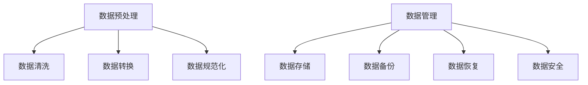

## 1.背景介绍

在我们进入人工智能(AI)的新时代，数据已经成为了推动这个领域发展的重要燃料。随着数据量的爆发式增长，如何有效地处理和管理这些数据，以便AI代理能够更好地学习和预测，已经成为了当前的重要挑战。本文将深入探讨AI代理工作流中的数据预处理和管理策略，帮助读者理解其原理，把握其实践方法，并掌握相关的最佳实践。

## 2.核心概念与联系

在AI代理工作流中，数据预处理和管理是至关重要的两个环节。数据预处理包括数据清洗、数据转换、数据规范化等步骤，而数据管理则涉及到数据的存储、备份、恢复、安全等问题。这两个环节紧密相连，共同构成了AI代理工作流的基础。



## 3.核心算法原理具体操作步骤

数据预处理和管理的核心算法原理和操作步骤可以分为以下几个部分：

### 3.1 数据清洗

数据清洗是数据预处理的第一步，主要是去除数据中的噪声和异常值，保证数据的质量和准确性。常用的数据清洗方法包括缺失值处理、异常值检测、重复值处理等。

### 3.2 数据转换

数据转换是将原始数据转化为适合AI代理处理的格式，常见的数据转换方法包括数据编码、数据标准化、数据离散化等。

### 3.3 数据规范化

数据规范化是将数据转化为一种统一的格式或标准，以便AI代理可以更好地处理和学习。常见的数据规范化方法包括数据标准化、数据归一化等。

### 3.4 数据存储

数据存储是数据管理的重要环节，主要是将处理过的数据存储在适当的地方，以便后续的使用和分析。常见的数据存储方式包括关系型数据库、非关系型数据库、分布式文件系统等。

### 3.5 数据备份和恢复

数据备份和恢复是数据管理的重要环节，主要是防止数据丢失和保证数据的安全性。常见的数据备份和恢复方法包括定期备份、数据镜像、数据恢复等。

### 3.6 数据安全

数据安全是数据管理的重要环节，主要是保护数据不被非法访问和破坏。常见的数据安全措施包括数据加密、数据访问控制、数据审计等。

## 4.数学模型和公式详细讲解举例说明

在数据预处理和管理中，我们通常会使用一些数学模型和公式来帮助我们完成任务。例如，在数据清洗中，我们可能会使用Z-score方法来检测异常值，其公式为：

$$ Z = \frac{X - \mu}{\sigma} $$

其中，X是观测值，$\mu$是平均值，$\sigma$是标准差。如果Z的值大于3或小于-3，那么我们通常会认为X是一个异常值。

在数据规范化中，我们可能会使用Min-Max标准化方法来将数据转化为[0,1]的范围，其公式为：

$$ X_{norm} = \frac{X - X_{min}}{X_{max} - X_{min}} $$

其中，$X_{norm}$是规范化后的数据，$X_{min}$和$X_{max}$分别是数据的最小值和最大值。

在数据安全中，我们可能会使用AES加密算法来保护数据的安全，其公式为：

$$ C = E(K, P) $$

其中，C是密文，E是加密函数，K是密钥，P是明文。

## 5.项目实践：代码实例和详细解释说明

在实际项目中，我们通常会使用Python语言和相关的库来进行数据预处理和管理。以下是一些代码示例和详细的解释说明。

### 5.1 数据清洗

在Python中，我们可以使用Pandas库来进行数据清洗。以下是一个简单的例子，展示了如何使用Pandas来处理缺失值：

```python
import pandas as pd

# 创建一个包含缺失值的DataFrame
df = pd.DataFrame({
    'A': [1, 2, np.nan],
    'B': [5, np.nan, np.nan],
    'C': [1, 2, 3]
})

# 使用fillna函数来填充缺失值
df.fillna(value=df.mean(), inplace=True)
```

### 5.2 数据转换

在Python中，我们可以使用Scikit-learn库来进行数据转换。以下是一个简单的例子，展示了如何使用Scikit-learn来进行数据标准化：

```python
from sklearn.preprocessing import StandardScaler

# 创建一个StandardScaler对象
scaler = StandardScaler()

# 使用fit_transform函数来进行数据标准化
data = [[0, 0], [0, 0], [1, 1], [1, 1]]
data = scaler.fit_transform(data)
```

### 5.3 数据规范化

在Python中，我们可以使用Scikit-learn库来进行数据规范化。以下是一个简单的例子，展示了如何使用Scikit-learn来进行数据归一化：

```python
from sklearn.preprocessing import MinMaxScaler

# 创建一个MinMaxScaler对象
scaler = MinMaxScaler()

# 使用fit_transform函数来进行数据归一化
data = [[-1, 2], [-0.5, 6], [0, 10], [1, 18]]
data = scaler.fit_transform(data)
```

### 5.4 数据存储

在Python中，我们可以使用Pandas库来进行数据存储。以下是一个简单的例子，展示了如何使用Pandas来将数据存储到CSV文件中：

```python
import pandas as pd

# 创建一个DataFrame
df = pd.DataFrame({
    'A': [1, 2, 3],
    'B': [4, 5, 6],
    'C': [7, 8, 9]
})

# 使用to_csv函数来将数据存储到CSV文件中
df.to_csv('data.csv', index=False)
```

### 5.5 数据备份和恢复

在Python中，我们可以使用shutil库来进行数据备份和恢复。以下是一个简单的例子，展示了如何使用shutil来进行数据备份：

```python
import shutil

# 使用copy2函数来进行数据备份
shutil.copy2('data.csv', 'backup/data.csv')
```

### 5.6 数据安全

在Python中，我们可以使用cryptography库来进行数据安全。以下是一个简单的例子，展示了如何使用cryptography来进行数据加密：

```python
from cryptography.fernet import Fernet

# 生成一个密钥
key = Fernet.generate_key()

# 创建一个Fernet对象
cipher_suite = Fernet(key)

# 使用encrypt函数来进行数据加密
data = b"hello world"
cipher_text = cipher_suite.encrypt(data)
```

## 6.实际应用场景

数据预处理和管理在各种实际应用场景中都有广泛的应用，以下是一些典型的例子：

### 6.1 金融风控

在金融风控中，数据预处理和管理是非常重要的。通过数据清洗，可以去除数据中的噪声和异常值，提高模型的预测准确性。通过数据转换和规范化，可以将各种不同的数据转化为统一的格式，便于模型的训练和预测。通过数据存储和备份，可以保证数据的安全性和可用性。

### 6.2 推荐系统

在推荐系统中，数据预处理和管理也是非常重要的。通过数据清洗，可以去除用户的异常行为，提高推荐的准确性。通过数据转换和规范化，可以将用户的行为数据转化为统一的格式，便于模型的训练和预测。通过数据存储和备份，可以保证数据的安全性和可用性。

### 6.3 人工智能研究

在人工智能研究中，数据预处理和管理是必不可少的。通过数据清洗，可以去除实验数据中的噪声和异常值，提高实验的准确性。通过数据转换和规范化，可以将实验数据转化为统一的格式，便于模型的训练和预测。通过数据存储和备份，可以保证数据的安全性和可用性。

## 7.工具和资源推荐

以下是一些推荐的工具和资源，可以帮助你更好地进行数据预处理和管理：

- Pandas：一个强大的数据处理和分析库，提供了大量的数据清洗、转换和存储功能。
- Scikit-learn：一个强大的机器学习库，提供了大量的数据预处理和转换功能。
- MySQL：一个流行的关系型数据库，可以用来存储和管理大量的数据。
- Hadoop：一个分布式文件系统，可以用来存储和处理海量的数据。
- Cryptography：一个强大的加密库，可以用来保护数据的安全。

## 8.总结：未来发展趋势与挑战

随着人工智能的发展，数据预处理和管理的重要性将会越来越高。在未来，我们需要面对的挑战和发展趋势包括：

- 数据规模的不断增大，将对数据预处理和管理提出更高的要求。
- 数据安全和隐私保护的问题，将成为数据管理的重要挑战。
- 数据质量的问题，将对数据预处理提出更高的要求。
- 数据的实时性和动态性，将对数据预处理和管理提出新的挑战。

尽管面临着这些挑战，但我相信，随着技术的不断进步，我们将能够更好地处理和管理数据，推动人工智能的发展。

## 9.附录：常见问题与解答

Q1：数据预处理和管理有什么重要性？

A1：数据预处理和管理是AI代理工作流中的重要环节，可以提高模型的预测准确性，保证数据的安全性和可用性。

Q2：如何进行数据清洗？

A2：数据清洗主要是去除数据中的噪声和异常值，常用的方法包括缺失值处理、异常值检测、重复值处理等。

Q3：如何进行数据转换和规范化？

A3：数据转换和规范化主要是将原始数据转化为适合AI代理处理的格式，常见的方法包括数据编码、数据标准化、数据离散化、数据归一化等。

Q4：如何进行数据存储和备份？

A4：数据存储和备份主要是将处理过的数据存储在适当的地方，并进行定期备份，以防数据丢失。

Q5：如何保护数据安全？

A5：数据安全主要是保护数据不被非法访问和破坏，常见的方法包括数据加密、数据访问控制、数据审计等。

作者：禅与计算机程序设计艺术 / Zen and the Art of Computer Programming