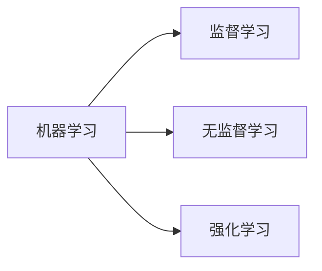
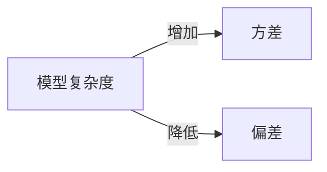

# AI模型选择原理与代码实战案例讲解

## 1. 背景介绍
### 1.1 AI模型选择的重要性
在人工智能的快速发展过程中,模型选择是一个至关重要的环节。恰当的模型选择可以大幅提升AI系统的性能,降低开发和部署成本。相反,不当的选择则可能导致模型欠拟合、过拟合等问题,影响模型的泛化能力和实际应用效果。
### 1.2 模型选择面临的挑战
AI模型选择面临诸多挑战:
1. 模型种类繁多,如何在众多模型中选择最优?
2. 不同场景对模型的要求各不相同,如何权衡各种因素?  
3. 模型选择需要大量的实验和调优,如何提高效率?
### 1.3 本文的主要内容
本文将重点探讨AI模型选择的原理和方法,并通过代码实战案例来讲解如何进行模型选择。主要内容包括:

1. AI模型选择的核心概念和基本原理
2. 不同类型AI任务的模型选择策略
3. 模型选择的数学理论基础
4. 代码实战:模型选择的Python实现
5. 模型选择在实际应用中的注意事项
6. 推荐的模型选择工具和资源
7. AI模型选择技术的发展趋势与面临的挑战
8. 常见问题解答

## 2. 核心概念与联系
### 2.1 机器学习范式
根据学习范式,机器学习可分为三大类:
- 监督学习(Supervised Learning):通过标注数据来训练模型,代表算法有决策树、SVM等。
- 无监督学习(Unsupervised Learning):从无标注数据中发掘模式,代表算法有聚类、降维等。
- 强化学习(Reinforcement Learning):通过奖励来指导模型学习,代表算法有Q-learning、策略梯度等。



### 2.2 模型复杂度
模型复杂度是指模型的参数量、网络层数等。一般而言,模型越复杂,拟合能力越强,但也更容易过拟合,训练时间更长。因此需要权衡模型性能和复杂度。常用的控制复杂度的方法有:
- 减少模型参数量
- 增加正则化项
- 提前停止训练
- 剪枝和量化

### 2.3 偏差-方差权衡
偏差(Bias)和方差(Variance)是模型泛化误差的两个来源。偏差指模型的期望输出与真实值间的差异,反映了模型本身的拟合能力;方差指模型输出的变化范围,反映了模型对数据扰动的敏感程度。
一般来说,模型复杂度越高,方差越大,偏差越小;反之亦然。因此需要权衡偏差和方差,选择复杂度适中的模型。



### 2.4 奥卡姆剃刀原则
奥卡姆剃刀原则指在性能相当的情况下,应选择更简单的模型。因为简单模型往往更加稳健,泛化能力更强,而复杂模型更容易过拟合。这一原则指导我们在满足性能需求的前提下,尽可能选择简单的模型。

### 2.5 模型评估指标
根据任务的不同,模型评估指标也各不相同。对于分类任务,常用的指标有:
- 准确率(Accuracy)
- 精确率(Precision)
- 召回率(Recall) 
- F1分数
- ROC曲线和AUC

对于回归任务,常用的指标有:  
- 平均绝对误差(MAE)
- 均方误差(MSE)
- 均方根误差(RMSE)
- R平方

选择合适的评估指标非常关键,要全面考虑模型的各项性能。

## 3. 核心算法原理具体操作步骤
下面以决策树和神经网络为例,讲解其核心算法原理和操作步骤。

### 3.1 决策树
决策树通过递归地划分特征空间,构建一个树形的分类器。其核心是在每个节点找到一个最优的划分特征及阈值。主要步骤如下:

1. 计算每个特征的信息增益或基尼指数 
2. 选择信息增益最大(或基尼指数最小)的特征作为划分特征
3. 根据特征阈值划分数据集
4. 递归地在子数据集上重复步骤1-3,直到满足停止条件
5. 将每个叶子节点标记为它所属的类别

决策树的关键在于划分特征的选择,常用的指标有信息增益、增益率和基尼指数。

### 3.2 神经网络
神经网络通过多层感知器来拟合复杂的非线性函数。其核心是通过反向传播算法来更新网络参数。主要步骤如下:

1. 随机初始化网络参数
2. 将训练样本输入网络,前向传播计算输出
3. 计算输出与标签间的损失函数
4. 反向传播计算每个参数的梯度
5. 用梯度下降法更新网络参数
6. 重复步骤2-5,直到损失函数收敛或达到最大迭代次数

神经网络的关键在于网络结构的设计和超参数的选择,如层数、神经元数、激活函数、学习率等。

## 4. 数学模型和公式详细讲解举例说明
本节详细讲解决策树和神经网络涉及的数学模型和公式。

### 4.1 决策树的数学原理
#### 4.1.1 信息熵
信息熵(Information Entropy)度量样本集合的不确定性,定义为:

$$
H(X) = -\sum_{i=1}^n p_i \log p_i
$$

其中$p_i$为第$i$类样本的比例。熵越大,样本的不确定性越大。

#### 4.1.2 信息增益
信息增益(Information Gain)度量一个特征对样本集合的划分能力,定义为划分前后熵的差值:

$$
IG(X,A) = H(X) - \sum_{v \in V} \frac{|X_v|}{|X|} H(X_v)
$$

其中$X$为样本集合,$A$为划分特征,$V$为$A$的所有取值,$X_v$为$A=v$的样本子集。信息增益越大,特征的划分能力越强。

#### 4.1.3 基尼指数
基尼指数(Gini Index)也度量样本集合的不确定性,定义为:

$$
Gini(X) = 1 - \sum_{i=1}^n p_i^2
$$

其中$p_i$为第$i$类样本的比例。基尼指数越小,样本的不确定性越小。

决策树在每个节点选择信息增益最大(或基尼指数最小)的特征作为划分特征,递归地构建整棵树。

### 4.2 神经网络的数学原理 
#### 4.2.1 前向传播
对于一个$L$层的神经网络,假设第$l$层有$n_l$个神经元,第$l-1$层有$n_{l-1}$个神经元,则第$l$层的前向传播公式为:

$$
z_j^l = \sum_{i=1}^{n_{l-1}} w_{ij}^l a_i^{l-1} + b_j^l \\
a_j^l = \sigma(z_j^l)
$$

其中$z_j^l$为第$l$层第$j$个神经元的加权输入,$w_{ij}^l$为第$l-1$层第$i$个神经元到第$l$层第$j$个神经元的权重,$b_j^l$为第$l$层第$j$个神经元的偏置项,$\sigma$为激活函数。

#### 4.2.2 反向传播
假设损失函数为$J(w,b)$,则第$l$层第$j$个神经元的权重梯度为:

$$
\frac{\partial J}{\partial w_{ij}^l} = a_i^{l-1} \delta_j^l
$$

其中$\delta_j^l$为第$l$层第$j$个神经元的误差项,由下式递归计算:

$$
\delta_j^l = \begin{cases} 
\frac{\partial J}{\partial a_j^L} \sigma'(z_j^L) & l = L \\
(\sum_{k=1}^{n_{l+1}} w_{jk}^{l+1} \delta_k^{l+1}) \sigma'(z_j^l) & l < L
\end{cases}
$$

偏置项的梯度为:

$$
\frac{\partial J}{\partial b_j^l} = \delta_j^l
$$

神经网络通过反复迭代前向传播和反向传播,不断更新权重和偏置,最小化损失函数,直至模型收敛。

## 5. 项目实践：代码实例和详细解释说明
下面以Python代码为例,演示如何用决策树和神经网络进行模型训练和预测。

### 5.1 决策树代码实例
```python
from sklearn.datasets import load_iris
from sklearn.model_selection import train_test_split
from sklearn.tree import DecisionTreeClassifier

# 加载数据集
iris = load_iris()
X = iris.data
y = iris.target

# 划分训练集和测试集
X_train, X_test, y_train, y_test = train_test_split(X, y, test_size=0.2)

# 创建决策树分类器
clf = DecisionTreeClassifier(criterion='gini', max_depth=3)

# 训练模型
clf.fit(X_train, y_train)

# 模型预测
y_pred = clf.predict(X_test)

# 评估模型
from sklearn.metrics import accuracy_score
print("Accuracy:", accuracy_score(y_test, y_pred))
```

上述代码首先加载iris数据集,然后划分出训练集和测试集。接着创建一个决策树分类器,指定划分准则为基尼指数,最大深度为3。然后用训练集拟合模型,并在测试集上进行预测。最后用准确率来评估模型性能。

### 5.2 神经网络代码实例
```python
import torch
import torch.nn as nn
import torch.optim as optim
from torchvision import datasets, transforms

# 定义网络结构
class Net(nn.Module):
    def __init__(self):
        super(Net, self).__init__()
        self.fc1 = nn.Linear(28*28, 512)
        self.fc2 = nn.Linear(512, 512)  
        self.fc3 = nn.Linear(512, 10)
        
    def forward(self, x):
        x = x.view(-1, 28*28)
        x = nn.functional.relu(self.fc1(x))
        x = nn.functional.relu(self.fc2(x))
        x = self.fc3(x)
        return x

# 加载数据集
transform = transforms.Compose([transforms.ToTensor(), 
                                transforms.Normalize((0.1307,), (0.3081,))])
trainset = datasets.MNIST('data', train=True, download=True, transform=transform)
testset = datasets.MNIST('data', train=False, transform=transform)
trainloader = torch.utils.data.DataLoader(trainset, batch_size=64, shuffle=True)
testloader = torch.utils.data.DataLoader(testset, batch_size=1000, shuffle=True)

# 创建模型
model = Net()

# 定义损失函数和优化器
criterion = nn.CrossEntropyLoss()
optimizer = optim.SGD(model.parameters(), lr=0.01, momentum=0.9)

# 训练模型
for epoch in range(10):
    for inputs, labels in trainloader:
        optimizer.zero_grad()
        outputs = model(inputs)
        loss = criterion(outputs, labels)
        loss.backward()
        optimizer.step()
        
# 评估模型
correct, total = 0, 0
with torch.no_grad():
    for inputs, labels in testloader:
        outputs = model(inputs)
        _, predicted = torch.max(outputs, 1)
        correct += (predicted == labels).sum().item()
        total += labels.size(0)
print("Accuracy:", correct / total)
```

上述代码首先定义了一个简单的三层全连接神经网络Net。然后加载MNIST手写数字数据集,并做归一化等预处理。接着创建模型实例,并指定交叉熵损失函数和SGD优化器。然后迭代10个epoch对模型进行训练。最后在测试集上评估模型的分类准确率。

## 6. 实际应用场景
AI模型选择在各个领域都有广泛应用,下面列举几个典型场景。

### 6.1 计算机视觉
在图像分类、目标检测、语义分割等任务中,需要根据任务难度、数据量、推理速度等因素选择