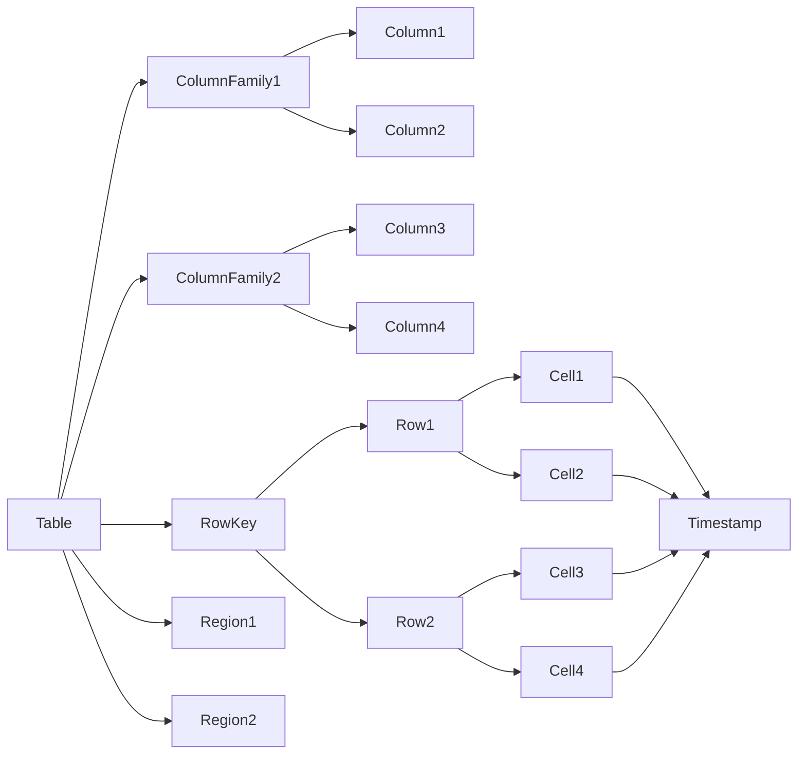

# AI系统HBase原理与代码实战案例讲解

## 1. 背景介绍
### 1.1 大数据时代的数据存储挑战
在当前大数据时代,海量数据的存储和管理面临着前所未有的挑战。传统的关系型数据库已经无法满足高并发、高吞吐量的数据访问需求。为了应对这一挑战,分布式NoSQL数据库应运而生,其中Apache HBase就是一个优秀的代表。

### 1.2 Apache HBase的诞生
HBase是一个开源的、分布式的、多版本的、面向列的NoSQL数据库。它最初由Powerset公司开发,后来成为Apache Hadoop生态系统的重要组成部分。HBase的设计灵感来自于Google的BigTable论文,旨在提供高可靠性、高性能、可伸缩的大规模结构化数据存储解决方案。

### 1.3 HBase在人工智能领域的应用价值
人工智能系统通常需要处理海量的训练数据和实时产生的用户数据。HBase凭借其优秀的可伸缩性和高性能的数据随机访问能力,成为了构建人工智能数据平台的理想选择。越来越多的AI公司开始使用HBase作为底层数据存储,支撑其智能业务和产品。

## 2. 核心概念与联系
### 2.1 RowKey行键
RowKey是HBase表中用于唯一标识一行数据的主键。每一行数据都由一个RowKey和多个Column(列)组成。RowKey的设计非常重要,直接影响到HBase的读写性能。

### 2.2 Column Family列族
HBase表中的Column(列)需要按照列族(Column Family)来组织。列族在表创建时需要预先定义,一个列族可以包含多个列,一个表可以有多个列族。列族支持动态增加列,无需预先声明其中的列。

### 2.3 Timestamp时间戳
HBase中每个单元格(Cell)都保存着同一份数据的多个版本,这些版本按照时间戳来区分。时间戳的类型是64位整型,可以由HBase自动赋值,也可以由用户显式指定。

### 2.4 Region区域
HBase表被划分为多个Region存储在RegionServer中。每个Region负责管理表中RowKey的一个连续范围,可以看作是表的一个子集。Region是HBase自动负载均衡和扩展的基本单位。

### 2.5 概念联系
下面是HBase核心概念的Mermaid流程图:


## 3. 核心算法原理具体操作步骤
### 3.1 读写数据流程
HBase使用LSM树结构来存储数据。写操作先写入内存中的MemStore,当MemStore达到一定大小后,会被刷写到磁盘上形成一个HFile。读操作会先检索MemStore,如果未命中,再去磁盘上的HFile中查找。

### 3.2 数据flush过程
当MemStore达到阈值时,会触发flush操作。flush会将MemStore中的数据写入一个新的HFile,并存储在HDFS上。RegionServer会记录HFile的元数据信息,包括其对应的RowKey范围等。

### 3.3 数据Compaction机制
HBase会定期运行Compaction任务以合并小的HFile,从而减少HFile的数量,加快数据检索速度。Compaction分为两种:Minor Compaction会将多个小HFile合并成一个大HFile;Major Compaction则会将一个Region下的所有HFile合并成一个HFile,并清理过期和删除的数据。

### 3.4 Region Split自动分裂
当一个Region中的HFile数量或大小超过阈值时,会触发Region Split。Split操作会将一个Region分裂成两个子Region,每个子Region包含原Region一半的数据,从而实现负载均衡。

## 4. 数学模型和公式详细讲解举例说明
### 4.1 Bloom Filter布隆过滤器
HBase使用布隆过滤器来优化读性能。布隆过滤器是一种概率型数据结构,可以快速判断一个元素是否在集合中。其原理是将元素哈希到一个bit数组中,查询时通过判断对应的bit位是否为1来确定。假设布隆过滤器的长度为 $m$,插入元素数量为 $n$,哈希函数个数为 $k$,则布隆过滤器的误判率 $P$ 可以用以下公式近似:

$$ P = (1 - e^{-kn/m})^k $$

通过合理设置 $m$ 和 $k$ 的值,可以在控制误判率的同时节省大量内存空间。

### 4.2 RowKey设计原则
RowKey是HBase表的主键,其设计直接影响查询性能。一个好的RowKey设计需要遵循以下原则:
1. 唯一性:RowKey必须唯一标识一行数据。
2. 散列性:RowKey要尽量散列分布,避免热点问题。
3. 长度适中:RowKey不宜过长,一般控制在10~100字节。
4. 可排序性:RowKey要能支持范围扫描等需求。

常见的RowKey设计方案有:
- 对时间戳取反:Long.MAX_VALUE - timestamp
- 字符串反转:reverse("str")
- 字符串哈希:MD5("str")

## 5. 项目实践:代码实例和详细解释说明
下面通过一个具体的代码实例来演示HBase的基本操作。该示例使用Java API创建一个表,插入一些数据,然后进行扫描查询。

```java
// 创建配置对象
Configuration config = HBaseConfiguration.create();
// 建立连接
Connection connection = ConnectionFactory.createConnection(config);
// 获取Admin接口
Admin admin = connection.getAdmin();

// 创建表描述符
TableName tableName = TableName.valueOf("test_table");
TableDescriptor tableDesc = TableDescriptorBuilder.newBuilder(tableName)
    .setColumnFamily(ColumnFamilyDescriptorBuilder.of("cf"))
    .build();
// 创建表
admin.createTable(tableDesc);

// 获取Table接口
Table table = connection.getTable(tableName);
// 插入数据
Put put1 = new Put(Bytes.toBytes("row1"));
put1.addColumn(Bytes.toBytes("cf"), Bytes.toBytes("col1"), Bytes.toBytes("value1"));
table.put(put1);
Put put2 = new Put(Bytes.toBytes("row2"));
put2.addColumn(Bytes.toBytes("cf"), Bytes.toBytes("col2"), Bytes.toBytes("value2"));
table.put(put2);

// 扫描数据
Scan scan = new Scan();
ResultScanner scanner = table.getScanner(scan);
for (Result result : scanner) {
    byte[] value = result.getValue(Bytes.toBytes("cf"), Bytes.toBytes("col1"));
    System.out.println(Bytes.toString(value));
}

// 关闭连接
table.close();
admin.close();
connection.close();
```

代码说明:
1. 首先创建一个Configuration对象,并通过ConnectionFactory建立到HBase的连接。
2. 通过Connection获取Admin接口,用于表的管理操作。
3. 创建表描述符TableDescriptor,指定表名和列族,然后调用createTable方法创建表。
4. 通过Connection获取Table接口,用于数据读写操作。
5. 创建Put对象,指定RowKey、列族、列名和值,然后调用Table.put方法插入数据。
6. 创建Scan对象,调用Table.getScanner方法获取ResultScanner,遍历其中的每一个Result,获取指定列的值并打印。
7. 最后关闭Table、Admin和Connection等资源。

## 6. 实际应用场景
HBase在实际中有非常广泛的应用,下面列举几个典型场景:

### 6.1 时序数据存储
HBase非常适合存储时序数据,如物联网传感器数据、监控数据等。可以将时间戳作为RowKey的一部分,方便进行范围查询和聚合分析。

### 6.2 用户行为分析
互联网公司通常使用HBase来存储用户的行为日志数据,如点击、浏览、收藏等。通过对这些数据的分析,可以洞察用户的喜好,为个性化推荐、广告投放等提供支持。

### 6.3 消息存储
HBase可以用作即时通讯等场景的消息存储引擎。将聊天记录、图片、视频等消息数据存入HBase,可以实现快速的历史消息查询和检索功能。

### 6.4 内容管理
对于大型门户网站、博客平台等,HBase可以作为文章、评论等UGC内容的底层存储。通过RowKey的巧妙设计,可以实现快速的内容检索、排序和分页查询。

## 7. 工具和资源推荐
### 7.1 HBase Shell
HBase Shell是HBase的命令行交互工具,可以用于表管理、数据操作等各种任务。熟练掌握HBase Shell能够大大提升开发和运维效率。

### 7.2 HBase REST API
HBase提供了基于HTTP协议的REST API,可以通过GET、PUT、POST、DELETE等方法对HBase进行操作。这为非Java语言集成HBase提供了便利。

### 7.3 Apache Phoenix
Phoenix是构建在HBase之上的一个SQL层,可以使用标准的SQL语法来查询和操作HBase数据。Phoenix极大降低了HBase的使用门槛,适合于偶尔的即席查询等场景。

### 7.4 Cloudera Manager
Cloudera Manager是大数据平台Cloudera CDH的管理工具,提供了对包括HBase在内的各个组件的部署、配置、监控等功能,是HBase运维不可或缺的利器。

## 8. 总结:未来发展趋势与挑战
### 8.1 与新兴技术的结合
HBase将不断与各种新兴技术进行结合,如Spark、Flink等流计算框架,以支持更加实时、高效的数据处理和分析。同时,HBase也将受益于硬件技术的进步,特别是NVM等新型存储介质的出现。

### 8.2 云原生化改造
随着云计算的普及,HBase也将向云原生架构演进。通过对接Kubernetes等云平台,实现弹性伸缩、故障自愈、多租户隔离等能力,从而更好地满足云环境下的大规模部署需求。

### 8.3 SQL化趋势
为了让更多用户能够便捷地使用HBase,未来HBase将进一步加强对SQL的支持。除了Phoenix,还会涌现出更多的SQL on HBase解决方案,甚至是直接内置于HBase中的SQL引擎。

### 8.4 实时性能优化
实时数据处理场景对HBase的写入和查询性能提出了更高的要求。HBase社区将持续优化诸如异步flush、Merge on Read等特性,不断提升HBase的实时性能,以满足时效性要求极高的业务场景。

## 9. 附录:常见问题与解答
### 9.1 HBase与HDFS的关系是什么?
HBase依赖于HDFS作为其底层存储,HBase的表数据最终是以文件的形式存储在HDFS上的。同时,HBase也利用了HDFS的数据复制和容错机制来保证自身的数据可靠性。

### 9.2 HBase适合什么样的数据量级?
HBase能够支撑TB到PB量级的海量数据存储。事实上,很多互联网公司都使用HBase来存储每天数以亿计的用户行为日志和时序数据。对于GB量级以下的数据,则不太适合使用HBase。

### 9.3 HBase的数据模型是什么样的?
HBase使用了一种疏松的数据模型。一个HBase表由多行(Row)组成,每行有一个RowKey和若干个Column。Column按照Column Family分组,列族需要预先定义,列则可以动态增加。

### 9.4 如何设计RowKey以获得最佳性能?
RowKey的设计要尽量做到散列和均匀分布,以避免热点问题。同时,RowKey还要考虑应用程序的查询模式,以便支持快速的数据检索。常见的RowKey设计包括Hash、反转、加盐、拼接等方式。

### 9.5 HBase的二级索引机制是什么?
HBase原生不支持二级索引,但可以通过协处理器(Coprocessor)或者Phoenix等工具来实现。协处理器允许用户在服务端执行自定义代码,可以