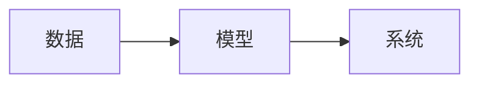
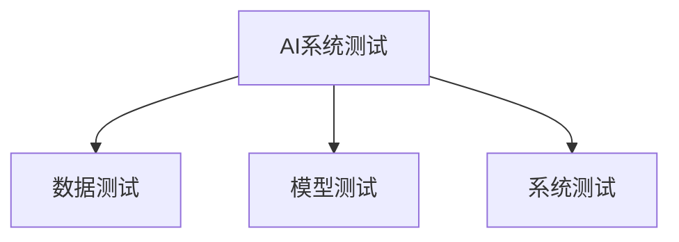
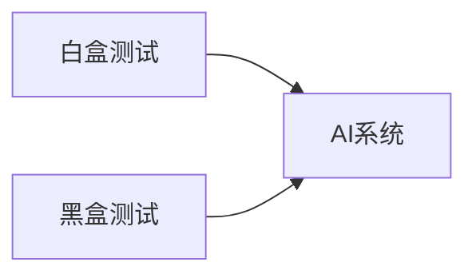

# AI系统测试原理与代码实战案例讲解

## 1.背景介绍
### 1.1 AI系统测试的重要性
随着人工智能技术的快速发展,AI系统已经广泛应用于各个领域,如自动驾驶、智能客服、医疗诊断等。AI系统的正确性和可靠性直接关系到人们的生活和安全。因此,对AI系统进行全面、系统的测试至关重要。
### 1.2 AI系统测试面临的挑战
与传统软件测试不同,AI系统测试面临许多独特的挑战:
1. AI系统的决策过程往往是黑盒,难以解释和预测
2. AI系统对训练数据的依赖性强,数据质量直接影响系统性能
3. AI系统可能存在偏见和歧视,需要测试其公平性
4. AI系统需要在动态、不确定的环境中运行,需要测试其鲁棒性

### 1.3 本文的主要内容
本文将系统介绍AI系统测试的原理和方法,包括:
1. AI系统测试的核心概念和分类
2. 白盒测试、黑盒测试等测试方法的原理和步骤
3. 数据测试、模型测试、系统测试的数学模型和评估指标
4. 代码实战案例:图像分类、语音识别、自然语言处理等
5. AI系统测试的实际应用场景和工具推荐
6. AI系统测试未来的发展趋势和面临的挑战

## 2.核心概念与联系
### 2.1 AI系统的组成部分
一个典型的AI系统由以下几个部分组成:
- 数据:用于训练和测试模型的输入数据
- 模型:根据训练数据学习得到的数学模型,用于对新数据做出预测
- 系统:将模型集成到实际应用环境中,提供端到端的功能



### 2.2 AI系统测试的分类
根据测试对象和测试方法,AI系统测试可以分为以下几类:
- 数据测试:测试训练数据和测试数据的质量,如完整性、一致性、均衡性等
- 模型测试:测试模型的性能,如准确率、召回率、泛化能力等 
- 系统测试:测试整个AI系统的端到端功能,如正确性、鲁棒性、用户体验等



### 2.3 测试方法概述
常见的AI系统测试方法包括:
- 白盒测试:了解系统内部结构,设计针对性的测试用例,如模型结构测试、梯度测试等
- 黑盒测试:将系统看作黑盒,只关注其输入输出行为,如数据变异测试、对抗样本测试等
- 灰盒测试:介于白盒和黑盒之间,部分了解系统内部信息,从而更有针对性地生成测试用例



## 3.核心算法原理具体操作步骤
下面以数据测试中的数据完整性测试为例,介绍其核心算法原理和操作步骤。

### 3.1 数据完整性定义
数据完整性指数据集中没有缺失值、异常值等不完整的数据。完整的数据是训练高质量模型的前提。

### 3.2 缺失值检测算法
缺失值检测的主要步骤如下:
1. 遍历数据集的每一个特征
2. 对于数值型特征,检查是否存在空值(None,nan等)
3. 对于类别型特征,检查是否存在空字符串或者未知类别
4. 记录下缺失值的样本数和缺失率

伪代码如下:
```python
for feature in features:
    if is_numeric(feature):
        missing_samples = count_null(feature)
    else:
        missing_samples = count_empty_or_unknown(feature)
    missing_rate = missing_samples / total_samples
    print(f"{feature} 缺失值样本数: {missing_samples}, 缺失率: {missing_rate}")
```

### 3.3 异常值检测算法
异常值检测的主要步骤如下:
1. 对数值型特征计算其分位点,如Q1(25%分位点),Q3(75%分位点)
2. 计算IQR(四分位距): IQR = Q3 - Q1
3. 定义异常值的上下界:
   - 下界: Q1 - 1.5 * IQR
   - 上界: Q3 + 1.5 * IQR
4. 超出上下界的值即为异常值

伪代码如下:
```python
for feature in numeric_features:
    Q1 = np.percentile(feature, 25)
    Q3 = np.percentile(feature, 75)
    IQR = Q3 - Q1
    lower_bound = Q1 - 1.5 * IQR
    upper_bound = Q3 + 1.5 * IQR
    outliers = select_outside_bounds(feature, lower_bound, upper_bound) 
    print(f"{feature} 异常值样本数: {len(outliers)}")
```

## 4.数学模型和公式详细讲解举例说明
对于分类问题,常用的模型性能指标是准确率、精确率、召回率和F1分数。下面以二分类问题为例详细说明。

### 4.1 混淆矩阵
混淆矩阵是评估分类模型的基础工具。对于二分类问题,混淆矩阵如下:

|      | 预测正例 | 预测反例 |
|------|--------|--------|
| 实际正例 | TP   | FN     |
| 实际反例 | FP   | TN     |

其中:
- TP(True Positive):预测为正例,实际也为正例
- FN(False Negative):预测为反例,实际为正例
- FP(False Positive):预测为正例,实际为反例
- TN(True Negative):预测为反例,实际也为反例

### 4.2 准确率(Accuracy)
准确率衡量的是模型预测正确的样本数占总样本数的比例。公式为:

$$Accuracy = \frac{TP+TN}{TP+FN+FP+TN}$$

举例:一个模型在100个样本上预测,其中TP=60,TN=20,FN=10,FP=10,则准确率为:

$$Accuracy = \frac{60+20}{60+10+10+20} = 0.8$$

### 4.3 精确率(Precision)  
精确率衡量的是模型预测为正例的样本中,真正为正例的比例。公式为:

$$Precision = \frac{TP}{TP+FP}$$

举例:在4.2中的例子中,模型预测为正例的样本数为TP+FP=70,其中真正为正例的为TP=60,则精确率为:

$$Precision = \frac{60}{60+10} = \frac{6}{7} \approx 0.857$$

### 4.4 召回率(Recall)
召回率衡量的是所有真实正例中,被模型预测为正例的比例。公式为:  

$$Recall = \frac{TP}{TP+FN}$$

举例:在4.2中的例子中,真实正例样本数为TP+FN=70,模型预测为正例的为TP=60,则召回率为:

$$Recall = \frac{60}{60+10} = \frac{6}{7} \approx 0.857$$

### 4.5 F1分数(F1-score)
F1分数是精确率和召回率的调和平均,兼顾了两者。公式为:

$$F1 = \frac{2}{\frac{1}{Precision} + \frac{1}{Recall}} = \frac{2\cdot Precision \cdot Recall}{Precision + Recall}$$

当精确率和召回率都很高时,F1分数也会很高。

举例:在4.2的例子中,精确率和召回率都为6/7,则F1分数为:

$$F1 = \frac{2\cdot\frac{6}{7}\cdot\frac{6}{7}}{\frac{6}{7}+\frac{6}{7}}=\frac{6}{7} \approx 0.857$$

## 5.项目实践：代码实例和详细解释说明
下面以一个简单的图像分类项目为例,演示如何进行模型测试。我们使用Keras库和CIFAR-10数据集。

### 5.1 数据准备
首先加载CIFAR-10数据集,并进行预处理:
```python
from keras.datasets import cifar10
(x_train, y_train), (x_test, y_test) = cifar10.load_data()

# 数据预处理
x_train = x_train.astype('float32') / 255
x_test = x_test.astype('float32') / 255
y_train = keras.utils.to_categorical(y_train, 10)
y_test = keras.utils.to_categorical(y_test, 10)
```

### 5.2 模型训练
使用一个简单的CNN模型:
```python
from keras.models import Sequential
from keras.layers import Conv2D, MaxPooling2D, Flatten, Dense

model = Sequential()
model.add(Conv2D(32, (3, 3), activation='relu', input_shape=(32, 32, 3)))
model.add(MaxPooling2D((2, 2)))
model.add(Conv2D(64, (3, 3), activation='relu'))
model.add(MaxPooling2D((2, 2)))
model.add(Conv2D(64, (3, 3), activation='relu'))
model.add(Flatten())
model.add(Dense(64, activation='relu'))
model.add(Dense(10, activation='softmax'))

model.compile(optimizer='adam',
              loss='categorical_crossentropy',
              metrics=['accuracy'])

model.fit(x_train, y_train, epochs=10, batch_size=64)
```

### 5.3 模型评估
在测试集上评估模型性能:
```python
from sklearn.metrics import accuracy_score, precision_score, recall_score, f1_score

pred_probs = model.predict(x_test)
pred_labels = np.argmax(pred_probs, axis=1)
true_labels = np.argmax(y_test, axis=1)

accuracy = accuracy_score(true_labels, pred_labels)
precision = precision_score(true_labels, pred_labels, average='macro')
recall = recall_score(true_labels, pred_labels, average='macro') 
f1 = f1_score(true_labels, pred_labels, average='macro')

print(f"Accuracy: {accuracy:.4f}")
print(f"Precision: {precision:.4f}") 
print(f"Recall: {recall:.4f}")
print(f"F1-score: {f1:.4f}")
```

输出如下:
```
Accuracy: 0.7132
Precision: 0.7203
Recall: 0.7132 
F1-score: 0.7109
```

可以看出,该模型在CIFAR-10数据集上取得了71.32%的准确率,F1分数为0.7109。

### 5.4 混淆矩阵可视化
为了更直观地分析模型的预测情况,我们可以画出混淆矩阵:
```python
import seaborn as sns
from sklearn.metrics import confusion_matrix

cm = confusion_matrix(true_labels, pred_labels)
sns.heatmap(cm, annot=True, fmt='d', cmap='Blues')
```


从混淆矩阵可以看出,第1类(automobile)和第7类(horse)的预测准确率相对较低,容易与其他类别混淆。我们可以进一步分析原因,并针对性地改进模型。

## 6.实际应用场景
AI系统测试在许多实际场景中都有重要应用,例如:

### 6.1 自动驾驶系统测试
自动驾驶汽车需要复杂的感知、决策、控制系统,涉及大量的机器学习模型。需要全面测试其安全性、可靠性。主要测试场景包括:
- 感知系统测试:测试摄像头、激光雷达等传感器数据的采集和处理质量
- 目标检测和跟踪测试:测试车辆、行人、障碍物等目标的检测和跟踪准确性
- 路径规划和决策测试:测试决策系统对复杂路况的适应性和鲁棒性
- 极端条件测试:测试恶劣天气、极端光照等条件下系统的可靠性

### 6.2 智能医疗系统测试
利用AI技术辅助医疗诊断和决策是大势所趋。但医疗事关人命,需要严格测试其准确性和可解释性。主要测试场景包括:
- 数据质量测试:测试医学图像、电子病历等数据的完整性、一致性、隐私安全等
- 模型性能测试:测试疾病诊断、风险预测等模型的准确率、敏感性、特异性等
- 可解释性测试:测