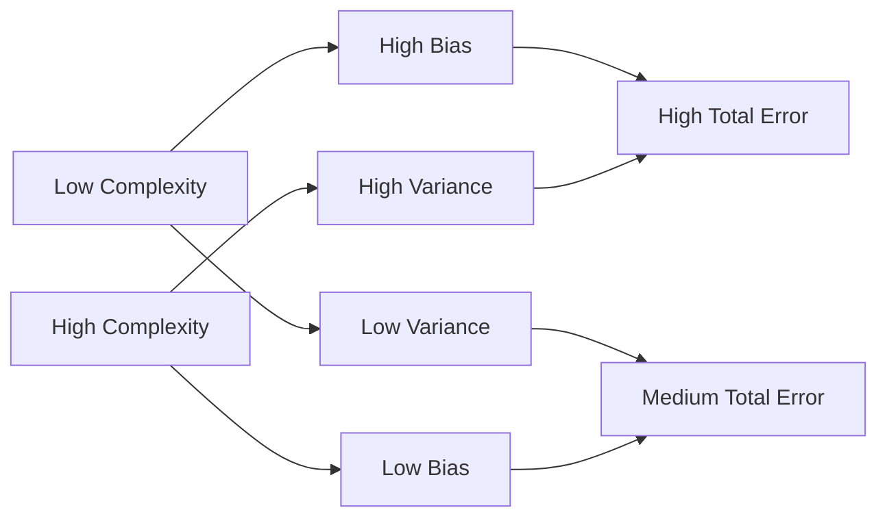

# Bias-Variance Tradeoff 原理与代码实战案例讲解

## 1.背景介绍
### 1.1 什么是 Bias-Variance Tradeoff
Bias-Variance Tradeoff 是机器学习中一个非常重要的概念,它描述了模型在训练集上的拟合程度与在新数据上泛化能力之间的平衡关系。Bias 指模型在训练集上的拟合误差,Variance 指模型在新数据上的预测误差。通常来说,Bias 和 Variance 此消彼长,很难同时降低。
### 1.2 为什么要关注 Bias-Variance Tradeoff
理解 Bias-Variance Tradeoff 对于训练出一个泛化性能良好的机器学习模型至关重要。如果只关注降低训练误差(Bias),很容易导致模型过拟合,在新数据上表现不佳;如果只关注降低模型复杂度(Variance),又可能导致欠拟合,没有很好地学习到数据的内在模式。因此需要在 Bias 和 Variance 之间权衡,找到一个最佳平衡点。

## 2.核心概念与联系
### 2.1 Bias(偏差)
Bias 衡量了模型在训练集上的拟合程度,Bias 越小说明模型拟合得越好。但 Bias 过小可能意味着模型过于复杂,过拟合了训练数据的噪声,泛化能力差。
### 2.2 Variance(方差)
Variance 衡量了模型预测的波动大小,反映了模型的稳定性。Variance 越大,说明模型对训练集的细微扰动或不同的训练集非常敏感,泛化能力差。Variance 越小则说明模型比较稳定。
### 2.3 Bias 和 Variance 的关系
通常情况下,Bias 和 Variance 是此消彼长的。增加模型复杂度会降低 Bias,提高拟合能力,但也会增加 Variance,降低稳定性。反之简化模型虽然 Variance 会降低,但 Bias 会升高。需要在二者之间寻求一个平衡。
### 2.4 模型复杂度
模型复杂度是影响 Bias 和 Variance 的关键因素。模型过于简单,难以很好地拟合数据,Bias 较大;模型过于复杂,虽然拟合训练集的能力更强,Bias 小,但 Variance 会急剧上升。合适的模型复杂度能够同时兼顾 Bias 和 Variance。

## 3.核心算法原理具体操作步骤
在实践中平衡 Bias 和 Variance 的一般步骤如下:
### 3.1 选择合适的模型
根据任务的复杂程度和数据的特点,选择合适的模型类别和结构。模型太简单容易欠拟合,模型太复杂容易过拟合。
### 3.2 划分数据集 
将数据划分为训练集、验证集和测试集。训练集用于模型训练,验证集用于模型选择和调参,测试集用于评估模型的泛化性能。
### 3.3 训练模型
用训练集对模型进行训练,记录训练误差和验证误差随 epoch 的变化曲线。
### 3.4 模型选择与调参
通过比较不同模型或不同超参数下模型在验证集上的表现,选择泛化性能最优的模型。常用的指标有准确率、F1 值、ROC AUC 等。
### 3.5 评估模型
用独立的测试集对最终选定的模型进行评估,衡量其在真实场景下的泛化能力。

下面是一个示意图,描述了模型复杂度与 Bias、Variance 以及总误差之间的关系:



## 4.数学模型和公式详细讲解举例说明
从数学角度看,Bias-Variance Tradeoff 可以用如下公式表示:

$$
\begin{aligned}
Err(x) &= E[(y - \hat{f}(x))^2] \\
&= (E[\hat{f}(x)] - f(x))^2 + E[(\hat{f}(x) - E[\hat{f}(x)])^2] + \sigma^2 \\  
&= Bias^2 + Variance + IrreducibleError
\end{aligned}
$$

其中:
- $Err(x)$表示在点 $x$ 处的泛化误差 
- $y$ 是真实值,$\hat{f}(x)$是模型预测值
- $f(x)$是真实的目标函数
- $E[\hat{f}(x)]$是模型预测值的期望,反映了模型的平均预测能力
- $Bias = E[\hat{f}(x)] - f(x)$,度量了模型预测的平均值与真实值的偏离程度
- $Variance = E[(\hat{f}(x) - E[\hat{f}(x)])^2]$,度量了模型预测的波动范围
- $IrreducibleError = \sigma^2$,表示不可避免的随机噪声,与模型无关

可以看出,泛化误差可以分解为 Bias、Variance 和不可约误差三个部分。我们的目标是同时最小化 Bias 和 Variance,但现实中很难两全其美。

举个例子,假设我们要预测房价,真实房价(万元)和房屋面积(平米)的关系为:$y = 0.5x + 10 + \epsilon$,其中 $\epsilon$ 为均值为 0,方差为 1 的高斯噪声。现在我们从 100 个样本中随机抽取 10 个作为训练集,分别用一次函数和九次函数拟合,得到如下结果:


可以看出:
- 一次函数欠拟合,在训练集上的 Bias 较大,预测值整体偏离真实值
- 九次函数过拟合,虽然 Bias 较小,但 Variance 很大,预测值波动剧烈
- 两种模型在测试集上的泛化误差都比较大,需要进一步优化

## 5.项目实践:代码实例和详细解释说明
下面我们用 Python 实现一个完整的例子,展示如何权衡 Bias 和 Variance。我们将用多项式回归拟合 sin 函数,并通过学习曲线观察 Bias 和 Variance 的变化。

```python
import numpy as np
import matplotlib.pyplot as plt
from sklearn.pipeline import Pipeline
from sklearn.preprocessing import PolynomialFeatures
from sklearn.linear_model import LinearRegression
from sklearn.model_selection import train_test_split

# 生成数据
x = np.random.uniform(-3, 3, size=100)
y = np.sin(x) + np.random.normal(scale=0.2, size=100)

# 划分数据集
x_train, x_test, y_train, y_test = train_test_split(x, y, test_size=0.2, random_state=0)

degrees = [1, 3, 5, 7, 9] # 多项式阶数
train_rmses = []
test_rmses = []

for d in degrees:
    # 定义模型Pipeline
    model = Pipeline([
        ('poly', PolynomialFeatures(degree=d)),
        ('linear', LinearRegression())
    ])
    
    # 训练模型
    model.fit(x_train.reshape(-1, 1), y_train)
    
    # 计算训练误差和测试误差
    train_rmse = np.sqrt(np.mean((y_train - model.predict(x_train.reshape(-1, 1)))**2))
    test_rmse = np.sqrt(np.mean((y_test - model.predict(x_test.reshape(-1, 1)))**2))
    train_rmses.append(train_rmse)
    test_rmses.append(test_rmse)

# 绘制学习曲线    
plt.figure(figsize=(10, 6))
plt.plot(degrees, train_rmses, 'o-', label='Train RMSE')
plt.plot(degrees, test_rmses, 's-', label='Test RMSE')
plt.xlabel('Polynomial Degree')
plt.ylabel('RMSE')
plt.xticks(degrees)
plt.legend()
plt.title('Learning Curve')
plt.show()
```


从学习曲线可以看出:
- 低阶多项式模型在训练集和测试集上的 RMSE 都较大,说明 Bias 较大,存在欠拟合
- 随着多项式阶数增加,训练误差持续下降,但测试误差先下降后上升,出现了过拟合,Variance 上升
- 三阶多项式在训练集和测试集上的 RMSE 都比较低,是较好的选择,在 Bias 和 Variance 之间取得了平衡

我们还可以直观地观察不同复杂度模型的拟合效果:

```python
# 绘制不同阶数的多项式拟合曲线
plt.figure(figsize=(12, 8))
x_plot = np.linspace(-3, 3, 100).reshape(-1, 1)

for i, d in enumerate(degrees):
    plt.subplot(2, 3, i+1)
    
    model = Pipeline([
        ('poly', PolynomialFeatures(degree=d)),
        ('linear', LinearRegression())
    ])
    model.fit(x_train.reshape(-1, 1), y_train)
    
    y_plot = model.predict(x_plot)
    plt.scatter(x_train, y_train, color='blue', label='train')
    plt.scatter(x_test, y_test, color='red', label='test')
    plt.plot(x_plot, y_plot, color='black', label='model')
    plt.plot(x_plot, np.sin(x_plot), color='green', label='true')
    plt.xlabel('x')
    plt.ylabel('y') 
    plt.title(f'Degree {d} Polynomial')
    plt.legend()
    
plt.tight_layout()
plt.show()
```


可以看出:
- 一阶多项式欠拟合,在训练集和测试集上都有较大偏差
- 三阶多项式拟合效果最好,在训练集和测试集上都很接近真实曲线
- 五阶及以上多项式过拟合,虽然训练误差小,但测试误差大,预测曲线波动剧烈

## 6.实际应用场景
Bias-Variance Tradeoff 在许多实际机器学习任务中都有重要应用,例如:
- 图像分类:选择合适复杂度的卷积神经网络,避免模型欠拟合或过拟合
- 自然语言处理:调节 BERT、GPT 等预训练语言模型的 fine-tune 参数,平衡在下游任务上的 Bias 和 Variance
- 推荐系统:控制矩阵分解等协同过滤算法的隐向量维度、正则化强度等,权衡召回率和精确率
- 时间序列预测:选择合适的时间窗口长度、模型阶数等,兼顾预测偏差和模型稳定性

## 7.工具和资源推荐
- scikit-learn:功能强大的 Python 机器学习库,提供了多种模型选择和评估工具
- TensorFlow、PyTorch:流行的深度学习框架,支持搭建不同复杂度的神经网络模型
- Kaggle:知名的数据科学竞赛平台,提供了丰富的真实数据集和解决方案,是研究 Bias-Variance Tradeoff 的绝佳练习场
- 吴恩达的机器学习课程:经典的机器学习入门课,系统讲解了 Bias-Variance Tradeoff 等重要概念

## 8.总结:未来发展趋势与挑战
### 8.1 自动机器学习(AutoML)
AutoML 旨在自动搜索最优的机器学习管道和超参数,平衡 Bias 和 Variance。代表方法有 Auto-sklearn、AutoKeras 等。但搜索空间优化、资源效率等仍面临挑战。
### 8.2 元学习(Meta-Learning)
元学习通过从历史任务中学习,实现