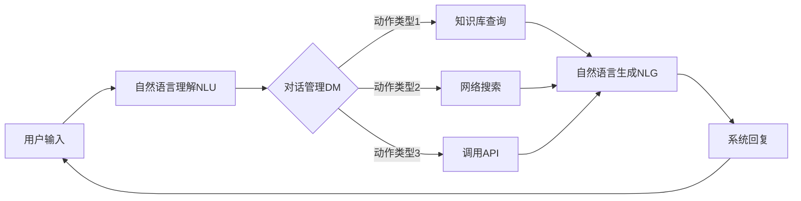

# Chatbots原理与代码实例讲解

## 1. 背景介绍

### 1.1 Chatbots的定义与发展历史

Chatbots,又称聊天机器人或对话系统,是一种基于自然语言处理(NLP)和人工智能(AI)技术,能够与人类进行自然对话交互的计算机程序。Chatbots 的发展可以追溯到 20 世纪 60 年代,1966年,Joseph Weizenbaum开发了世界上第一个聊天机器人ELIZA,它能够通过匹配关键词和句型模板来模拟人类对话。此后,随着人工智能和自然语言处理技术的不断进步,Chatbots也经历了规则系统、检索系统到生成系统的发展历程。

### 1.2 Chatbots的应用现状

如今,Chatbots已经在客户服务、销售咨询、智能家居、教育培训等众多领域得到广泛应用。据统计,全球有超过80%的企业计划在2020年前引入Chatbots,Chatbots市场规模预计到2025年将达到13.9亿美元。微软小冰、苹果Siri、IBM Watson等知名Chatbots更是引领了行业发展潮流。可以预见,Chatbots必将在人机交互领域扮演越来越重要的角色。

## 2. 核心概念与联系

### 2.1 Chatbots的核心模块

一个完整的Chatbots系统通常由以下几个核心模块组成:

- 自然语言理解(NLU):负责将用户输入的自然语言转化为结构化数据
- 对话管理(DM):负责根据当前对话状态和用户意图确定下一步系统动作
- 自然语言生成(NLG):负责将系统动作转化为自然语言回复
- 知识库:存储Chatbots所需的各类结构化和非结构化知识

### 2.2 Chatbots的关键技术

构建一个智能的Chatbots系统需要用到以下几项关键技术:

- 文本预处理:对原始文本进行分词、词性标注、命名实体识别等处理
- 意图识别与槽位填充:识别用户话语所表达的意图,提取关键信息
- 检索与匹配:从知识库中检索与用户问题相关的候选答案
- 答案抽取与生成:从候选答案中抽取或生成最佳答案
- 多轮对话管理:根据对话上下文推理用户意图,控制对话流程

### 2.3 Chatbots技术架构图

下面是一个典型的Chatbots系统的技术架构图:



## 3. 核心算法原理具体操作步骤

### 3.1 基于检索的Chatbots

基于检索的Chatbots的核心是从知识库中找出与用户问题最相关的答案。其主要步骤如下:

1. 对用户输入问题进行预处理,提取关键词
2. 利用关键词在问答对知识库中进行检索,得到候选答案集合
3. 计算每个候选答案与问题的相似度,取相似度最高者作为最终答案
4. 对答案进行一些必要的后处理,如替换标点、人称代词等
5. 将答案返回给用户

其中,问答对相似度的计算可以利用如下几种方法:
- 基于关键词匹配的相似度,如 Jaccard 系数、TF-IDF 等
- 基于语义的相似度,如 Word2Vec、BERT 等预训练词向量
- 基于深度学习的相似度,如 DSSM、Siamese LSTM 等

### 3.2 基于生成的Chatbots 

基于生成的Chatbots利用大规模语料库训练一个端到端的深度神经网络模型,直接根据当前对话上下文生成回复。其主要步骤如下:

1. 构建一个 Seq2Seq 模型,编码器将上下文编码为一个向量,解码器根据该向量生成回复
2. 在海量对话语料上训练 Seq2Seq 模型,优化模型参数
3. 进行推断时,将当前对话上下文输入编码器,再用解码器生成回复
4. 对生成的回复进行一些必要的后处理,如去重、纠错等
5. 将回复返回给用户

目前主流的生成式模型有:
- RNN 系列:LSTM、GRU 等
- Transformer 系列:GPT、BERT、XLNet 等
- 预训练-微调范式:T5、BART、DialoGPT 等

## 4. 数学模型和公式详细讲解举例说明

### 4.1 TF-IDF 相似度

TF-IDF 是一种常用的文本表示方法。对于一个词 $w$ 在文档 $d$ 中的 TF-IDF 值为:

$$
tfidf(w, d) = tf(w, d) \times idf(w)
$$

其中,$tf(w,d)$ 表示词频,即词 $w$ 在文档 $d$ 中出现的次数。$idf(w)$ 表示逆文档频率,用于衡量词 $w$ 的重要性,定义为:

$$
idf(w) = \log \frac{N}{df(w)}
$$

$N$ 为语料库中文档总数,$df(w)$ 为包含词 $w$ 的文档数。直观上看,如果一个词在很多文档中出现,其 $idf$ 值会较小。

有了每个词的 TF-IDF 值,就可以用一个向量来表示一篇文档,两篇文档的相似度可以通过计算它们 TF-IDF 向量的余弦相似度得到:

$$
sim(d_1, d_2) = \frac{\sum_{i=1}^n{tfidf(w_i, d_1) \times tfidf(w_i, d_2)}}{\sqrt{\sum_{i=1}^n{tfidf(w_i, d_1)^2}} \times \sqrt{\sum_{i=1}^n{tfidf(w_i, d_2)^2}}}
$$

### 4.2 Transformer 模型

Transformer 是一种基于自注意力机制的神经网络模型,广泛应用于自然语言处理任务。其核心是注意力机制,可以捕捉词与词之间的依赖关系。

对于一个长度为 $n$ 的输入序列 $X=(x_1,\dots,x_n)$,Transformer 首先会计算每个位置的三个向量:Query 向量 $Q$、Key 向量 $K$、Value 向量 $V$:

$$
Q = XW^Q, K = XW^K, V = XW^V
$$

然后通过计算 Query 和 Key 的点积来得到注意力分数:

$$
A = \text{softmax}(\frac{QK^T}{\sqrt{d}})
$$

其中 $d$ 为向量维度。最后根据注意力分数对 Value 向量进行加权求和,得到输出表示:

$$
\text{Attention}(Q,K,V) = AV
$$

多头注意力机制进一步将 $Q,K,V$ 映射为 $h$ 个子空间,分别进行注意力计算,再拼接结果:

$$
\text{MultiHead}(Q,K,V) = \text{Concat}(\text{head}_1,\dots,\text{head}_h)W^O \\
\text{head}_i = \text{Attention}(QW_i^Q, KW_i^K, VW_i^V)
$$

Transformer 的编码器和解码器都由多个这样的注意力层堆叠而成,使其能够建模长距离依赖关系。

## 5. 项目实践：代码实例和详细解释说明

下面我们用 Python 实现一个简单的基于检索的 Chatbots。首先安装必要的依赖库:

```bash
pip install jieba gensim
```

### 5.1 数据准备

我们需要准备一个问答对语料库,每行格式为"问题|||答案"。这里为了演示,我们手工构造一些数据:

```python
corpus = [
    "Chatbots 是什么|||Chatbots 是一种基于自然语言处理和人工智能技术,能够与人类进行自然对话交互的计算机程序。",
    "Chatbots 的应用领域有哪些|||Chatbots 主要应用于客户服务、销售咨询、智能家居、教育培训等领域。",
    "Chatbots 的关键技术有哪些|||Chatbots 的关键技术包括文本预处理、意图识别与槽位填充、检索与匹配、答案抽取与生成、多轮对话管理等。"
]
```

### 5.2 构建问答对语料库

我们需要将原始语料进行分词,并用 TF-IDF 模型将其向量化:

```python
import jieba
from gensim import corpora, models, similarities

# 分词
seg_corpus = []
for qa in corpus:
    q, a = qa.split("|||")
    seg_corpus.append((jieba.lcut(q), a))

# 构建词典
dictionary = corpora.Dictionary(q for q, _ in seg_corpus)

# 基于词典建立新的语料库
new_corpus = [dictionary.doc2bow(q) for q, _ in seg_corpus]

# 对语料库建立 TF-IDF 模型
tfidf_model = models.TfidfModel(new_corpus)

# 基于 TF-IDF 模型建立相似度矩阵索引
index = similarities.MatrixSimilarity(tfidf_model[new_corpus], num_features=len(dictionary))
```

### 5.3 匹配问题最佳答案

当用户输入一个问题时,我们首先对其分词,然后用 TF-IDF 模型进行向量化,再利用相似度索引找出最相似的问题,返回对应的答案:

```python
def answer_question(question):
    # 分词
    seg_question = jieba.lcut(question)
    
    # 向量化
    vec_bow = dictionary.doc2bow(seg_question)
    vec_tfidf = tfidf_model[vec_bow]
    
    # 计算相似度
    sims = index[vec_tfidf]
    
    # 返回相似度最大的问题的答案
    best_index = sims.argmax()
    return seg_corpus[best_index][1]
```

### 5.4 运行 Chatbots

最后,我们就可以运行我们的 Chatbots 了:

```python
print("你好,我是一个简单的 Chatbots,请问有什么可以帮助你的吗?")
while True:
    question = input("用户:")
    if question.lower() in ["bye", "再见"]:
        print("Chatbots:再见,下次再聊!")
        break
    answer = answer_question(question)
    print(f"Chatbots:{answer}")
```

一个简单的基于检索的 Chatbots 就完成了。你可以尝试输入一些问题,看看 Chatbots 能否给出合理的回答。当然,这只是一个玩具示例,真实的 Chatbots 系统要复杂得多。

## 6. 实际应用场景

Chatbots 在现实生活中有非常广泛的应用,下面列举几个典型场景:

### 6.1 客服机器人

很多企业会部署客服机器人来解答用户的常见问题,如产品咨询、订单查询、故障诊断等。客服机器人 7x24 小时在线,可以显著降低人工客服成本,提高服务效率。例如阿里小蜜、京东 JIMI 等。

### 6.2 智能语音助手

智能音箱、手机语音助手等消费类电子产品通常内置了语音聊天功能,可以帮助用户完成闹钟设置、天气查询、音乐播放等日常任务。代表产品有苹果 Siri、小米小爱同学、华为小艺等。

### 6.3 医疗健康助理

在医疗健康领域,Chatbots 可以提供疾病初诊、用药指导、心理咨询等服务,既可以普及医疗知识,又能缓解医疗资源紧张问题。例如微医全科医生 AI、春雨医生智能助理等。

### 6.4 教育培训助教

Chatbots 也在教育培训领域崭露头角,可以为学生答疑解惑、推荐学习资源、进行课后复习等,极大提升了学习体验。代表产品有好未来 AI 老师、流利说英语对话机器人等。

## 7. 工具和资源推荐

如果想进一步学习和实践 Chatbots 开发,这里推荐一些常用的工具和资源:

- 