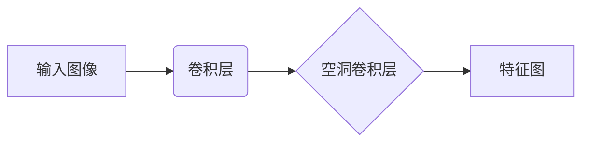
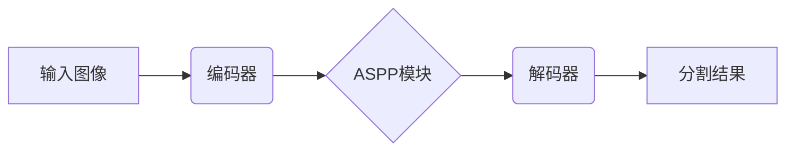
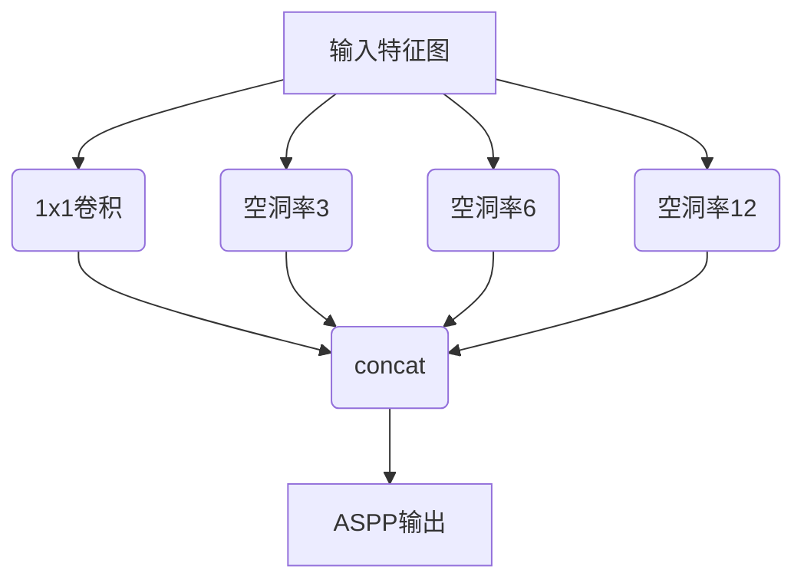
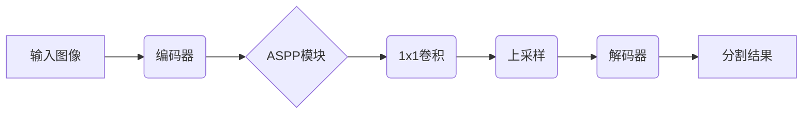
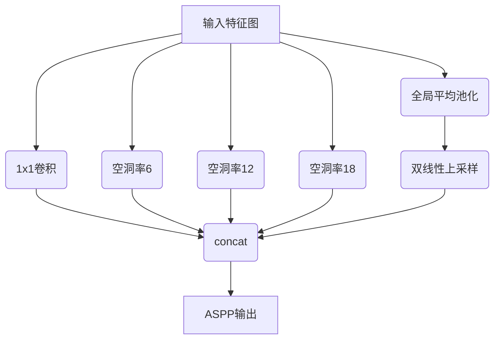

# DeepLab系列原理与代码实例讲解

## 1.背景介绍

### 1.1 语义分割的重要性

在计算机视觉领域,语义分割是一项关键任务,旨在将图像中的每个像素分配给一个预定义的类别标签。与图像分类和目标检测不同,语义分割需要对整个图像进行像素级别的预测,从而获得更加精细的理解。这种技术在诸多领域都有广泛应用,例如自动驾驶、医疗影像分析、机器人视觉等。

### 1.2 DeepLab系列发展历程

为了解决语义分割任务,谷歌于2014年提出了DeepLab系列模型。DeepLab最初基于深度卷积神经网络,旨在应对分割任务中的两大挑战:保持精确的边界信息和增强对小物体的识别能力。

DeepLab系列经历了多次迭代,每一次都对模型进行了改进和优化。主要版本包括DeepLab-v1、DeepLab-v2、DeepLab-v3、DeepLab-v3+等。这些版本引入了诸多创新技术,如空洞卷积(atrous convolution)、编码-解码结构、DepthwiseSeparable卷积等,显著提升了分割性能。

## 2.核心概念与联系

### 2.1 全卷积神经网络

DeepLab系列建立在全卷积神经网络(FCN)的基础之上。与传统卷积神经网络不同,FCN将最后的全连接层替换为卷积层,从而可以对任意大小的输入进行预测,非常适合语义分割任务。

### 2.2 空洞卷积

空洞卷积(atrous convolution)是DeepLab的核心创新之一。它通过在卷积核中引入空洞率(dilation rate)参数,从而控制卷积核的采样位置,增大感受野而不增加参数量。这使得网络能够同时捕获细节和上下文信息。



### 2.3 编码-解码结构

DeepLab-v3+采用了编码-解码结构,将编码器(如ResNet)和解码器(如ASPP)级联,从而融合多尺度信息。编码器提取高级语义特征,解码器则恢复空间细节。这种结构可以有效地平衡识别和定位能力。



### 2.4 ASPP模块

ASPP(Atrous Spatial Pyramid Pooling)模块是DeepLab-v3及以后版本的关键组件。它通过并行应用多个不同采样率的空洞卷积,有效地融合了多尺度特征,增强了对物体及其上下文的感知能力。



## 3.核心算法原理具体操作步骤

### 3.1 DeepLab-v3+算法流程

1. 使用编码器(如ResNet)提取输入图像的特征。
2. 将编码器输出的特征图送入ASPP模块,融合多尺度上下文信息。
3. 对ASPP输出应用1x1卷积,压缩通道数。
4. 使用双线性上采样,将压缩后的特征图放大到原始输入分辨率。
5. 应用解码器模块,进一步恢复细节和精化边界。
6. 最后一层为逐像素分类层,输出每个像素的类别预测。



### 3.2 ASPP模块详解

ASPP模块包含以下几个并行分支:

1. 1x1卷积:捕获全局信息。
2. 空洞率为6的空洞卷积:捕获中等尺度信息。
3. 空洞率为12的空洞卷积:捕获较大尺度信息。 
4. 空洞率为18的空洞卷积:捕获更大尺度信息。
5. 全局平均池化:编码全局场景信息。

所有分支输出在通道维度上级联,形成最终的ASPP输出特征图。



## 4.数学模型和公式详细讲解举例说明

### 4.1 空洞卷积公式

空洞卷积在标准卷积的基础上引入了一个新的超参数——空洞率(dilation rate)$r$。对于二维输入$X$和卷积核$K$,空洞卷积的计算公式为:

$$
Y[i,j] = \sum_{k,l} X[i+r\cdot k, j+r\cdot l] \cdot K[k,l]
$$

其中$r=1$时即为标准卷积。空洞率$r$的增加会导致卷积核的采样位置变稀疏,从而增大感受野。这使得网络能够有效地融合多尺度上下文信息。

### 4.2 ASPP模块计算

ASPP模块的输出可以表示为并行分支的级联:

$$
\begin{aligned}
F_{aspp}(X) &= [F_1^{1\times1}(X), F_2^{r=6}(X), F_3^{r=12}(X), F_4^{r=18}(X), F_5^{im}(X)]\\
           &= \text{concat}(F_1^{1\times1}(X), F_2^{r=6}(X), F_3^{r=12}(X), F_4^{r=18}(X), F_5^{im}(X))
\end{aligned}
$$

其中$F_i^{1\times1}$表示1x1卷积分支,$F_i^r$表示空洞率为$r$的空洞卷积分支,$F_5^{im}$表示全局平均池化分支。这些分支输出在通道维度上级联,形成最终的ASPP输出特征图$F_{aspp}(X)$。

### 4.3 双线性上采样

在DeepLab-v3+中,使用双线性上采样(Bilinear Upsampling)将ASPP模块输出的低分辨率特征图放大到原始输入分辨率。对于输入特征图$X$,双线性上采样可以表示为:

$$
X^{up} = \mathcal{U}(X, s)
$$

其中$\mathcal{U}$为双线性插值函数,$s$为上采样因子。这种上采样方式相比于反卷积(Deconvolution)更高效,同时能够有效恢复细节信息。

## 5.项目实践:代码实例和详细解释说明

以下是使用PyTorch实现DeepLab-v3+的代码示例,包括ASPP模块和主要的前向传播逻辑。

```python
import torch
import torch.nn as nn
import torch.nn.functional as F

# ASPP模块实现
class ASPPConv(nn.Module):
    def __init__(self, in_channels, out_channels, atrous_rate, dropout_rate=0.1):
        super(ASPPConv, self).__init__()
        self.block = nn.Sequential(
            nn.Conv2d(in_channels, out_channels, 3, padding=atrous_rate, dilation=atrous_rate, bias=False),
            nn.BatchNorm2d(out_channels),
            nn.ReLU(True),
            nn.Dropout(dropout_rate)
        )

    def forward(self, x):
        return self.block(x)

class ASPPPooling(nn.Module):
    def __init__(self, in_channels, out_channels):
        super(ASPPPooling, self).__init__()
        self.gap = nn.Sequential(
            nn.AdaptiveAvgPool2d(1),
            nn.Conv2d(in_channels, out_channels, 1, bias=False),
            nn.BatchNorm2d(out_channels),
            nn.ReLU(True)
        )

    def forward(self, x):
        size = x.shape[-2:]
        x = self.gap(x)
        return F.interpolate(x, size=size, mode='bilinear', align_corners=False)

class ASPP(nn.Module):
    def __init__(self, in_channels, atrous_rates, out_channels=256):
        super(ASPP, self).__init__()
        modules = []
        modules.append(nn.Sequential(
            nn.Conv2d(in_channels, out_channels, 1, bias=False),
            nn.BatchNorm2d(out_channels),
            nn.ReLU(True)
        ))

        rates = tuple(atrous_rates)
        for rate in rates:
            modules.append(ASPPConv(in_channels, out_channels, rate))

        modules.append(ASPPPooling(in_channels, out_channels))

        self.convs = nn.ModuleList(modules)

        self.project = nn.Sequential(
            nn.Conv2d(len(self.convs) * out_channels, out_channels, 1, bias=False),
            nn.BatchNorm2d(out_channels),
            nn.ReLU(True),
            nn.Dropout(0.1)
        )

    def forward(self, x):
        res = []
        for conv in self.convs:
            res.append(conv(x))
        res = torch.cat(res, dim=1)
        return self.project(res)

# DeepLab-v3+主要前向传播逻辑
class DeepLabV3Plus(nn.Module):
    def __init__(self, backbone, classifier):
        super(DeepLabV3Plus, self).__init__()
        self.backbone = backbone
        self.classifier = classifier

    def forward(self, x):
        input_shape = x.shape[-2:]
        features = self.backbone(x)

        x = self.classifier(features)
        x = F.interpolate(x, size=input_shape, mode='bilinear', align_corners=False)
        return x
```

上述代码中:

- `ASPPConv`实现了不同空洞率的空洞卷积分支。
- `ASPPPooling`实现了全局平均池化分支。
- `ASPP`模块将所有分支级联,并使用1x1卷积进行特征融合。
- `DeepLabV3Plus`定义了整个模型的前向传播逻辑,包括backbone(如ResNet)和分类头(ASPP+上采样)。

在实际使用时,可以根据需要对backbone和分类头进行自定义。此外,还需要实现训练、评估、数据加载等相关模块。

## 6.实际应用场景

DeepLab系列模型在多个领域都有广泛的应用,下面列举了一些典型场景:

1. **自动驾驶**: 语义分割对于自动驾驶系统具有重要意义,可以精确识别道路、行人、车辆等目标,为决策规划提供关键信息。

2. **医疗影像分析**: 在医学影像中,语义分割可用于自动分割肿瘤、器官等结构,辅助医生诊断和治疗规划。

3. **机器人视觉**: 语义分割能够帮助机器人更好地理解环境,实现精准的目标识别和抓取。

4. **增强现实(AR)**: 通过对图像进行精确分割,可以将虚拟元素自然融入真实场景,增强用户体验。

5. **遥感图像分析**: 对卫星遥感图像进行分割,可以自动提取建筑物、道路、植被等地理信息。

6. **人机交互**: 语义分割可用于手势识别、人体姿态估计等人机交互应用。

总的来说,DeepLab系列模型凭借出色的分割性能,为众多领域提供了强有力的技术支持。

## 7.工具和资源推荐

在学习和使用DeepLab系列模型时,以下工具和资源可以为您提供帮助:

1. **PyTorch和TensorFlow**: 这两个深度学习框架都提供了DeepLab的官方实现,方便快速上手。

2. **Google AI博客**: Google AI团队在这里分享了DeepLab系列的最新进展和技术细节。

3. **TensorFlow模型园**: 包含了DeepLab的预训练模型,可直接用于迁移学习。

4. **DeepLab官方代码库**: Google开源了DeepLab的源代码,供开发者参考和修改。

5. **语义分割数据集**: 常