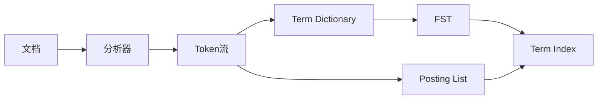

# ES索引原理与代码实例讲解

## 1.背景介绍
### 1.1 全文搜索引擎的发展历程
#### 1.1.1 全文搜索引擎的起源
#### 1.1.2 倒排索引的诞生 
#### 1.1.3 Lucene的出现和发展
### 1.2 Elasticsearch应运而生
#### 1.2.1 Elasticsearch的起源
#### 1.2.2 Elasticsearch的发展历程
#### 1.2.3 Elasticsearch的应用现状
### 1.3 为什么要学习ES索引原理
#### 1.3.1 深入理解ES的工作原理
#### 1.3.2 优化ES的索引和查询性能
#### 1.3.3 排查和解决ES的常见问题

## 2.核心概念与联系
### 2.1 文档(Document)
#### 2.1.1 文档的定义
#### 2.1.2 文档的结构和字段类型
#### 2.1.3 文档的元数据
### 2.2 索引(Index)
#### 2.2.1 索引的定义
#### 2.2.2 索引的结构
#### 2.2.3 索引的配置
### 2.3 映射(Mapping)
#### 2.3.1 映射的定义
#### 2.3.2 动态映射和显式映射
#### 2.3.3 元字段
### 2.4 分片(Shard)和副本(Replica)
#### 2.4.1 分片的概念和作用
#### 2.4.2 主分片和副本分片
#### 2.4.3 分片的数量和容量规划
### 2.5 倒排索引
#### 2.5.1 倒排索引的原理
#### 2.5.2 Term Dictionary和Term Index
#### 2.5.3 Posting List



## 3.核心算法原理具体操作步骤
### 3.1 文档索引过程
#### 3.1.1 文档写入Buffer
#### 3.1.2 Refresh
#### 3.1.3 Flush
#### 3.1.4 Merge 
### 3.2 文档搜索过程
#### 3.2.1 查询解析
#### 3.2.2 查询改写
#### 3.2.3 查询执行
#### 3.2.4 结果合并和排序
### 3.3 相关度评分算法
#### 3.3.1 TF-IDF
#### 3.3.2 BM25
#### 3.3.3 自定义评分函数

## 4.数学模型和公式详细讲解举例说明
### 4.1 布尔模型
#### 4.1.1 布尔模型的定义
#### 4.1.2 布尔查询的表达式
#### 4.1.3 布尔查询的例子
### 4.2 向量空间模型
#### 4.2.1 向量空间模型的定义
#### 4.2.2 文档和查询的向量表示
#### 4.2.3 余弦相似度计算
### 4.3 概率模型
#### 4.3.1 概率模型的定义
#### 4.3.2 概率生成模型
#### 4.3.3 语言模型

布尔模型的查询表达式：
$$
q = t_1 \wedge t_2 \vee \neg (t_3 \wedge t_4)
$$
其中，$t_i$ 表示查询中的一个词项。

向量空间模型中的余弦相似度计算公式：
$$
\cos \theta = \frac{\vec{d} \cdot \vec{q}}{\lVert \vec{d} \rVert \lVert \vec{q} \rVert} = \frac{\sum_{i=1}^n w_{i,d} \cdot w_{i,q}}{\sqrt{\sum_{i=1}^n w_{i,d}^2} \sqrt{\sum_{i=1}^n w_{i,q}^2}}
$$
其中，$\vec{d}$ 和 $\vec{q}$ 分别表示文档向量和查询向量，$w_{i,d}$ 和 $w_{i,q}$ 表示词项 $t_i$ 在文档 $d$ 和查询 $q$ 中的权重。

## 5.项目实践：代码实例和详细解释说明
### 5.1 创建索引
```java
// 创建索引
CreateIndexRequest request = new CreateIndexRequest("my-index");
CreateIndexResponse response = client.indices().create(request, RequestOptions.DEFAULT);

// 输出响应结果
System.out.println("Index created: " + response.isAcknowledged());
```
上述代码使用Java High Level REST Client创建了一个名为"my-index"的索引。`CreateIndexRequest`定义了要创建的索引，`client.indices().create()`方法发送创建索引的请求，`CreateIndexResponse`接收响应结果。

### 5.2 定义映射
```java
// 定义映射
XContentBuilder builder = XContentFactory.jsonBuilder();
builder.startObject();
builder.startObject("properties");
builder.startObject("title").field("type", "text").endObject();
builder.startObject("content").field("type", "text").endObject();
builder.startObject("publish_date").field("type", "date").endObject();
builder.endObject();
builder.endObject();

// 创建映射
PutMappingRequest request = new PutMappingRequest("my-index")
        .source(builder);
AcknowledgedResponse response = client.indices().putMapping(request, RequestOptions.DEFAULT);

// 输出响应结果
System.out.println("Mapping created: " + response.isAcknowledged());
```
上述代码定义了索引的映射，包括`title`、`content`和`publish_date`三个字段及其类型。使用`XContentBuilder`构建JSON格式的映射定义，然后通过`PutMappingRequest`创建映射，`client.indices().putMapping()`方法发送创建映射的请求。

### 5.3 索引文档
```java
// 创建文档对象
Map<String, Object> jsonMap = new HashMap<>();
jsonMap.put("title", "ES索引原理与代码实例讲解");
jsonMap.put("content", "这是一篇关于Elasticsearch索引原理的文章，通过代码实例来讲解ES的索引过程。");
jsonMap.put("publish_date", "2023-06-03");

// 索引文档
IndexRequest request = new IndexRequest("my-index")
        .id("1")
        .source(jsonMap);
IndexResponse response = client.index(request, RequestOptions.DEFAULT);

// 输出响应结果
System.out.println("Document indexed with ID: " + response.getId());
```
上述代码创建了一个文档对象，包含`title`、`content`和`publish_date`三个字段及其值。使用`IndexRequest`定义要索引的文档，`client.index()`方法发送索引文档的请求，`IndexResponse`接收响应结果。

### 5.4 搜索文档
```java
// 构建查询
SearchSourceBuilder sourceBuilder = new SearchSourceBuilder();
sourceBuilder.query(QueryBuilders.matchQuery("content", "Elasticsearch"));
sourceBuilder.from(0);
sourceBuilder.size(10);

// 执行搜索
SearchRequest request = new SearchRequest("my-index")
        .source(sourceBuilder);
SearchResponse response = client.search(request, RequestOptions.DEFAULT);

// 处理搜索结果
SearchHits hits = response.getHits();
for (SearchHit hit : hits.getHits()) {
    String sourceAsString = hit.getSourceAsString();
    System.out.println("Search result: " + sourceAsString);
}
```
上述代码构建了一个查询，使用`match`查询在`content`字段中搜索"Elasticsearch"关键词。使用`SearchSourceBuilder`定义查询条件、分页参数等，然后通过`SearchRequest`执行搜索，`client.search()`方法发送搜索请求。最后，遍历`SearchHits`获取搜索结果，并打印每个文档的内容。

## 6.实际应用场景
### 6.1 日志搜索和分析
#### 6.1.1 收集和索引日志数据
#### 6.1.2 实时日志搜索
#### 6.1.3 日志聚合分析
### 6.2 电商商品搜索
#### 6.2.1 商品数据索引
#### 6.2.2 多条件组合搜索
#### 6.2.3 相关度排序和高亮显示
### 6.3 地理位置搜索
#### 6.3.1 地理位置数据索引
#### 6.3.2 附近位置搜索
#### 6.3.3 地理围栏和区域搜索

## 7.工具和资源推荐
### 7.1 Elasticsearch官方文档
#### 7.1.1 Elasticsearch Guide
#### 7.1.2 Elasticsearch Reference
#### 7.1.3 Elasticsearch Java API
### 7.2 Elasticsearch可视化工具
#### 7.2.1 Kibana
#### 7.2.2 Grafana
#### 7.2.3 ElasticHD
### 7.3 Elasticsearch社区资源
#### 7.3.1 Elasticsearch论坛
#### 7.3.2 Elasticsearch博客
#### 7.3.3 Elasticsearch源码

## 8.总结：未来发展趋势与挑战
### 8.1 Elasticsearch的发展趋势
#### 8.1.1 云原生和容器化部署
#### 8.1.2 机器学习和自然语言处理
#### 8.1.3 时序数据分析
### 8.2 Elasticsearch面临的挑战
#### 8.2.1 数据量增长和性能优化
#### 8.2.2 安全和访问控制
#### 8.2.3 数据备份和恢复
### 8.3 Elasticsearch的未来展望
#### 8.3.1 与大数据生态系统的融合
#### 8.3.2 智能化和自动化运维
#### 8.3.3 行业垂直领域的深度应用

## 9.附录：常见问题与解答
### 9.1 Elasticsearch与Solr的区别是什么？
### 9.2 Elasticsearch如何实现分布式搜索？
### 9.3 Elasticsearch的倒排索引是如何构建的？
### 9.4 Elasticsearch的分片和副本有什么作用？
### 9.5 Elasticsearch的相关度评分是如何计算的？
### 9.6 Elasticsearch如何实现近实时搜索？
### 9.7 Elasticsearch在分布式环境下如何保证数据一致性？
### 9.8 Elasticsearch的常见性能优化方法有哪些？
### 9.9 Elasticsearch如何处理大量数据的索引和搜索？
### 9.10 Elasticsearch在数据安全和权限控制方面有哪些机制？

作者：禅与计算机程序设计艺术 / Zen and the Art of Computer Programming