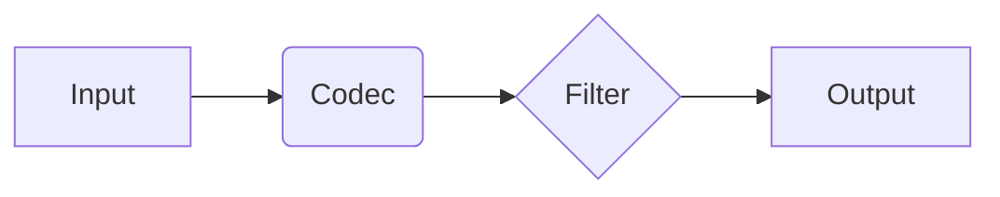

# ElasticSearch Logstash原理与代码实例讲解

## 1. 背景介绍
### 1.1 大数据处理的挑战
在当今大数据时代,海量数据的实时采集、传输、存储和分析已成为企业面临的重大挑战。传统的数据处理方式难以应对数据量激增、数据类型多样化、处理时效性要求高等问题。因此,亟需一种高效、灵活、可扩展的数据处理方案。
### 1.2 ELK技术栈的兴起
ELK是Elasticsearch、Logstash、Kibana三个开源软件的缩写。ELK技术栈以其优异的性能、灵活性和可扩展性,成为应对大数据挑战的利器,被广泛应用于日志分析、指标监控、安全分析等领域。其中,Logstash作为数据处理管道的核心组件,在数据采集、转换、过滤等环节发挥着关键作用。
### 1.3 Logstash的重要地位
Logstash是一个开源的服务器端数据处理管道,可以同时从多个数据源采集数据,并对数据进行转换和过滤,最终将数据发送到指定的存储系统如Elasticsearch。Logstash凭借其插件化的架构设计、丰富的数据处理能力,以及良好的水平扩展能力,成为ELK技术栈中不可或缺的重要组成。

## 2. 核心概念与联系
### 2.1 数据源(Input)
数据源是Logstash的输入,它可以从多种来源采集数据,例如文件、TCP/UDP网络数据流、消息队列、数据库等。Logstash支持多种常见的数据源类型,可以灵活选择。
### 2.2 数据过滤器(Filter) 
数据过滤器用于对采集到的原始数据进行加工处理,例如格式转换、数据净化、字段提取等。Logstash内置了丰富的过滤器插件,可以对数据进行结构化处理,提取关键字段。用户也可以根据需要自定义过滤器。
### 2.3 数据输出(Output)
数据输出是Logstash管道的最后一站,经过处理的结构化数据在这里被发送到指定的存储系统,如Elasticsearch、文件、消息队列等。Logstash支持多种数据输出方式,可以根据数据的特点和用途,选择合适的存储。
### 2.4 编解码器(Codec)
编解码器位于数据源和过滤器之间,负责对原始数据进行解码,将数据转换为Logstash事件。同时,编解码器也可以在数据输出时对数据进行编码。常见的编解码器有json、multiline等。
### 2.5 概念之间的关系
下面是Logstash核心概念之间的关系图:

从数据流的角度看,原始数据从Input进入,经过Codec解码成事件,然后在Filter中进行数据处理,最后通过Output发送到存储系统。整个数据处理流程是一个线性的数据管道。

## 3. 核心算法原理与具体操作步骤
### 3.1 数据解析与事件生成
Logstash使用编解码器将原始数据解析为事件。事件是Logstash数据处理的基本单位,它包含了数据的原始内容和解析后的字段。常见的事件解析方式有:
1. 逐行解析:将原始数据按行切分,每一行解析为一个事件。
2. 多行合并:将多行数据合并为一个事件,常用于处理Java堆栈信息等。
3. JSON解析:将JSON格式数据解析为事件,事件的字段与JSON键值对一一对应。
4. 正则解析:用正则表达式提取原始数据中的字段,生成事件。

具体操作步骤如下:
1. 选择合适的编解码器,如json、multiline等。 
2. 配置编解码器的参数,例如匹配模式、字段名称等。
3. 将编解码器应用到数据源,开始解析数据。
4. 解析后的数据以事件的形式流转到过滤器。

### 3.2 数据过滤与富化 
数据过滤器是Logstash数据处理的核心,它的主要功能包括:
1. 数据过滤:根据特定条件过滤事件,例如按字段值过滤、按正则匹配过滤等。
2. 数据富化:为事件添加新的字段,例如时间戳、主机名、地理位置信息等。
3. 数据转换:对事件的字段进行重命名、裁剪、合并等转换操作。

具体操作步骤如下:
1. 根据数据处理需求,选择合适的过滤器插件,如grok、mutate、date等。
2. 配置过滤器插件的参数,例如grok表达式、时间格式等。
3. 将过滤器插件按照处理顺序排列,形成过滤器管道。
4. 将事件输入过滤器管道依次处理,输出处理后的事件。

### 3.3 数据输出与编码
经过过滤器处理的事件,需要输出到指定的存储系统。Logstash支持多种数据输出方式,例如:
1. Elasticsearch:将事件以JSON文档的形式写入Elasticsearch集群。
2. 文件:将事件以指定格式写入磁盘文件。
3. 消息队列:将事件发送到Kafka、RabbitMQ等消息队列。

具体操作步骤如下:
1. 选择合适的输出插件,如elasticsearch、file等。
2. 配置输出插件的参数,例如Elasticsearch集群地址、文件路径等。
3. 将过滤器处理后的事件传递给输出插件。
4. 输出插件将事件转换为指定格式,发送到目标存储系统。

## 4. 数学模型和公式详细讲解举例说明
### 4.1 数据采样模型
在高并发场景下,Logstash可能无法处理全量的数据流。这时可以采用数据采样模型,按照一定的采样率对数据进行采样,以减小数据处理压力。设数据总量为N,采样率为R(0<R≤1),则采样后的数据量N'可表示为:

$$
N' = N \times R
$$

例如,若数据总量为1000万条,采样率为10%,则采样后的数据量为:
$N' = 10,000,000 \times 10\% = 1,000,000$

### 4.2 指数退避重试模型
当Logstash向Elasticsearch输出数据时,可能会遇到Elasticsearch服务暂时不可用的情况。这时可以采用指数退避重试模型,通过指数级增加重试间隔时间,避免频繁重试对服务端造成压力。设初始重试间隔为T,指数退避因子为F,第n次重试的间隔时间T(n)可表示为:

$$
T(n) = T \times F^{n-1}
$$

例如,若初始重试间隔为1秒,指数退避因子为2,则第3次重试的间隔时间为:
$T(3) = 1 \times 2^{3-1} = 4$ 秒

### 4.3 数据流量控制模型 
为避免Logstash产生的数据流量超出Elasticsearch的处理能力,可以采用数据流量控制模型。通过设置数据缓冲区和输出限流,平滑数据流量。设缓冲区大小为B,输出限流为L,则缓冲区的数据滞留时间T可表示为:

$$
T = \frac{B}{L}
$$

例如,若缓冲区大小为1000条,输出限流为100条/秒,则缓冲区的数据滞留时间为:
$T = \frac{1000}{100} = 10$ 秒

## 5. 项目实践:代码实例和详细解释说明
下面通过一个实际的Logstash配置文件,来演示如何实现从文件读取Apache日志,并过滤、解析后输出到Elasticsearch。

```ruby
input {
  file {
    path => "/var/log/apache/access.log"
    start_position => "beginning"
    sincedb_path => "/dev/null"
  }
}

filter {
  grok {
    match => { "message" => "%{COMBINEDAPACHELOG}" }
  }
  date {
    match => [ "timestamp", "dd/MMM/yyyy:HH:mm:ss Z" ]
  }
  geoip {
    source => "clientip"
  }
}

output {
  elasticsearch {
    hosts => ["http://localhost:9200"]
    index => "apache-access-%{+YYYY.MM.dd}"
  }
}
```

代码解释:
1. input部分定义了数据源,这里从文件`/var/log/apache/access.log`读取Apache访问日志。`start_position`指定从文件起始位置开始读取,`sincedb_path`设为`/dev/null`表示不记录读取进度。
2. filter部分定义了数据过滤器链。首先使用grok插件,基于正则表达式`COMBINEDAPACHELOG`解析日志中的各个字段。然后使用date插件,将日志中的时间字段`timestamp`转换为Logstash事件的时间戳。最后使用geoip插件,根据`clientip`字段查询IP地址对应的地理位置信息。
3. output部分定义了数据输出,这里将处理后的事件以JSON文档的形式写入Elasticsearch。`hosts`指定了Elasticsearch集群的地址,`index`定义了索引名称,按照日期分割。

这个配置文件演示了Logstash从输入到过滤再到输出的完整数据处理流程,通过灵活选择和组合插件,可以满足多样化的数据处理需求。

## 6. 实际应用场景
Logstash在实际的应用场景中有广泛的用途,下面列举几个典型场景:
### 6.1 日志收集与分析
Logstash可以收集各种服务器、应用的日志,如Web服务器访问日志、应用程序运行日志等。通过Logstash过滤和解析,提取日志中有价值的信息,发送到Elasticsearch进行全文检索和统计分析,并结合Kibana实现可视化的日志分析平台。
### 6.2 数据管道与ETL
Logstash可以作为数据处理管道,实现数据在不同存储系统之间的流动与转换。例如将关系型数据库中的数据经过Logstash清洗、转换后写入Elasticsearch,或者将消息队列中的数据经过Logstash处理后写入时序数据库等。
### 6.3 安全信息和事件管理
Logstash可以收集各种安全设备、软件的日志,如防火墙、IDS、IPS等。通过Logstash解析安全事件、提取关键信息,并结合Elasticsearch和Kibana进行安全威胁检测、事件关联分析等,实现企业安全信息和事件管理。
### 6.4 物联网数据采集与处理
Logstash可以对物联网设备产生的海量数据进行采集、过滤和转换。例如将传感器数据经过Logstash处理后写入时序数据库,结合Kibana实现物联网数据可视化监控与分析。

## 7. 工具和资源推荐
### 7.1 官方文档
Elastic官方提供了详尽的Logstash文档,包括入门指南、插件配置、最佳实践等。
https://www.elastic.co/guide/en/logstash/current/index.html
### 7.2 Grok Debugger
Grok Debugger是一个在线调试grok表达式的工具,可以方便地测试和调优grok匹配规则。
http://grokdebug.herokuapp.com/
### 7.3 Logstash配置文件示例
Elastic官方的GitHub仓库中提供了大量Logstash配置文件的示例,覆盖了常见的数据源、过滤器、输出组合。
https://github.com/elastic/examples/tree/master/Common%20Data%20Formats
### 7.4 Logstash社区
Elastic社区是Logstash用户交流和学习的平台,可以找到丰富的Logstash应用案例、插件推荐、问题解答等。
https://discuss.elastic.co/c/logstash

## 8. 总结:未来发展趋势与挑战
### 8.1 云原生和无服务化
随着云计算的发展,Logstash逐渐向云原生和无服务化方向演进。通过与Kubernetes、Serverless等云平台的集成,实现Logstash部署和扩缩容的自动化,降低运维成本。
### 8.2 实时数据处理
在实时数据处理领域,Logstash面临着Apache Flink、Apache Spark等流处理框架的竞争。Logstash需要在流式数据处理的低延迟、高吞吐、容