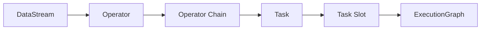

# Flink算子链：提升执行效率的利器

## 1. 背景介绍

### 1.1 Flink简介

Apache Flink是一个开源的分布式流处理和批处理框架，它以数据并行和流水线方式执行任意流数据程序，Flink的核心是一个提供数据分发、通信和容错的流数据流引擎。

### 1.2 Flink的优势

- 支持高吞吐、低延迟、高性能的流处理
- 支持高度灵活的窗口（Window）操作
- 支持有状态计算的Exactly-once语义
- 提供DataStream API和DataSet API

### 1.3 算子链的重要性

在实际的Flink作业中，我们常常需要对数据流进行一系列的转换操作，例如map、flatMap、filter等，每一次转换都需要将数据在网络中传输。为了最小化数据在网络中传输的次数，Flink会尽可能地将operator的subtask链接在一起形成一个task，operator链接的越多，性能就越好。这个优化我们称之为算子链（Operator Chains）。

## 2. 核心概念与联系

### 2.1 基本概念

- 算子（Operator）：Flink程序的基本组成单元，用于处理数据流，如map、flatMap、filter等。
- 任务（Task）：Flink将算子的可以链接的子任务（subtask）链接在一起形成任务。
- 任务槽（Task Slot）：Flink中资源调度的基本单位，每个任务槽可以运行一个或多个任务。
- 执行图（ExecutionGraph）：Flink程序被映射成一个数据流图，并生成ExecutionGraph。

### 2.2 概念之间的关系



如上图所示，DataStream经过一系列Operator的转换操作，可以链接的Operator会形成Operator Chain，进一步生成Task。每个Task被调度到一个Task Slot中运行，最终形成程序的ExecutionGraph。

## 3. 核心算法原理具体操作步骤

Flink中的算子链优化主要分为以下几个步骤：

### 3.1 生成 StreamGraph 

Flink程序首先被映射为一个StreamGraph，StreamGraph包含了所有的operator和中间结果。

### 3.2 StreamGraph 转换为 JobGraph

- Flink 将 StreamGraph 转换为 JobGraph。在这个阶段，将尽可能多的符合条件的operator chains 在一起形成 task。   
- 具有相同并行度的one-to-one操作符可以被链接成一个task
- 为了更好地资源利用，Flink会尝试将多个operator chains成一个task，前提是他们是one-to-one操作符且并行度一样。

### 3.3 JobGraph 转换为 ExecutionGraph

- JobGraph 被转换为 ExecutionGraph 。ExecutionGraph 是 JobGraph 的并行化版本，是调度层最核心的数据结构。
- 一个 JobVertex 可能有多个 ExecutionVertex，取决于并行度。
- ExecutionVertex 被调度后分配到一个具体的 TaskManager 的一个 slot 中执行。

## 4. 数学模型和公式详细讲解举例说明

设Flink程序由$n$个算子$op_1, op_2, ..., op_n$组成，每个算子$op_i$的子任务数为$p_i$。如果算子$op_i$和$op_{i+1}$可以进行链接，设链接后减少的子任务数为$c_i$，则优化后减少的总子任务数$C$为：

$$C=\sum_{i=1}^{n-1}c_i$$

其中，$c_i$的计算公式为：

$$
c_i=\begin{cases}
min(p_i, p_{i+1}), & \text{if }op_i \text{ and } op_{i+1} \text{ chained} \\
0, & \text{otherwise}
\end{cases}
$$

举个例子，假设一个Flink程序包含3个算子，每个算子的并行度都为2，即$p_1=p_2=p_3=2$。如果$op_1$和$op_2$可以链接，$op_2$和$op_3$不能链接，则：

$$
\begin{aligned}
c_1 &= min(p_1, p_2) = 2 \\
c_2 &= 0 \\
C &= c_1 + c_2 = 2
\end{aligned}
$$

优化后，原本需要6个子任务($2\times3$)，现在只需要4个子任务，减少了2个子任务的开销。

## 5. 项目实践：代码实例和详细解释说明

下面是一个Flink DataStream API的代码示例，演示了算子链的效果。

```java
StreamExecutionEnvironment env = StreamExecutionEnvironment.getExecutionEnvironment();

DataStream<String> text = env.readTextFile("input");

DataStream<Tuple2<String, Integer>> counts = text
    .flatMap(new Tokenizer())
    .keyBy(value -> value.f0)
    .sum(1)
    .map(value -> Tuple2.of(value.f0, value.f1 * 2));

counts.writeAsText("output");

env.execute("Word Count Example");
```

在这个例子中，flatMap、keyBy、sum、map这几个算子会被自动优化链接成一个task。整个任务链如下图所示：


Flink会尽可能地将算子链接在一起，减少数据在网络中传输的次数，提升整体的执行效率。

## 6. 实际应用场景

算子链在实际的Flink应用中非常常见，下面列举几个典型的应用场景：

### 6.1 数据清洗和转换

在数据处理的过程中，我们经常需要对数据进行清洗和转换，如过滤掉无效数据、转换数据格式等。这些操作通常可以用map、flatMap、filter等算子来实现，将它们链接在一起可以减少数据传输的开销。

### 6.2 数据聚合

对数据进行分组聚合是Flink的一个重要功能，如sum、reduce、aggregate等。通过算子链，我们可以将这些聚合操作与其他的转换操作链接在一起，在同一个task中完成，提升执行效率。

### 6.3 数据关联

在一些复杂的数据处理场景中，我们可能需要将多个数据流进行关联，如join、coGroup等。这些关联操作涉及到数据重分区（shuffle），开销较大。通过算子链，我们可以将一些预处理逻辑与关联操作链接在一起，尽量减少shuffle的数据量。

## 7. 工具和资源推荐

- [Flink官方文档](https://nightlies.apache.org/flink/flink-docs-release-1.14/)：Flink的官方文档，包含了详尽的概念解释、API文档、用户手册等。
- [Flink GitHub仓库](https://github.com/apache/flink)：Flink的源码仓库，可以深入研究Flink的实现原理。
- [Ververica](https://www.ververica.com/)：专注于Flink的企业级应用，提供Flink的商业发行版和技术支持。
- [《Stream Processing with Apache Flink》](https://www.oreilly.com/library/view/stream-processing-with/9781491974285/)：O'Reilly出版的Flink专著，系统地介绍了Flink的架构和API。

## 8. 总结：未来发展趋势与挑战

随着实时数据处理的需求不断增长，Flink正在被越来越多的企业采用。Flink的算子链优化是其高性能的关键所在。未来Flink在算子链方面可能有以下一些发展趋势和挑战：

- 自适应算子链优化：根据数据特征和资源情况，自动调整算子链的划分策略，进一步提升性能。
- 更细粒度的资源管理：目前Flink的资源管理是以task为单位，如果能够以算子为单位进行资源管理和调度，可以实现更细粒度的优化。
- 算子链与容错机制的平衡：算子链的引入可能会影响Flink的容错机制（如checkpoint），需要在性能和容错之间找到一个平衡点。
- 算子链与Flink SQL的结合：Flink SQL是Flink的一个重要特性，如何将算子链优化应用于Flink SQL，是一个值得研究的课题。

## 9. 附录：常见问题与解答

### Q1: 是否所有的算子都可以进行链接？

A1: 并不是所有的算子都可以被链接，以下情况下算子不能被链接：
- 算子的并行度不同
- 算子之间存在shuffle（如keyBy、broadcast等）
- 用户显式地禁用了算子链（如使用`disableChaining`方法）
- 算子是某些特殊的算子，如union、split等

### Q2: 算子链对Flink程序的内存有什么影响？

A2: 算子链可以减少数据在网络中传输的次数，但同时也可能会增加任务的内存消耗。因为链接在一起的算子在同一个任务中执行，需要共享内存。所以在设计Flink程序时，需要权衡算子链带来的性能提升和内存开销。

### Q3: 如何手动配置算子链？

A3: Flink提供了`StreamExecutionEnvironment.disableOperatorChaining()`方法来全局禁用算子链。此外，也可以通过`StreamExecutionEnvironment.disableChaining()`来禁用某个特定算子的链接。如果要强制将两个算子链接在一起，可以使用`StreamExecutionEnvironment.startNewChain()`方法。

作者：禅与计算机程序设计艺术 / Zen and the Art of Computer Programming